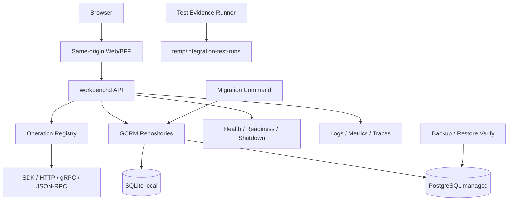

# Workbench Production Foundation R0 设计

## 1. 当前基线

- `Taskfile.yml` 的 `spec:status` 与 `spec:validate` 曾固定指向已于 2026-08-16 归档的 `complete-open-design-studio-workflow`；其未交付生产闭环后续已取消，当前 `SPEC_CHANGE` 默认 `workbench-production-foundation-r0`。
- `service/internal/runtime/runtime.go` 为 `/healthz` 和 `/readyz` 注册同一个 `healthy` handler，无法发现 DB、migration、registry 或配置不可用。
- 只有本地预览目标与 SQLite data path；没有 Dockerfile、managed DB profile、deployment manifest、backup 或 restore verification。
- 已有 `scripts/test-evidence/run.ts`、Task 四 transport tests、local session security tests，可直接复用。
- Owner adapters 和 UI fixtures 能模拟 offline/mismatch/unknown_accept，但不能证明 production provider readiness。

## 2. 架构



R0 不增加业务 service implementation。它只冻结通用 envelope、注册 capability shell，并建立所有后续 Release 共用的运行基础。

## 3. Contract Foundation

通用 contract 字段：`tenantRef`、`workspaceRef`、`resourceRef`、`version`、`expectedVersion`、`idempotencyKey`、`capability`、`freshness`、`cursor`、`correlationRef`、`receiptRef`、`error` 与 `evidenceRefs`。

错误基线：`invalid_argument`、`authentication_required`、`permission_denied`、`not_found`、`resource_tombstoned`、`version_conflict`、`contract_mismatch`、`owner_offline`、`rate_limited`、`unknown_accept`、`unavailable`、`internal`。

R0 为 Asset、Team、WorkItem、Layout、Board、Search、Audit 与 Handoff 注册 capability descriptor 和 schema identity。未实现 operation 必须返回 `needs_contract` 或 `unavailable`，不得返回空成功对象。

## 4. Configuration

配置优先级固定为 command flag → environment → user-level config → safe default。credential 可来自 user-level secret store、user-level config 或 CI secret；任何来源诊断只显示 source type、env name、config path 或 configured status。

启动分两阶段：

1. parse/validate：profile、listen address、DB、migration policy、issuer/origin allow-list、limits、telemetry exporter。
2. initialize：DB、migration check、registry、workers、listeners。

managed profile 缺 DB/TLS/issuer 等关键配置时，在绑定 public listener 前 fail-fast。local profile 默认 loopback 与 SQLite，不自动暴露到外网。

## 5. Persistence Profiles

### Local

- pure-Go SQLite driver，保持 `CGO_ENABLED=0`。
- 单进程自动 migration，显式 data path。
- 适合开发、预览和小型本地 workspace，不声称 HA。

### Managed

- PostgreSQL + GORM，API/worker 多实例。
- 独立 migration job，应用实例只检查 schema compatibility。
- 连接池、TLS、statement timeout、transaction timeout 和 graceful drain 可配置。

Repository interface 不暴露数据库特定类型。普通业务 read/write 不在 handler/application service 写 SQL；migration 与明确的 queue/lease 例外集中在 repository internals 并参数化。

## 6. Migration Framework

```text
expand -> backfill -> shadow compare -> capability cutover -> contract cleanup
```

- 每个 migration 有 id、checksum、minimum app version、reversible 标志和 operator note。
- backfill 使用 cursor、bounded batch、lease、pause/resume 和 progress receipt。
- migration failure 使 managed readiness false；local 自动 migration 失败则退出，不启动半兼容服务。
- destructive/irreversible migration 要求有效 backup + restore verification，并由后续独立 change 承担 cleanup。
- R0 提供 backup/restore interface 与 staging verify command，不绑定云厂商。

## 7. Runtime Health

- `/healthz`：进程 event loop、panic/termination state，仅用于 liveness。
- `/readyz`：config、DB ping、schema compatibility、registry completeness、required worker state。
- 可选 Owner offline 不使 Workbench 整体 not-ready，只使 owner capability degraded/offline。
- graceful shutdown 顺序：停止接流量 → ready=false → drain HTTP/gRPC/SSE → 停 worker → flush telemetry → 关闭 DB。

Readiness 返回稳定 code 与 safe component summary，不显示 DSN、token、private path 或 provider URL。

## 8. Observability

### Metrics

- HTTP/gRPC/RPC latency、status、in-flight。
- DB pool、transaction latency、migration state。
- registry operation/capability count。
- Task state、gate、unknown_accept、reconcile。
- projection/outbox/owner metrics 只预留命名规范，业务实现后启用。

### Traces and logs

- correlation ref 从 Browser/BFF 贯穿 workbenchd 与未来 Owner adapters。
- structured English keys；tenant/workspace/subject 只记录 opaque digest。
- sanitizer 在日志、trace attributes、error details 和 evidence 四层复用。
- telemetry exporter 不可用时 bounded drop/disable，不阻塞核心请求，也不无限缓存。

## 9. Limits and Security

- request body、response projection、cursor、batch、query time、SSE connections、header 与 timeout 有 safe defaults。
- BFF 继续丢弃浏览器自定义 Authorization 和动态 owner URL。
- managed listener 默认需要 approved auth/issuer；local listener 默认 loopback。
- server headers、CSP/Origin/Host/CSRF 策略与现有 session tests 保持一致。
- diagnostics、metrics label 与 health 不允许高基数 raw resource id 或 PII。

## 10. Taskfile Contract

R0 提供：

```text
task spec:status SPEC_CHANGE=<change>
task spec:validate SPEC_CHANGE=<change>
task dev
task preview
task preview:status
task preview:smoke
task build
task container:smoke
task test:unit
task test:contract
task test:integration
task test:security
task test:observability
task db:migrate:check
task db:backup ENV=staging
task db:restore:verify ENV=staging
task release:readiness ENV=staging
task release:rollback:dry-run ENV=staging
```

`release:*` 默认只验证，不部署、不执行 production mutation。可能访问 staging 的任务必须要求显式 `ENV` 与 approved config，并由 evidence runner 记录脱敏证据。

## 11. Rollout

1. 合同与 registry 先落地，业务 capability 保持 unavailable。
2. local profile 保持默认，managed profile 仅 integration/staging 启用。
3. health/readiness 先 shadow 输出 diagnostics，再作为部署 gate。
4. observability 先本地/no-op exporter，再启 staging exporter。
5. Taskfile 旧别名可保留一个 deprecation window，但默认目标切换为当前平台 change。

R0 rollback 关闭 managed/telemetry 新配置并恢复旧 local startup；additive schema、Task receipts 与 evidence 不删除。

## 12. Test Plan

| Layer | Scope | Evidence |
| --- | --- | --- |
| unit | config precedence/validation、sanitizer、readiness reducer、migration metadata | test output |
| contract | proto/schema、registry、four transport parity、stable errors | contract evidence |
| integration | SQLite/PostgreSQL repositories、fresh/upgrade/failure migration | six-file evidence |
| component/system | startup/shutdown、DB outage、telemetry outage、container smoke | logs/artifacts |
| security | auth/origin/host/redaction/limits/config secret | security report |
| performance | startup、DB pool、registry、health overhead | metrics artifact |

## 13. Failure Modes Registry

| Failure | Detection | Behavior | Rescue |
| --- | --- | --- | --- |
| invalid config | startup validation | fail before public listener | show safe missing key/source |
| DB unavailable | readiness/DB metric | ready=false, health=true | reconnect/operator runbook |
| schema ahead/behind | checksum/version | ready=false | compatible app or migration job |
| migration interrupted | migration receipt | no partial cutover | resume checkpoint/rollback |
| telemetry exporter down | exporter metric | core requests continue | bounded drop/retry |
| registry incomplete | startup/readiness | ready=false | compare generated catalog |
| backup invalid | restore verify | release blocked | create/verify new backup |
| graceful drain timeout | shutdown metric | force stop after bound | inspect stuck request/worker |

## 14. Error / Rescue

| Code | Meaning | Rescue |
| --- | --- | --- |
| `config_invalid` | required config missing/invalid | correct source and restart |
| `database_unavailable` | DB unreachable | restore connection/failover |
| `schema_incompatible` | app/schema range mismatch | run approved migration or rollback app |
| `migration_failed` | migration/backfill failed | resume/rollback from receipt |
| `registry_incomplete` | operation catalog drift | regenerate/fix registry |
| `telemetry_degraded` | exporter unavailable | continue core service, repair exporter |
| `backup_unverified` | restore evidence missing/expired | run backup + restore verify |

## 15. Decision Audit

| Decision | Alternative | Resolution | Reason |
| --- | --- | --- | --- |
| R0 独立 child change | 与全部功能一起实现 | 独立 | 缩小爆炸半径并让后续并行 |
| SQLite + PostgreSQL | 只保留 SQLite | 双 profile | 保持 local-first，同时支持 managed team mode |
| DB outbox first | 立即 Kafka/Redis | DB-first | 当前无实测瓶颈，减少基础设施 |
| readiness 分离 | 继续静态 healthy | 分离 | 防止不兼容实例接流量 |
| Taskfile 参数化 | 每个 change 写新目标 | 参数化 | 单一真实入口，避免旧计划漂移 |
| fixture promotion | fixture 通过即 available | 禁止 | 生产 readiness 必须有真实 provider/consumer 证据 |

## 16. Review Summary

- CEO：R0 不增加用户功能，但消除所有后续域重复支付的生产成本；范围合理。
- Engineering：双 profile、registry parity、migration/readiness/observability 是必要基础；不引入新消息基础设施。
- DX：Taskfile 参数化和一组稳定命令是首要开发体验修复；release 命令默认只读。
- Security：managed auth、config secret、redaction、limits、DB migration/backup 是 release blocker。
