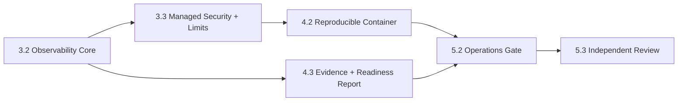

# Workbench R0 下一批 P0 执行计划

## 1. 目标

下一批工作不继续扩展业务 Pane，而是把当前可构建服务变成可运行、可观察、可限制、可部署、可回滚的生产基础。完成后 R1/R2 才能安全消费身份和 Owner 合同。

## 2. 串行关键路径

Observability 与 evidence report 可分 lane 并行，但 container 必须消费稳定 config/readiness/security 合同；最终 operations gate 必须使用同一个构建 artifact。

## 3. P0-A Observability Core

**Current progress (2026-07-20)**: HTTP/JSON-RPC/gRPC correlation、redacted JSON logs、低基数调用 metrics、认证后的版本化 diagnostics、持久化成功后的 Task status transition metrics、无 SQL 的 DB query status/duration 与 pool metrics、bounded OTLP/HTTP span exporter、disposable receiver delivery/503 bounded outage、runtime lifecycle logs、真实 binary component smoke 与脱敏 evidence 已完成。剩余 P0-A 是 staging collector 长时 outage/retry、OTLP metrics exporter、独立 admin listener、Web/BFF propagation 和跨服务 trace context。

- **Owned paths**: `service/internal/observability/**`, `service/internal/app/**`, `service/internal/transport/**`, `service/cmd/workbenchd/**`。
- **Deliverables**: shared sanitizer、structured JSON logger、request/correlation propagation、HTTP/gRPC/JSON-RPC metrics、DB/registry/readiness metrics、OTel trace/exporter adapter。
- **Cardinality policy**: metric label 只允许 transport、method family、status class、capability、readiness component；tenant/user/task/resource/path/error text 不能作为 label。
- **Failure policy**: exporter timeout/drop 不阻塞业务；queue bounded；shutdown 有最大 flush deadline；输出不含 token、Authorization、cookie、DSN、raw body、provider payload、私有路径或完整 ID。
- **Acceptance**: correlation 可跨 transport 和 Owner adapter；exporter outage、oversized error、malicious ref 和 shutdown tests 通过。
- **Verification**: `task test:observability && task test:security && CGO_ENABLED=1 go test -race ./service/internal/observability ./service/internal/runtime ./service/internal/transport/...`。

## 4. P0-B Managed Security 与 Limits

- **Owned paths**: `service/internal/security/**`, `service/internal/config/**`, `service/internal/runtime/**`, `service/internal/transport/**`, `apps/web/src/bff/**`。
- **Deliverables**: managed listener guard、approved issuer/JWKS validator interface、Origin/Host/CSRF/CSP、request/body/batch/query/cursor/SSE limits、timeouts、rate/concurrency limits、safe errors。
- **Profile rule**: local 只绑定 loopback 并使用 private local-session token；managed public listener 缺 approved auth/issuer 时 fail-fast。
- **Boundary rule**: browser 不接收 Owner credential；BFF 不把用户 Authorization 透传给动态 Owner URL；Owner 调用只使用批准的 service delegation。
- **Acceptance**: spoofed Host/Origin、oversized body、cursor abuse、slow client、SSE exhaustion、invalid issuer 和 auth outage 均 fail-closed；日志无 secret。
- **Verification**: `task test:security && CGO_ENABLED=1 go test -race ./service/internal/security ./service/internal/transport/...`。

**Current progress (2026-07-20)**: local/current-managed loopback 基线已落地 shared request policy、exact Host/Origin、body/header/query budget、稳定 413/414/431、SSE process semaphore、bounded lease、429 + Retry-After、CLI 收紧参数和真实 binary component abuse evidence `20260720085425-07fb752d-c9fb-4ed8-b502-fb5493f55de6`。下一步不是继续增加 local 特例，而是进入 R1 approved issuer/session validator 与 BFF/service-delegation 边界；在此之前 managed public listener 继续 fail-closed。

### 4.1 落地工作流

P0-B 按“合同先行 → abuse test → middleware/runtime → transport mapping → component evidence → review”串行推进，避免各 Pane 或 transport 各自实现一套限制：

1. **Contract freeze**：先冻结默认阈值、profile gate、稳定 error code 与不记录字段；阈值变化必须更新 spec 和 abuse matrix。
2. **Failing abuse tests**：分别覆盖 Host/Origin、Content-Length/chunked body、query/cursor、SSE capacity、lease timeout、cancel/shutdown cleanup；测试必须证明请求未进入业务依赖。
3. **Shared enforcement**：`service/internal/security` 拥有 HTTP request policy 与 stream lease；`runtime` 只负责配置默认值、listener gate 与 middleware wiring；transport 只映射协议错误。
4. **Profile acceptance**：local 与当前 managed 运行 loopback matrix；非 loopback managed 在 R1 validator 到位前必须启动失败。不得为演示放宽为公网 local token。
5. **Evidence gate**：真实 `workbenchd` component smoke 并发占满 SSE、验证第 33 条被拒绝、取消后可重新获取 slot、oversized request 为 `413`，输出进入标准 evidence runner。
6. **Production review**：完成 race、strict spec、secret scan 与独立 security review 后才允许 P0-B 从 partial 变为 complete。

### 4.2 与完整产品工作流的衔接

本阶段不是独立 demo hardening，而是后续完整功能的公共执行机制：所有 Pane、文件预览、全屏 Pane、Task/Workflow、Owner adapter 与未来 managed collaboration 都必须复用同一认证 principal、request budget、stream lease、correlation、stable error 和 evidence contract。新功能若绕过这些公共入口，不得进入 R1-R5 的 production-ready 状态。

## 5. P0-C Reproducible Container

- **Owned paths**: `Dockerfile`, `.dockerignore`, `deploy/**`, `scripts/container/**`, `Taskfile.yml`, `package.json`。
- **Deliverables**: pinned multi-stage build、`CGO_ENABLED=0` binaries、Vite static assets、non-root minimal runtime、read-only root filesystem compatible paths、health/readiness probe、graceful SIGTERM、SBOM/provenance metadata。
- **Image exclusions**: source tree、`.git`、local database、tokens、credentials、evidence runs、tests、fixtures、developer config。
- **Acceptance**: image inspect 无 secret/source/local state；以非 root 启动；DB/migration 未就绪时 readiness 失败；SIGTERM 在 deadline 内 drain。
- **Verification**: `task build && task container:smoke`，并检查 image user、layers、ports、filesystem writes、signals 和 embedded config。

## 6. P0-D Evidence 与 Readiness Report

- **Owned paths**: `scripts/test-evidence/**`, `tests/evidence/**`, `scripts/release/**`, `service/cmd/workbench-readiness/**`, `Taskfile.yml`。
- **Deliverables**: interrupt-safe evidence runner、artifact/config/schema/contract digests、redaction result、gate aggregation、machine-generated readiness report 和 human summary。
- **Report rule**: report 由 CLI 读取真实 evidence/run metadata 生成；Agent 不手写状态；缺 run、失败、过期或 digest drift 均为 fail。
- **Acceptance**: success/failure/signal/disk-error/secret injection 都保留原退出码和可审计六件套；报告不包含私有路径或 credential。
- **Verification**: `bun test tests/evidence && task release:readiness ENV=local`。

## 7. 外部环境门禁

以下工作需要用户或运维提供 disposable 环境，但不阻塞本地实现：

| Gate | Required input | Safe constraint | Completion evidence |
| --- | --- | --- | --- |
| PostgreSQL parity | `WORKBENCH_TEST_POSTGRES_URL` | 独立 test database | repository/migration integration run |
| PostgreSQL restore | source + restore verify DSN | restore DB name含 disposable marker | checksum/schema/business invariant run |
| Container runtime | Docker/BuildKit | 无 production secret | startup/readiness/shutdown evidence |
| OTel integration | disposable collector endpoint | exporter credential不进 argv/log | trace/metric outage and delivery evidence |

没有这些真实证据时，相应任务保持 partial；不得用 mock 或 local SQLite 代替 managed gate。

## 8. 完成定义

下一批 P0 只有在以下条件同时满足时完成：

1. observability、security、container、evidence/readiness 的单元、race、集成和失败注入门禁通过；
2. `task build` 生成相同来源的四个数据库/服务二进制与 Web assets；
3. container smoke、migration check、restore verify 和 telemetry outage 产生脱敏 evidence；
4. strict OpenSpec、contract/security/observability tests 全绿；
5. 独立 review/security review 无 P0/P1；
6. 未获得真实 PostgreSQL、OTel 或 container 证据的项目明确保持 partial，不被文档关闭。
