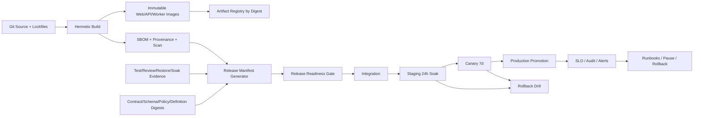
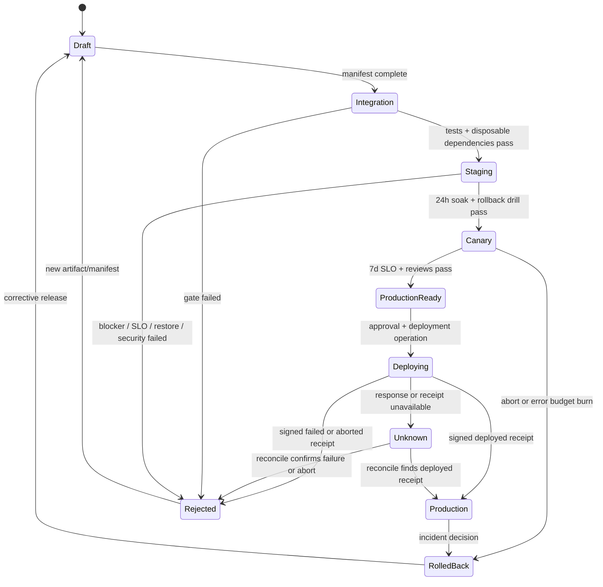

# Workbench Production GA R5 设计

## Context

Workbench 是 Web/BFF、Go API/control plane、workflow worker、PostgreSQL、Identity/Owner providers 的组合系统。R0-R4 分别拥有基础、身份、Owner、Desktop/Daily Operations、Spatial/Workflow capability；R5 不拥有这些业务逻辑，只负责证明同一组版本能够在 production-like环境安全运行、升级、恢复和回滚。

当前已有 Taskfile preview/build/test/migration 基础、integration evidence runner和T0 production task guard；T0只验证environment/dry-run/approval presence/opaque refs与输出/退出码，不验证approval权威或release readiness。项目仍缺统一 container/deploy/CI、真实 Postgres parity、managed backup/restore、release manifest、SLO/error budget、staging/canary soak、supply-chain/security和GA审核。生产动作具有外部副作用，R5 的自动化默认只读/dry-run；真实发布需用户/root批准。

## PostgreSQL target and managed migration authority (2026-09-03)

The old environment-string gate is not an authority boundary. PostgreSQL test
mutation therefore has a two-stage contract: a local current-UID 0600
attestation canonically binds a normalized DSN, target class, expiry and
provisioner sentinel/effect nonce; then each executable process performs a
read-only server-side identity/sentinel verification before it can execute
DDL/DML. The target loader rejects symlinks, unsafe modes, duplicate/case or
unknown JSON fields, caller search-path/options, multi-host/socket/fragment,
passfile/service/hostaddr and inherited `PG*` overrides. Local disposable
targets are loopback-only. Managed targets have no local substitute and remain
blocked pending a signed provider target/plan/approval/operation authority.

Managed migration and backup are deliberately asymmetric with local SQLite:
SQLite may continue to migrate and back up locally. Managed `up`, legacy
`-command up`, `pg_dump`, `pg_restore`, and target cleanup block before
connection or subprocess execution until the authority consumer exists;
managed dry-run is plan-only. `check`/`status` are read-only and must not
bootstrap migration metadata. This deliberately invalidates historical PG
evidence which used only `WORKBENCH_POSTGRES_TEST_TARGET=disposable`.

跨 Release 的生产方/消费方交接、可分派执行包、Taskfile稳定目标、首个生产租户cutover、最终治理/closeout、治理CLI实现切片、data inventory owner签收、Provider执行DAG和support diagnostics生产交接分别由 `details/cross-release-integration-delivery-dag.md`、`details/production-execution-work-packages.md`、`details/production-taskfile-target-contract.md`、`details/first-production-tenant-cutover-plan.md`、`details/production-governance-closeout-handoff.md`、`details/governance-cli-implementation-slices.md`、`details/data-inventory-owner-signoff-handoff.md`、`details/data-inventory-provider-integration-runbook.md`、`details/support-diagnostics-production-handoff.md` 细化。这些文件是本设计的强制执行部分，不是可选参考。

## Goals / Non-Goals

**Goals:**

- 构建一次不可变制品并按digest晋级，能够追溯源码/依赖/合同/schema/policy/definition/evidence。
- 证明 managed Web/API/worker/PostgreSQL/Identity/Owner topology 的配置、readiness、容量、故障、备份恢复、升级回滚与SLO。
- 用CLI/服务生成release manifest和Go/No-Go结果，阻止缺证据、过期证据或手写结论晋级。
- 每个capability独立flag/kill switch/canary/rollback，不让单个Owner或新功能扩大事故面。

**Non-Goals:**

- 不新增R0-R4业务功能或修复范围外产品缺口；缺口退回owner change。
- 不在未经批准时执行production deploy、DNS、secret rotation、外部消息或真实数据mutation。
- 不把staging fixture/local profile/screenshot/人工口头确认当production evidence。
- 不保证第三方Owner自身SLO；只定义Workbench对其capability/degradation/alert/rollback行为。

## Architecture



## Decisions

### 1. Build once, promote by immutable digest

Web assets、`workbenchd`、`workbench-worker`、`workbench-migrate` 和相关 runtime image在受控build中一次生成。Release记录source commit/submodule refs、lockfile digest、toolchain、build args allowlist、image/artifact digest、SBOM/provenance/signature。integration/staging/canary/production MUST 使用同一digest；环境差异只来自approved config/secret reference，不重新编译。

正常Go binary保持`CGO_ENABLED=0`。Container使用non-root、read-only root filesystem（必要写目录显式挂载）、最小base、固定版本，不能包含源码、node_modules/cache、token、local DB、test evidence或开发配置。

### 2. Release manifest 由CLI/服务生成且不可手写

`workbench-release`（或项目脚本/服务）从真实artifact registry、OpenSpec status、test evidence、review结果、migration/backup/restore、SLO/soak与known risk来源生成versioned manifest。至少包含：

```text
release_id, version, source refs, artifact digests,
contract/schema/policy/definition digests,
R0-R4 capability versions/status,
test/evidence refs + freshness/redaction,
SBOM/provenance/scan refs,
migration/backup/restore/rollback refs,
SLO/capacity/soak refs,
approved flags/kill switches,
known risks/owners/expiry,
decision/approvers/timestamps
```

manifest是structured asset，必须由CLI/服务创建/更新；Agent不得手写JSON/YAML/状态文件。缺失、过期、digest不一致、P0/P1或redaction失败时readiness gate失败。

Stable v3 不由现有alpha字段直接改版本获得。冻结前必须按 `details/stable-v3-freeze-readiness-matrix.md` 收敛八类真实authority：artifact/immutable worker、managed restore、capability selector approval、external review、连续SLO、independent handoff、supply-chain和selected deployment contract。任一项为partial/blocked时保持No-Go；candidate只绑定deployment contract与只读preflight，不提前记录production approval、deployment receipt或deployed truth。

Supply-chain authority 分阶段收敛：`details/artifact-sbom-authority-baseline.md` 只建立 artifact SBOM 的 fail-closed diagnostic authority，不替代 approved builder provenance、四目标 image/base SBOM、license/advisory policy、registry signature 或 secret/source/layer scan。Stable v3 只能消费后续聚合并签名的 supply-chain authority，不能直接把 v1alpha1 diagnostic report 改版本或清空 blockers。

Security scan 同样分层：`details/artifact-security-authority-baseline.md` 只扫描 exact artifact tree 与已绑定的 SBOM/supply-chain authority，并以 code/relative path/count 记录 finding，禁止保存 matched value、snippet 或私有路径。Repository、candidate evidence、OCI history/config/filesystem、rotation/revocation/rebuild 与独立 security approval 必须由后续 provider authority 完成；本地 v1alpha1 report 不能直接进入 stable v3。

Approved builder provenance 采用独立 provider/consumer/joint handoff，合同见 `details/approved-builder-provenance-handoff.md`，执行交接见 `details/approved-builder-provider-integration-runbook.md`。Provider拥有runner、registry、workload identity与signer；Workbench只验证签名public receipt、managed policy/trust digest、artifact/R4 worker绑定与cross-builder comparison。Provider Ready、Consumer Done与Joint Integration分开计算，fixture consumer test不能替代真实builder签收；provider响应丢失必须lookup/reconcile原invocation，rotation/revoke后必须重新评估candidate。

Builder joint之后的stable supply-chain authority见 `details/stable-supply-chain-authority-handoff.md`。四个OCI target、两个base digest、image/base SBOM、dependency/license/advisory policy、exception、artifact/image/SBOM/scan signature与stable aggregator必须逐层绑定同一candidate。Scanner missing/stale/partial、registry referrer unavailable、signature/policy revoked或漏任一target时fail closed；artifact diagnostic report不能通过改字段直接晋升为stable authority。

Production security authority见 `details/production-security-authority-handoff.md`。Repository/history、untracked/ignored candidate inputs、generated state、成功与失败evidence、四目标OCI config/history/every layer/merged filesystem必须分别扫描。Scanner receipt只能输出safe code/path alias/count，禁止matched value/snippet/offset/hash/private path；真实credential命中后必须完成quarantine、revoke、rotate、exposure audit、新source/artifact/image/SBOM/signature与rescan、旧authority撤销和独立security review，扫描clean或审批本身都不能替代事故闭环。

Managed runtime到production的跨lane执行顺序见 `details/managed-runtime-production-handoff.md`。Deployment platform、environment inventory、managed PostgreSQL/PITR、observability/paging必须分别Provider Ready，才能生成四组件manifests、执行preflight和进入staging。24h staging、首租户C0-C7与7-day canary必须使用同一artifact/image/manifest digest；response loss使用原operation lookup/reconcile，read通过不自动开启write，任一窗口缺口、P0/P1、RPO/RTO或rollback失败都生成No-Go而非缩短窗口。

### 3. Environment config 与 secret 分离

环境profile定义非秘密值：public base URL、issuer/audience、DB/Owner service refs、limits、timeouts、feature flags、telemetry endpoint、resource sizing。Secret只以secret manager/keychain/CI secret reference注入；不写repo、manifest values、argv、logs、evidence或image layer。

managed启动前验证：HTTPS/proxy trust、Identity issuer/JWKS/session、Postgres TLS/pool、service identity、Owner allowlist、audit/telemetry、cookie/CSRF、migration/schema、worker contract。invalid/missing/conflicting config fail-fast且错误不回显secret。

### 4. Production topology 分离Web/API/migration/worker

- Web/BFF：同源session/security proxy，独立scale/readiness。
- API/control plane：HTTP/gRPC/JSON-RPC/SSE、registry/services，独立scale/readiness。
- Migration job：显式一次性任务，先check/plan/up/check，不由API/worker启动自动迁移。
- Workflow worker：独立binary/deployment/profile，scheduler/worker readiness、graceful drain与lease fencing。
- PostgreSQL：managed HA/backup/monitoring；local SQLite不进入production。

部署使用rolling或blue/green，但新旧版本必须在contract/schema/worker range兼容。Migration遵循expand → backfill → shadow/read compare → cutover → contract，破坏性contract需deprecation窗口和独立approval。

### 5. Promotion 使用显式状态机



每个状态转换要求manifest digest和approver；真实Production转换不由普通`release:readiness`命令执行。`Deploying`和`Unknown`必须保留真实外部不确定性：partial apply、响应丢失或receipt暂时不可用时不得重试创建第二个deployment operation，只能使用原idempotency key和operation ref执行lookup/reconcile。只有批准deployment platform签发且绑定stable manifest、artifact与approval digest的`deployed` receipt通过后才能进入Production。

### 6. Capability 独立晋级与 kill switch

`identity_managed`、各Owner connector、`desktop_v3`、`asset_catalog`、`workitems`、`daily_ops`、`spatial_board`、`workflow_runtime`等独立记录planned/needs_contract/integration_ready/canary/available/degraded/disabled。总release可包含未available capability，但UI/API必须诚实降级且默认flag关闭。

kill switch按global/tenant/capability/Owner operation/definition分层；触发只阻止新流量/dispatch，已接受mutation继续receipt/reconcile。恢复前检查contract/auth/queue/schema和incident action。

### 7. Database migration、backup、restore 与DR 是发布前置

Release manifest固定schema version/checksum、migration plan/compatibility/rollback boundary。部署顺序：backup current → restore verification current → migration check/plan → additive migration job → schema check → app/worker rollout → backfill/shadow/cutover → post-check。

Backup metadata至少包含database/profile/schema version、started/completed、size/checksum/encryption/key reference、retention/expiry、provider ref。每次GA/canary前必须把选定backup恢复到disposable隔离环境，运行schema/checksum、row/invariant、application smoke和redaction；“backup文件存在”不等于可恢复。

目标：managed RPO≤5m、RTO≤30m，最终由provider能力和drill冻结。Rollback不执行未经设计的destructive schema reversal；通常回滚application/flags并保持expand schema。无法兼容旧binary时阻止rollout而不是冒险回滚。

### 8. SLI/SLO/error budget 驱动promotion

初始目标：

| SLI | Target | Promotion blocker |
| --- | --- | --- |
| API availability | 99.9% monthly | 5m burn >2% or 1h burn >1% |
| mutation accepted/known outcome | 99.5% excluding explicit Owner offline | 15m error >2% |
| Asset/Search p95 | <500ms | >750ms for 15m |
| Pane interaction p95 | <100ms | >200ms canary |
| SSE recovery p95 | <10s | >30s |
| projection/revoke freshness p95 | <60s | >5m stale / revoke over approved window |
| workflow scheduling/reconcile | approved R4 budget | queue/reconcile lag over threshold |
| Backup RPO | ≤5m | lag >15m |
| Restore RTO | ≤30m | drill timeout/failure |

staging至少24h soak，canary至少7天或批准等价窗口；error budget不满足时暂停feature/rollout，不能用平均值掩盖tail/failure。

观测权威链分为三个独立责任域：provider-owned adapter负责只读查询与签名，security/operations负责policy和public trust bundle分发、轮换与撤销，Workbench只负责严格验证并绑定release manifest。`collect`生成`workbench.slo_report.v1alpha2`，provider signer生成`workbench.slo_observation_receipt.v1alpha1`，Workbench通过managed `WORKBENCH_SLO_POLICY_DIGEST`与`WORKBENCH_SLO_TRUST_BUNDLE_DIGEST`锚定来源；调用者不得自由覆盖query revision、source digest或trust digest。

连续窗口以同一environment、artifact digest、capability、policy digest、query-set digest为基本单元。窗口中途切换artifact/policy/query必须重新开始计时；coverage、missing seconds、segment count和max gap均进入验证，不能把多个失败窗口拼接成一个合格窗口。原始metrics/logs/traces留在观测provider，Workbench evidence仅保存脱敏report、签名receipt、公开trust material、命令与摘要。

### 9. Observability、alert与runbook一一对应

metrics/traces/logs/audit覆盖request/DB/session/identity/Owner/projection/SSE/Task/unknown_accept/layout/search/workitem/board/workflow/worker/backup/release。每个P0/P1 alert必须链接可运行runbook、dashboard、owner、escalation、safe diagnostics和rollback/kill switch步骤。

Telemetry exporter outage不能阻塞普通低风险请求，但required audit写入失败时高风险mutation fail-closed或进入批准durable buffer。日志使用structured English keys与opaque digest，不含secret/raw content/private path/PII。

### 10. Supply-chain 与security gate

- dependency/lockfile/license/advisory scan；critical/high按policy处理。
- SBOM/provenance/signature/immutable registry；验证base image/toolchain来源。
- secret scan、container layer/source/config检查、non-root/capabilities/seccomp/read-only FS/network/egress policy。
- SAST/Go vet/lint/typecheck/test/race、browser security、cross-tenant、token/cookie、SSRF/open redirect、operator/workflow abuse。
- privacy/data retention/export/delete/tombstone审查；evidence/backup/diagnostics同样脱敏。

未解决P0/P1、真实secret、跨租户、数据丢失、arbitrary execution、unknown_accept重复dispatch、restore失败一律No-Go。

### 11. Rollback 与incident不依赖重新构建

rollback目标是前一批准artifact digest + compatibility matrix + preserved schema。应用/worker可分别回滚或停止，capability可kill switch。回滚前检查migration/schema、in-flight Task/workflow/receipt/reconcile；回滚后运行readiness/smoke/data invariant/SLO并更新incident/release evidence。

incident流程：detect → classify → stop new risk via flag/switch → preserve evidence → reconcile external mutations → rollback/fix-forward decision → restore if data loss → customer/internal communication由批准owner处理 → postmortem/action tracking。Agent不得自行发送外部消息或执行production action。

### 12. Support diagnostics 最小化暴露

Diagnostics展示version/artifact digest、profile/config source type、contract/schema/policy/definition versions、capability/readiness/freshness、safe trace/evidence refs和救援命令。不得显示secret值、internal raw endpoint、full tenant/user/resource refs、payload或stack。

### 13. Provider Ready 与 Consumer Done 分开验收

每个 Identity/Owner 对接先由生产方交付版本化合同、SDK、auth/delegation、event resume、mutation receipt/reconcile、真实进程验证和rollback，再由Workbench完成adapter/service/transport/SDK/UI/fault evidence。Provider缺口只能回对应repo/change修复；Workbench可实现fail-closed skeleton，但不得复制Provider状态机或把fixture提升为available。

跨Release交接使用`INT-*`包追踪producer、consumer、digest、environment、evidence、rollback和failure owner。只有Provider Ready与Consumer Done都成立，capability才能从`needs_contract`进入`integration_ready`。

### 14. 首个租户按读写风险逐级 cutover

首个生产租户必须显式allowlist并使用test workspace、Eikona disposable project和独立capability flags。cutover固定按Identity bootstrap → Provider connect → shadow projection → read canary → limited write → Daily loop → Workflow canary → 7-day observation推进；不得把demo profile、fixture identity、local bridge或普通用户项目直接迁入生产。

每一级有独立停止条件和rollback。读路径失败回旧projection generation；写路径先kill新dispatch并reconcile既有receipt；workflow先pause scheduler/claim并保留lease/run truth。扩大租户或capability需要新的批准与证据，不能用首租户结论自动全量放开。

## Migration Plan

1. 建立build/container/SBOM/provenance和artifact digest验证。
2. 建立release manifest CLI/schema与evidence freshness/redaction validator。
3. 建立integration/staging/canary/prod config/deploy skeleton和dry-run validation。
4. 完成managed Postgres migration/backup/restore/rollback流程与disposable drill。
5. 建立SLO/dashboard/alert/runbook/capacity/fault/security/a11y gates。
6. 按`INT-*`交接包确认Provider Ready与Consumer Done，再生成同一digest的integration candidate。
7. 首租户依次执行shadow/read-only、limited-write、Daily和Workflow canary，不同时首次打开多个高风险mutation。
8. R0-R4 stable artifact在integration→staging 24h soak→canary 7d推进。
9. 独立review/security/operations Go-No-Go；用户/root批准后才可真实production rollout。

## Test and Evidence Plan

- Build：reproducibility、digest、SBOM/provenance/signature、layer/source/secret、non-root、startup/shutdown。
- Deployment：config validation、migration job、rolling/blue-green compatibility、readiness/drain、resource/egress/secret refs。
- Data：fresh/upgrade/failure/checksum、backup corruption/expiry/wrong profile、restore/invariants/RPO/RTO、rollback。
- Reliability：Identity/Owner/DB/telemetry/worker outage、network partition、key rotation、revoke、queue/outbox lag、disk/full resource pressure。
- Capacity/performance：R3/R4 production scales、load/soak、tail latency、memory/CPU/DB pool/connections。
- Security/privacy/a11y：independent reviews与browser/system evidence。
- Release：manifest/gate/promotion/pause/abort/rollback、stale/missing evidence、digest mismatch、capability flags。
- Handoff/Cutover：Provider Ready/Consumer Done、demo清退、tenant bootstrap、shadow compare、逐capability读写canary、停止/回滚与普通用户资源隔离。
- Taskfile：ENV/DRY_RUN/opaque ref校验、missing dependency No-Go、底层退出码、evidence wrapper、help/docs/target parity。

所有结果写per-run evidence六件套；release manifest引用evidence refs/digests而不是复制raw logs。失败必须保留原exit code和artifacts。

## Risks / Trade-offs

- **[R5变成文档豁免层]** → 只接受可运行命令和generated evidence；任何功能缺口退回R0-R4。
- **[环境差异导致canary失真]** → build once、production-like config/topology/data scale、same artifact digest。
- **[过度自动化生产副作用]** → readiness/canary/rollback默认dry-run/read-only；deploy/secret/external actions需明确approval。
- **[SLO目标未经测量]** → 初始目标作为门槛候选，staging evidence可调但必须记录decision/owner，不可事后放宽掩盖失败。
- **[backup可用性幻觉]** → restore-to-disposable + application invariant/smoke，非仅checksum。
- **[回滚与新schema不兼容]** → expand/contract compatibility matrix，阻止不兼容artifact而非盲目回滚。

## Open Questions

- 部署平台/Kubernetes或其他runtime的最终owner与manifest格式；R5保留provider-neutral release contract，具体adapter由deploy owner实现。
- artifact signing/provenance采用何种现有CI/registry能力；不得新增无法维护的自建PKI。
- managed PostgreSQL backup provider、PITR能力与最终RPO/RTO。
- canary用户/tenant选择、数据合规和外部沟通approval owner。
