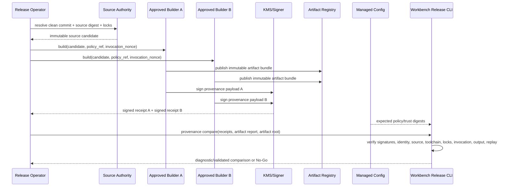

# Approved Builder Provenance Provider 对接 PRD

## 1. 问题与当前结论

Workbench 已能生成 reproducibility report、artifact SBOM、artifact supply-chain diagnostic report 与 artifact disclosure diagnostic report，但这些能力都运行在本地工作区，不能证明 artifact 来自批准 builder，也不能证明 source、toolchain、lock、runner image、build invocation 与输出 digest 由独立平台观察并签名。

当前尚未批准具体 CI/builder provider、runner pool、workload identity、registry、KMS/HSM signer 或 trust distribution。因此：

- 本文冻结 provider-neutral contract，不选择或伪造 provider；
- 本地 `workbench-release` 不生成 builder private key，不把 caller 字符串当 builder identity；
- `3.4b4b1` 合同冻结与 `3.4b4b3` Consumer Done 已完成；
- Provider Ready、真实 cross-builder joint evidence 和 production authority 继续保持未完成；
- Stable v3 / authorized container plan / production deployment 继续 No-Go。

## 2. 目标用户与 Job-to-be-Done

目标用户包括 R4 immutable worker owner、release engineer、CI/platform owner、registry owner、security/KMS owner 与 Workbench release consumer owner。

共同任务是：从一个 clean、固定 source candidate 启动批准 builder，以独立 workload identity 和固定 runner image 执行确定性 build，签发可重验 provenance receipt；至少两个隔离 invocation 对同一 candidate 产生相同 artifact tree digest，或对允许差异提供签名且受政策批准的解释；Workbench 在不接触 builder credential、private key、CI raw payload 或 registry credential 的前提下验证 receipt、trust、cross-builder comparison 与本地 artifact authority。

## 3. Owner 与信任边界

| 责任 | Owner | 写入位置 | Workbench 权限 |
| --- | --- | --- | --- |
| Builder workflow、runner image、network/secret policy | CI/platform owner | provider repository/config | 只消费公开receipt |
| Immutable worker build与handoff metadata | R4 owner | R4 repository/evidence | 只验证digest/contract refs |
| Registry upload与immutable artifact/image digest | registry/release owner | provider registry | 只消费digest与opaque ref |
| Signing key、issuer policy、rotation/revocation | security/KMS owner | KMS/HSM/approved signer | 不接触private key |
| Public trust bundle与expected digest分发 | security + release operations | managed config/registry | 只读消费，不接受caller覆盖 |
| Provenance receipt/comparison严格验证 | Workbench release owner | `service/cmd/workbench-release/**` | 是 |
| Provider Ready与Consumer Done签收 | provider owner + Workbench owner | 各自OpenSpec/evidence | 不得互相代签 |

Builder provider不得向 Workbench 输出 runner filesystem path、checkout path、credential、OIDC token、registry Authorization header、secret env、raw CI event或完整 provider payload。Workbench evidence只保留公开receipt、trust bundle、safe summary、opaque provider refs与digest。

## 4. Authority 数据流



状态顺序固定为：

```text
source_resolved -> building -> artifact_published -> attested -> compared -> consumer_validated
```

任何 source commit/digest、submodule digest、lock digest、toolchain、runner image、build parameters、artifact tree、worker handoff 或 policy digest变化都必须启动新 invocation 与新 receipt；不得沿用旧 nonce、receipt ID 或 comparison report。

## 5. Builder Provenance Receipt v1alpha1

Provider 输出 schema 名称冻结为：

```text
workbench.builder_provenance_receipt.v1alpha1
```

### 5.1 必填字段

| 字段 | 语义与约束 |
| --- | --- |
| `spec_version` | 精确等于 v1alpha1 schema 名称 |
| `receipt_id` | provider生成的opaque唯一ID；不能是path/URL |
| `environment` | `integration|staging|canary|production` |
| `capability_id` | 首个固定为 `workbench-production` |
| `artifact_digest` | 完整 `sha256:<tree-digest>` |
| `artifact_count` | 与reproducibility report exact tree一致 |
| `artifact_report_digest` | CLI-authored reproducibility report digest |
| `source_repository_id` | allowlisted opaque repo identity，不记录remote URL |
| `source_commit` | 40位Git commit |
| `source_digest` | 规范化source inventory digest |
| `source_dirty` | 必须为false |
| `submodule_digest` | canonical submodule path/commit aggregate digest；无submodule也需固定empty digest |
| `bun_lock_digest` | `bun.lock` digest |
| `go_mod_digest` | `service/go.mod` digest |
| `go_sum_digest` | `service/go.sum` digest |
| `builder_provider_id` | allowlisted provider identity |
| `builder_pool_id` | allowlisted isolated pool identity |
| `builder_instance_id` | 单次隔离builder instance identity；comparison中必须distinct |
| `workload_identity` | provider/KMS验证过的opaque workload subject |
| `runner_image_digest` | immutable OCI digest，不接受tag |
| `runner_os` / `runner_arch` | canonical target |
| `go_toolchain` / `bun_toolchain` | 完整版本，与build metadata一致 |
| `build_parameters_digest` | `CGO_ENABLED=0`、trimpath、buildvcs、buildid、SOURCE_DATE_EPOCH等canonical digest |
| `invocation_id` | provider唯一build invocation ref |
| `invocation_digest` | source+policy+builder+parameters的canonical digest |
| `invocation_nonce` | provider随机nonce，防止receipt replay |
| `started_at` / `finished_at` | RFC3339Nano，顺序有效且满足max duration policy |
| `policy_digest` | approved builder policy digest，来自managed config |
| `worker_handoff_digest` | R4 immutable worker handoff digest |
| `artifact_registry_ref` | opaque immutable artifact bundle ref，不是URL |
| `issued_at` / `expires_at` | receipt签发与过期时间 |
| `issuer_ref` / `key_id` / `algorithm` | allowlisted signer identity；v1alpha1只允许Ed25519，keyless profile留待新版本 |
| `signature` | 对canonical unsigned payload签名 |

### 5.2 Canonicalization

- JSON必须拒绝unknown fields、duplicate keys、多个JSON value与非canonical数字。
- 签名payload排除`signature`，其余字段以固定field order和UTF-8 JSON编码。
- 所有digest统一小写`sha256:<64 hex>`。
- 时间统一UTC RFC3339Nano。
- `artifact_registry_ref`、identity与receipt ref必须是opaque value，不得含scheme、host、path separator、query或credential词。
- Provider必须发布schema digest；Workbench consumer固定支持的schema digest/version window，不按字段猜测兼容。
- Trust key必须同时allowlist `source_repository_id`、provider、pool与workload identity；receipt字段存在不等于被授权。
- Workbench按source/locks、builder identity、runner/toolchain、build parameters、policy与worker handoff重算`invocation_digest`，不得只信provider提交值。

### 5.3 R4 Worker Artifact Handoff

Workbench consumer同时支持严格只读 schema：

```text
workbench.worker_artifact_handoff.v1alpha1
```

该文件由R4 CLI/服务生成，至少包含environment、capability、`bin/workbench-worker` digest/size、source digest、worker contract/step registry/schema range digest、component/system evidence digest、`claim_enabled=true`、`closeout_complete=true`与generated time。Workbench使用managed `WORKBENCH_WORKER_HANDOFF_DIGEST`绑定该文件，并将worker binary digest/size与reproducibility artifact tree逐项比较。Claim-disabled、未closeout、stale/future、source/artifact mismatch全部阻断。

## 6. Cross-Builder Comparison Report v1alpha1

Workbench CLI从两个或以上有效receipt生成：

```text
workbench.builder_comparison_report.v1alpha1
```

报告至少绑定：

- environment、capability、artifact digest、artifact report digest；
- source commit/digest、submodule/lock/toolchain/build parameters/policy digest；
- 排序、去重的receipt digest列表；
- distinct invocation IDs/nonces；
- distinct builder instance identity；
- artifact count/tree digest equality；
- worker handoff digest equality；
- comparison status、blockers、generated_at。

首版只有全部输出完全相同才允许`matched=true`。任何“允许差异”必须由后续版本引入显式 difference policy、字段级provenance和独立security批准；v1alpha1不得用自由文本解释绕过digest mismatch。

## 7. Provider Adapter 命令合同

Provider repository至少提供以下机器命令；名称可适配provider，但语义必须一致。

### 7.1 `build`

```bash
workbench-builder-adapter build \
  --environment staging \
  --source-ref source:<opaque-ref> \
  --policy-ref policy:<opaque-ref> \
  --worker-handoff-ref handoff:<opaque-ref> \
  --invocation-ref invocation:<opaque-ref> \
  --json
```

返回opaque operation/invocation ref，不返回checkout path、runner token或registry credential。相同invocation ref与相同target必须幂等；相同ref但target变化必须阻断。

### 7.2 `lookup`

```bash
workbench-builder-adapter lookup \
  --invocation-ref invocation:<opaque-ref> \
  --output <evidence-run>/artifacts/builder-provenance-receipt.json \
  --json
```

状态至少支持`queued|running|published|attested|failed|cancelled|unknown`。响应丢失进入`unknown`并lookup/reconcile，禁止盲目重建或重复publish。

### 7.3 `trust-export`

```bash
workbench-builder-adapter trust-export \
  --environment staging \
  --output <managed-config-path>/builder-trust-bundle.json \
  --json
```

只输出public key/certificate identity、issuer、key ID、validity、status、revocation与bundle digest，不输出private key、KMS credential或provider endpoint。

## 8. Workbench Consumer 命令入口

Workbench consumer入口已经实现；它们只证明Consumer Done，不证明Provider Ready：

```bash
task supply-chain:provenance:compare \
  ENV=integration \
  ARTIFACT_REPORT=<path> \
  ARTIFACT_ROOT=<path> \
  WORKER_HANDOFF=<path> \
  BUILDER_RECEIPT_A=<path> \
  BUILDER_RECEIPT_B=<path> \
  BUILDER_TRUST_BUNDLE=<path> \
  WORKBENCH_BUILDER_POLICY_DIGEST=sha256:<digest> \
  WORKBENCH_BUILDER_TRUST_BUNDLE_DIGEST=sha256:<digest> \
  WORKBENCH_WORKER_HANDOFF_DIGEST=sha256:<digest>

task supply-chain:provenance:validate \
  ENV=integration \
  BUILDER_COMPARISON=temp/release/supply-chain/builder-comparison.json \
  ARTIFACT_REPORT=<path> \
  ARTIFACT_ROOT=<path> \
  WORKER_HANDOFF=<path> \
  BUILDER_RECEIPT_A=<path> \
  BUILDER_RECEIPT_B=<path> \
  BUILDER_TRUST_BUNDLE=<path> \
  WORKBENCH_BUILDER_POLICY_DIGEST=sha256:<digest> \
  WORKBENCH_BUILDER_TRUST_BUNDLE_DIGEST=sha256:<digest> \
  WORKBENCH_WORKER_HANDOFF_DIGEST=sha256:<digest>
```

Managed config必须提供：

```text
WORKBENCH_BUILDER_POLICY_DIGEST
WORKBENCH_BUILDER_TRUST_BUNDLE_DIGEST
WORKBENCH_WORKER_HANDOFF_DIGEST
```

CLI flags不得覆盖这三个expected digest。环境变量只保存公开digest，不保存private key、credential或完整receipt。缺失managed anchor时fail closed，不得回落到caller trust。

当前comparison输出固定 `matched=true`、`consumer_done=true`、`provider_ready=false`、`production_authorized=false` 与blockers `provider_integration_evidence_missing`、`rotation_revoke_evidence_missing`。人工修改为provider ready或production authorized会被validator拒绝。

## 9. Provider / Consumer / Joint DAG

| Gate | Owner | Dependencies | Deliverable | Exit evidence |
| --- | --- | --- | --- | --- |
| BUILDER-P1 Provider Contract | CI/platform | provider selected | adapter schema/command/version/error contract | provider unit/component evidence |
| BUILDER-P2 Builder Policy | security/platform | P1 | runner image/pool/workload/source/network/secret policy | signed policy + managed digest |
| BUILDER-P3 Signer Trust | security/KMS | P2 | trust bundle、rotation、revocation、keyless constraints | trust lifecycle evidence |
| BUILDER-P4 Artifact Publish | CI/registry/R4 | immutable worker + clean source | two isolated builds + immutable bundle refs | provider system evidence |
| BUILDER-C1 Receipt Validator | Workbench release | P1-P3 schema frozen | strict loader/signature/trust/freshness/replay validator | 已完成：unit/race/golden/negative matrix |
| BUILDER-C2 Comparison | Workbench release | C1 + receipt fixtures；真实P4待joint | CLI-authored comparison report | 已完成Consumer合同：component evidence |
| BUILDER-J1 Joint Integration | provider + Workbench | P4 + C2 | same digest end-to-end validation | integration evidence六件套 |
| BUILDER-J2 Rotation/Revoke | security + provider + Workbench | J1 | old/new key overlap、revoke、replay drill | system evidence |
| BUILDER-J3 Stable Consumer | Workbench release | J1/J2 + image/security gates | stable supply-chain authority projection | stable v3 consumer evidence |

Provider Ready要求P1-P4全部真实完成；Consumer Done要求C1/C2完成；`3.4b4b`只有J1/J2通过后完成。任何一方不得用fixture替另一方签收。

当前Consumer Done evidence：`temp/integration-test-runs/20260721100528-4d8d4149-1757-49e1-9e0e-777948e941b6/`。该证据使用签名测试fixture，只证明strict consumer behavior，不计P1-P4或J1/J2。

Provider owner、security/KMS、registry、R4 与 Workbench test owner 的实际交付顺序、写入租约、命令、evidence 和 failure drill 见 `details/approved-builder-provider-integration-runbook.md`。

## 10. 失败与负向矩阵

| 场景 | 预期 |
| --- | --- |
| source dirty、commit/digest/submodule/lock mismatch | blocked |
| receipt artifact digest与reproducibility report/tree不同 | blocked |
| worker handoff digest缺失或claim-disabled worker | blocked |
| runner image使用tag或digest不在policy | blocked |
| wrong provider/pool/workload identity | blocked |
| caller传入自建trust bundle或覆盖expected digest | blocked |
| signature tamper、unknown/revoked/expired/future key | blocked |
| receipt expired、future issued、build duration超policy | blocked |
| nonce/receipt/invocation replay | blocked并记录safe finding code |
| 两个receipt来自同一invocation或同一builder instance | comparison blocked |
| artifact digest不同但附带自由文本解释 | blocked |
| build响应丢失 | unknown，只允许lookup/reconcile |
| registry ref为mutable tag、URL或含credential | blocked |
| provider raw payload、checkout path或secret进入evidence | evidence gate blocked |
| fixture receipt通过Workbench unit test | 只证明Consumer合同，不计Provider Ready |

## 11. Rotation、Revocation 与 Rollback

- Key rotation必须支持旧/新key overlap窗口，receipt按`issued_at`选择有效key。
- Revocation立即阻断尚未promotion的receipt；已使用receipt触发candidate重新评估与新build，不静默保留Ready。
- Builder policy、runner image或workload identity撤销后，关联未发布candidate全部失效。
- Registry bundle删除或不可读取时进入authority unavailable，不从本地cache猜测通过。
- Provider故障时可以切换另一 approved provider，但必须生成新receipt与comparison；不能复用旧provider identity。
- 回滚consumer adapter只移除未被stable manifest消费的alpha合同；已经用于promotion的receipt必须保留审计与revocation记录。

## 12. Evidence 与隐私

每次provider build/lookup、receipt validation、comparison、rotation/revoke与joint integration都写入所属项目的 `temp/integration-test-runs/<run-id>/` 六件套。允许artifact：public signed receipt、public trust bundle、comparison report、safe policy summary与opaque refs。

禁止写入：OIDC token、registry credential、KMS request/response、private key、checkout/runner path、CI raw event、Authorization header、provider payload、raw prompt、private tool arguments、用户资源ID或full chain-of-thought。

## 13. 原子交付任务与写入租约

1. Root/operations批准provider、registry、runner pool、signer与failure owner。
2. CI/platform owner在provider repository实现P1/P2，不修改Workbench tracked files。
3. Security/KMS owner发布P3 managed trust，不向Workbench提交private key。
4. R4 owner关闭immutable worker handoff与claim-enabled runtime evidence。
5. Workbench implementer独占 `service/cmd/workbench-release/**` 实现C1/C2。
6. Test owner在provider sandbox运行J1；security与provider运行J2。
7. Workbench release owner只在J1/J2和image/security gates完成后接入J3/stable v3。

共享 `Taskfile.yml`、release CLI与stable manifest只有一个writer。Provider、security和R4任务并行时写路径必须互不重叠。

## 14. 待决策

- 首个CI/builder provider与两个隔离builder instance的定义；
- artifact bundle registry与retention/immutability policy；
- runner image owner、更新节奏与emergency revoke流程；
- v1alpha1 固定 Ed25519；后续是否新增独立 keyless profile，以及其issuer/subject/audience约束；
- max build duration、receipt TTL、lookup SLA与Unknown reconcile周期；
- source repository/submodule canonical digest算法与empty-submodule digest；
- provider切换时comparison是否要求跨provider，或同provider隔离pool即可；
- provenance receipt和comparison report retention周期。
