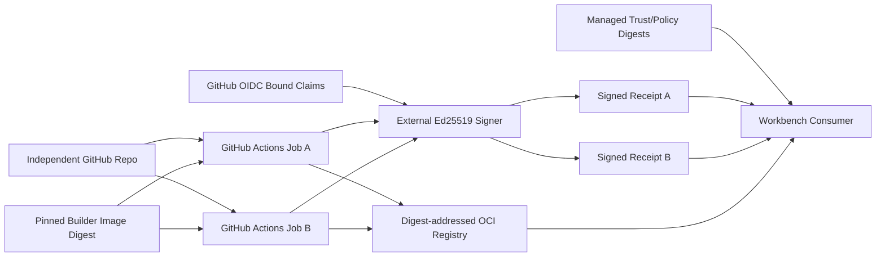

# Approved Builder 首个 Provider 决策建议

## 1. 决策状态

状态：`proposed`，尚未批准，不计 `3.4b4b2a` 完成，也不计 Provider Ready。

建议首个 profile：

```text
orchestrator: GitHub Actions
source repository: independent GitHub repository for yeisme-workbench
artifact registry: GHCR-compatible digest-addressed OCI registry
builder isolation: two independent ephemeral builder jobs/pools
builder runtime: pinned OCI builder image digest
workload identity: GitHub OIDC constrained by repository/ref/workflow/audience
signing: approved external Ed25519 signer/KMS adapter
trust distribution: managed public trust bundle + pinned digest
```

该建议只选择 provider 方向，不批准 production credential、registry namespace、OIDC subject、runner pool、signer、retention 或 on-call owner。Root/operations 与 security/platform owners 必须完成第 5 节决策后，才能把状态改为 approved。

## 2. 当前证据

2026-07-21 本地与服务能力盘点显示：

| 证据 | 当前事实 | 决策影响 |
| --- | --- | --- |
| 根仓库 `git remote -v` | `origin` 指向 GitHub | GitHub 已是现有 source/CI 生态 |
| 根仓库 `.github/workflows/eikona-ci.yml` | 已使用 GitHub Actions、submodule checkout、Go test/race/lint/build | 可复用 workflow 治理习惯，但不能直接复制为 approved builder |
| 根仓库 `.github/workflows/eikona-release.yml` | 已使用 GitHub tag/release 流程 | GitHub 是当前唯一有实际 workflow 的 provider 候选 |
| Workbench workflow inventory | 子项目没有 `.github/workflows` 或 `.gitea/workflows` | approved builder workflow 尚未实现 |
| Workbench `origin` | 指向根仓库内本地 bare repo | 不能被托管 CI 作为独立生产 source；必须先建立独立远端 |
| 根 `.gitmodules` | Workbench URL 为本地 filesystem path | GitHub checkout 无法解析该 production submodule URL |
| Gitea capability self-check | authenticated，但 Actions、Packages 均 unsupported/unavailable | 当前 Gitea 不能作为首个 builder+registry profile 的直接选择 |

这些证据只支持“优先评估 GitHub Actions”，不证明 GitHub-hosted runner、GHCR、OIDC 或 signer 已满足 approved builder policy。

## 3. 推荐架构



GitHub Actions 只负责编排。真正的 builder identity 必须同时绑定：

- 独立 Workbench repository/ref/workflow；
- 两个 distinct invocation、job 与 builder instance；
- pinned OCI builder image digest；
- GitHub OIDC issuer/subject/audience 与批准 pool/workload mapping；
- clean source、submodule、Bun/Go lock、toolchain 与 build parameters；
- R4 worker handoff digest；
- external Ed25519 signer签发的 v1alpha1 receipt。

不能把 `runs-on: ubuntu-latest`、workflow名称、job ID 或 GitHub用户字符串单独当 approved builder identity。

## 4. 为什么不直接采用现有工作流

现有 Eikona workflow 是普通 CI/release precedent，不具备以下 Workbench production authority：

- Workbench 独立远端与可托管 checkout；
- immutable runner/builder image digest；
- 两个隔离 invocation/instance；
- fail-closed source/submodule/lock/toolchain/worker handoff绑定；
- provider adapter `build|lookup|trust-export` 与 Unknown reconcile；
- external Ed25519 signer和managed trust digest；
- immutable artifact registry retention；
- public signed provenance receipt；
- rotation/revoke/replay 与 registry unavailable演练；
- provider-owned evidence六件套与独立Provider Ready签收。

因此只能复用 workflow style，不能把现有 GitHub Actions green build计为 P1-P5 evidence。

## 5. 批准前必须补齐的决策

| ID | 决策 | 推荐默认 | 必须批准的 owner |
| --- | --- | --- | --- |
| PD-1 | Workbench 独立 GitHub repository 与 `develop/main` policy | 新建/迁移独立 repo，根 submodule 使用可访问 HTTPS/SSH URL | root repository owner |
| PD-2 | 两个隔离 builder pool/instance 的技术边界 | 两个独立 ephemeral jobs，不共享 workspace/cache identity | CI/platform owner |
| PD-3 | Builder OCI image | 维护 pinned digest，升级必须新 policy digest | CI/platform + security |
| PD-4 | Registry namespace/retention/immutability | GHCR-compatible registry，所有消费按 digest，禁止 tag authority | registry/release owner |
| PD-5 | OIDC claims | 固定 repository、ref、workflow、environment、audience | Identity/security owner |
| PD-6 | Ed25519 signer | 外部 signer/KMS adapter，OIDC换取短期签名权限 | security/KMS owner |
| PD-7 | Trust distribution | managed public bundle与digest，定义refresh/revoke SLA | security + operations |
| PD-8 | Network/secret policy | build默认deny，只有依赖下载/registry/signer显式allow | security/platform owner |
| PD-9 | Artifact/evidence retention | receipts/trust/policy/comparison/run可覆盖审计与rollback窗口 | compliance/release owner |
| PD-10 | Failure/on-call | CI、registry、signer、trust、consumer分别有owner | operations owner |

`PD-1` 是首个硬前置：当前本地 bare remote 和 filesystem submodule URL 不适用于托管 approved builder。未完成 PD-1 前，不应新增声称 production 的 Workbench GitHub workflow。

## 6. 推荐实施顺序

1. Root owner 创建 Workbench 独立远端，保留 `develop` 日常集成、`main` 稳定发布策略；更新根 submodule URL只能在独立远端可fetch后执行。
2. CI/platform owner在独立 repository 创建普通 read-only CI canary，先验证 checkout/submodule/toolchain，不签发 provenance、不发布 production artifact。
3. Security/platform owner批准 PD-2 至 PD-8，冻结 builder policy 与 signer/trust contract。
4. Provider owner实现 `approved-builder-provider-integration-runbook.md` P1-P4。
5. Provider/security/R4 owners独立签收 P5，完成 Provider Ready。
6. Workbench/provider/security owners执行 J0-J5；只有 joint evidence完成后进入 image/advisory/signature gates。

## 7. 替代方案与退出条件

### Gitea Actions + Gitea Packages

当前 capability probe 显示 Actions、Packages unavailable，因此不是首选。只有当后续直接证据证明：

- Actions endpoint 可用且有批准 runner isolation；
- Packages/OCI registry 可用且支持digest/retention；
- OIDC/workload identity与external signer可约束；
- provider adapter与evidence runner可落地；

才重新进入候选比较。不得仅因已存在Gitea登录态而选择。

### 自建 CI/builder

当前不推荐。它会新增 runner lifecycle、scheduler、credential、registry、signer、availability 与 on-call 面，超出 demo→production 的最短路径。只有 GitHub Actions 无法满足明确安全/隔离/成本要求，且 operations 批准长期维护 owner 后再评估。

### 退出 GitHub Actions 建议

如果 PD-1 无法建立独立远端，或无法获得满足 Ed25519/OIDC/immutable runner/registry 要求的安全 owner与平台，则保持 No-Go，并重新比较其他托管 provider；不得降级到 local runner、repo key 或 unsigned artifact。
