# Approved Builder Provider 对接执行手册

## 1. 目的与当前状态

本文把 `approved-builder-provenance-handoff.md` 已冻结的 provider-neutral 合同转换为可直接交接给 CI/platform、security/KMS、registry、R4 worker 与 Workbench release owner 的执行包。本文不是新的状态数据库；Provider Ready、Joint Integration、rotation/revoke 与 stable v3 状态必须由各 owner 的 CLI、provider service 或 release CLI 生成并以 evidence digest 证明，不能通过修改 Markdown checkbox 获得。

当前事实：

- Workbench `BUILDER-C1/C2` Consumer Done 已完成；
- `BUILDER-P1-P4` 尚无真实 provider evidence，因此 Provider Ready 未完成；
- `BUILDER-J1/J2` 尚未运行，因此 production authority 继续 No-Go；
- 本文冻结后，下一步是 root/operations 选择并批准首个 provider profile，再由 provider owner 在 provider repository 实现，不在 Workbench 仓库伪造 provider；当前证据化建议见 `details/approved-builder-provider-decision-recommendation.md`。

## 2. 生产解锁边界

Approved builder 只解决“谁在什么受控环境中从哪个 source 生成了哪个 artifact”这一条 authority。它不能单独解锁生产发布。

```mermaid
flowchart LR
  D[Provider 决策完成] --> P1[P1 Adapter Contract]
  P1 --> P2[P2 Builder Policy]
  P2 --> P3[P3 Managed Trust]
  P3 --> P4[P4 Two Isolated Builds]
  P4 --> PR[Provider Ready]
  C[Workbench Consumer Done] --> J1[J1 Joint Comparison]
  PR --> J1
  J1 --> J2[J2 Rotation / Revoke Drill]
  J2 --> BJ[Builder Joint Done]
  BJ --> I[Image SBOM / Advisory / Signature]
  I --> S[Stable Supply-chain Authority]
  S --> M[Stable v3 Manifest]
  M --> CT[Authorized Container Plan]
  CT --> DEP[Staging / Canary / Production]
```



`Builder Joint Done` 只解除 `3.4b4b`，后续仍必须完成 `3.4b4c-3.4b4e`、stable v3、authorized container plan、真实 deployment receipt、SLO/soak、review 与 rollback gates。

## 3. 首个 Provider Profile 决策单

Root/operations 必须一次性批准以下项目；任何空项都使 `3.4b4b2a` 保持 blocked：

| 决策项 | 必填结果 | 禁止替代 |
| --- | --- | --- |
| CI/builder provider | provider 名称、owner、provider repository、支持 SLA | 本地 shell、个人 runner、fixture workflow |
| Isolation boundary | 两个 invocation 如何保证 instance/pool 隔离 | 同一 workspace 复制两份 receipt |
| Runner image | immutable digest、owner、更新与 emergency revoke | mutable tag、`latest` |
| Workload identity | issuer、subject/workload、audience、pool 映射 | caller 参数、自报字符串 |
| Artifact registry | immutable digest/ref、retention、delete/recovery owner | 本地目录、mutable tag |
| Signing profile | v1alpha1 Ed25519 signer、KMS/HSM owner、key ID | repo private key、argv/env private key |
| Trust distribution | managed public bundle location、digest owner、refresh SLA | caller 自建 trust bundle |
| Builder policy | policy owner、digest、source/network/secret/toolchain constraints | 无签名 prose policy |
| Failure owner | build、registry、signer、trust、consumer 各自 on-call | 统一归给 Workbench owner |
| Evidence retention | receipt/trust/policy/comparison/run retention | 只保留 CI 页面或截图 |

决策结果应进入 owning root/provider OpenSpec 或批准系统；Workbench 只记录 opaque ref 与 digest，不存 provider credential、private key 或 raw provider payload。

## 4. Provider 写入租约与交付物

### 4.1 写入租约

| Lane | Owner | 可写范围 | 禁止动作 |
| --- | --- | --- | --- |
| P-A Adapter | CI/platform implementer | provider repository adapter/workflow/tests | 修改 Workbench validator 迎合 provider payload |
| P-B Policy | CI/platform + security | runner/network/source/secret/toolchain policy | 把 mutable tag 或 caller identity 写入 allowlist |
| P-C Trust | security/KMS | signer、public trust distribution、rotation/revoke runbook | private key 进入 repo、logs、evidence |
| P-D Artifact | registry + R4 owner | immutable bundle、worker handoff、retention policy | 使用本地 path 或 tag 作为 artifact identity |
| C Consumer | Workbench implementer | `service/cmd/workbench-release/**`、Taskfile/tests | 生成 provider receipt 或持有 signer credential |
| J Verification | test/security owners | diagnostic/evidence artifacts | 修改冻结中的 provider/consumer 实现 |

P-A 至 P-D 可以并行准备，但 P4 system run 必须在 P1-P3 的 schema、policy digest 与 trust digest冻结后开始。共享 provider workflow、managed config 或 Workbench Taskfile 只允许单一 writer。

### 4.2 Provider Ready 最小交付包

Provider repository 必须通过 CLI 或 provider service 生成以下公开产物：

1. adapter version 与 `build|lookup|trust-export` machine contract；
2. 两次隔离 invocation 的 signed `workbench.builder_provenance_receipt.v1alpha1`；
3. public `workbench.builder_trust_bundle.v1alpha1`；
4. signed builder policy digest 与 safe policy summary；
5. immutable runner image digest、pool/workload identity refs；
6. immutable artifact bundle ref/digest；
7. R4 CLI/service 生成的 `workbench.worker_artifact_handoff.v1alpha1`；
8. provider component/system evidence 六件套；
9. Provider Ready receipt 或 owning OpenSpec evidence ref，明确 `P1-P4=true`；
10. rotation/revoke 演练计划和失败 owner。

产物不得由 Agent 手写 JSON/YAML metadata；必须通过 provider adapter、trust service、R4 CLI 或 approved release service 生成。

## 5. Adapter 行为合同

### 5.1 `build`

```bash
workbench-builder-adapter build \
  --environment staging \
  --source-ref source:<opaque-ref> \
  --policy-ref policy:<opaque-ref> \
  --worker-handoff-ref handoff:<opaque-ref> \
  --invocation-ref invocation:<opaque-ref> \
  --json
```

验收规则：

- 首次调用只返回 opaque operation/invocation ref 与 safe state；
- 相同 invocation ref 与相同 target 幂等，不重复 publish/sign；
- 相同 invocation ref 但 source/policy/handoff/target 任一变化必须非零退出；
- provider timeout 或响应丢失不得自动创建新 invocation；
- stdout/stderr 不出现 checkout path、token、Authorization、secret env 或 raw event。

### 5.2 `lookup`

```bash
workbench-builder-adapter lookup \
  --invocation-ref invocation:<opaque-ref> \
  --output <provider-run>/artifacts/builder-provenance-receipt.json \
  --json
```

状态机固定支持：

```text
queued -> running -> published -> attested
   |         |           |
   +-------> failed <----+
   +-------> cancelled
   +-------> unknown -> reconcile -> known terminal state
```

`unknown` 是 fail-closed 状态。只能 lookup/reconcile 原 invocation；禁止盲目 rebuild、重复 publish、复用 nonce 或根据本地 cache 宣称成功。

### 5.3 `trust-export`

```bash
workbench-builder-adapter trust-export \
  --environment staging \
  --output <provider-run>/artifacts/builder-trust-bundle.json \
  --json
```

输出只能包含 public key、issuer/key lifecycle、provider/repository/pool/workload allowlist 与公开 policy refs。Managed config 发布其 digest，并分别注入：

```text
WORKBENCH_BUILDER_POLICY_DIGEST
WORKBENCH_BUILDER_TRUST_BUNDLE_DIGEST
WORKBENCH_WORKER_HANDOFF_DIGEST
```

这三个值是公开 digest，不是 secret；但只能由 managed config owner 发布，不能由 release caller 在命令 flags 中覆盖。

## 6. Provider Ready 原子任务

### P0：Provider Decision

- Owner：root/operations decision owner。
- Dependencies：deployment、registry、security/KMS 与 R4 owner 已确认。
- 输出：第 3 节全部决策项、owner、failure escalation 与 rollout environment。
- 验收：两个隔离 invocation 的边界可解释且可测试；v1alpha1 使用 Ed25519，不把未批准 keyless profile 混入本轮。
- 验证：owning OpenSpec strict validation + decision/approval receipt。
- Failure recheck：provider 名称存在但无 repository/owner/SLA，或仅“CI 能跑”即视为未完成。

### P1：Adapter Contract

- Owner：CI/platform implementer；路径：provider repository。
- Dependencies：P0。
- 输出：`build|lookup|trust-export`、versioned schema mapping、stable error codes、idempotency store。
- 验收：unknown fields、invalid refs、duplicate target、timeout/unknown、redaction 全部有 component tests。
- 验证：provider repository 的 unit/component commands，并写 evidence 六件套。
- Failure recheck：human log parsing、CI URL 作为 receipt、响应丢失后自动新建 invocation。

### P2：Builder Policy

- Owner：CI/platform + security。
- Dependencies：P0/P1。
- 输出：immutable runner digest、pool/workload/repository allowlist、network deny-by-default、secret allowlist、toolchain/build parameters、duration/TTL/replay policy。
- 验收：dirty source、wrong repository/pool/workload、mutable image、unexpected network/secret、toolchain drift 均在 provider 侧阻断。
- 验证：provider negative matrix + signed policy digest + managed distribution evidence。
- Failure recheck：只依赖 Workbench consumer 才发现 wrong pool/source。

### P3：Signer 与 Managed Trust

- Owner：security/KMS。
- Dependencies：P1/P2。
- 输出：Ed25519 signing profile、public trust bundle、key lifecycle、overlap/revoke procedure、managed digest distribution。
- 验收：private key 不离开批准 signer；unknown/revoked/expired/future key 和 wrong issuer/repository/pool/workload 全部被拒绝。
- 验证：sign/verify component、trust refresh、旧新 key overlap 与 emergency revoke dry-run evidence。
- Failure recheck：repo key、fixture trust、删除旧 key 代替 overlap、revoke 只改文档。

### P4：Two Isolated Builds

- Owner：CI/platform + registry + R4。
- Dependencies：P1-P3、clean source candidate、claim-enabled worker handoff。
- 输出：两个 distinct invocation/nonce/instance 的 signed receipts、同一 artifact tree digest、immutable registry refs、provider system evidence。
- 验收：两个 invocation 没有共享 workspace/cache identity；artifact/report/source/locks/toolchain/params/policy/handoff 全部一致；receipt 本身允许的 identity/time/key 差异不影响 artifact equality。
- 验证：两次 `build` + terminal `lookup` + provider receipt self-validation。
- Failure recheck：复制 receipt、同 instance 重跑、使用 local artifact、claim-disabled worker、mutable registry tag。

### P5：Provider Ready Sign-off

- Owner：provider owner + security owner；Workbench owner 不得代签。
- Dependencies：P1-P4。
- 输出：Provider Ready receipt/evidence ref，列出 P1-P4 run IDs、public artifact digests、policy/trust digests与 failure owner。
- 验收：每个事实都有 provider-owned 直接证据；不存在 fixture/local runner/private payload/redaction failure。
- 验证：provider OpenSpec validation + evidence digest verification。
- Failure recheck：只有 Workbench comparison pass、CI green 或截图时不得签收。

## 7. Joint Integration 批次

### J0：Staging Preflight

- Owner：provider test owner + Workbench test owner。
- Dependencies：P5、Workbench C1/C2、managed anchors 已部署到 staging。
- 输入：同一 clean artifact authority、worker handoff、两个 signed receipts、trust bundle。
- 验收：所有 digest 在 provider、managed config 与 Workbench 三方一致；所有 artifact 可读但不暴露 private provider path。
- Failure recheck：由 operator 临时 export 任意 digest 冒充 managed config。

### J1：Happy-path Comparison

```bash
task supply-chain:provenance:compare \
  ENV=staging \
  ARTIFACT_REPORT=<artifact-report> \
  ARTIFACT_ROOT=<artifact-root> \
  WORKER_HANDOFF=<worker-handoff> \
  BUILDER_RECEIPT_A=<provider-receipt-a> \
  BUILDER_RECEIPT_B=<provider-receipt-b> \
  BUILDER_TRUST_BUNDLE=<managed-trust-bundle> \
  WORKBENCH_BUILDER_POLICY_DIGEST=<managed-policy-digest> \
  WORKBENCH_BUILDER_TRUST_BUNDLE_DIGEST=<managed-trust-digest> \
  WORKBENCH_WORKER_HANDOFF_DIGEST=<managed-worker-handoff-digest>
```

- Owner：Workbench test owner；provider owner 只提供公开输入。
- 验收：命令零退出，comparison `matched=true`、`consumer_done=true`；当前 v1alpha1 仍保持 `provider_ready=false`、`production_authorized=false`，Provider Ready 由独立 provider evidence 证明，不由 comparison 自报。
- Evidence：Workbench component/integration run 六件套，并保留 CLI-authored comparison。
- Failure recheck：手改 comparison、caller trust、同 receipt 两次输入、输出 private provider path。

### J2：Unknown/Reconcile Drill

- Owner：provider test owner。
- 操作：在 build 已接收但响应丢失时制造 timeout；使用相同 invocation ref 反复 `lookup`，直到 terminal state。
- 验收：没有第二次 publish/sign；如果 provider 无法恢复权威 terminal state，结果保持 blocked 并由 failure owner处理。
- Failure recheck：timeout 后创建新 invocation、复用旧 nonce、以本地 artifact 猜测成功。

### J3：Rotation Overlap Drill

- Owner：security/KMS + provider + Workbench test owners。
- 操作：旧 key 有效时发布新 key；trust bundle 在 overlap 窗口同时包含两者；分别验证旧/新 receipt。
- 验收：按 `issued_at` 与 key validity 正确验证；新 key 生效不使 overlap 窗口内旧 receipt 无故失效；managed trust digest 更新可审计。
- Failure recheck：直接删除旧 key、由 caller 选择绕过 trust digest、fixture key 替代 KMS signer。

### J4：Revoke/Replay Drill

- Owner：security/KMS + Workbench test owner。
- 操作：撤销旧 key 或 builder policy；重验尚未 promotion 的 comparison；重放旧 nonce/receipt/invocation。
- 验收：revoke 后立即非零退出并投影 No-Go；candidate 被要求重新 build/compare；旧 receipt 保留审计但不能继续授权。
- Failure recheck：validator cache 继续通过、只标 warning、删除 evidence 掩盖旧 receipt。

### J5：Rollback 与 Joint Sign-off

- Owner：provider owner + security owner + Workbench release owner，三方独立签收。
- 操作：模拟 provider unavailable、registry unreadable 或 trust distribution失败；执行 fail-closed/切换批准 provider 的 runbook。
- 验收：不从 local cache 或旧 comparison 猜测 Ready；切换 provider 必须新 invocation、新 receipt、新 comparison；失败 evidence 保留原 exit code。
- 输出：J1-J5 run IDs/digests、joint sign-off refs、明确尚未解锁的 `3.4b4c-3.4b4e` blockers。

## 8. Evidence 目录与验收清单

每个 provider component/system 与 Workbench integration/system entry point 都必须生成：

```text
temp/integration-test-runs/<run-id>/
├── summary.json
├── command.txt
├── stdout.log
├── stderr.log
├── env.json
└── artifacts/
```

其中 structured assets 必须由 CLI/service 生成。Evidence collector 必须脱敏 token、Authorization、registry/KMS payload、checkout/runner path、secret env、raw CI event、private tool arguments与full chain-of-thought，并保留原始 exit code。

Joint sign-off 前逐项确认：

- P1-P5 由 provider/security/R4 owner 直接签收；
- J0-J5 均有独立 run ID 与 digest；
- 两个 invocation/nonce/instance distinct；
- source、locks、toolchain、params、policy、handoff、artifact equality 已直接验证；
- unknown/reconcile 未重复 publish；
- overlap、revoke、replay、registry unavailable 均 fail closed；
- Workbench 没有 provider credential/private key/raw payload；
- comparison 没有被手工提权为 Provider Ready 或 production authorized；
- 后续 image/advisory/signature/stable manifest blockers仍被显式保留。

## 9. 后续生产任务顺序

`3.4b4b4` 完成后按以下顺序继续，不允许跳过：

1. `3.4b4c`：四目标 image/base SBOM 与 artifact→image digest绑定；
2. `3.4b4d`：dependency/license/advisory managed policy authority；
3. `3.4b4e`：artifact/image/SBOM/scan signature 聚合与 stable supply-chain authority；
4. `3.4b3b2b`：stable v3 promotion authority 生成 authorized container plan；
5. `3.4b3c`：批准 container engine/builder 的真实 build/smoke；
6. staging shadow、restore、SLO/soak、independent review；
7. canary、abort/rollback drill 与 production Go/No-Go。

任何一步发现 artifact digest、policy/trust digest、source、worker handoff 或 deployment receipt 变化，都必须使下游 candidate 失效并从相应上游重新生成证据。
