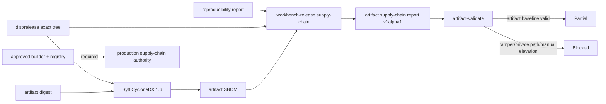

# Artifact SBOM Authority Baseline

## 1. 结论

Workbench 已具备 artifact 级 SBOM 的诊断 authority，但尚未具备 production supply-chain authority。

当前实现使用 Syft 生成 CycloneDX 1.6 JSON，并由 `workbench-release` 将 SBOM、reproducibility report 与磁盘 artifact tree 重新绑定到 CLI-authored `workbench.supply_chain_artifact_report.v1alpha1`。该报告固定 `status=diagnostic`、`production_authorized=false`；任何人工删除 blocker 或改成 verified 都会被 validator 拒绝。

因此当前判断为：

- **Artifact SBOM baseline：Ready**；
- **SV3-G supply-chain authority：Partial**；
- **Stable v3 / Production：No-Go**。

## 2. 数据流



## 3. 已冻结合同

### 3.1 SBOM 生成

```bash
task supply-chain:artifact:generate \
  ENV=integration \
  ARTIFACT_ROOT=dist/release \
  ARTIFACT_DIGEST=sha256:<digest> \
  ARTIFACT_SBOM=temp/release/supply-chain/workbench-release.cdx.json
```

生成命令固定：

- `CycloneDX 1.6 JSON`；
- source name 为 `yeisme-workbench-release`；
- source version 等于完整 `sha256:<artifact-digest>`；
- `SYFT_FILE_METADATA_SELECTION=none`，禁止把 host workspace path 作为 file component 写入可发布 SBOM；
- 输出由 Syft CLI 创建，不由 Agent 手写结构化资产。

### 3.2 Authority 计划与复核

```bash
task supply-chain:artifact:plan \
  ENV=integration \
  ARTIFACT_REPORT=temp/reproducibility/<run-id>/report.json \
  ARTIFACT_ROOT=dist/release \
  ARTIFACT_SBOM=temp/release/supply-chain/workbench-release.cdx.json

task supply-chain:verify \
  ENV=integration \
  SUPPLY_CHAIN_REPORT=temp/release/supply-chain/artifact-report.json \
  ARTIFACT_REPORT=temp/reproducibility/<run-id>/report.json \
  ARTIFACT_ROOT=dist/release \
  ARTIFACT_SBOM=temp/release/supply-chain/workbench-release.cdx.json
```

Validator 每次重新验证：

1. reproducibility report 为 clean、完整、固定 toolchain/lock/source；
2. artifact tree 无额外文件、symlink、size/digest drift；
3. SBOM 为普通文件、大小受限、CycloneDX 1.6、唯一 Syft tool identity；
4. SBOM source version 与 artifact digest 一致；
5. SBOM 不含 `/workspaces/`、`/home/`、`/Users/`、`file://` 或 Windows user path；
6. publishable SBOM 不含 `type=file` component；
7. report 中 artifact/SBOM/source/count/license/blocker 字段与当前输入完全一致；
8. v1alpha1 不接受 `production_authorized=true`。

## 4. 当前实测

本机 Syft `1.42.3` 对当前 `dist/release` 生成：

- CycloneDX spec：`1.6`；
- component：207；
- file component：0；
- private host path：0。

当前 `temp/reproducibility/20260721-container-static-contract/report.json` 仍记录 dirty source，因此 `artifact-plan` 在解析并接受真实 SBOM 后返回 `artifact_authority_invalid`。这是预期的 fail-closed 结果，不能通过修改报告或传入 caller digest 绕过。

组件证据：`temp/integration-test-runs/20260721093102-cb3531da-5f25-463a-a24a-43eb2574266b/`。

## 5. 未完成 Authority 与后续对接

| Package | Owner | 依赖 | 交付物 | 退出条件 |
| --- | --- | --- | --- | --- |
| SC-G1 | R4 + release | immutable worker、clean approved artifact | `approved-builder-provenance-handoff.md` signed receipts、clean artifact report、跨 builder digest | `artifact-plan` 可生成诊断报告且builder comparison通过 |
| SC-G2 | release/platform | approved image builder、固定 base digest | 四目标 image SBOM 与 source→image provenance | image digest、base digest、artifact digest 同链绑定 |
| SC-G3 | dependency/security | advisory 与 license policy | Go/Bun/Web/base image scan receipt | critical/high 清零或有受批准 exception；unknown license 清零或阻断 |
| SC-G4 | security/platform | registry、Cosign trust、KMS/issuer policy | artifact/image signature 与 verify receipt | wrong issuer/key/revoked/stale/unsigned 全部阻断 |
| SC-G5 | Workbench release | SC-G1 至 SC-G4 | stable supply-chain authority adapter | `task supply-chain:verify` 零退出并可被 stable v3 消费 |

SC-G2 至 SC-G4 必须在 approved builder/registry 环境执行。Workbench 本地实现不得伪造 image digest、provenance issuer、signature 或 advisory pass。

## 6. 回滚

该能力为 additive v1alpha1：移除 `supply-chain artifact-plan|artifact-validate`、对应 Taskfile targets 与诊断报告即可回滚，不改变现有 manifest/promotion/container schema。已经生成的 SBOM/report 不具有 deployment authority，删除它们不会撤销任何真实生产状态。
