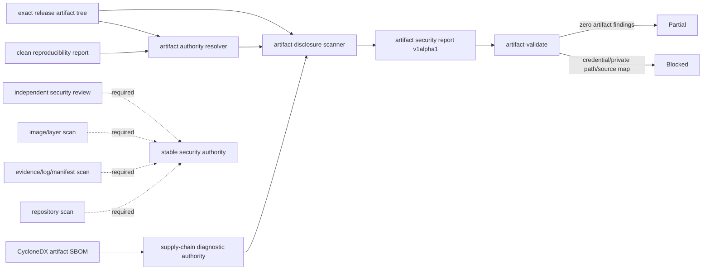

# Artifact Security Authority Baseline

## 1. 结论

Workbench 已具备 release artifact 与其 SBOM/supply-chain authority 文件的 fail-closed disclosure scan，但尚未具备完整 production security authority。

新命令将 exact artifact tree、reproducibility report、CycloneDX SBOM 与 `workbench.supply_chain_artifact_report.v1alpha1` 绑定到 CLI-authored `workbench.artifact_security_report.v1alpha1`。扫描报告只记录 finding code、相对 artifact path 与 occurrence count；禁止写入命中值、snippet、offset、credential、private root 或原始 payload。

当前状态：

- **Artifact disclosure diagnostic baseline：Ready**；
- **Repository/evidence/image-layer/independent review：Blocked**；
- **SV3-G：Partial**；
- **Stable v3 / Production：No-Go**。

## 2. 数据流



## 3. 命令合同

```bash
task security:artifact:plan \
  ENV=integration \
  ARTIFACT_REPORT=temp/reproducibility/<run-id>/report.json \
  ARTIFACT_ROOT=dist/release \
  ARTIFACT_SBOM=temp/release/supply-chain/workbench-release.cdx.json \
  SUPPLY_CHAIN_REPORT=temp/release/supply-chain/artifact-report.json

task security:artifact-scan \
  ENV=integration \
  ARTIFACT_SECURITY_REPORT=temp/release/security/artifact-security-report.json \
  ARTIFACT_REPORT=temp/reproducibility/<run-id>/report.json \
  ARTIFACT_ROOT=dist/release \
  ARTIFACT_SBOM=temp/release/supply-chain/workbench-release.cdx.json \
  SUPPLY_CHAIN_REPORT=temp/release/supply-chain/artifact-report.json
```

`artifact-plan` 创建新报告；`artifact-validate` 每次重新解析 authority、重新扫描全部文件并比较 digest/count/finding/blocker。v1alpha1 固定 `production_authorized=false`，人工清空 finding/blocker 或改成 verified 会失败。

## 4. 扫描策略

### 4.1 高置信阻断

- PEM/RSA/EC/OpenSSH/DSA private key material；
- AWS、GitHub、OpenAI、Slack token 形态；
- JWT、带值 Bearer token、credential assignment 与含 password 的数据库 DSN；
- `/workspaces/`、approved CI workspace、Windows user root 与当前 host workspace/home path；
- source map reference、`sourcesContent` 或 `webpack://`，仅对发布文本资产生效；
- `.map`、`.env`、`.pem`、`.key`、`.p12`、`.pfx`、DB、log、token、secret、`.git`、`node_modules`、temp 与 evidence 路径。

### 4.2 明确不按词面阻断

编译 runtime 合法包含 `file://`、`Authorization`、`Bearer`、`password`、`privateKey` 与 source-map capability 字符串。扫描器不得仅因关键词存在就失败；binary 只执行 provider-specific token、private key 与 JWT 等高置信规则，generic assignment/source-map 规则只扫描发布文本文件和 authority JSON。

### 4.3 输出与证据

报告和所有 AI-native 输出只允许：

- `finding.code`；
- `finding.artifact_path`，且只能是 release-relative path 或固定 `authority/*` alias；
- `finding.occurrence_count`；
- aggregate count、policy digest 与 artifact/supply-chain digest。

禁止输出 matched value、snippet、line、offset、host absolute path、secret hash 或可用于猜测 credential 的长度分布。

## 5. 当前验证

- 高置信 token/DSN/private path/source-map fixture 均被阻断；
- report、summary、JSON、agent、explain 均未出现注入的 credential；
- report tamper、unknown field 与 `production_authorized=true` 被拒绝；
- 当前 `dist/release` 规则 smoke 扫描 15 个 artifact 文件，0 个高置信 finding；该 smoke 只证明规则无明显 runtime 误报，不替代 clean artifact authority；
- component evidence：`temp/integration-test-runs/20260721094804-332d988c-a2bd-4258-9adb-51af1d457bb9/`。

## 6. 后续安全对接包

| Package | Owner | 依赖 | 交付物 | 退出条件 |
| --- | --- | --- | --- | --- |
| SEC-A1 | R4 + release | clean immutable artifact | authoritative artifact disclosure report | exact artifact+SBOM authority可生成clean diagnostic report |
| SEC-A2 | security/dependency | approved repository scanner与policy | tracked source、lock、generated state scan receipt | real secret为零；false positive有owner/expiry decision |
| SEC-A3 | release/security | candidate evidence set | manifest/log/evidence redacted scan receipt | raw prompt/provider payload/private tool args/private path均为零 |
| SEC-A4 | platform/security | approved image builder | image filesystem、history、layer、config/env scan receipt | source/cache/secret/local DB/evidence零命中 |
| SEC-A5 | incident/security/release | SEC-A1-A4 | rotate/revoke/rebuild/rescan + independent approval authority | real secret命中必须完成rotation与新artifact digest，不接受只删字符串 |

SEC-A2 至 SEC-A5 不能由 Workbench caller 自签。Stable v3 只消费独立 security authority 的签名摘要与 artifact digest，不直接消费本地 v1alpha1 diagnostic report。

## 7. 回滚

该能力为 additive v1alpha1。删除 `security artifact-plan|artifact-validate`、Taskfile targets 与诊断报告即可回滚，不改变 manifest、promotion、container 或 supply-chain schema。报告从未授予 production authority，因此回滚不会撤销真实部署状态。
