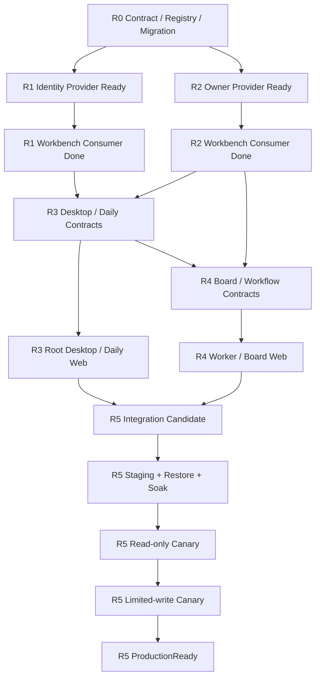

# Workbench 跨 Release 集成交付 DAG

## 1. 目标

本计划把 R0-R5、Identity Provider、Owner Provider 与 Workbench Consumer 的依赖转换为可执行交付顺序。它不以“页面可打开”或“本地 mock 通过”为完成，而要求每个交接点同时具备版本化合同、生成 SDK、真实环境证据、失败语义、kill switch 和回滚归属。

## 2. 关键路径

本文件采用以下 canonical Release 映射，并覆盖 umbrella 或历史文档中的其他编号口径；不要求重命名现有 change 目录，但 release CLI、handoff registry、manifest 和 closeout 必须使用本映射：

| Release | Canonical owning change | 说明 |
| --- | --- | --- |
| R0 | `workbench-production-foundation-r0` | contract/registry/config/persistence/runtime foundation |
| R1 | `workbench-identity-tenant-access-r1-gates` | Identity consumer 已随 `workbench-identity-tenant-access-r1` 归档交付；本 change 承接剩余验证门禁与 `6.5` closeout |
| R2 | `workbench-owner-backend-integrations` | Owner provider/consumer integration；目录名不含 R2 但语义固定为 R2 |
| R3 | `workbench-daily-operations-r3-gates` | Desktop、Asset、WorkItem 与 Daily 已随 `workbench-desktop-daily-operations-r3` 归档交付；本 change 承接剩余验证门禁与 `8.5` closeout |
| R4 | `workbench-spatial-workflow-automation-r4` | Board、worker 与 durable workflow |
| R5 | `workbench-production-ga-r5` | artifact、environment、promotion、DR、SLO 与 GA gate |

`openspec status` 的 artifact complete 只代表 proposal/design/spec/tasks 齐全。Release closeout 还必须由 CLI/服务生成 `contract_validated`、`provider_ready`、`consumer_done`、`integration_passed`、`rollback_passed` 和 capability-scoped status；Markdown 或 OpenSpec artifact 状态不得直接晋级。

任何 Provider Ready 未成立时，Consumer 可以实现 fail-closed adapter 和 conformance harness，但 capability 只能停在 `needs_contract`。任何 Consumer Done 未成立时，UI 不得通过 direct URL、local bridge、fixture 或手工配置绕过。

## 3. 交接包最小合同

每个 `INT-*` 交接包必须由生产方和消费方共同确认以下字段；结构化状态由 CLI/服务生成，本文只定义字段语义：

| 字段 | 生产方责任 | 消费方责任 |
| --- | --- | --- |
| identity | repo/change、contract id/version/range、schema digest、SDK version | 固定允许范围并在 drift 时 fail-closed |
| auth | issuer/audience/actions、delegation/session、expiry/revoke | 不接受请求体 principal/role/token，不降级为 local identity |
| operations | typed method/route、read/mutate 分类、input/output schema | 注册 route catalog，不复制 Provider 状态机 |
| events | source、cursor、retention、resume/gap、snapshot fence | 独立 source cursor、去重、gap 重建，不猜全局顺序 |
| mutation | expected version、idempotency、cost/permission gate | 统一进入 Task/Workflow admission，不由 Panel 直调 |
| receipt | lookup/status/reconcile/cancel/partial child | 保存 safe ref，未知结果只 reconcile 原 operation |
| safety | size/rate/query limits、redaction、forbidden fields | 额外执行 response sanitizer 与 tenant/ref 校验 |
| evidence | Provider contract/system/fault commands和真实环境 | `HTTP REST/SSE`、`gRPC unary/stream`、`JSON-RPC 2.0` 三个 wire transport，加 TypeScript SDK facade/UI/fault parity evidence |
| rollback | Provider kill switch、兼容版本、数据保留语义 | capability flag、停止新 dispatch、保留 receipt/reconcile |
| ownership | on-call、缺陷队列、breaking-change通知窗口 | consumer owner、升级窗口、deprecation跟踪 |

Provider handoff 只有在“合同可生成、SDK可发布、真实进程可验证、失败分支可重放”四项全部成立时才是 Provider Ready。Consumer Done 要求 route、service、repository、transport、SDK、UI 和 fault evidence 均指向同一 digest。

## 4. 对接任务包

| ID | Producer | Consumer | Entry | Producer exit | Consumer exit | Failure owner |
| --- | --- | --- | --- | --- | --- | --- |
| `INT-R0-01` | R0 Contract/Migration | R1-R4 | registry/migration baseline | version/range/digest、migration receipt、readiness | 所有 service 使用同一 catalog | R0 |
| `INT-R1-01` | Identity Platform | Workbench R1 | provider change approved | discovery/JWKS/session/tenant/revoke/delegation SDK+evidence | managed BFF、authority stream、cache purge、two-tab evidence | provider先修合同，consumer修映射 |
| `INT-R2-01` | Eikona | Workbench R2 | R2 1.1b冻结 | discovery/events/generation/review/handoff/receipt/reconcile/cancel | OwnerService、Task mapping、四 transport、mutation canary | 按 digest/route/mapper 定位 |
| `INT-R2-02` | Scaena/Auctra | Workbench R2/R3 | owner contract approved | safe launch/return/receipt/event合同 | descriptor registry、origin校验、return rescue | owner合同缺口回 owner change |
| `INT-R2-03` | Pinax/Sonora | Workbench R2/R3 | owner contract approved | safe projection/event与rights/permission合同 | read projection、event gap、disabled mutation diagnostics | 未晋级时保持disabled，不阻塞Eikona first-support |
| `INT-R3-01` | R1/R2 consumers | R3 Daily | authority和safe projection可用 | tenant/ref/event/receipt稳定 | Asset/WorkItem/Daily contracts和services conformance | R3仅修组合，不复制权威 |
| `INT-R4-01` | R2 Task/Owner | R4 Workflow | receipt/reconcile contract validated | durable mutation truth可查 | R4 4.3a-4.3c、5.0a-5.2b、6.1a-7.4完成，lease/fencing/drain/unknown reconcile/Eikona canary evidence齐全 | lease/runtime缺口归R4，Owner receipt/status缺口归R2 adapter |
| `INT-R5-01` | R0-R4 | R5 Release | stable candidate digests + R4 9.2b/10.5 | requirement/evidence/rollback refs完整，worker binary/metadata/fault evidence同digest | immutable manifest和environment promotion；3.4b2b不得以stub worker关闭 | 缺口退回 owning change，R5不补workflow domain/runtime |
| `INT-RUNTIME-01` | Aigora/broker runtime | `workbench-client-runtime-promotion-gates` | owner release tag、安全复核和broker contract稳定 | descriptor/admission/event/cancel/reconcile/rollback evidence | Workbench runtime capability逐项晋级，默认关闭 | 不属于首租户Eikona主链；缺证据时保持disabled |

### 4.1 首个生产候选范围

首个 production tenant 的最小 mature 集合固定为：managed Identity、Eikona read、Eikona review/handoff/generation limited mutation、Desktop/Layout、Asset/WorkItem/Daily、Board/Workflow 的 Eikona 单 owner 路径，以及 R0/R5 release/DR/operations 基础。

Scaena/Auctra、Pinax、Sonora、Ordo、Ordo、Quaestor 和 Aigora runtime adapter 可以保留 catalog/diagnostics，但未形成独立 `INT-*` Provider Ready + Consumer Done + real environment evidence 前必须 `disabled` 或 `needs_contract`。这些能力不阻塞 Eikona first-support production candidate，但会阻塞声称“全 Owner GA”或归档其 owning change。

## 5. 并行 Lane 与写入租约

| Lane | Owned paths | 可并行条件 | 合并门禁 |
| --- | --- | --- | --- |
| Contract | `api/proto/**`, `api/schema/**`, generators | 各 domain path 不重叠 | schema/route/error/SDK digest parity |
| Provider | provider repo OpenSpec/API/SDK | 不修改 Workbench tracked files | Provider Ready evidence |
| Backend | `service/internal/<domain>/**` | repository/service/worker path lease明确 | Go race、Postgres、fault tests |
| SDK/BFF | `packages/task-sdk/**`, BFF批准路径 | DTO已冻结 | REST/gRPC/JSON-RPC/SDK parity |
| Web | `apps/web/src/**` | SDK DTO和Pane registry已冻结 | component/Playwright/a11y |
| Release | `deploy/**`, release CLI、Taskfile | stable candidate diff | manifest/preflight/restore/rollback |

生成合同、共享 registry、Taskfile 和 release CLI 都是高冲突路径，只允许单一 writer；review/test 在稳定 diff 后进行。

## 6. 集成波次

### Wave 0：合同冻结

- 完成 R0 registry/migration range、R1 authority、R2 provider/receipt、R3 Daily、R4 workflow definition合同。
- 输出所有 `INT-*` 的 digest、SDK version、owner和验证命令。
- 未完成项保持 `needs_contract`，UI显示安全 diagnostics，不显示假动作。

### Wave 1：Consumer Skeleton

- 注册默认关闭的 route/capability descriptor。
- 建立真实 dependency 缺失、digest drift、permission denied、cursor gap、unknown receipt 的负向测试。
- 不接入普通用户资源，不执行真实外部 mutation。

### Wave 2：Integration

- 使用 disposable PostgreSQL、Identity test realm、Eikona disposable project。
- 完成 provider→adapter→service→transport→SDK→Pane 的同 digest conformance。
- 成功、拒绝、超时、响应丢失、revoke、gap、partial、cancel unconfirmed 全部生成脱敏 evidence。

### Wave 3：Staging Shadow

- 同一 immutable artifact 进入 staging。
- 只读 projection/backfill/shadow compare；Layout legacy import只对显式测试身份运行。
- 完成 restore、migration、rollout、load、chaos、24h soak；任何 drift 不进入写 canary。

### Wave 4：Canary

- 先 read-only canary，再按 capability 开启 limited write。
- 仅显式 allowlisted test tenant/project；每个 operation 有成本上限、kill switch、receipt/reconcile。
- Daily loop稳定后才开启 R4 workflow scheduler/worker；不得同时首次启用多个高风险 mutation capability。

### Wave 5：ProductionReady

- 7 天 canary、error budget、backup/restore、incident/rollback与P0/P1=0。
- release decision引用同一 manifest digest；真实 production action仍需用户/root外部批准。

## 7. 失败路由

| 失败 | 回退 owner | 处理 |
| --- | --- | --- |
| contract/schema digest缺失或漂移 | Provider/R0 contract lane | 禁止 consumer猜测兼容，发布新合同/SDK |
| auth/revoke/tenant错误 | R1 | 停止受影响 capability，清缓存/cursor，不降级 local |
| projection/event gap | R2/R3 projector | 标 stale，snapshot+fence重建，不清空现有可读索引 |
| unknown/partial/cancel_requested | Task/R2/R4 | 停新 dispatch，lookup/status/reconcile，不重放 parent |
| UI identity/layout恢复错误 | R3 Web/Layout | suspend敏感 Pane，回安全 layout，不恢复旧 tenant state |
| migration/restore/compatibility失败 | R0/R5 | readiness false，保留 expand schema，选择兼容 rollback/fix-forward |
| SLO/security/data-loss blocker | owning R0-R4 + R5 gate | No-Go，新 artifact和manifest，不用文档豁免 |

## 8. 完成定义

跨 Release 对接只有在每个目标 capability 的 Provider Ready、Consumer Done、真实 integration、staging shadow、canary、rollback 和 support owner 均有直接证据时完成。任一交接包缺失不得以完整 UI、local preview、fixture E2E 或 artifact build替代。

R2 capability-scoped closeout必须发布 per-owner status/digest/evidence/rollback owner；Eikona 可以先达到 mature，其他 Owner 保持 disabled。只有 R2 声明的全部 P0 Owner 均达到自身 exit gate 时，`workbench-owner-backend-integrations` 才能整体归档。

**2026-08-23 integration status:** R2 final gate 已由 evidence `20260823120024-8b0f3889-64bb-4a1e-b8b6-73e40b6ceee2` 关闭。CLI-authored integration registry revision 5 已为 `INT-R2-01` 记录 provider/consumer/integration/rollback 四项证据与 digest，故 R2 canonical package 为 ready；全局 `release:handoff:validate` 仍诚实返回 `handoff_incomplete`、1/6 ready，因为 R0/R1/R3/R4/R5 尚未交付。该全局阻塞不得降级 Eikona 的已验证状态，也不得被用于代签未完成 release 或提升其他 Owner capability；Scaena/Auctra/Pinax/Sonora 继续 disabled/needs_contract。
