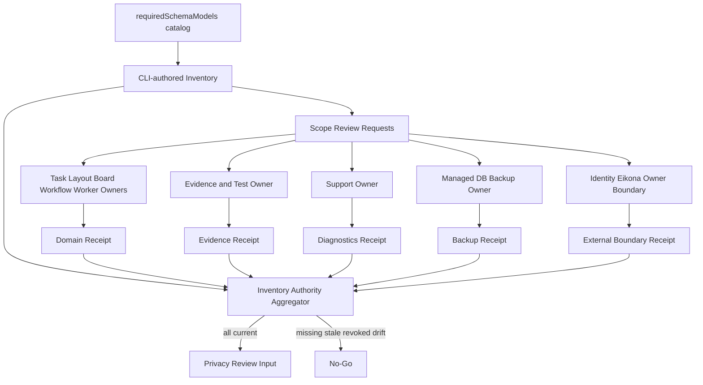

# Workbench Data Inventory Owner Sign-off 交接合同

## 1. 目的与当前状态

`workbench.data_inventory.v1alpha1` 已能从 canonical registry 与 `requiredSchemaModels()` 生成，并将每个真实 GORM table 恰好绑定到一个 lifecycle data class。该结果仍是 Workbench consumer diagnostic，不等于 privacy、DB、support 或外部 Owner 已批准分类、retention、export/delete、legal hold 与 backup policy。

当前状态：

- Workbench repository catalog parity：Consumer Done；
- Domain、evidence/support、managed backup 与 external Owner 签收：Provider Ready 未完成；
- aggregate inventory authority consumer：已实现并完成本地负测；
- privacy review：保持 blocked。

这里的 `privacy_review_authorized=true` 是aggregate资产内部的“五scope均已验证，可提交privacy reviewer”事实，不等于当前环境已具备真实Owner签收。由于五类Provider资产尚未交付，当前production planning仍保持blocked，且`production_authorized`始终为false。

## 2. Authority 数据流



## 3. 签收 Scope

| Scope ID | Provider / Owner | 必须覆盖 | 当前直接证据 |
| --- | --- | --- | --- |
| `domain_gorm` | Task/Layout/Board/Workflow/Worker/DB domain owners | 全部 `requiredSchemaModels()` table、data class、owner、retention、export/delete、hold、backup | repository catalog diagnostic only |
| `evidence_storage` | test infrastructure/security | 成功与失败 evidence、artifact收集、retention、redaction、purge、legal hold | evidence runner authority，尚无lifecycle receipt |
| `support_diagnostics` | support/operations/security | bundle内容上限、retention、download audit、purge和forbidden fields | D0未实现 |
| `managed_backup` | managed DB/backup owner | backup/PITR scope、retention、legal hold、expiry、restore与provider receipt | provider未选/未签收 |
| `external_owner_boundary` | Identity、Eikona及后续Owner owners | canonical payload不由Workbench存储/代删，可选外部delete合同与receipt语义 | owner handoff待签收 |

所有 scope 必须独立签收。Workbench implementer、Agent 或 inventory generator 不能代表 provider owner 签名。

## 4. Receipt 与 Trust 合同

Workbench consumer已接受以下版本化资产：

- `workbench.data_inventory_owner_review_request.v1alpha1`；
- `workbench.data_inventory_owner_evidence_manifest.v1alpha1`；
- `workbench.data_inventory_owner_receipt.v1alpha1`；
- `workbench.data_inventory_trust_bundle.v1alpha1`；
- aggregate `workbench.data_inventory_authority.v1alpha1`。

Owner receipt required 字段：

- `environment`、`scope_id`、`owner_ref`、`owner_role`；
- `inventory_digest`、`policy_digest`、`repository_catalog_digest`；
- 当前scope的稳定排序 `data_class_ids` 与 `store_bindings`；
- `review_request_digest`、`evidence_manifest_digest`与稳定排序的`evidence[{requirement_id,evidence_ref,digest}]`；
- `decision=approved`、空blocking findings；
- `issued_at`、`expires_at`、`nonce`、`key_id`、`issuer`、`signature`；

Receipt 不得包含 table row、resource title/content、identity claim、endpoint、DSN、credential、provider payload、private path或完整命令参数。

Trust bundle由对应治理 owner发布，包含issuer/key/role/scope/status/not-before/not-after与managed digest。Caller自建trust、unknown/revoked/expired key、wrong role/scope/environment/inventory/policy/catalog digest和receipt replay必须fail closed。

## 5. Workbench Consumer 命令

已实现命令：

```text
workbench-lifecycle inventory review-request-generate
workbench-lifecycle inventory review-request-validate
workbench-lifecycle inventory evidence-manifest-generate
workbench-lifecycle inventory evidence-manifest-validate
workbench-lifecycle inventory receipt-validate
workbench-lifecycle inventory authority-generate
workbench-lifecycle inventory authority-validate
```

Taskfile薄包装：

```text
task data-lifecycle:review-request:generate ENV=staging SCOPE=domain_gorm ...
task data-lifecycle:review-request:validate ENV=staging ...
task data-lifecycle:evidence-manifest:generate ENV=staging ...
task data-lifecycle:evidence-manifest:validate ENV=staging ...
task data-lifecycle:owner-receipt:validate ENV=staging ...
task data-lifecycle:authority:generate ENV=staging ...
task data-lifecycle:authority:validate ENV=staging ...
```

`evidence-manifest-generate`只读取当前scope固定命名的`.evidence`文件并保存safe ref/digest，不复制内容或路径；缺失、额外、symlink、空文件、oversize与后续digest drift全部失败。`receipt-validate`只读并验证一个scope，同时重验request、manifest和直接evidence。`authority-generate`要求五个scope全部current approved且绑定同一inventory/policy/catalog/request/evidence digest；缺项、重复、replay或trust失败时不写authority并返回非零。`authority-validate`重新读取全部直接输入，不信aggregate中的summary。

当前consumer只记录scope、owner、receipt ref与digest，不复制签名、finding、public key或raw receipt payload。真实Provider仍需通过DI-S1至DI-S5生成和托管receipt/trust资产；测试fixture不能作为签收证据。

完整Provider执行顺序、命令和证据矩阵见`data-inventory-provider-integration-runbook.md`。

## 6. Unknown、Revocation 与 Drift

- Provider review响应丢失：进入unknown，只lookup/reconcile原`review_ref`，不得新建第二次审批。
- Inventory revision、policy digest或repository catalog digest变化：所有旧receipt立即失效，新inventory重新签收。
- Owner key/role/policy撤销：aggregate重新计算为blocked，旧receipt只保留审计。
- 新增table/store：repository catalog parity先失败；补classification后仍需受影响scope重新签收。
- 删除table/store：必须提供migration、retention/delete与backup影响证据，不能仅从catalog删除隐藏残留。

## 7. 原子对接包

| Package | Owner | Entry | Exit |
| --- | --- | --- | --- |
| `DI-S1` Domain GORM | domain + DB owners | current catalog/inventory | signed `domain_gorm` receipt + add/remove table negative matrix |
| `DI-S2` Evidence | test/security | evidence runner inventory | signed `evidence_storage` receipt + success/failure purge policy |
| `DI-S3` Support | support/operations/security | D0 diagnostics bundle | signed `support_diagnostics` receipt + leak/size/retention matrix |
| `DI-S4` Backup | managed DB owner | managed backup/PITR contract | signed `managed_backup` receipt + expiry/hold/restore evidence |
| `DI-S5` Owner Boundary | Identity/Eikona/Owner owners | provider contracts | signed `external_owner_boundary` receipt + no-payload/no-direct-delete evidence |
| `DI-A1` Aggregate | Workbench lifecycle/release | DI-S1..S5 | CLI-authored current authority，供privacy review消费 |

## 8. 完成门槛

`6.0a1` 只有在以下条件全部成立时完成：

1. repository catalog与inventory table bindings完全一致；
2. 五个scope有独立受信owner receipt；
3. receipt/trust freshness、rotation、revoke、replay和wrong-scope负测通过；
4. aggregate只消费直接authority并能在任一drift后回到blocked；
5. component/system evidence写入脱敏六件套；
6. privacy reviewer可以只通过CLI和evidence refs重验，不读取手写结论。
