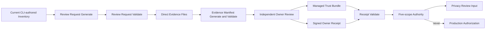
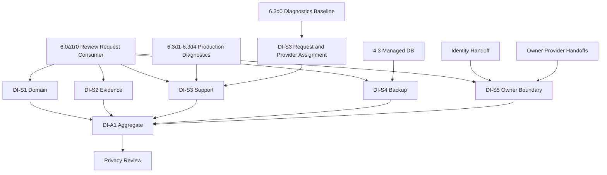

# Workbench Data Inventory Provider 对接运行手册

## 1. 目标与边界

本手册把 `DI-S1` 至 `DI-S5` 从责任清单变成可执行交接流程。Workbench 只生成绑定当前inventory的待审包、验证Provider返回的receipt/trust，并聚合authority；Workbench implementer、Agent与测试fixture不得替代Owner签名，也不得托管生产私钥。

新增待审资产：

```text
workbench.data_inventory_owner_review_request.v1alpha1
```

待审包只包含environment、scope、handoff package、expected role、inventory/policy/catalog digest、稳定排序的data class/store bindings、请求有效期和预期receipt/trust schema。它不包含Provider endpoint、credential、public/private key、用户内容、row、private path或生产授权。

## 2. 对接数据流



## 3. Workbench 侧标准命令

每个scope先生成独立待审包：

```bash
task data-lifecycle:review-request:generate \
  ENV=staging \
  SCOPE=domain_gorm \
  LIFECYCLE_INVENTORY=temp/lifecycle/inventory.json \
  OWNER_REVIEW_REQUEST=temp/lifecycle/review-requests/domain_gorm.json
```

发送前重新验证：

```bash
task data-lifecycle:review-request:validate \
  ENV=staging \
  LIFECYCLE_INVENTORY=temp/lifecycle/inventory.json \
  OWNER_REVIEW_REQUEST=temp/lifecycle/review-requests/domain_gorm.json
```

Provider返回receipt和managed trust后，Workbench只执行消费验证：

先从待审包要求的固定文件生成并重验evidence manifest：

```bash
task data-lifecycle:evidence-manifest:generate \
  ENV=staging \
  LIFECYCLE_INVENTORY=temp/lifecycle/inventory.json \
  OWNER_REVIEW_REQUEST=temp/lifecycle/review-requests/domain_gorm.json \
  OWNER_EVIDENCE_DIR=temp/lifecycle/evidence/domain_gorm \
  OWNER_EVIDENCE_MANIFEST=temp/lifecycle/evidence-manifests/domain_gorm.json

task data-lifecycle:evidence-manifest:validate \
  ENV=staging \
  LIFECYCLE_INVENTORY=temp/lifecycle/inventory.json \
  OWNER_REVIEW_REQUEST=temp/lifecycle/review-requests/domain_gorm.json \
  OWNER_EVIDENCE_DIR=temp/lifecycle/evidence/domain_gorm \
  OWNER_EVIDENCE_MANIFEST=temp/lifecycle/evidence-manifests/domain_gorm.json
```

Provider receipt必须签名绑定request和manifest digest。Workbench只执行消费验证：

```bash
task data-lifecycle:owner-receipt:validate \
  ENV=staging \
  LIFECYCLE_INVENTORY=temp/lifecycle/inventory.json \
  OWNER_RECEIPT=<provider-receipt-path> \
  OWNER_REVIEW_REQUEST=temp/lifecycle/review-requests/domain_gorm.json \
  OWNER_EVIDENCE_MANIFEST=temp/lifecycle/evidence-manifests/domain_gorm.json \
  OWNER_EVIDENCE_DIR=temp/lifecycle/evidence/domain_gorm \
  INVENTORY_TRUST_BUNDLE=<managed-trust-path> \
  INVENTORY_TRUST_DIGEST=<managed-sha256>
```

五scope齐全后生成并重验aggregate：

```bash
task data-lifecycle:authority:generate ENV=staging \
  DOMAIN_GORM_RECEIPT=<path> \
  DOMAIN_GORM_REQUEST=<path> DOMAIN_GORM_EVIDENCE_MANIFEST=<path> DOMAIN_GORM_EVIDENCE_DIR=<path> \
  EVIDENCE_STORAGE_RECEIPT=<path> \
  EVIDENCE_STORAGE_REQUEST=<path> EVIDENCE_STORAGE_EVIDENCE_MANIFEST=<path> EVIDENCE_STORAGE_EVIDENCE_DIR=<path> \
  SUPPORT_DIAGNOSTICS_RECEIPT=<path> \
  SUPPORT_DIAGNOSTICS_REQUEST=<path> SUPPORT_DIAGNOSTICS_EVIDENCE_MANIFEST=<path> SUPPORT_DIAGNOSTICS_EVIDENCE_DIR=<path> \
  MANAGED_BACKUP_RECEIPT=<path> \
  MANAGED_BACKUP_REQUEST=<path> MANAGED_BACKUP_EVIDENCE_MANIFEST=<path> MANAGED_BACKUP_EVIDENCE_DIR=<path> \
  EXTERNAL_OWNER_BOUNDARY_RECEIPT=<path> \
  EXTERNAL_OWNER_BOUNDARY_REQUEST=<path> EXTERNAL_OWNER_BOUNDARY_EVIDENCE_MANIFEST=<path> EXTERNAL_OWNER_BOUNDARY_EVIDENCE_DIR=<path> \
  INVENTORY_TRUST_BUNDLE=<path> \
  INVENTORY_TRUST_DIGEST=<sha256>

task data-lifecycle:authority:validate ENV=staging \
  DOMAIN_GORM_RECEIPT=<path> \
  DOMAIN_GORM_REQUEST=<path> DOMAIN_GORM_EVIDENCE_MANIFEST=<path> DOMAIN_GORM_EVIDENCE_DIR=<path> \
  EVIDENCE_STORAGE_RECEIPT=<path> \
  EVIDENCE_STORAGE_REQUEST=<path> EVIDENCE_STORAGE_EVIDENCE_MANIFEST=<path> EVIDENCE_STORAGE_EVIDENCE_DIR=<path> \
  SUPPORT_DIAGNOSTICS_RECEIPT=<path> \
  SUPPORT_DIAGNOSTICS_REQUEST=<path> SUPPORT_DIAGNOSTICS_EVIDENCE_MANIFEST=<path> SUPPORT_DIAGNOSTICS_EVIDENCE_DIR=<path> \
  MANAGED_BACKUP_RECEIPT=<path> \
  MANAGED_BACKUP_REQUEST=<path> MANAGED_BACKUP_EVIDENCE_MANIFEST=<path> MANAGED_BACKUP_EVIDENCE_DIR=<path> \
  EXTERNAL_OWNER_BOUNDARY_RECEIPT=<path> \
  EXTERNAL_OWNER_BOUNDARY_REQUEST=<path> EXTERNAL_OWNER_BOUNDARY_EVIDENCE_MANIFEST=<path> EXTERNAL_OWNER_BOUNDARY_EVIDENCE_DIR=<path> \
  INVENTORY_TRUST_BUNDLE=<path> \
  INVENTORY_TRUST_DIGEST=<sha256>
```

## 4. 原子工作包

| Package | 前置依赖 | Provider动作 | Workbench验收 | 必须保留的证据 |
| --- | --- | --- | --- | --- |
| `DI-S1` `domain_gorm` | current repository catalog；DB/domain owner名单 | 审核全部GORM table映射并用授权role签receipt | request、receipt、trust、catalog digest一致；新增/删除/reclassify table负测 | request digest、owner receipt ref/digest、trust digest、catalog diff测试 |
| `DI-S2` `evidence_storage` | evidence runner与retention/redaction policy | 审核成功/失败run、artifact、purge、hold边界 | failure run不漏证据；无限retention与敏感内容阻断 | component/system run六件套、purge/redaction负测、receipt |
| `DI-S3` `support_diagnostics` | D0 bundle、D1a partial source snapshot、D1b0 runtime report consumer合同、support/operations/security owner；D1b1-D3生产能力 | 审核bundle/source snapshot/runtime report字段、direct/unknown count、大小、下载审计、retention与purge | incomplete source、fixture冒充managed truth、forbidden field、oversize、expired bundle、缺audit全部失败 | source/runtime report drift、managed diagnostics fault matrix、download audit、purge/reconcile、receipt |
| `DI-S4` `managed_backup` | managed DB provider选型、PITR/restore直接证据 | 发布backup scope/retention/hold/expiry/restore authority | 本地文件、checksum或普通DB target不能替代provider receipt | provider policy ref、restore run、expiry/hold测试、receipt |
| `DI-S5` `external_owner_boundary` | Identity/Eikona/后续Owner合同 | 分别确认no-copy/no-direct-delete与外部delete语义 | Workbench只保留safe refs，不将本地tombstone声明为Owner删除完成 | owner contract refs、no-payload扫描、delete/reconcile合同测试、receipt |
| `DI-A1` aggregate | `DI-S1` 至 `DI-S5`全部current | 无Provider写入；Workbench聚合 | 缺失、重复、replay、撤销、过期、digest drift全部fail closed | authority asset、component/system evidence、privacy reviewer重验记录 |

## 5. 每个 Provider Package 的五步状态

每个 `DI-S*` 必须独立经历以下状态，不能用一条Markdown勾选代替：

1. `request_ready`：CLI生成并重验待审包，记录request ref/digest；
2. `evidence_ready`：每个required evidence文件由对应Owner工具生成，CLI manifest重验无缺失/额外/drift；
3. `provider_assigned`：明确Owner、issuer、role、scope、trust发布责任与升级联系人；
4. `provider_signed`：Provider系统生成绑定request/manifest/evidence的current receipt和managed trust，禁止Workbench自签；
5. `consumer_verified`：Workbench CLI重新读取全部直接输入并写入component/system evidence。

任一inventory revision、policy digest、repository catalog digest、Owner key状态或scope内容变化，都必须将对应package退回 `request_ready`，重新生成待审包和receipt。

## 6. 并行泳道与依赖



`DI-S1`、`DI-S2`可立即开始Owner分配与待审。`DI-S3`已有`6.3d0` bundle、`6.3d1a` partial source snapshot与`6.3d1b0` runtime report consumer合同，可完成`request_ready`与`provider_assigned`并冻结D1b1-D3 evidence requirements；但component fixture不得进入provider receipt，必须等待D1d `complete=true`、D2 security fault matrix、D3 download audit/purge后才能进入`evidence_ready`，并在`6.3d4`完成独立签收后进入`consumer_verified`。`DI-S4`等待managed DB/backup provider；`DI-S5`等待Identity/Eikona及未来Owner合同。`DI-A1`只能在五条泳道全部current后运行。

## 7. Go / No-Go

以下任一条件成立时保持No-Go：

- 待审包来自手写JSON、inventory已过期或request已过期；
- Provider owner、issuer、role、scope或managed trust digest未知；
- receipt由Workbench implementer、Agent、fixture key或caller自建trust签发，或未绑定request/evidence manifest；
- 任何scope缺失、重复、replay、revoked、wrong digest或跨environment；
- 只完成repository parity、测试绿灯或页面demo，没有真实Provider Ready；
- aggregate被误用为production approval。

只有 `DI-S1` 至 `DI-S5` 的直接证据和 `DI-A1` aggregate全部current，才允许启动privacy review；production promotion仍需独立security、SLO、operations、deployment和approver authority。
