# Eikona First-support OpenSpec Selector 与后续对接计划

## 1. 目标与边界

`eikona-first-support` selector 用于回答“Workbench 是否具备生成首租户 production candidate manifest 的实现前置条件”。它只选择候选制品生成之前必须完成的 OpenSpec task，不把 staging soak、canary、Go/No-Go、真实 deploy 或 post-deploy 任务塞进 candidate manifest，从而避免循环依赖。

Selector 不是发布批准。它只提供 task-level source authority；restore、review、SLO、provider/consumer handoff、外部 approval 和真实 deployment receipt 仍由各自独立 authority adapter 证明。

## 2. 机器权威

逐任务状态只读取：

```text
openspec instructions apply --change <id> --json
```

Resolver 使用官方 JSON 中的 `id`、`description` 与 `done`，从 `description` 的第一个 token 提取 canonical task key，并同时绑定 description digest。它不读取 human table，不解析 Markdown checkbox，不按目录 `latest` 猜测，也不持久化完整任务描述或本地绝对路径。

Change 级别另外重验：

```text
openspec status --change <id> --json
openspec validate <id> --strict --json --no-interactive
```

每个 selected task 必须同时满足 `artifact_complete=true`、`strict_valid=true`、`done=true` 才能 ready。

## 3. 合同与兼容策略

新增合同均为 pre-1.0 alpha：

| Contract | 用途 | 兼容策略 |
| --- | --- | --- |
| `workbench.openspec_selector.v1alpha1` | 显式 capability → change/task key allowlist | CLI 只新建、0600、拒绝覆盖；字段与排序严格校验 |
| `workbench.openspec_capability_status.v1alpha1` | selector 对官方逐任务状态的可重验快照 | 绑定 selector/source/artifact/description digest、OpenSpec version、freshness |
| `workbench.release_manifest.v3alpha3` | capability snapshot 的 candidate authority | 仅在 `openspec_capability` 存在时读取；不改变 v2/v3alpha1/v3alpha2 语义 |

Expand-then-contract 规则：

1. v2 继续作为 requirement/evidence/artifact 诊断格式；
2. v3alpha1 继续作为 restore authority 格式；
3. v3alpha2 继续作为 global OpenSpec closeout audit 格式；
4. v3alpha3 用于 capability-scoped candidate，禁止同时绑定 global snapshot；
5. 稳定 v3 只能在 release owner、Identity/Eikona provider owner、Workbench consumer owner 与 operations 共同批准 selector 后发布；
6. 回滚时省略 selector/capability snapshot 参数并回到 v3alpha2 global 诊断，但 promotion 必须保持 blocked，不能用旧格式绕过 capability gate。

## 4. 首租户前置任务闭包

当前 selector 共 22 项：

| Change | Required task keys | 原因 |
| --- | --- | --- |
| R0 `workbench-production-foundation-r0` | `5.4` | 生产基础、合同、migration、DR、readiness 与安全 review 完整 closeout |
| R1 `workbench-identity-tenant-access-r1-gates` | `6.5` | managed Identity、tenant、revoke、delegation 完成 consumer handoff |
| R2 `workbench-owner-backend-integrations` | `1.1b`, `1.3b`, `3.2`, `3.6`, `4.4`, `6.0`, `7.2`, `7.3` | Eikona provider contract、真实 conformance、read/event、delegated mutation、Eikona gate、安全 review 与 Workbench final gate |
| R3 `workbench-daily-operations-r3-gates` | `8.5` | Desktop/Layout、Asset/WorkItem/Daily 与 rollback/handoff closeout |
| R4 `workbench-spatial-workflow-automation-r4` | `7.4`, `9.2b` | Eikona allowlisted workflow canary/rollback drain 与 immutable worker artifact handoff |
| R5 `workbench-production-ga-r5` | `3.4b2b`, `3.4c`, `3.4d2b2b2b`, `3.4d2b2b3`, `3.4d2b2b4`, `3.4d2b2b5`, `3.4d3`, `3.4d4`, `3.4d5` | 完整制品、managed DR、review/SLO/handoff authority、promotion/report/audit 命令实现 |

R2 的 Auctra、Ordo、Ordo、Quaestor 等 task 不在首租户 selector 中，必须保持 `disabled|needs_contract`。R4 `10.5` 全 change closeout 也不作为 Eikona first-support candidate 前置，避免未成熟非首租户能力永久阻塞；全平台归档仍由 global snapshot 审计。

## 5. 状态流与后续对接

```mermaid
flowchart LR
  Selector[22-task selector] --> Candidate[Capability manifest candidate]
  Candidate --> E10[WP-E10 Integration environment]
  E10 --> S10[WP-S10 Staging shadow + restore]
  S10 --> C10[WP-C10 Identity/Eikona read + limited write]
  C10 --> C20[WP-C20 Workflow canary]
  C20 --> G10[WP-G10 7-day observation]
  G10 --> G20[WP-G20 Independent Go/No-Go]
  G20 -->|Approved external receipt| G30[WP-G30 Production + post-deploy]
```



Candidate 后的任务不由 selector 代替：

| Wave | Provider owner | Workbench owner | 必须新增的直接证据 |
| --- | --- | --- | --- |
| Contract freeze | Identity + Eikona | R1/R2 consumer | provider release/version、contract/schema/SDK digest、allowed operations、rollback owner |
| Integration | disposable Identity realm + Eikona project | WP-I20/WP-O20 | four-transport/SDK/Web parity、revoke/gap/offline、receipt/reconcile/cancel、negative evidence |
| Limited write | Eikona provider | WP-O30/R3 | explicit operation allowlist、cost ceiling、unknown/partial/lost response、Daily loop、kill switch |
| Workflow | Eikona provider | R4 WP-W10/W20 | lease/fence/crash/pause/resume/approval timeout/unknown reconcile/rollback drain |
| Staging/canary | operations | R5 release | managed restore、24h staging、7d canary、SLO/error budget/incidents、independent review decision |
| Production | approved deploy system | operations/support | immutable artifact/manifest digest、deploy receipt、progressive rollout、read-only post-deploy、support handoff |

## 6. 当前直接证据与 No-Go

CLI-authored selector：

```text
temp/release/eikona-first-support-selector-20260721052500.json
```

CLI-authored capability snapshot：

```text
temp/release/eikona-first-support-status-20260721052500.json
```

两者权限均为 0600。22 个 selected task 均可从 OpenSpec `1.6.0` 官方 machine output 唯一解析；当前 `0/22` ready，因此 generate/validate 均返回 `openspec_capability_blocked`。这是 production candidate 的直接 No-Go，而不是 global change 未全部归档导致的误阻断。

## 7. 批准与变更控制

Selector seed 当前是实现侧建议，不等同于 release approval。进入 staging candidate 前必须完成：

1. release owner 确认没有遗漏 candidate 前置 task；
2. Identity 与 Eikona provider owner 确认其 provider task 和 digest 边界；
3. R1/R2/R3/R4 consumer owner 确认 selected task 足以覆盖首租户链；
4. operations/security 确认 restore/review/SLO authority 不被 selector 替代；
5. 任何 task 新增、删除、重命名或 scope 变化都通过 CLI 生成新 selector revision与snapshot，不覆盖旧资产；
6. selector 审批 receipt 尚未接入前，production promotion 必须保持 blocked。
