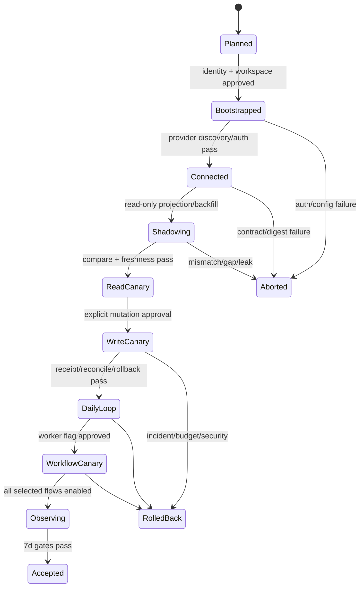

# Workbench 首个生产租户 Cutover 计划

## 1. 范围与安全边界

首个生产租户不是把 demo profile 指向真实数据库。它是显式创建、授权、连接、shadow验证、有限写入、观察和回滚的一次受控迁移。本文只设计流程；tenant创建、credential、DNS、真实Provider写入与production deploy仍由外部批准系统执行。

首批范围固定为：一个批准 tenant、一个 test workspace、一个 Eikona disposable project、少量命名测试用户和一组独立 capability flags。普通用户项目、历史私有路径、demo seed、fixture identity和local bridge均不进入首批生产数据。

## 2. Cutover 状态机

状态由 release/onboarding CLI或批准系统生成；不能手写 JSON/YAML 把租户标记为已晋级。

## 3. 前置条件

1. 同一 artifact digest已通过 R5 integration/staging、restore、migration和rollback。
2. R1 Identity Provider Ready：issuer/JWKS/session/tenant/revoke/delegation和on-call已确认。
3. R2 Eikona Provider Ready：discovery digest、event cursor、generation/review/handoff、receipt/status/reconcile/cancel已确认。
4. Workbench R1/R2 Consumer Done：BFF、adapter、service、transport、SDK、UI和fault evidence一致。
5. R3 Layout/Daily与R4 Workflow candidate通过PostgreSQL、a11y、security、capacity。
6. backup最新且restore-to-disposable在RPO/RTO内；kill switches和compatible rollback artifact可用。
7. allowlist、成本上限、数据保留、support/on-call、incident channel和外部approver已确认。

## 4. 数据来源与 demo 清退

| 数据 | 生产权威 | 首批处理 | 禁止来源 |
| --- | --- | --- | --- |
| principal/session/tenant | Identity Platform | 外部批准创建或选择test tenant/workspace | fixture user、local session fallback |
| Owner project/assets/runs | Eikona | disposable project + safe projection | 本机目录、raw provider payload、demo JSON |
| Layout | Workbench LayoutService | 新profile或显式一次性allowlist import | 自动上传任意localStorage |
| Asset/Search index | R2 events + snapshot | shadow backfill/checkpoint/compare | MSW/fixture作为current |
| WorkItem/Daily | Workbench services | 从批准source command创建 | 前端seed或浏览器伪造receipt |
| Board/Workflow | Workbench R4 | canary阶段创建独立测试对象 | demo graph冒充durable run |
| Receipt/Audit/Evidence | Task/Owner/Workflow | 真实safe refs和脱敏evidence | 手写success、截图替代 |

上线前必须扫描 Web bundle、database、projection index、recent items、layout profile和support bundle，确认不存在 demo tenant id、fixture token、localhost owner URL、private path或示例receipt。

## 5. 分阶段执行

### C0：计划与批准

- 生成 candidate manifest、tenant cutover plan和allowlisted refs的digest。
- 验证 approver、窗口、on-call、成本上限、停止条件、backup/rollback。
- dry-run输出不得包含真实token、endpoint、email或完整resource ref。

### C1：Identity Bootstrap

- 外部系统创建/选择 tenant、workspace、管理员与测试成员。
- Workbench仅验证session exchange、tenant membership/version、switch/revoke和delegation audience。
- 两标签页并发验证authority event和旧tenant cache/cursor/Pane/draft清理。

### C2：Provider Connect

- 注册批准的 Eikona instance ref与secret reference；不接受浏览器base URL。
- 校验contract range/schema digest/SDK version/capabilities/event retention/limits。
- 只打开diagnostics和read descriptor；mutation flags保持关闭。

### C3：Shadow Projection

- 创建独立projection generation，执行snapshot+fence+event catch-up。
- 比较count、digest、tombstone、freshness和权限；旧generation继续服务直到原子切换。
- gap、revoke或sanitizer rejection立即停止cutover，不清空当前索引。

### C4：Read Canary

- 开启Owner project/asset/run、Asset Search、Layout/Desktop只读体验。
- 验证刷新、断线恢复、offline/degraded、tenant switch/revoke、20 Pane恢复与安全预览。
- 连续观察达到门限后才能请求write canary批准。

### C5：Limited Write Canary

- 每次只启用一个 operation：先review decision，再handoff prepare，最后cost-gated generation。
- 每个Task验证permission、expected version、idempotency、receipt lookup/status/reconcile和cancel语义。
- 响应丢失、unknown、partial child或cancel_requested演练通过前不得扩大流量。

### C6：Daily Loop

- 运行 Inbox → WorkItem → Task/Gate → Eikona → Activity → Delivery 完整路径。
- Delivery必须显示child receipt和unknown/reconcile状态；不得把部分成功折叠为全成功。
- 通过a11y、移动端救援、刷新/重连、operator审计与support diagnostics。

### C7：Workflow Canary

- 独立批准 `workflow_runtime`/scheduler/worker flag。
- 在任何 managed execution 之前，只能生成私有、严格绑定的离线 diagnostic plan；其
  `plan_valid=true` 固定不授予 execution、external action 或 production authority。
  `tenant:cutover:workflow-canary` 是不读取输入的 exit-5 sentinel，不能作为该计划的
  validator 或 canary evidence；未来 managed authority 必须独立重验批准、trust、kill 与
  rollback-drain receipts。
- 先运行无外部副作用step，再运行一个Eikona mutation step。
- 演练lease expiry、worker crash、pause/resume、approval timeout、unknown reconcile和rollback drain。

### C8：观察与接受

- 连续7天汇总SLO/error budget、security/audit、backup/restore、Owner/Identity变化与support事件。
- P0/P1=0、成本/rights/retention达标且rollback仍可用时，生成Accepted recommendation。
- Accepted不等于全租户GA；扩大租户或capability需新批准和独立evidence。

## 6. 停止与回滚

| 触发 | 立即动作 | 保留 | 恢复条件 |
| --- | --- | --- | --- |
| auth/revoke/tenant越界 | 关闭相关capability，终止session/stream | audit、safe trace | R1修复并重跑security |
| contract/schema drift | 停止消费和新dispatch | 当前安全projection/receipt | Provider发布兼容合同+SDK |
| projection mismatch/gap | 标stale，停止cutover | 旧generation | snapshot/fence/rebuild compare通过 |
| unknown/partial激增 | 停新mutation，启动lookup/reconcile | receipt/evidence/output refs | backlog和error budget恢复 |
| cost/rights/policy超限 | kill具体operation | 已接受operation truth | 新审批/policy版本 |
| worker重复dispatch风险 | pause scheduler/claims | leases/run/receipts | fencing/compatibility drill通过 |
| migration/DB/restore失败 | readiness false，停止rollout | expand schema、backup、manifest | compatible rollback或fix-forward |

回滚不删除新表、receipt、audit或进行中workflow；不把真实external outcome改成failed/cancelled。需要先停止新风险，再reconcile已发副作用。

## 7. 验收证据

每阶段至少生成：candidate/tenant/capability digest、命令、环境摘要、stdout/stderr、指标/trace/audit safe refs、失败注入结果、rollback检查与owner签名。截图只能作为UI辅助artifact，不能替代API/DB/Provider/receipt证据。

最终验收必须证明：没有demo数据或local fallback；真实Identity和Eikona闭环成立；读、写、Daily、Workflow逐级晋级；revoke/gap/unknown/partial/rollback可恢复；普通用户资源未被自动选择；所有外部写入有批准receipt。
