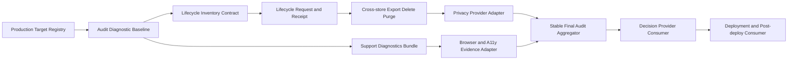

# Workbench Governance CLI 实现切片

## 1. 目的与最小生产路径

本文件把 `production-governance-closeout-handoff.md` 中的治理合同映射到具体代码目录、命令、schema、测试和外部 owner。实现顺序遵循“先只读证明，再引入有副作用生命周期操作，最后接外部审批与生产动作”。

## 1.1 已完成切片：CMD-0 Production Target Registry

- Owner：release CLI implementer + Taskfile/docs test owner；写入租约：target registry schema/generator/validator、Taskfile薄包装与parity tests。
- 输入：`task --list-all`可发现入口、CLI help、批准的production target contract和OpenSpec owning task；不执行任何production write。
- 输出：稳定排序的`target`、`owner_task`、`status`、`authority_level`、`required_inputs`、`expected_exit`、`evidence_layer`、provider/consumer dependencies与`source_digest`。
- 验收：不存在target、参数/help漂移、diagnostic target提权、provider blocked却零退出全部fail closed；旧registry不能跨candidate复用。
- 验证：`task production-targets:validate && task taskfile:production-contract:test && CGO_ENABLED=0 go test ./service/cmd/workbench-release -count=1`。
- 当前状态：registry generator/validator、Taskfile targets、JSON/Agent输出、source drift、0600/O_EXCL和component evidence已完成；Evidence：`temp/integration-test-runs/20260721150833-82524d77-2116-45b2-84da-7d819c93c82e/`。依赖deploy、workflow system/e2e、soak、canary、rollback、DR和post-deploy命令的治理/支持/GA工作包仍因这些target为`planned`而blocked。

## 2. 已完成切片：AUD-0 Diagnostic Requirement Audit

- 代码：`service/cmd/workbench-release/release_audit.go` 与相邻测试。
- CLI：`workbench-release audit generate|validate`。
- Taskfile：`release:audit:generate` 与 `release:audit`。
- Schema：`workbench.release_evidence_audit.v1alpha1`。
- 能力：重新读取 OpenSpec requirement source 和每个 evidence bundle，拒绝 missing、recorded-only、stale、tampered、wrong environment、bundle drift；输出只包含 safe requirement/change/owner/evidence/rollback refs 与 digest。
- 明确限制：该 schema 只有 requirement evidence diagnostic authority，`production_authorized=false`；它不聚合 security、privacy、a11y、SLO、deployment 或 approver authority，不得被 promotion/deployment consumer 当作 Go decision。
- Evidence：`temp/integration-test-runs/20260721105959-644ceef4-97e6-4f73-b7ee-d82fe2c314a4/`，component、passed、exit 0、六件套权限正确且敏感扫描无命中。

## 3. 已完成基线：Slice L0 Lifecycle Inventory Diagnostic

- Owner：单一 Workbench implementer；写入租约：`service/internal/lifecycle/**`、`service/cmd/workbench-lifecycle/**`、Taskfile/tests；未修改Owner adapters或生产数据。
- 命令：
  - `workbench-lifecycle inventory generate --environment <env> --output <path>`；
  - `workbench-lifecycle inventory validate --environment <env> --inventory <path>`；
  - Taskfile：`data-lifecycle:inventory:generate`、`data-lifecycle:contract`。
- Schema：`workbench.data_inventory.v1alpha1`，required 字段为 `environment`、`revision`、`policy_digest`、`generated_at`、稳定排序的 `data_classes[]`；每项绑定 `id`、`authority_owner`、`store_kind`、`classification`、`retention_policy`、`export_policy`、`delete_policy`、`legal_hold_policy`、`backup_policy`、`contains_owner_payload=false`。
- 当前数据来源：CLI从canonical non-content registry生成18类diagnostic inventory，并遍历repository `requiredSchemaModels()`将每个真实GORM table恰好绑定到一个data class；不扫描用户内容，也不允许手写inventory JSON。
- 负测：重复/未知 class、Owner payload 标记、永久 retention/hold、unknown store、wrong environment、unknown field、digest drift、overwrite/symlink、private path 输出。
- 验证：focused Go tests、Taskfile端到端、race、vet与component evidence均通过；Evidence：`temp/integration-test-runs/20260721111225-6aeaeefe-f650-4ba4-baad-7963cbc6f00c/`。
- 明确限制：GORM table parity已完成，但filesystem store、managed backup provider receipt与跨Owner签名尚未完成；因此只完成`6.0a0/6.0a0a` consumer baseline，不能关闭`6.0a1`、privacy review或任何删除权限。Owner交接见`data-inventory-owner-signoff-handoff.md`。

## 3.1 已完成基线：Slice L0A Signed Inventory Authority Consumer

- Owner：Workbench lifecycle implementer；写入租约：`service/internal/lifecycle/owner_authority.go`、`service/cmd/workbench-lifecycle/**`、Taskfile/tests；不生成Provider签名、不选择生产trust owner。
- 命令：`inventory receipt-validate`、`inventory authority-generate`、`inventory authority-validate`；Taskfile对应`data-lifecycle:owner-receipt:validate`、`data-lifecycle:authority:generate`、`data-lifecycle:authority:validate`。
- Schema：`workbench.data_inventory_owner_receipt.v1alpha1`、`workbench.data_inventory_trust_bundle.v1alpha1`、`workbench.data_inventory_authority.v1alpha1`。
- 能力：验证Ed25519、managed trust digest、active/revoked key、role/scope、freshness、inventory/policy/repository catalog digest，要求`domain_gorm`、`evidence_storage`、`support_diagnostics`、`managed_backup`、`external_owner_boundary`五scope独立且无receipt/nonce replay。
- Authority只保存safe refs与digests；五scope齐全时可标记`privacy_review_authorized=true`，但`production_authorized=false`固定不变，不能进入deployment/promotion authority。
- 验证：focused/Taskfile/full Go、race、vet、typecheck与全量OpenSpec通过；component Evidence：`temp/integration-test-runs/20260721114106-c401d782-bae6-437f-9cae-edfbc02ce2de/`。
- 当前限制：DI-S1至DI-S5真实Owner receipt/trust和joint evidence尚未交付，因此`6.0a1/6.0a1a-6.0a1e`继续blocked；仅`6.0a1e0` consumer baseline完成。

## 3.2 已完成基线：Slice L0B Owner Review Request Consumer

- Schema：`workbench.data_inventory_owner_review_request.v1alpha1`；命令：`inventory review-request-generate|review-request-validate`。
- 每个资产恰好绑定一个required scope、DI-S1至DI-S5 package ID、expected owner role、current inventory/policy/catalog digest、稳定data classes/store bindings和bounded TTL。
- 待审包由CLI以0600/O_EXCL生成，输出request digest；不包含Provider endpoint、credential、key、用户内容、private path或production authority。
- Taskfile：`data-lifecycle:review-request:generate`、`data-lifecycle:review-request:validate`；Provider执行DAG见`data-inventory-provider-integration-runbook.md`。
- 验证：focused/Taskfile/full Go、race、vet、typecheck与全量OpenSpec通过；component Evidence：`temp/integration-test-runs/20260721115401-c11cbc8e-a7a5-46bd-b527-d37b232aad02/`。
- 当前限制：该能力只把Owner待审输入标准化，不产生签名、不选择Provider、不关闭DI-S1至DI-S5。

## 3.3 已完成基线：Slice L0C Owner Evidence Binding

- Schema：`workbench.data_inventory_owner_evidence_manifest.v1alpha1`；命令：`inventory evidence-manifest-generate|evidence-manifest-validate`。
- 每个scope拥有固定evidence requirement registry；CLI只接受恰好对应的`.evidence`文件，拒绝缺失、额外、symlink、空文件、oversize和digest drift，manifest不复制内容或private path。
- Owner receipt现在必须签名绑定`review_request_digest`、`evidence_manifest_digest`与稳定evidence entries；receipt和aggregate都会重新读取request、manifest和直接evidence文件。
- Authority只保留request/manifest/receipt digests，不复制raw evidence、签名或Provider payload，且`production_authorized=false`保持不变。
- Taskfile新增`data-lifecycle:evidence-manifest:generate|validate`，receipt与authority任务要求同序request/manifest/evidence-dir输入。
- 验证：focused/Taskfile、race、vet、typecheck和全量OpenSpec通过；component Evidence：`temp/integration-test-runs/20260721121054-7f2d849b-58f6-4a35-9011-1de662a4ce92/`。
- 当前限制：真实DI-S1至DI-S5 evidence与Provider签名仍未交付，不能关闭Provider Ready或privacy review。

## 4. Slice L1：Lifecycle Request、Receipt 与状态机

- Owner：同一 lifecycle implementer；Dependencies：L0、managed PostgreSQL migration owner。
- 代码：`service/internal/lifecycle/domain` 定义纯状态机，`service/internal/lifecycle/repository` 使用 GORM，`service/internal/lifecycle/service` 负责编排；transport 只调用 service。
- Schema：`workbench.lifecycle_request.v1alpha1` 与 `workbench.lifecycle_receipt.v1alpha1`。
- 状态：`requested -> tombstoned -> purging -> backup_expiry_pending -> completed`；不确定副作用进入 `unknown`，只允许原 operation lookup/reconcile；`legal_hold` 阻止 purge/expiry但不恢复普通访问。
- 命令：`export request|status`、`delete request|status`、`operation reconcile`；所有 mutation 要求 tenant/workspace opaque ref、expected revision、idempotency key、actor authority 和 dry-run/approval gate。
- 不变量：重复请求不重复副作用；partial purge 不得 completed；Owner canonical payload 不由 Workbench 直接删除；receipt/audit truth 不因删除消失。
- 验证：domain table tests、repository restart/CAS tests、service unknown/reconcile tests、transport parity、race 与 system evidence。

## 5. Slice L2：Cross-store Lifecycle Executors

- Owner：按 store 单写入租约串行：DB → projection/index → cache → evidence/diagnostics → managed backup adapter。
- Provider 合同：每个 executor 实现 `Plan`、`Apply`、`Lookup`、`Reconcile`，返回 opaque operation ref、source revision、bounded counts 和 safe blocker code；不得返回 row content、resource title、private path 或 provider payload。
- Export：生成 CLI-authored manifest/checksum，只包含 Workbench-owned数据和safe refs。
- Delete：先通过 authorization tombstone 阻止普通访问，再按 generation 清理派生数据。
- Evidence：成功和失败都通过 runner；backup expiry 必须消费 managed provider receipt，不能用本地文件缺失证明删除。
- System matrix：response loss、restart、partial store failure、legal hold race、stale projection、cache resurrection、evidence redaction failure、backup provider timeout。

## 6. Slice D0：Safe Support Diagnostics

- 当前状态：`6.3d0`bundle合同、`6.3d1a`两项direct-report snapshot、`6.3d1b0`runtime report consumer合同、`6.3d1b1a`正式worker bootstrap attachment、`6.3d1b1b0`typed authority consumer与`6.3d1b1c0`role DAG去环已实现；可选runtime report可形成direct=5 snapshot，但真实Identity/delegation Provider canary、D1b1c1-c6 scheduler/executor/outbox/reconcile/claim authority/system handoff与Workflow definition/policy digest仍待交付，完整`6.3d`继续等待D1b-D1d authority、安全矩阵、download audit/purge和独立签收，详见`support-diagnostics-production-handoff.md`。
- Owner：独立 implementer；写入租约：`service/internal/diagnostics/**`、`service/cmd/workbench-diagnostics/**`、tests；不得修改 session/identity semantics。
- 命令：
  - `workbench-diagnostics bundle generate --environment <env> --candidate-digest <sha256> --source-type <type> --source-ref <opaque-ref> --diagnostic <code=status> --output <path>`；
  - `workbench-diagnostics source generate|validate --environment <env> --candidate-digest <sha256> --config-report <path> --release-report <path> ...`；
  - `workbench-diagnostics bundle generate-from-snapshot --environment <env> --candidate-digest <sha256> --snapshot <path> ...`；
  - `workbench-diagnostics bundle validate --environment <env> --candidate-digest <sha256> --bundle <path>`；
  - Taskfile：`diagnostics:sources:generate|validate`、`diagnostics:bundle:generate-from-sources`、`diagnostics:verify`、`diagnostics:d1a:test`、`test:diagnostics-sources:component`。
- Schema：`workbench.support_diagnostics_bundle.v1alpha1`，只允许 version/artifact/profile digest、capability state、source type、opaque receipt refs、safe error codes、time window、rescue commands、redaction/size/retention receipt。
- 禁止字段与内容：raw endpoint、identity claim、tenant/resource title、provider payload、stack memory、Authorization/token/cookie/secret、private path、完整 argv。
- 限制：最大文件数、单文件/总字节数、最大 retention、禁止 symlink/device、稳定排序、0600 文件；validator 必须重新读取所有内容而非信任 `redaction.enabled`。
- 已验证基线：canonical code/status、success/failure/unknown rescue、strict JSON、candidate/freshness/symlink/size、config/release source report重读与digest drift、2 direct/5 unknown snapshot、CLI JSON/agent/explain、Taskfile/component evidence。
- 待验证生产门：database/worker/workflow/Identity/Owner五项direct source、complete frozen snapshot、递归seeded leak matrix、download audit、retention/purge、staging system evidence和独立operations/security receipt，再由browser/a11y reviewer消费。

## 7. Slice P0/U0：外部 Review Adapter

Privacy 与 Browser/A11y 必须使用两个独立 provider adapter，不能把本地测试进程或 implementer identity 当 reviewer：

| Adapter | Provider Ready | Consumer Done | Joint evidence |
| --- | --- | --- | --- |
| Privacy | reviewer identity/role、policy/trust、inventory/lifecycle scope、expiry/revoke | `workbench-release privacy validate` 重验签名receipt与直接evidence | staging lifecycle fault matrix + revoke/rotation |
| Browser/A11y | 固定browser/AT matrix、reviewer role、candidate/environment scope、report signer | `workbench-release experience validate` 重验journey/a11y/security/diagnostics refs | fixed identity/tenant/viewport/locale replay + report revoke |

两个 receipt 都必须绑定 candidate/artifact/manifest digest、evidence digest、reviewer role、policy/trust digest、issued/expiry、nonce 和 signature。Provider response loss只允许 lookup 原 review ref。

## 8. Slice A1/G0/X0：Stable Audit、Decision 与 Post-deploy

1. `workbench-release audit aggregate` 消费 AUD-0、security、privacy、experience、SLO、handoff、rollback/backup 与 deployment-contract authority，生成下一版本 stable audit；任何 required authority 非current verified时为No-Go。
2. `workbench-release decision validate` 只消费外部 approver provider生成的签名 decision，不提供“Agent approve”命令。
3. `workbench-release deployment receipt-validate` 只验证批准平台 receipt；apply 不由普通 Agent 或 OpenSpec 自动执行。
4. `workbench-release post-deploy validate` 消费production只读 evidence、SLO/audit/backup/flags/reconcile和support handoff，生成 closeout eligibility；active incident/Unknown/missing support owner保持active。

## 9. 对接任务与推荐顺序

| 顺序 | 对接 Owner | 必需交付 | Workbench 前置 |
| --- | --- | --- | --- |
| 1 | managed DB/backup | lifecycle store inventory、backup expiry/hold receipt、disposable restore | L0 schema draft |
| 2 | Identity/Eikona/其他 Owner | canonical payload边界、可选外部delete合同、lookup/reconcile | L0 owner matrix |
| 3 | privacy reviewer | policy/trust、signed receipt、revoke/rotation | L2 joint evidence |
| 4 | browser/a11y reviewer | browser/AT matrix、signed report、replay条件 | D0 bundle + frozen candidate |
| 5 | release approvers | role separation、decision receipt/trust | A1 zero blocker |
| 6 | deployment platform | plan/apply/lookup/receipt/rollback adapter | current Go decision |
| 7 | operations/support | post-deploy checks、paging、support handoff | deployed receipt |

每个外部 owner 都要分别完成 Provider Ready、Workbench Consumer Done、Joint Integration 和 Rollback/Revoke，不允许用一份会议结论同时关闭四项。

## 10. 不应提前自动化

- 不自动执行 production apply、tenant deletion、Owner payload deletion、backup destruction、legal hold解除或 approver签署。
- 不在 lifecycle L0 阶段扫描或导出真实用户内容。
- 不让 diagnostic AUD-0、fixture reviewer、browser screenshot 或 CI green 获得 promotion authority。
- 不在 provider 尚未选择时把某个 SaaS、KMS、browser farm 或部署平台写成既定生产依赖。
