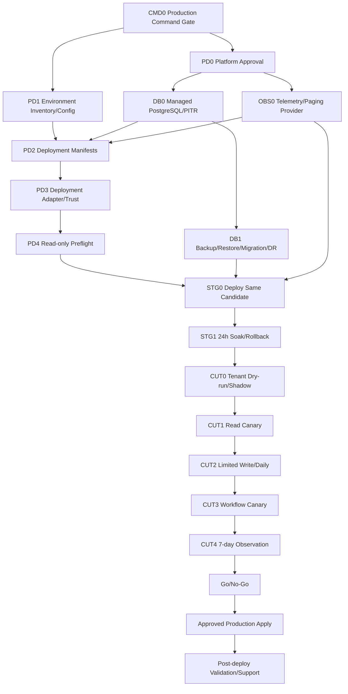

# Managed Runtime 到 Production 交接执行手册

## 1. 目的与当前事实

本文把 deployment platform、managed PostgreSQL/PITR、observability/SLO、首租户cutover、staging soak、canary和production decision串成一条可执行主路径。它引用已有provider-neutral合同，不新增第二套状态数据库；真实environment、backup、SLO、deployment、tenant cutover和rollback状态必须由批准provider或Workbench release CLI生成。

当前事实：

- deployment platform仅有推荐决策包，尚未批准实际platform、owner、adapter repository或staging sandbox；
- `deploy/` 只有image说明，没有Kubernetes/GitOps/managed container manifests、IaC或environment profiles；
- 本地可构建PostgreSQL diagnostic paths，但managed migration/apply/backup/restore public
  operations pre-connect hard-block；`pg_dump`/`pg_restore` component or disposable
  baselines are not managed restore, staging, RPO/RTO, or production acceptance;
- 尚无真实managed PostgreSQL provider、PITR、retention/encryption authority、RPO/RTO drill；
- Workbench已有OTLP exporter与本地observability tests，但尚无metrics/logs/traces/query registry、paging backend、on-call RACI或signed SLO observation provider；
- `release:readiness/manifest/handoff/audit`等本地入口已存在，但deploy、workflow system/e2e、soak、canary、rollback、DR和post-deploy等主路径命令仍有多项不可发现；在CLI-authored target registry完成前不得把本文命令表当成可执行authority；
- 首租户cutover、24h staging和7-day canary只有合同，没有真实tenant/provider/environment/approval evidence；
- v8 target registry is the current command truth (36 total: 8 available, 5
  diagnostic, 14 planned, 9 provider-blocked; `complete=false`,
  `production_authorized=false`). Older v2–v7/current aliases are stale;
  the DAG below is conditional planning, not staging execution authority;
- 因此production runtime仍为No-Go。

## 2. 主路径 DAG



所有环境必须晋级同一artifact/image/stable manifest digest。环境差异只能来自approved non-secret profile与secret references，不允许在staging/canary/production重新编译。

## 3. Owner 与信任边界

| Authority | Owner | Workbench可做 | Workbench禁止 |
| --- | --- | --- | --- |
| Runtime/platform truth | deployment platform owner | validate/plan/apply/lookup safe adapter | 根据Pod health、Git commit或Task exit写deployed |
| Environment inventory | operations/platform | 消费opaque environment/tenant refs与digest | 接受caller任意endpoint/namespace |
| PostgreSQL/PITR | DB/provider owner | migration/backup/restore verifier | 保存DB credential或把SQLite当managed evidence |
| Telemetry/SLO | observability/on-call owner | 验证report/receipt/trust | 读取raw logs/traces或自报连续窗口 |
| Tenant/capability | Identity/Owner/release owners | 生成allowlist、flags、cutover plan | 自动选择普通用户tenant/project |
| Deployment approval | explicit approver | 验证signed approval receipt | Agent/automation identity自批production |
| Production write | user/root production owner | 发起已批准adapter operation | 默认或隐式执行真实外部写 |

## 4. Deployment Platform 批准包

### 4.1 必填决策

实际platform approval必须冻结：

- platform/controller名称、版本、owner、provider repository；
- staging/canary/production environment inventory source；
- Web/API/worker/migration runtime topology；
- OCI registry、stable digest和pull identity；
- network ingress/egress/DNS/TLS/proxy boundary；
- managed secret reference/KMS owner；
- PostgreSQL与observability provider mapping；
- operation idempotency、lookup SLA、Unknown reconcile；
- rollout waves、pause/abort/rollback和partial apply语义；
- deployment receipt signer、trust distribution、rotation/revoke；
- on-call、failure owner、support hours、cost/auto-stop boundary。

当前建议仍是Kubernetes + GitOps或满足同等能力的managed container platform。推荐不等于批准；缺cluster/sandbox/owner/API/receipt signer/rollback任一项时保持blocked。

### 4.2 Environment inventory

Provider必须生成versioned inventory，绑定environment、cluster/project/namespace opaque refs、tenant scope、network/DB/telemetry/registry/secret provider refs、region、capacity class、owner、created/expiry与digest。不得把raw endpoint、credential、kubeconfig、account/project用户资源ID写入Workbench evidence。

### 4.3 Adapter 状态机

```text
planned -> applying -> partially_applied -> deployed
   |          |                |
   |          +-> unknown -----+-> lookup/reconcile
   +-> failed
   +-> aborted
deployed -> rolling_back -> rolled_back | rollback_failed | unknown
```

Apply响应丢失只能使用原operation/idempotency key lookup/reconcile；禁止盲目第二次apply。`partially_applied`不能晋级Production，也不能仅因部分Pod healthy变成deployed。

## 5. Environment Profile 与 Manifest

### 5.1 Non-secret profile

每个environment profile至少声明：

- public origins、service refs、Identity issuer/audience；
- PostgreSQL profile/ref、pool/timeouts/TLS mode；
- Owner allowlist/contract/schema refs；
- telemetry collector/query registry/paging refs；
- capability flags、kill switches、limits/cost budgets；
- resource requests/limits、replicas/autoscale bounds；
- ports/probes/drain deadlines、migration/worker compatibility ranges；
- retention/data lifecycle/support metadata。

Profile必须由CLI/service生成或管理，不能手写机器状态。Secret只以approved secret reference出现；任何secret value进入argv/rendered manifest/log/evidence都阻断。

### 5.2 四组件 manifest

- Web/API/worker/migration独立lifecycle；
- API/worker不得AutoMigrate；migration job先执行compatible check再apply；
- non-root、read-only root filesystem、显式tmpfs/writable mounts；
- 最小service account、capabilities、network/egress allowlist；
- readiness/liveness/startup、preStop、graceful drain；
- worker claim、scheduler与mutation flags默认关闭，按cutover阶段打开；
- image只按digest；manifest绑定stable supply-chain/security authority和deployment profile digest。

### 5.3 Worker bootstrap 输入与启动顺序

`workbench-worker`已进入D1b1a bootstrap-attached阶段。Release pipeline必须先用CLI生成并校验两个不可变合同资产：

```bash
task operation:registry:generate \
  OPERATION_REGISTRY=temp/contracts/operation-registry.json

task operation:registry:check \
  OPERATION_REGISTRY=temp/contracts/operation-registry.json

task workflow:step-registry:generate \
  OUTPUT=temp/contracts/workflow-step-registry.json

task workflow:step-registry:check \
  SNAPSHOT=temp/contracts/workflow-step-registry.json
```

Deployment manifest将两个文件作为同candidate的只读release asset挂载，不得由operator手写或在环境中重新生成。Worker同时需要release version、source digest、worker artifact digest、Identity contract version与delegation contract version；这些字段必须来自stable manifest/worker handoff，不接受普通caller覆盖。

当前`workbench-operation-contract`只冻结默认synthetic + design registry，用于D1b1a bootstrap attachment和fail-closed验证。启用Aigora或其他feature-gated operation的candidate必须在R4 `5.0b2b2c2b`增加candidate-aware registry projection并绑定R0 release manifest，证明API与worker使用完全相同的operation digest；不得把默认registry用于功能已扩展的production candidate。

启动顺序固定为：migration compatibility/apply完成 → snapshot与metadata校验 → `bootstrap.Open`连接managed PostgreSQL external-migration store → dependency checker与lifecycle option附加 → admin listener启动。Snapshot无效、metadata drift或数据库不可用必须在listen前失败，日志只输出`bootstrap_failed`等安全错误码，不输出DSN、snapshot path或底层provider错误。

D1b1a之后仍保持claim-disabled。D1b1b0已实现service identity/delegation typed readiness consumer；D1b1b1仍必须由Identity owner交付真实Provider canary。D1b1c0已修正R4 role DAG；D1b1c1-c6依次交付fair scheduler/no-side-effect claim、typed local executor、workflow outbox、durable dispatch/reconcile、candidate-bound claim authority与真实process system handoff。只有全部required dependency current、四role engine真实运行、rollout receipt current且注册/heartbeat成功，`/readyz`才可作为managed worker truth。

### 5.4 Authority readiness consumer合同

Worker对Identity与delegation只消费typed readiness，不读取token、private key、raw JWKS或provider内部状态。Production endpoint必须使用HTTPS或受管理service mesh；普通HTTP仅允许loopback component test。两个endpoint使用`GET`并返回`workbench.worker_authority_readiness.v1alpha1` strict JSON，单响应上限64KiB，禁止redirect、userinfo、query credential、未知字段与尾随内容。

Service identity响应必须绑定`environment`、`candidate_digest`、`contract_version`、`issuer`、`audience`、`service_identity_ref`、精确algorithm集合、`keyset_digest`、`issued_at`、`expires_at`和`revoked=false`。Delegation响应必须绑定同一environment/candidate、delegation contract、issuer/audience、`grant_version`、`policy_digest`与同样的freshness/revoke字段。两类响应的`production_authorized`必须为false；readiness只证明dependency current，不授予rollout或claim authority。

Deployment manifest通过secret-free config注入以下变量，endpoint值不得进入日志、diagnostics或evidence：

```bash
WORKBENCH_WORKER_ENVIRONMENT=staging
WORKBENCH_WORKER_IDENTITY_READINESS_URL=https://identity.internal/readiness/service-identity
WORKBENCH_WORKER_IDENTITY_ISSUER=https://identity.example
WORKBENCH_WORKER_IDENTITY_AUDIENCE=workbench-worker
WORKBENCH_WORKER_IDENTITY_ALGORITHMS=EdDSA
WORKBENCH_WORKER_DELEGATION_READINESS_URL=https://identity.internal/readiness/delegation
WORKBENCH_WORKER_DELEGATION_ISSUER=https://identity.example
WORKBENCH_WORKER_DELEGATION_AUDIENCE=workbench-worker
WORKBENCH_WORKER_DELEGATION_GRANT_VERSION=grant.v1
WORKBENCH_WORKER_AUTHORITY_TIMEOUT=3s
```

Workbench本地验收命令：

```bash
task worker:authority-readiness:test
task test:worker-authority-readiness:component
```

这些命令只证明Consumer Done基础与fail-closed fault matrix。D1b1b1必须另附真实Identity process、managed TLS、rotation/revoke/outage和staging `/readyz` evidence，不能用`httptest`结果代替Provider Ready。

## 6. Managed PostgreSQL、Backup 与 PITR

### 6.1 当前实现边界

Workbench已具备：

- managed profile PostgreSQL migration连接验证；
- `pg_dump` custom-format backup；
- checksum/schema metadata manifest；
- `pg_restore --clean --if-exists` 到显式disposable target；
- integration以上环境只接受managed restore receipt。

这些能力不证明provider HA、backup job成功、PITR、retention/encryption、跨版本业务invariant、RPO/RTO或灾难切流。

### 6.2 Provider Ready 最小包

DB owner必须批准并证明：

- provider/region/HA/failover topology；
- TLS/identity/connection/pool policy；
- automated backup与PITR window；
- retention、encryption、key ref与rotation；
- backup operation/status/lookup/receipt API；
- disposable restore target隔离和destroy/cleanup；
- RPO/RTO objectives、measurement source与on-call；
- fresh、N-1→N、N→N和interrupted migration兼容矩阵；
- production数据库永不作为restore verifier target。

### 6.3 DR 状态机

```text
incident_detected
  -> writes_fenced
  -> restore_point_selected
  -> disposable_restore_verified
  -> replacement_ready
  -> traffic_cutover
  -> application_reconciled
  -> observation_passed
  -> incident_closed
```

任何unknown external mutation、workflow receipt、projection cursor或audit gap都必须reconcile；不能只验证数据库可连接。

## 7. Observability、SLO 与 Paging

### 7.1 Provider Ready

Operations必须批准：

- metrics/logs/traces backend与provider repository；
- query registry owner与versioned query digest；
- deployment artifact→running instances映射source；
- P0/P1 severity、paging、ack/escalation、incident commander；
- signer/KMS、trust bundle、rotation/revoke SLA；
- telemetry retention、coverage和raw data privacy；
- support hours、failure owner和provider outage行为。

Dashboard存在不等于paging ready；generic team name不等于on-call owner。

### 7.2 Required indicators

首个production candidate至少覆盖：

- API availability、p95/p99 latency、error rate；
- mutation known outcome/unknown_accept/reconcile freshness；
- search、Pane/SSE与projection/revoke freshness；
- workflow queue/lease/reconcile/duplicate dispatch；
- PostgreSQL pool/connection/migration、backup RPO和restore RTO；
- Identity/Owner dependency health；
- worker capacity、resource saturation与kill/rollback events。

24h staging和7-day canary必须是连续窗口，记录expected/observed/missing seconds、segments、max gap、samples、query/source digest、budget/incidents。窗口缺口不能通过拼接或缩短隐藏。

## 8. Staging、Tenant Cutover 与 Canary

### 8.1 Staging entry

进入staging前必须具备：

- stable artifact/image/manifest/supply-chain/security digest；
- deployment platform、DB、observability Provider Ready；
- environment profile、manifests、preflight和rollback plan；
- backup/restore authority；
- selected test tenant allowlist与external approval；
- not-ready capabilities disabled。

### 8.2 24h staging

同candidate执行：deploy、scale、restart、key rotation/revoke、Identity/Owner outage、DB connection loss、worker drain、backup/restore、rollback/redeploy。任一P0/P1、budget burn、duplicate mutation、lost receipt、restore超限、missing alert都使窗口失败并要求新candidate/窗口。

### 8.3 Cutover 阶段

```text
C0 approved plan
C1 Identity bootstrap
C2 provider connect
C3 shadow projection
C4 read canary
C5 operation-by-operation limited write
C6 Daily loop
C7 workflow canary
C8 seven-day observation
```

每阶段有独立flag、receipt、stop/abort/rollback与owner。不得同时开启多个mutation；read通过不能自动打开write；workflow先无副作用step再Eikona mutation。

### 8.4 7-day canary

每天必须生成当前artifact/manifest/allowlist/SLO/query/policy/trust digest绑定的daily evidence。任一天缺失、budget exhausted、P0/P1、restore/revoke/reconcile失败都暂停或rollback；不得补录、拼接或缩短七天窗口。

## 9. 原子交付包

### RT-PD0：Platform Approval

- Owner：root/operations + platform/security/DB/observability owners。
- 输出：实际platform/controller/repository/sandbox、inventory、registry/secret/network/DB/telemetry、operation SLA、signer/trust、rollout/on-call/cost决策。
- 验收：所有字段有owner和direct capability evidence；“external system”占位、个人credential或口头批准blocked。

### RT-CMD0：Production Command Availability

- Owner：Workbench release CLI implementer + Taskfile/docs test owner。
- 输出：CLI-authored target registry与validator，区分`available`、`diagnostic_only`、`planned`、`provider_blocked`和`deprecated`，绑定owner task、authority、expected exit、evidence layer与source digest。
- 验收：本文引用的不存在target保持blocked；diagnostic target不能替代deployment/provider/production evidence；Taskfile、CLI help或文档漂移使旧candidate失效。
- 验证：`task production-targets:test && task test:production-targets:component`；实现证据为`temp/integration-test-runs/20260721150833-82524d77-2116-45b2-84da-7d819c93c82e/`。RT-CMD0 consumer实现已完成，但当前registry仍因真实planned/provider-blocked targets返回No-Go。

### RT-PD1：Environment/Profile Authority

- Owner：operations + Workbench config implementer。
- 输出：integration/staging/canary/production non-secret profile schemas、secret reference resolver、environment inventory consumer与negative matrix。
- 验收：missing/conflicting/local fallback、wrong issuer/DB/Owner/telemetry、secret value leak全部fail fast。

### RT-PD2：Deployment Manifest/Adapter

- Owner：platform implementer + Workbench release consumer。
- 输出：四组件manifests、migration/worker ordering、deployment adapter、signed receipt/trust、lookup/reconcile、pause/abort/rollback。
- 验收：image tag、wrong authority、partial apply、unknown receipt、incompatible ranges和caller truth blocked。

### RT-DB0：Managed DB Provider

- Owner：DB/operations owner。
- 输出：provider/HA/TLS/pool、backup/PITR/retention/encryption、restore isolation、RPO/RTO和failure owner决策。
- 验收：SQLite/local file或backup job green不计Provider Ready。

### RT-DB1：Parity/Backup/Restore/Migration/DR

- Owner：Workbench DB implementer + DB test/operations owners。
- 输出：real Postgres parity、provider backup receipts、disposable restore、fresh/N-1→N/interrupted migration、timed DR drill。
- 验收：wrong target/profile/key/checksum/schema、cleanup failure、RPO/RTO超限和external truth gap blocked。

### RT-OBS0：Observability/Paging Provider

- Owner：observability/security/operations owners。
- 输出：provider/query registry/deployment mapping、paging/on-call RACI、signed observation receipt、managed policy/trust。
- 验收：dashboard-only、generic team、raw telemetry evidence、caller query/trust blocked。

### RT-OBS1：24h/7d Window Authority

- Owner：observability provider + Workbench release consumer。
- 输出：continuous staging/canary SLO reports、coverage/budget/incidents、rotation/revoke和provider outage evidence。
- 验收：missing indicators/gaps/stale query/wrong artifact/short window blocked。

### RT-CUT0：Staging/Cutover Dry-run

- Owner：release + Identity/Owner/DB/operations owners。
- 输出：allowlist、external approval、bootstrap/provider discovery/shadow projection/rollback plan和24h staging evidence。
- 验收：demo/fixture/local bridge/普通用户资源、index先清空或real write during dry-run blocked。

### RT-CUT1：Read/Write/Workflow Canary

- Owner：release + R2/R3/R4 + user/root approval owners。
- 输出：C1-C7阶段receipts、flags、unknown/partial/cancel/reconcile、workflow drain与rollback evidence。
- 验收：每operation独立启用；失败不扩大流量、不重放parent、不删除run/receipt。

### RT-CUT2：Seven-day/Go-No-Go

- Owner：operations/security/test/release approvers。
- 输出：连续七天daily evidence、error budget、incidents、backup/restore、known risks、final decision和production action plan。
- 验收：任一天缺失或P0/P1/budget/restore/revoke/reconcile失败即No-Go。

## 10. 生产写入门禁

本OpenSpec、Taskfile或普通Agent只能生成计划、验证输入和调用approved adapter。真实production apply必须由user/root production owner在Go decision后显式授权；无signed deployment receipt时状态保持unknown/not deployed。Post-deploy checks只读且production-safe，失败触发approved abort/rollback runbook。

## 11. 待批准决策

- 实际deployment platform/controller、provider repository与staging sandbox；
- environment inventory与tenant scope authority；
- managed PostgreSQL/PITR provider、RPO/RTO、retention/encryption；
- metrics/logs/traces/query/paging backend、on-call RACI；
- deployment与observation signer/trust profile；
- first tenant/workspace/disposable Eikona project与approval owner；
- 24h/7d窗口起止、missing gap、budget和automatic abort policy；
- production apply、rollback和post-deploy support owner。
