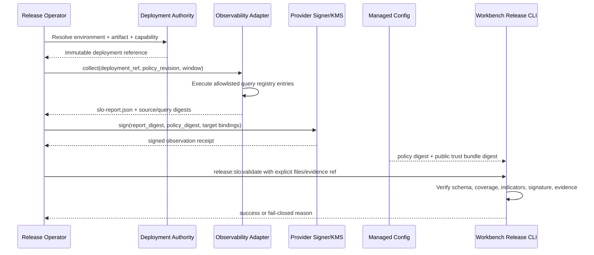

# Observability Authority Provider 对接 PRD

## 1. 问题与目标用户

Workbench 已能严格验证 `workbench.slo_report.v1alpha2`、`workbench.slo_policy.v1alpha2`、`workbench.slo_observation_receipt.v1alpha1` 与 `workbench.slo_trust_bundle.v1alpha1`，但当前通过证据来自测试夹具，不代表真实 observability provider 已接入。若没有 provider-owned 查询、签名和 trust lifecycle，调用者仍可能在本地构造“看起来合格”的报告，Demo 不能据此晋级生产。

目标用户包括 observability platform owner、security、release operations、Eikona/Workbench service owner 与 on-call。共同 job-to-be-done 是：针对一个明确 environment、artifact digest 与 capability，从批准的 telemetry source 生成可重验、多 SLI、连续窗口报告，由 provider-controlled key 签名，并让 Workbench 在不接触 provider credential、private key 或 raw telemetry 的前提下给出 fail-closed release 结论。

## 2. 最小可发布范围

首个交付只覆盖 `eikona-first-support`，依次支持：

1. staging 连续 24 小时窗口；
2. canary 连续 7 天窗口；
3. `api-latency`、`search-error-rate`、`workflow-queue-lag` 三个 required indicators；
4. managed policy digest 与 public trust bundle digest 注入；
5. Ed25519 receipt 签名、轮换、撤销和负向演练；
6. Workbench `release:slo:validate` 与 `release_manifest.v3alpha5` 消费。

首版不自动执行 production deploy，不自动扩大租户或 capability，不把 dashboard 截图当 authority，不把 raw logs/traces/metrics复制进 Workbench evidence，不由 Workbench 生成 provider private key，不允许调用者自由输入 query text 或声明 source digest。

## 3. Owner 与仓库边界

| 责任 | Owner | 写入位置 | Workbench 是否拥有 |
| --- | --- | --- | --- |
| Query registry 与只读采集 adapter | observability provider repository | provider-owned source/config/tests | 否，只消费输出 |
| Service/capability/artifact deployment mapping | deploy/runtime owner | approved deployment inventory | 否，只验证绑定 |
| Signing key 与 signer runtime | security + observability provider | KMS/HSM或批准的secret store | 否，不接触私钥 |
| Public trust bundle 与 policy 分发 | security + release operations | managed config/registry | 仅消费只读副本与digest |
| SLO report/receipt严格验证 | Workbench | `service/cmd/workbench-release/**` | 是 |
| 连续窗口、incident 与 error-budget验收 | release operations + on-call | system evidence与release report | 共同验收 |

Provider repository 必须拥有 adapter 实现与集成测试；Workbench repository 只维护 provider-neutral consumer、测试夹具和发布绑定。任何 provider SDK、credential、webhook payload parser 或 query language都不得进入 Workbench。

## 4. 用户流程与状态



窗口状态为 `collecting -> complete -> signed -> validated -> bound`。以下变化必须使状态回到 `collecting`，不能继续累计旧窗口：

- artifact digest、environment 或 capability变化；
- policy digest、query-set digest 或 source revision变化；
- coverage低于policy、max gap超限或provider确认telemetry缺失；
- signer key在窗口或签发时无效；
- P0/P1 incident需要纳入但尚未完成关联。

`validated` 只表示当前输入通过；manifest生成与验证仍需重新执行 resolver，不能把历史成功布尔值写回资产。

## 5. Adapter 命令合同

Provider adapter 至少提供以下可自动化命令。命令名可以由 provider 选择，但参数语义和机器输出必须稳定；不得要求 Workbench 解析 human stdout。

### 5.1 `collect`

建议命令：

```bash
workbench-slo-adapter collect \
  --environment staging \
  --capability eikona-first-support \
  --deployment-ref deployment:<opaque-ref> \
  --policy-ref policy:<opaque-ref> \
  --window 24h \
  --output <evidence-run>/artifacts/slo-report.json \
  --json
```

要求：

- `deployment-ref` 必须由部署authority解析为当前 artifact digest，不能由调用者同时提交任意digest覆盖。
- `policy-ref` 必须解析到批准revision与digest，查询adapter不得修改threshold。
- query只允许引用provider-owned registry ID；禁止传递任意query字符串或shell片段。
- 报告按indicator ID排序并去重；`query_set_digest`由全部 canonical indicator query digests计算。
- `expected_seconds = observed_seconds + missing_seconds`，coverage、segment count、max gap从真实采样完整度计算。
- 输出只包含聚合值、opaque refs和SHA-256 digest；不包含用户内容、原始event、trace payload、endpoint、credential或private path。

### 5.2 `sign`

建议命令：

```bash
workbench-slo-adapter sign \
  --report <evidence-run>/artifacts/slo-report.json \
  --policy-ref policy:<opaque-ref> \
  --issuer-ref observability-provider:<issuer> \
  --output <evidence-run>/artifacts/slo-observation-receipt.json \
  --json
```

要求：

- signer通过KMS/HSM或批准的provider secret store使用私钥；私钥不得进入文件参数、环境快照、stdout/stderr或evidence。
- receipt必须绑定environment、capability、artifact、report digest、policy digest、source/query digest、window、issuer、key ID、issued/expires与唯一nonce。
- 签发时间不得早于window end；receipt expiry必须覆盖预期manifest生成和审核时间，但不得成为长期永久凭证。
- 签名payload必须与Workbench canonical字段完全一致；不能签名human文本或不稳定序列化。

## 6. 数据合同与来源规则

### 6.1 Required indicators

| Indicator ID | Kind | Unit | Objective | Source owner | 首版解释 |
| --- | --- | --- | --- | --- | --- |
| `api-latency` | `latency` | `ms` | `p95_lte` | Workbench API telemetry | 当前artifact服务请求的p50/p95/p99/max |
| `search-error-rate` | `rate` | `bps` | `value_lte` | Search/projection telemetry | 搜索请求失败率，明确排除项必须由policy定义 |
| `workflow-queue-lag` | `freshness` | `seconds` | `max_lte` | Workflow scheduler/worker | queue/reconcile lag，不得只报告平均值 |

后续加入 Pane/SSE、projection/revoke freshness、mutation known outcome、backup RPO 与 restore RTO 时，必须通过新policy revision增加；不得静默改变现有indicator语义。

### 6.2 Source 与 query digest

- `source_ref` 标识批准的observability dataset或materialized view revision，不得包含真实endpoint。
- `source_digest`覆盖source schema、retention/completeness rule与environment binding。
- 每个 `query_digest` 覆盖registry ID、query revision、aggregation、filters、exclusions、grouping和unit conversion。
- `query_set_digest`覆盖按indicator ID排序后的全部indicator ID与query digest。
- query、source或policy任何变化都必须生成新报告和receipt，并使旧candidate失效。

### 6.3 Incident 与预算

P0/P1 incident必须来自批准的incident authority，报告只保存opaque incident/evidence refs与digest。Adapter不得通过过滤、重分类或修改窗口隐藏incident。Error budget计算规则属于policy revision；报告不得自行声明不同算法。

## 7. Trust Bootstrap、轮换与撤销

1. 每个environment使用独立issuer/key scope；staging key不得验证canary或production receipt。
2. Trust bundle只包含public key、capabilities、validity和revocation metadata。
3. Managed config向Workbench注入 `WORKBENCH_SLO_POLICY_DIGEST` 与 `WORKBENCH_SLO_TRUST_BUNDLE_DIGEST`；CLI flag不得覆盖。
4. 轮换使用overlap窗口：先发布新public key，再启用新signer，待旧receipt freshness窗口结束后再撤销旧key。
5. Key compromise时立即发布revocation和新bundle digest；所有尚未promotion的candidate必须重生。
6. 历史audit需要保留当时trust bundle revision与digest，但撤销key不能继续批准新candidate。

## 8. Evidence 与审计要求

每次 provider integration、rotation drill、staging soak和canary window必须生成 `temp/integration-test-runs/<run-id>/` 六件套及 `artifacts/`。允许收集：

- 脱敏SLO report；
- signed observation receipt；
- public trust bundle；
- policy的公开或脱敏投影；
- provider adapter machine summary；
- dashboard、incident、deployment和query registry的opaque refs/digests。

禁止收集：private key、credential、Authorization header、raw query response、raw logs/traces、用户内容、完整provider payload、hidden prompt、private tool arguments或full chain-of-thought。证据必须保留原命令exit code；失败运行同样写入六件套。

## 9. 验收与回归矩阵

| 场景 | 预期 |
| --- | --- |
| 完整24h staging窗口、三指标、active key、pinned digests | `release:slo:validate`成功 |
| canary少于7天 | blocked |
| indicator缺失、重复、乱序、wrong unit/objective/query | blocked |
| coverage不足、missing math错误、gap超限、窗口拼接 | blocked |
| artifact/environment/capability/policy/query/source drift | blocked |
| caller自建trust bundle或错误managed digest | blocked |
| receipt tamper、wrong target、expired、future、unknown/revoked key | blocked |
| raw telemetry或secret进入evidence | evidence runner失败 |
| policy/query/key rotation后复用旧candidate | blocked并要求重生 |
| v1alpha1 report尝试生成alpha5/stable manifest | blocked；仅诊断读取兼容 |

必须执行：

```bash
task release:slo:validate \
  ENV=staging \
  CAPABILITY=eikona-first-support \
  ARTIFACT_DIGEST=sha256:<digest> \
  SLO_REPORT=<system-run>/artifacts/slo-report.json \
  SLO_POLICY=<managed-policy> \
  SLO_EVIDENCE_REF=evidence:system:<run-id> \
  SLO_OBSERVATION_RECEIPT=<system-run>/artifacts/slo-observation-receipt.json \
  SLO_TRUST_BUNDLE=<managed-public-trust-bundle>
```

随后运行 `task release:soak ENV=staging DURATION=24h` 与 `task release:canary:report ENV=canary WINDOW=7d`。命令尚未实现时，对应OpenSpec任务保持未完成，不得以手工检查替代。

## 10. 交付顺序与完成定义

1. Observability owner确认provider repository、query registry owner和deployment mapping source。
2. Security确认signer/KMS、issuer命名、key scope、rotation与revocation SLA。
3. Provider实现 `collect` 与 `sign`，先跑短窗口integration负向测试。
4. Operations发布managed policy/trust digests并完成rotation/revocation drill。
5. Release owner启动新的24h staging窗口；通过后部署同一candidate到canary并启动7天窗口。
6. Workbench生成新的alpha5 candidate，完成provider/consumer handoff后冻结stable v3。

完成定义不是“adapter命令存在”，而是：真实provider source、真实签名、managed trust、连续窗口、incident与coverage完整、Workbench复验、rotation/revocation负向证据和同一candidate manifest binding全部通过。

## 11. 风险与待决策

- **Provider选择**：首个adapter使用现有metrics平台还是云厂商托管observability，需要operations指定owner与repository。
- **Signer实现**：KMS/HSM产品、key lifetime、receipt expiry与revocation传播SLA尚需security冻结。
- **Deployment mapping**：artifact digest与运行实例的权威映射来源尚未指定，不能由标签或镜像tag猜测。
- **Incident authority**：P0/P1来源、severity mapping和关闭状态digest需要on-call owner确认。
- **Query retention**：7天canary窗口要求source retention和完整度至少覆盖验证及审计周期。
- **Stable schema**：真实24h/7d数据返回前不冻结stable v3，以免在缺少生产分布时过早固定字段。
