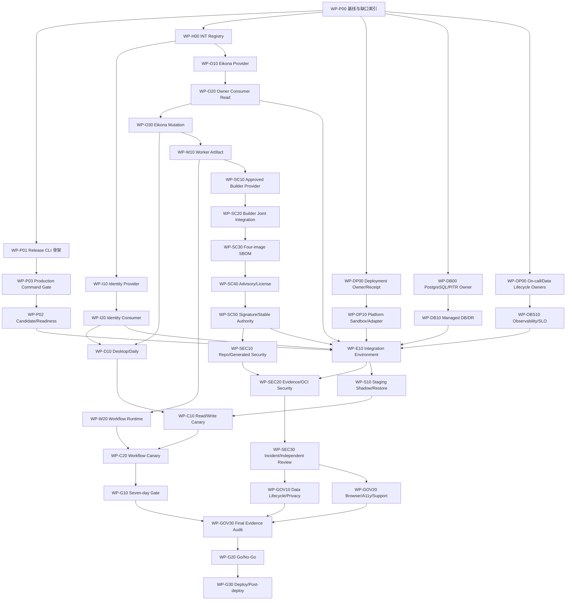

# Workbench Demo 到 Production 执行包账本

## 1. 目的

本文件把 R0-R5 的大任务拆成可独立分派、可复验、可失败回退的执行包。它不是新的状态数据库；真实进度、digest、evidence、review 与 promotion state 必须由 release CLI 或服务生成。本文件只定义人类可读的工作分解、依赖和验收合同。

执行包不以“代码已写”“页面可打开”或“fixture 测试通过”为完成。每个包必须同时满足：

1. 单一 owning change 与单一写入租约；
2. 明确的生产方、消费方和失败 owner；
3. 直接验证命令、期望结果和 failure recheck；
4. 对应 capability 的 flag、kill switch、rollback 或 fail-closed 行为；
5. integration/component/system/e2e 类验证通过 evidence runner 写入脱敏六件套；
6. Provider Ready 与 Consumer Done 分开计算，不能互相代签。

## 2. 执行包状态

release CLI 后续生成的执行包投影至少支持以下状态；Markdown checkbox 不得作为权威状态：

| 状态 | 含义 | 允许的下一步 |
| --- | --- | --- |
| `planned` | owner、scope、依赖和验收已冻结 | 可领取写入租约 |
| `blocked` | 上游合同、环境、权限或证据缺失 | 回 owning change 修复 |
| `implementing` | 单一 writer 正在修改批准路径 | 只允许同 lane 自检 |
| `candidate` | 实现完成，等待独立验证 | 冻结 diff，进入 test/review |
| `verified` | 直接命令和 evidence 通过 | 可进入下游集成 |
| `promoted` | 对应环境和 capability 已批准晋级 | 继续观察或扩大范围 |
| `rolled_back` | 已停止新风险并执行兼容回退 | 保留 receipt/run/evidence 并重新候选 |

`unknown`、证据过期、digest 不一致或只有 fixture 时必须投影为 `blocked`，不得默认 `candidate` 或 `verified`。

## 3. 总体依赖图

## 4. Wave 0：计划编译与权威缺口

### WP-P00：Requirement/Evidence 基线

- Owner：root integrator；写入租约：release CLI 的 requirement index generator；只读输入：R0-R4 OpenSpec、测试入口和现有 evidence。
- Dependencies：无。
- 输出：每条 requirement 的 owning change、代码 owner、直接测试、目标环境、evidence freshness、rollback、capability status；缺失项显式 `blocked`。
- 验收：R0、R1、Owner/R2、R3、R4 不再以 change-level 百分比代替 requirement 级证据。
- 当前基线：`release:requirements:init/record/verify-evidence` 已提供确定性source digest、stable requirement ID、revision CAS、`missing→recorded→verified`状态与Workbench test-evidence authority/freshness/bundle-digest resolver；OpenSpec/artifact/review/restore/SLO及provider authority仍属于WP-P01后续adapter。
- 验证：`task release:requirements:init ENV=integration REQUIREMENT_INDEX=temp/release/requirements-verification.json && openspec validate workbench-production-foundation-r0 --strict && openspec validate workbench-identity-tenant-access-r1-gates --strict && openspec validate workbench-owner-backend-integrations --strict && openspec validate workbench-daily-operations-r3-gates --strict && openspec validate workbench-spatial-workflow-automation-r4 --strict`。
- Failure recheck：fixture、截图、过期 run 或手写 passed 必须回到 `blocked`。

### WP-P01：Release CLI 最小闭环

- Owner：implementer；写入租约：`service/cmd/workbench-release/**`、对应 schema/tests；不得与 Taskfile writer 并行。
- Dependencies：WP-P00、R0 production output contract。
- 输出：`requirements init/record`、`handoff init/record/validate`、`manifest generate/validate`、`readiness` 本地命令；只接受 artifact/evidence/handoff refs，不接受 secret value 或 raw provider payload。
- 验收：CLI 生成 schema-versioned structured asset；digest mismatch、missing evidence、unknown capability、stale review 均非零退出。
- 当前基线：本地structured-state、file digest drift、environment/revision/CAS、Workbench test evidence authority/freshness/tamper revalidation和fail-closed已完成；unknown capability、OpenSpec/artifact/review/restore/SLO与provider authority adapter仍待实现。
- 验证：`CGO_ENABLED=0 go test ./service/cmd/workbench-release -count=1 && task release:gates:test && task release:readiness ENV=integration`。
- Failure recheck：不得解析 human output、扫描目录猜最新 evidence 或默认选择 production。

### WP-P02：Capability Candidate 与独立降级

- Owner：release engineer；写入租约：release capability/readiness service 与 tests。
- Dependencies：WP-P01、WP-H00。
- 输出：Identity、Owner、Desktop、Asset、WorkItem、Daily、Board、Workflow 独立 status/flag/kill switch/range。
- 验收：一个 Owner 或 Workflow 未就绪时只关闭相关 capability；read-only 可用不能自动打开 mutation。
- 验证：`task release:readiness ENV=integration && task release:handoff:validate ENV=integration`。
- Failure recheck：扫描共享总开关、unknown version、fixture available 与跨 capability 隐式依赖。

### WP-P03：Production Command Availability Gate

- Owner：Workbench release CLI implementer + Taskfile/docs test owner；写入租约：target registry schema/generator/validator、Taskfile薄包装和parity tests。
- Dependencies：WP-P01、R5 `0.4a`命令审计合同。
- 输出：CLI-authored production target registry，区分`available`、`diagnostic_only`、`planned`、`provider_blocked`与`deprecated`，并绑定owner task、authority、expected exit、evidence layer和source digest。
- 验收：任何工作包引用不存在target时直接blocked；diagnostic target不得供manifest/promotion/deployment提权；Taskfile、CLI help或文档漂移使旧candidate失效。
- 验证：`task production-targets:validate && task taskfile:production-contract:test && CGO_ENABLED=0 go test ./service/cmd/workbench-release -count=1`。
- Failure recheck：target名称存在即计ready、解析human output、手写状态、provider缺失却零退出或validator执行production write。
- 当前基线：registry生成/验证、Taskfile targets、JSON/Agent输出、drift与0600/O_EXCL门已完成；Evidence：`temp/integration-test-runs/20260721150833-82524d77-2116-45b2-84da-7d819c93c82e/`。当前registry因真实planned/provider-blocked targets保持`complete=false`，但WP-P03实现切片本身已verified。

### WP-H00：`INT-*` Handoff Registry

- Owner：root integrator + provider/consumer owners；写入租约：release handoff command/schema/tests。
- Dependencies：WP-P00。
- 输出：producer ref、consumer ref、contract/schema/SDK digest、auth/events/receipt、environment、evidence、rollback、failure owner。
- 验收：Provider Ready、Consumer Done、Environment Verified 三个布尔事实由不同证据支持；任一缺失保持 `needs_contract`。
- 当前基线：`handoff init/record` 已要求每个ready gate带owner/evidence/digest并使用revision CAS；独立provider/consumer身份与environment authority仍待WP-H00 provider接入。
- 验证：`task release:handoff:init ENV=integration HANDOFF_REGISTRY=temp/release/handoff-verification.json && task release:handoff:validate ENV=integration HANDOFF_REGISTRY=temp/release/handoff-verification.json`（第二条预期以blocked非零退出，直到四门证据全部签收）。
- Failure recheck：local bridge、CLI human output、consumer 复制 provider DTO 或手工 checkbox 不算 handoff。

### WP-DP00：Deployment Platform 与 Receipt 合同

- Owner：root/operations 决策 owner + deployment platform owner；写入租约：R5 design/task/spec 与后续 deployment adapter paths。
- Dependencies：WP-P00。
- 输出：批准的 runtime/platform、environment state source、versioned deployment receipt、progressive rollout/abort/rollback API、on-call 与 failure owner。
- 验收：能够区分 planned、partially_applied、deployed、failed、aborted、rolled_back；receipt 引用 artifact/manifest/approval digest，不保存 secret value。
- 验证：`task deploy:validate ENV=staging && task deploy:preflight ENV=staging && task deploy:smoke ENV=staging STRATEGY=rolling`。
- Failure recheck：平台未选定、receipt 丢失、digest/approval 过期或外部系统不可用时必须 No-Go，不能以 Taskfile success 代替真实部署事实。

### WP-DB00：Managed PostgreSQL、Backup 与 PITR Owner

- Owner：operations/database owner；写入租约：R0/R5 database、backup、restore 与 provider handoff paths。
- Dependencies：WP-P00、R0 GORM/migration baseline。
- 输出：PostgreSQL provider/profile、backup/PITR 能力、retention/encryption/key reference、RPO/RTO、fresh→N-1→N compatibility 和 restore-to-disposable 合同。
- 验收：错误 profile、过期/损坏 backup、不兼容 binary/schema、PITR target 超界全部 fail-closed；测试恢复绝不覆盖 normal/production DB。
- 验证：`task test:postgres && task db:restore:verify ENV=staging && task disaster-recovery:drill ENV=staging`。
- Failure recheck：SQLite、backup job success、未恢复的文件或无 owner 的 RPO/RTO 不算生产证据。

### WP-OP00：On-call、告警与数据生命周期 Owner

- Owner：operations + privacy/security owner；写入租约：`deploy/observability/**`、`docs/operations/**`、data lifecycle service/CLI/tests。
- Dependencies：WP-P00。
- 输出：paging backend/on-call RACI、alert→dashboard→runbook registry、版本化 data inventory/retention/export/delete/tombstone/purge/backup expiry 合同。
- 验收：每个 P0/P1 alert 有 owner、threshold、safe action、escalation 和 receipt；每类 Workbench 数据有 lifecycle owner，Owner canonical payload 仍由 Owner 自身治理。
- 验证：`task observability:validate ENV=staging && task runbook:validate && task data-lifecycle:contract`。
- Failure recheck：只有 review 文档、无可运行删除/导出/告警命令或 backup/evidence 残留 PII 时保持 blocked。

### WP-DP10：Platform Sandbox、Environment 与 Deployment Adapter

- Owner：platform/security/operations + Workbench release owners；写入租约：provider repository/inventory/manifests/adapter与consumer串行交接。
- Dependencies：WP-DP00、stable artifact/container contracts。
- 输出：实际platform/controller/version、staging sandbox、environment inventory、non-secret profiles/secret refs、四组件manifests、validate/plan/apply/lookup/pause/abort/rollback与signed receipt/trust。
- 验收：partial/unknown/wrong digest/stale approval/caller trustblocked；response loss只lookup原operation；Taskfile/Pod health/Git commit不能写deployed。
- 验证：provider capability + staging read-only validate/plan/lookup joint evidence，真实apply待stable candidate与user/root gate。
- Failure recheck：口头选平台、个人credential、无sandbox/signer/lookup/rollback或fixture adapter不算Provider Ready。

### WP-DB10：Managed PostgreSQL、Backup/PITR、Migration 与 DR

- Owner：DB/operations + Workbench DB implementer/test owners；写入租约：provider handoff、managed config、backup/restore/migration/DR evidence。
- Dependencies：WP-DB00、WP-DP10 environment inventory。
- 输出：HA/TLS/pool profile、backup/PITR/retention/encryption、provider receipts、disposable restore、fresh/N-1→N/interrupted migration与timed DR drill。
- 验收：SQLite/job green不计authority；normal/production target、wrong key/checksum/schema、cleanup failure、RPO/RTO超限和external truth gapblocked。
- 验证：`task test:postgres && task db:restore:verify ENV=staging && task disaster-recovery:drill ENV=staging`。
- Failure recheck：只证明可连接/文件存在、未测PITR/业务invariant/worker receipt/audit continuity不算DB Ready。

### WP-OBS10：Observability、Paging 与 Signed SLO Authority

- Owner：observability/operations/security + Workbench release owners；写入租约：provider/query/policy/paging/signer与consumer串行交接。
- Dependencies：WP-OP00、WP-DP10 deployment mapping、WP-DB10 RPO/RTO indicators。
- 输出：metrics/logs/traces provider、query registry、artifact→instance mapping、P0/P1 paging/on-call、signed observation receipts、managed policy/trust、24h/7d validators。
- 验收：dashboard-only/generic team/caller query/trust/raw telemetryblocked；missing/gap/stale/partial/revoked/provider outage不能投影clean。
- 验证：`task observability:validate ENV=staging && task release:slo:validate ...` + rotation/revoke/outage joint evidence。
- Failure recheck：average-only、窗口拼接、旧query/artifact窗口复用或provider outage计zero incidents不算SLO Ready。

## 5. Wave 1：Identity 与首个 Owner 对接

### WP-I10：Identity Provider Ready

- Owner：Identity Platform owner；写入租约：Identity 子项目 owning change，Workbench 只读消费。
- Dependencies：WP-H00、R1 provider contract gate。
- 输出：discovery/JWKS、session exchange、tenant/membership、switch/revoke、delegation audience、published SDK 和真实 process evidence。
- 验收：Provider 可独立启动和验证；revoke、membership version、expired delegation 与 issuer/audience mismatch 有负向测试。
- 验证：`cd ../../backend-server/identity-platform && openspec validate --all --strict && CGO_ENABLED=0 go test ./...`。
- Failure recheck：Provider 不存在或合同未发布时，Workbench managed identity 保持 `needs_contract`，不得补 local identity。

### WP-I20：Identity Consumer Done

- Owner：Workbench R1 implementer；写入租约：managed BFF session、PrincipalContext、authority event、tenant-scoped cache purge paths。
- Dependencies：WP-I10。
- 输出：opaque cookie、audience-bound PrincipalContext、two-tab authority event、tenant switch/revoke 清理与 audit。
- 验收：旧 tenant 的 query、cursor、Pane、draft 和 mutation gate 全部失效；浏览器不可读取 provider token。
- 验证：`task identity:contract:test && bun run test:e2e && bun run web:e2e`。
- Failure recheck：只验证登录 happy path、不验证 revoke/two-tab/cache purge 时不得标记 Consumer Done。

### WP-O10：Eikona Provider Ready

- Owner：Eikona owner；写入租约：Eikona 独立 OpenSpec/API/SDK；Workbench 不修改 provider tracked files。
- Dependencies：WP-H00、Owner receipt contract freeze。
- 输出：discovery/schema digest、safe projections、events/cursor、generation/review/handoff typed mutation、idempotency、receipt lookup/status/reconcile/cancel/partial child、disposable project 与 kill switch。
- 验收：真实 Eikona process 可运行 provider contract/fault tests；mutation 缺 receipt/status/reconcile 任一项即不 ready。
- 验证：`cd ../../cli/eikona && openspec validate --all --strict && CGO_ENABLED=0 go test ./internal/api/... ./sdk/go/eikona/...`。
- Failure recheck：Eikona CLI human output、私有 run directory、generic map 或 fixture success 不算 Provider Ready。

### WP-O20：Workbench Owner Read Consumer

- Owner：Workbench R2 implementer；写入租约：Owner catalog/adapter/service/repository/transport/SDK/Web read paths，按层串行合并。
- Dependencies：WP-O10、R1 Consumer Done。
- 输出：descriptor、project/resource projection、event watch/gap rebuild、diagnostics、四 transport 与 SDK/Pane 同 digest parity。
- 验收：浏览器只访问 same-origin BFF；offline、contract mismatch、permission required、cursor gap 显式 fail-closed/degraded。
- 验证：`task test:owner-contract:component && task test:owner-transport:component && bun run web:e2e`。
- Failure recheck：fixture route 注册成功不得把 capability 提升为 available。

### WP-O30：Eikona Limited Mutation Consumer

- Owner：Workbench R2 implementer + Eikona owner reviewer；写入租约：Task admission、Owner adapter mutation/receipt/reconcile 与 canary tests。
- Dependencies：WP-O20、WP-O10 mutation evidence。
- 输出：review decision、handoff prepare、generation 三个独立 operation；permission、cost、expected version、idempotency、approval、receipt/reconcile/cancel 全链路。
- 验收：lost response、unknown、partial、cancel unconfirmed 不自动重发或伪造 terminal；每个 operation 有独立 flag/kill switch。
- 验证：`task test:owner-eikona-mutation-canary && bun run test:integration`。
- Failure recheck：任一 operation 缺真实 provider receipt/fault evidence 时只保留 read capability。

## 6. Wave 2：Daily 与 Workflow 对接

### WP-D10：Desktop/Daily 闭环

- Owner：Workbench R3 implementer；写入租约：Asset/WorkItem/Daily services、SDK/BFF/Web 与 integration tests。
- Dependencies：WP-I20、WP-O20；写 mutation 场景额外依赖 WP-O30。
- 输出：Inbox → WorkItem → Task/Gate → Owner → Activity → Delivery；Layout/Pane 恢复只保存 opaque refs。
- 验收：Delivery 保留 child receipt、unknown/partial/reconcile；tenant switch/revoke 清理 Desktop state；offline 保留可救援 intent。
- 验证：`task test:daily-ops-integration OWNER=eikona && bun run web:e2e`。
- Failure recheck：浏览器 seed、localStorage canonical state、synthetic success 或 direct owner 调用阻断晋级。

### WP-W10：Worker Candidate Artifact

- Owner：Workbench R4 implementer + release engineer；写入租约：`service/cmd/workbench-worker/**`、worker runtime 与 artifact metadata generator。
- Dependencies：R4 worker lifecycle/registry/lease tasks、WP-P01、WP-P03。
- 输出：独立 `workbench-worker` binary/image、supported contract/step/schema range、registry digest、roles、health/readiness/drain/fault refs。
- 验收：不是 stub/sleep/workbenchd 复用；默认 mutation disabled；binary、metadata 和 evidence 同 digest。
- 验证：`CGO_ENABLED=0 go test ./service/... -count=1 && task test:worker-managed-bootstrap:component && task test:worker-lifecycle:component && task build:reproducibility && task release:handoff:validate COMPONENT=workbench-worker ENV=integration`。
- Failure recheck：claim 永久 disabled、dirty source、missing range 或 digest 不一致不得进入 R5。

### WP-W20：Workflow Runtime Consumer Done

- Owner：Workbench R4 implementer；写入租约：definition/run/scheduler/lease/executor/reconcile/operator paths，按 repository→service→worker→transport→Web 串行。
- Dependencies：WP-W10、WP-O30、WP-P03、R4 Board/Workflow contracts；`test:workflow-system`与`test:workflow-e2e`在target registry中为`available`前保持blocked。
- 输出：无副作用 step、Eikona mutation step、pause/resume/cancel、approval wait、lease/fence、unknown reconcile、rollback drain。
- 验收：worker crash/lease loss/response loss 不重复 dispatch；旧 worker 零 commit；rollback 不删除 run/receipt。
- 验证：`task test:workflow-system && task test:workflow-e2e OWNER=eikona`。
- Failure recheck：fixture owner、单进程 happy path 或无 crash-point evidence 不算 Consumer Done。

### WP-SC10：Approved Builder Provider Ready

- Owner：CI/platform + security/KMS + registry + R4 owners；写入租约：provider repository、managed trust/policy、registry与R4 handoff，禁止修改Workbench validator迎合provider。
- Dependencies：WP-W10、clean source candidate、`approved-builder-provider-integration-runbook.md` P0-P5。
- 输出：`build|lookup|trust-export` adapter、immutable runner/policy、Ed25519 managed trust、两个隔离signed receipts、immutable artifact refs与Provider Ready签收。
- 验收：wrong source/repository/pool/workload/tag/secret、duplicate invocation、private payload/redaction leak全部fail closed；Provider Ready由provider/security/R4直接证据支持。
- 验证：provider component/system commands + P1-P5 evidence六件套与digest verification。
- Failure recheck：local/fixture runner、repo private key、CI green或Workbench comparison不能替代Provider Ready。

### WP-SC20：Approved Builder Joint Integration

- Owner：provider + security + Workbench test/release owners；写入租约：provider sandbox、managed config与integration evidence，验证阶段冻结实现diff。
- Dependencies：WP-SC10、Workbench provenance Consumer Done。
- 输出：staging preflight、真实cross-builder comparison、Unknown reconcile、rotation overlap、revoke/replay、provider/registry/trust rollback与三方签收。
- 验收：两个distinct invocation/nonce/instance产生相同artifact digest；revoke立即No-Go；provider切换生成新receipt/comparison；失败保留原exit code与脱敏六件套。
- 验证：`task supply-chain:provenance:compare ... && task supply-chain:provenance:validate ...` + provider fault/system runs。
- Failure recheck：fixture、同receipt复制、caller trust、comparison手工提权或cache猜Ready不得解锁image/stable gates。

### WP-SC30：Four-image Inventory 与 SBOM

- Owner：approved container builder + registry + release/platform + Workbench release owners；写入租约：provider image workflow/inventory/SBOM与consumer validator串行交接。
- Dependencies：WP-SC20、authorized container plan、container builder decision。
- 输出：`api|worker|migration|web`四image manifest/config/layer/base digests、image provenance、四份image与两份base SBOM、Workbench image report。
- 验收：同candidate、digest-only、target完整、无private registry/path；wrong base/target/artifact/plan/SBOM和manual elevation全部阻断。
- 验证：provider registry inspect/SBOM system evidence + `task supply-chain:image:verify` integration evidence。
- Failure recheck：tag、本地daemon ID、combined-only SBOM、漏migration/web或fixture joint不算SC-G2。

### WP-SC40：Dependency/License/Advisory Authority

- Owner：dependency + security + independent approver；写入租约：managed scanner/policy/exception adapter与evidence。
- Dependencies：WP-SC30。
- 输出：scanner/DB/policy profile、artifact+six SBOM scan receipts、exception lifecycle与独立policy sign-off。
- 验收：覆盖Go/Bun/Web/OS/base及direct/transitive；critical/high/unknown license、scanner missing/stale/partial/timeout默认blocked；exception精确scope/owner/expiry/revocation。
- 验证：`task supply-chain:scan` integration/system + seeded advisory/license/exception negative matrix。
- Failure recheck：scanner exit 0、summary counts、free-text allowlist或approval替代scan不算SC-G3。

### WP-SC50：OCI Signature 与 Stable Authority

- Owner：security/platform + registry + Workbench release + stable manifest owners；写入租约：signer/referrer、signature consumer、stable aggregator串行。
- Dependencies：WP-SC40。
- 输出：artifact/images/inventory/SBOM/scan签名、verify receipts、rotation/revoke/replay/registry unavailable证据、CLI-authoredstable supply-chain authority。
- 验收：wrong issuer/key/subject/digest、unsigned/revoked/stale/missing referrer fail closed；diagnostic/manual elevation不被消费；compromise后完整rebuild/resign/rescan；该authority供后续独立security aggregate消费而不反向依赖它。
- 验证：real registry sign/verify system drill + `task supply-chain:verify`零退出 + stable manifest consumer/rollback evidence。
- Failure recheck：caller trust、只签tag、cache继续授权或复用旧digest/signature不算SV3-G。

### WP-SEC10：Repository/History 与 Generated-state Security

- Owner：security/dependency + Workbench release + independent finding approver；写入租约：scanner provider/receipt/decision与consumer串行交接。
- Dependencies：WP-SC50 artifact/schema authority。
- 输出：repo/history/tracked/untracked/ignored/submodule/generated scan receipts、finding decision lifecycle与SEC-A2 sign-off。
- 验收：scanner missing/stale/partial/unsupported、real secret与coverage gap blocked；输出零matched value/snippet/offset/hash/private path；decision精确scope/owner/expiry/revoke。
- 验证：seeded history/untracked/ignored/binary/generated/decision matrix + provider/consumer integration evidence。
- Failure recheck：仅`git grep`、global ignore、fixture或扫描结果回显secret不算SEC-A2。

### WP-SEC20：Candidate Evidence 与 OCI Security

- Owner：test infrastructure + release/platform + security + Workbench consumer owners；写入租约：evidence scanner、OCI scanner与joint evidence。
- Dependencies：WP-SEC10、WP-E10、four-image inventory。
- 输出：成功/失败evidence递归scan、四target config/history/every layer/merged FS receipts与SEC-A3/A4 sign-off。
- 验收：重新读取内容而非信任redaction flag；任一run/file/layer/target漏扫、超限、不可读、symlink逃逸或digest mismatch blocked。
- 验证：seeded evidence/private argument/raw payload + multi-layer delete/history/config/filesystem matrix。
- Failure recheck：只扫成功run/final filesystem/app layer或local daemon image不算SEC-A3/A4。

### WP-SEC30：Incident Closure 与 Independent Security Review

- Owner：incident/security + external reviewer/approval provider + Workbench release/stable manifest owners；写入租约：incident adapters、review receipt与stable security aggregator串行。
- Dependencies：WP-SEC20、stable supply-chain authority、真实review adapter/trust。
- 输出：compromise revoke/rotate/exposure audit/rebuild/resign/rescan/old authority revoke evidence、current independent review与CLI-authoredstable security authority。
- 验收：删除/ignore/scan clean不能替代rotation；旧candidate不能promotion；reviewer role/scope/artifact/manifest/current scans可重验且P0/P1=0。
- 验证：compromise system drill + `task release:review:validate ...` + stable security authority/manifest regression evidence。
- Failure recheck：Agent/automation自批、approval替代scan、复用旧digest/signature或过期authority不算SEC-A5。

## 7. Wave 3-5：环境、Canary 与 GA

### WP-E10：Integration Environment

- Owner：operations + test-engineer；写入租约：deploy/config、disposable environment harness；与 release CLI writer 串行修改 Taskfile。
- Dependencies：WP-P02、WP-I20、WP-O20、managed PostgreSQL profile。
- 输出：真实 PostgreSQL、Identity test realm、Eikona disposable project、telemetry 和 evidence storage；默认 mutation/worker disabled。
- 验收：managed dependency 缺失直接 blocked；不得回落 SQLite、fixture 或 local bridge。
- 验证：`task config:validate ENV=integration && task deploy:preflight ENV=integration && bun run test:integration`。
- Failure recheck：环境 URL、token、private ref 不落日志、argv、manifest 或 evidence。

### WP-S10：Staging Shadow、Restore 与 Rollback

- Owner：operations/test-engineer；写入租约：staging generated state/evidence only。
- Dependencies：WP-E10、WP-DP10、WP-DB10、WP-OBS10、immutable candidate artifact。
- 输出：projection snapshot/fence/backfill/compare、restore-to-disposable、rolling/blue-green、worker drain、24h soak 与 rollback dry-run。
- 验收：同一 artifact digest；gap/drift/restore/compatibility 任一失败即 No-Go，旧 generation 保持可读。
- 验证：`task release:soak ENV=staging DURATION=24h && task release:rollback:dry-run ENV=staging`。
- Failure recheck：重新构建的 staging artifact、未验证 backup 或只读 happy path 不得进入 canary。

### WP-C10：Read 与 Limited-write Canary

- Owner：release owner + user approval + R1/R2/R3 owners；外部真实动作仅由 root/user 执行。
- Dependencies：WP-S10、WP-D10、WP-O30。
- 输出：C1-C6 Identity bootstrap、Provider connect、shadow cutover、read-only、逐 operation write、Daily loop。
- 验收：显式 allowlist、成本上限、receipt、reconcile、kill switch；unknown/partial 立即停止扩大流量。
- 验证：`task tenant:cutover:read-canary ENV=canary DRY_RUN=1 && task tenant:cutover:write-canary ENV=canary DRY_RUN=1`，真实 action 由批准系统另生成 receipt。
- Failure recheck：多个 mutation 首次同时开启、普通用户资源自动选择或 demo fallback 立即 abort。

### WP-C20：Workflow Canary

- Owner：release owner + user approval + R4 owner；外部真实动作仅由 root/user 执行。
- Dependencies：WP-C10、WP-W20。
- 离线 diagnostic plan 只绑定 opaque authority refs/digests 并保持 `execution_authorized=false`；
  不能替代 managed executor、Provider receipt 或用户批准。公开 canary Task 固定 exit 5，
  不读取 caller plan。
- 输出：先无副作用 step，再单个 Eikona mutation；lease/crash/pause/resume/approval timeout/unknown reconcile/kill/rollback drain 演练。
- 验收：scheduler、worker、operation 分别有 flag；无 duplicate dispatch、lost receipt 或 stuck lease。
- 验证：`task tenant:cutover:workflow-canary ENV=canary DRY_RUN=1 && task test:workflow-e2e OWNER=eikona`。
- Failure recheck：rollback 删除 run、unknown 自动 retry 或 incompatible worker claim 阻断晋级。

### WP-G10：七日观察与证据冻结

- Owner：operations/test-engineer/security；写入租约：canary evidence only。
- Dependencies：WP-C20。
- 输出：连续 7 天 SLO/error budget、audit、support、backup/restore、Owner/Identity drift、incident/rollback 与 known risk freshness。
- 验收：P0/P1=0；不能缩短窗口、补写成功或混用不同 artifact digest。
- 验证：`task release:canary:report ENV=canary WINDOW=7d`。
- Failure recheck：任一 burn、revoke、reconcile、restore 或 rollback 超限生成新 candidate。

### WP-GOV10：Data Lifecycle 与 Privacy Authority

- Owner：privacy/security + Workbench domain + managed DB/backup owners；写入租约：lifecycle schema/CLI/service/tests与privacy provider/consumer串行。
- Dependencies：WP-SEC30、managed PostgreSQL/backup authority、frozen staging candidate。
- 输出：CLI-authored data inventory、lifecycle request/receipt、跨DB/projection/cache/evidence/diagnostics/backup joint evidence与independent privacy authority。
- 验收：Owner canonical payload保持外部治理；export完整，删除立即阻止普通访问，partial/unknown可reconcile，legal hold与backup expiry有受信receipt，P0/P1=0。
- 验证：`task data-lifecycle:contract && task data-lifecycle:system ENV=staging && task privacy:review ENV=staging`。
- Failure recheck：unknown owner/retention、单store清理、无限backup、误删external truth、fixture reviewer或手写approval均保持blocked。

### WP-GOV20：Browser、A11y 与 Support Diagnostics

- Owner：browser-debugger + independent UI/a11y + security/operations reviewers；写入租约：仅diagnostics实现由implementer持有，验证阶段冻结candidate。
- Dependencies：WP-SEC30、frozen staging candidate、current Identity/Owner/Daily/Workflow capability matrix。
- 输出：固定candidate/identity/tenant/viewport/locale的critical journey evidence、keyboard/screen reader/200% zoom/reduced-motion结果、session rescue/revoke/offline security结果与CLI-authored safe diagnostics bundle。
- 当前切片：D0 bounded bundle、D1a config/release snapshot、D1b0 runtime report consumer合同、D1b1a正式worker bootstrap attachment、D1b1b0 typed authority consumer与D1b1c0 R4 role DAG去环已完成；D1b1b1真实Identity/delegation Provider canary、D1b1c1-c6 scheduler/executor/outbox/reconcile/claim authority/system handoff、D1b2 Workflow digest/staging fault matrix、D1c-D1d provider/frozen aggregate、D2 recursive security matrix、D3 audit/retention/purge、D4 staging owner signoff仍为阻断项。
- 验收：critical security/a11y/support findings=0；bundle无raw endpoint/identity/resource/provider payload/stack/secret/private path且有size/file/retention/audit限制。
- 验证：`task test:e2e ENV=staging && task test:a11y ENV=staging && task diagnostics:verify ENV=staging`。
- Failure recheck：自动扫描、截图、demo session、跨candidate拼接或只信redaction flag不得成为authority。

### WP-GOV30：Final Requirement Evidence Audit

- Owner：root integrator + independent test/review owners；写入租约：release evidence audit generator/validator，其他输入只读。
- Dependencies：WP-G10、WP-GOV10、WP-GOV20、全部provider/consumer/environment/promotion authority。
- 输出：稳定排序的requirement→direct evidence index与`verified|blocked|expired|revoked|unknown`最终audit authority。
- 验收：candidate/artifact/image/manifest/policy/trust一致；六件套完整并递归脱敏；freshness/revoke/unknown/rollback/backup/kill/support均可重验；任一required非verified则No-Go。
- 验证：`task release:audit ENV=canary && openspec validate workbench-production-ga-r5 --strict`。
- Failure recheck：目录搜索、`latest`、OpenSpec artifact complete、CI green、截图或口头确认不能替代直接authority。

### WP-G20：Go/No-Go

- Owner：明确 release approvers；Agent 不自批。
- Dependencies：WP-GOV30、独立 security/privacy/operations/release approvals。
- 输出：CLI 生成的 decision record，引用同一 manifest/artifact/evidence digest、known risks/expiry、flags/kill/rollback/backup。
- 验收：批准身份、role separation与trust可验证；缺失、过期、撤销、弱证据或未签署 owner 一律 No-Go，No-Go路由blocker且不解锁deploy/archive。
- 验证：`task release:audit ENV=canary && task release:decision:validate ENV=canary`。
- Failure recheck：不得用口头确认、截图、session身份、CLI flag或 OpenSpec valid 替代直接证据与签署。

### WP-G30：Production 与 Post-deploy

- Owner：user/root production owner + operations；真实部署是外部 decision gate。
- Dependencies：WP-G20 的 Go decision。
- 输出：same-digest production action plan、明确user/root approval、批准系统deploy receipt、progressive rollout、read-only post-deploy report、SLO/audit/backup/receipt/reconcile/support/on-call handoff与closeout index。
- 验收：无current signed receipt不得声称已部署；response loss只lookup/reconcile原operation；失败触发pause/abort/rollback/incident并保留deployment truth；只有post-deploy和support handoff通过才具备archive资格。
- 验证：`task deployment:plan ENV=production DRY_RUN=1 && task deployment:receipt:validate ENV=production && task release:post-deploy ENV=production DRY_RUN=1` 加批准部署系统的真实 checks。
- Failure recheck：post-deploy不得修改真实业务数据或泄露secret/resource refs；Unknown、active incident、missing support owner或No-Go保持change active。

## 8. 后续 Owner 扩展顺序

Eikona 是首个生产 write owner。第二批 Owner 不与首租户 GA 强绑定，按以下顺序独立晋级：

1. Scaena/Auctra：先交付 safe launch/return、project binding、receipt/event；production mutation 始终走 Scaena facade。
2. Pinax/Sonora：先只读 safe projection 与 event，再按 rights/permission/snapshot 合同开放有限 mutation。
3. Ordo/Quaestor：先建立 owner 独立 OpenSpec 和可运行 service contract；未完成前仅显示 catalog/`needs_contract`。

每新增一个 Owner，必须复制 WP-O10 → WP-O20 → 可选 WP-O30 的交付模式，而不是复制 Eikona DTO 或在 Workbench 增加 generic raw connector。

## 9. 推荐前三个执行周期

### Cycle 1：让计划可计算

- 串行：WP-P00 → WP-P01 → WP-H00 → WP-P02；决策 gate WP-DP00、WP-DB00、WP-OP00 可并行准备，但必须在 integration environment 前签收。
- 并行只读：R1 Identity provider contract audit、Eikona provider contract audit、R4 worker artifact gap audit。
- Exit：`task release:readiness ENV=integration` 能诚实输出 blocked 原因和 owning change，不要求任何真实外部写。

### Cycle 2：打通生产只读面

- Provider lane：WP-I10 与 WP-O10 可并行，但各自只有一个 writer。
- Consumer lane：WP-I20 与 WP-O20 在 DTO/digest 冻结后并行，Taskfile/registry 合并由单 writer 串行。
- Exit：真实 Identity + Eikona read projection 在 integration 环境通过 four-transport/SDK/Web、revoke/gap/offline 负向 evidence。

### Cycle 3：有限写入与业务闭环

- 串行：WP-O30 → WP-D10 → WP-W10；随后WP-W20与WP-SC10可在互斥写入租约下推进，supply-chain/security lane按WP-SC10 → WP-SC20 → WP-SC30 → WP-SC40 → WP-SC50 → WP-SEC10；integration环境生成真实evidence后执行WP-SEC20 → WP-SEC30。
- 并行验证：security、test、browser、performance 只读审查稳定 diff。
- Exit：业务lost response/unknown/partial/cancel、worker crash/lease loss、builder unknown/rotation/revoke、四image completeness、scanner stale/exception revoke、signature rollback、history/evidence/layer secret与credential compromise闭环均有真实evidence；WP-SC50与WP-SEC30分别提供supply-chain/security authority，仍需其他Stable v3 gates。
