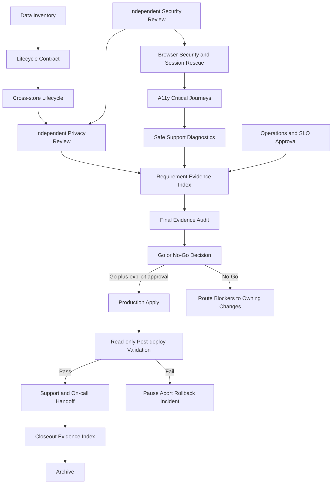

# Workbench Production 治理与 Closeout 交接合同

## 1. 目的与当前结论

本文件冻结 Demo 到 Production 最后一段治理链：数据生命周期、隐私审批、浏览器与无障碍验收、支持诊断、最终证据审计、Go/No-Go、真实部署、部署后验证和 OpenSpec 归档。

当前结论保持 **No-Go for production deployment**。原因不是缺少页面或本地测试，而是外部 owner、真实环境和独立审批尚未全部交付直接证据。Markdown 只定义合同；inventory、request、receipt、audit、decision 与 post-deploy state 必须由 CLI、应用服务或批准 provider 生成。

## 2. 权威依赖图



任何上游 authority 过期、撤销、digest 漂移或证据缺失都必须重新计算下游结果。No-Go 是有效终态，但不是完成归档生产交付的依据；它必须保持 change active 并把缺口路由回 owning change。

## 3. 数据分类与责任边界

| 数据类别 | 权威 Owner | Workbench 行为 | 生命周期要求 |
| --- | --- | --- | --- |
| task metadata、attempt、event index | Workbench | 最小化存储和租户隔离 | retention、export、tombstone、async purge、legal hold |
| safe refs、receipt refs、artifact digests | Workbench + provider | 只保存不可逆或不含 payload 的引用 | 与外部 truth 保持可核验，删除不伪造 provider 状态 |
| layout、recent items、projection、cache | Workbench | 派生数据，可重建 | 删除后不可授权读取，按 generation 清理并验证无旧索引 |
| evidence、logs、diagnostics | Workbench test/operations | 只保存脱敏证据 | 有界 retention、递归重扫、失败证据同样清理 |
| backup、PITR restore points | managed DB owner | Workbench 只消费 receipt | expiry、legal hold、disposable restore、provider-owned deletion evidence |
| Owner canonical payload | 对应 Owner provider | Workbench 不复制、不代删 | 只发起批准合同允许的请求，Owner receipt 保持外部权威 |

Owner canonical payload 不属于 Workbench 删除权威。Workbench tenant/workspace 删除只清理自身数据和派生物；若产品合同要求联动 Owner 删除，必须由对应 Owner change 定义独立权限、幂等、receipt、lookup/reconcile 和失败 owner。

## 4. 生命周期状态机

```text
active
  -> export_requested -> export_ready | export_failed
  -> deletion_requested -> tombstoned
  -> projection_purged -> cache_purged
  -> evidence_diagnostics_expired
  -> backup_expiry_pending -> completed

任意阶段 -> legal_hold（阻止 purge/expiry，但不恢复普通访问）
任意不确定 provider 响应 -> unknown -> lookup/reconcile 原 operation
```

删除必须先阻止普通授权访问，再异步清理各存储。Partial purge、unknown 和 cleanup failure 不能标记 `completed`。Legal hold 必须记录批准身份、scope、reason code、开始时间、expiry/review 时间和解除 receipt；不得用 free-text 或永久布尔值无限延长。

## 5. CLI/服务生成合同

后续实现至少提供以下版本化资产；名称可在实现设计中细化，但语义不得合并为一个手写报告：

- `workbench.data_inventory.v1alpha1`：数据类别、owner、store、classification、retention、export/delete、legal hold、backup policy。
- `workbench.lifecycle_request.v1alpha1`：tenant/workspace、operation、scope、idempotency ref、requester authority。
- `workbench.lifecycle_receipt.v1alpha1`：每个 store 的状态、source revision、purge/expiry evidence refs、unknown/reconcile 状态。
- `workbench.privacy_review_authority.v1alpha1`：candidate、inventory digest、lifecycle evidence、reviewer trust、findings、expiry/revocation。
- `workbench.support_diagnostics_bundle.v1alpha1`：版本、artifact/profile、safe capability/source type、opaque refs、rescue commands、redaction/size/retention receipt。
- `workbench.release_evidence_audit.v1alpha1`：requirement 到直接 authority/evidence digest 的索引、freshness、environment、owner、rollback 和 blocker。
- `workbench.release_decision.v1alpha1`：Go/No-Go、批准身份、candidate/manifest digest、依赖 authority、known risk、expiry、生产动作边界。
- `workbench.post_deploy_report.v1alpha1`：deployment receipt、只读检查、SLO/audit/backup/flag/reconcile 结果、incident/rollback 和 support handoff。

所有合同必须支持 canonical digest、版本兼容、unknown field 拒绝策略、freshness、revocation 和错误环境/租户/candidate 负测。

## 6. 浏览器、无障碍与支持验收矩阵

关键旅程至少覆盖登录与恢复、租户切换、Owner 连接、只读搜索/预览、limited write receipt 跟踪、Daily loop、Workflow pause/resume/cancel、revoke/offline 和错误恢复。每条关键旅程必须固定 candidate、identity、tenant、viewport、locale 与 capability flags，不能用不同夹具拼接通过。

无障碍门禁至少验证：

- 全键盘操作、可见 focus、合理 tab order、modal/focus trap 和 escape 行为；
- screen reader 的名称、角色、状态、错误、进度、动态区域和确认信息；
- 200% zoom、窄 viewport、长文本和中英文 locale 不丢操作；
- reduced motion 下无强制平滑滚动、闪烁或依赖动画传达唯一状态；
- session rescue、tenant switch、revoke、offline/online 不泄漏前一身份或租户内容。

支持诊断 bundle 只能包含 safe version、artifact/profile digest、capability 状态、provider source type、opaque receipt refs、时间窗口、redacted error code 和可直接执行的 rescue commands。不得包含 raw endpoint、identity claims、resource title/content、provider payload、stack memory、Authorization、token、cookie、secret、私有路径或完整命令参数。Bundle 必须有大小、文件数、retention、下载审计和递归 redaction 上限。

## 7. 最终证据审计

最终审计必须按 requirement ID 读取直接 authority 和 evidence digest，禁止依赖目录搜索、`latest`、测试名、截图、口头确认或 OpenSpec artifact complete。每项至少验证：

1. owning change、provider、consumer、environment 和 failure owner；
2. candidate/artifact/image/manifest/policy/trust digest 一致；
3. evidence 六件套完整，命令真实，失败 exit code 保留，内容递归脱敏；
4. freshness、expiry、revocation、rotation 和 unknown/reconcile 已处理；
5. rollback、kill switch、backup/restore 和 support handoff 可执行；
6. fixture-only、manual elevation、weak evidence 和 missing provider 均投影为 blocker。

审计输出必须稳定排序并区分 `verified`、`blocked`、`expired`、`revoked`、`unknown`。任一 required requirement 非 `verified` 时，Go/No-Go 输入只能为 No-Go。

## 8. Go/No-Go、部署与归档

Go/No-Go 必须由受信批准身份签署，且 security、privacy、operations、release 四类责任不能由 Agent 自批。Decision 绑定 candidate、stable manifest、SLO window、findings、known risks、flags、kill switches、rollback、backup 和 production action plan；任一依赖变更后原 decision 失效。

真实 production apply 必须位于外部批准 deployment system，并在 user/root 明确授权后执行。调用响应丢失时使用原 idempotency key 或 operation ref lookup/reconcile，不得重发第二次 apply。只有通过 trust 验证的 deployed receipt 才能把状态推进到 Production。

Post-deploy 默认只读，验证 readiness、关键 smoke、SLO、audit、backup、flags、receipts 和 reconcile。失败必须 pause/abort/rollback 或开启 incident，并保留原 deployment truth。支持与 on-call handoff 完成后才能生成 closeout evidence index。

只有所有 required requirement 有当前直接证据、真实 deployed receipt、post-deploy pass 和 support handoff 时才能归档生产交付。No-Go、未部署、unknown deploy、post-deploy failure 或 blocker 未关闭时，change 保持 active。

## 9. Evidence 与原子工作包

所有 lifecycle、privacy、browser/a11y、diagnostics、audit、decision 和 post-deploy 的 integration/component/system/e2e 入口必须复用现有 evidence runner，写入 `temp/integration-test-runs/<run-id>/` 六件套；成功与失败都执行相同 redaction 和 artifact 限制。

| Work Package | Owner | Entry | Exit |
| --- | --- | --- | --- |
| `WP-GOV10` Data Lifecycle/Privacy | privacy/security + domain + DB owners | managed store inventory、6.1 security candidate | lifecycle system evidence + independent privacy authority |
| `WP-GOV20` Browser/A11y/Support | browser-debugger + UI/a11y + operations | frozen staging candidate、current security authority | critical journey/a11y/security pass + safe diagnostics authority |
| `WP-GOV30` Final Evidence Audit | root integrator + independent test/review owners | all provider/consumer/environment authorities | generated requirement audit with zero required blocker |
| `WP-G20` Go/No-Go | explicit release approvers | `WP-GOV10/20/30`、SLO、rollback、backup | current signed decision; Go or routed No-Go |
| `WP-G30` Deploy/Post-deploy/Closeout | user/root production + platform + operations | Go + explicit production approval | deployed receipt + read-only validation + support handoff + archive eligibility |

## 10. 失败路由

- 数据 owner、retention 或 legal hold 不明：回 `WP-GOV10`，不得进入 privacy review。
- 浏览器安全、关键 a11y 或诊断泄漏：回 owning UI/session/diagnostics change，冻结 candidate。
- evidence 缺失、过期、撤销、digest drift 或 redaction failure：回直接 evidence owner，重新生成 candidate authority。
- Go/No-Go approver/trust/decision 过期：保持 No-Go，重新审批，Agent 不补签。
- deployment receipt unknown/missing：保持 Deploying/Unknown，只 lookup/reconcile。
- post-deploy failure：执行 pause/abort/rollback/incident，不归档。
