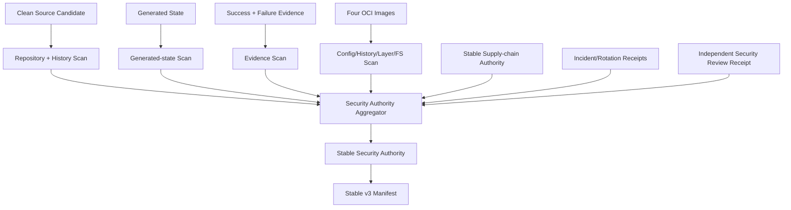

# Production Security Authority 对接与事故闭环计划

## 1. 目的与当前结论

本文细化 `3.4b5b-3.4b5d`。目标不是“跑一次secret scanner”，而是建立能证明当前source、generated state、candidate evidence和四目标OCI image均未携带敏感数据，并在真实命中后完成revoke、rotate、rebuild、resign、rescan与独立安全签收的 production security authority。

当前事实：

- exact release artifact disclosure diagnostic authority已完成；
- evidence runner已具备基础path/token/Authorization/private argument脱敏和六件套；
- 当前环境没有Gitleaks、TruffleHog、detect-secrets或Trivy；
- repository/history、ignored/untracked candidate input、generated metadata、成功/失败evidence、OCI config/history/layers/filesystem均无真实provider authority；
- 独立review receipt consumer已存在，但真实approval provider/trust尚未上线；
- 因此 `SEC-A2-A5` 均未完成，Stable v3继续 No-Go。

本文冻结安全边界、provider/consumer合同、事故状态机与任务，不在Workbench仓库保存scanner credential、secret命中值、private key、raw payload或审批provider credential。

## 2. Security Authority 数据流



Production security authority只有在所有扫描面完整、当前、同candidate、零blocking finding或有精确未过期decision，并且真实命中已完成事故闭环时才能成立。

## 3. 威胁模型与扫描面

### 3.1 Repository 与 History

必须覆盖：

- 当前verified commit、全部tracked files与submodule refs；
- 会影响candidate的untracked/ignored inputs、generated code/config、local build overrides；
- Bun/Go locks、workflow、Dockerfile、Taskfile、scripts、fixtures、docs与skills；
- 当前release branch、reachable tags和批准history window中的新增/删除secret；
- `.gitignore`、`.dockerignore`、scanner ignore policy本身与任何allow decision。

只运行 `git grep` 不足以覆盖已删除历史、untracked/ignored candidate input、binary和generated metadata。History命中不得输出secret diff；receipt只记录safe rule、commit ref、path alias、count和exposure window。

### 3.2 Generated State

必须覆盖所有由CLI/provider/service生成并可能进入release/promotion/registry/evidence的asset：

- release manifest、promotion/container plan；
- artifact/image/base SBOM；
- provenance、comparison、inventory、scan/signature receipts；
- stable supply-chain/security authority；
- migration/restore/SLO/review/deployment receipts；
- static Web assets、source maps、generated schemas和SDK bundles。

Structured asset合法包含字段名 `token|secret|Authorization|private_key` 时不能仅按词面阻断；必须检测真实值、private path、raw provider payload、credential-bearing URL/DSN与禁止文件。

### 3.3 Candidate Evidence

必须扫描成功和失败run的：

- `summary.json`、`command.txt`、`stdout.log`、`stderr.log`、`env.json`；
- `artifacts/**`；
- test reports、screenshots、trace、profile、manifest、diagnostic exports；
- provider component/system、Workbench integration/system、rotation/revoke/rollback evidence。

扫描器不得只扫描成功evidence或只验证runner宣称 `redaction.enabled=true`。必须重新读取文件内容；任一文件不可读、超出批准大小/数量、缺失、symlink逃逸或未扫描都阻断。

### 3.4 OCI Image

四个target必须覆盖：

- manifest/index/config JSON；
- config env、labels、annotations、history与created_by；
- 每个compressed/uncompressed layer内容；
- merged final filesystem；
- source、cache、`node_modules`、local DB、test evidence、`.git`、source map、credential、private path与禁止文件；
- base image layers与Workbench新增layers的归属。

只扫描最终filesystem会漏掉后续层删除的secret；只扫描history/config会漏文件内容。四target与base/layer必须绑定当前image inventory、artifact和stable supply-chain digest。

## 4. Scanner Provider 与 Policy 合同

### 4.1 Provider 决策

Security owner必须批准：

- repository/history scanner与版本；
- filesystem/binary/generated-state scanner；
- OCI config/history/layer scanner；
- rule DB来源、digest、更新时间、最大freshness；
- custom high-confidence rules与false-positive policy；
- history depth/tag/branch范围；
- size/count/time limits与partial/timeout映射；
- credential/network需求、redaction、retention和failure owner。

当前没有批准scanner。Tool missing、rule DB stale、partial、timeout、unsupported file或coverage unknown都必须fail closed，不能投影为zero findings。

### 4.2 Scan receipt

Provider生成的公开合同建议为：

```text
workbench.security_scan_receipt.v1alpha1
```

Receipt至少包含：

- scope：`repository|history|generated_state|evidence|oci_config|oci_history|oci_layer|oci_filesystem`；
- environment、candidate/source/artifact/image/evidence bundle digests；
- scanner/version、rule DB/policy digest与freshness；
- scanned/skipped/error file/layer counts；
- finding code、safe relative path/alias、occurrence count、severity与decision ref；
- coverage、status、generated/expiry、opaque provider/evidence refs；
- signature/trust refs。

Receipt禁止包含matched value、snippet、line content、offset、secret hash、entropy sample、private absolute path、credential-bearing URL、raw scanner payload或用户资源ID。Scanner内部可以使用secret fingerprint做provider-side去重，但不得输出给Workbench或evidence。

### 4.3 False-positive decision

允许决定必须由独立security owner通过approved adapter生成：

```text
workbench.security_finding_decision.v1alpha1
```

必须绑定rule ID、safe path/alias、candidate/artifact/image/evidence digest、reason code、owner、approver role、issued/expiry、remediation/reevaluation date和signature。不得绑定或回显secret value；不得用全局ignore、无expiry allowlist或free-text扩大scope。

## 5. Incident、Rotation 与 Rebuild 状态机

真实secret或credential material命中后状态固定为：

```text
detected
  -> quarantined
  -> credential_revoked
  -> credential_rotated
  -> exposure_audited
  -> source_scrubbed_or_replaced
  -> artifact_rebuilt
  -> images_rebuilt
  -> sbom_rescanned
  -> signatures_reissued
  -> old_authority_revoked
  -> independent_reviewed
  -> closed
```

每一步必须有直接receipt/evidence。删除文件、清空日志、添加ignore或scanner返回clean都不能跳过revoke/rotate/exposure audit。若命中为private path/source map而非credential，可以按policy跳过credential rotation，但必须有typed finding classification和独立decision；不能由scanner caller自行判断。

### 5.1 Incident receipt

建议合同：

```text
workbench.security_incident_receipt.v1alpha1
```

Receipt只记录incident ID、finding codes、affected candidate/artifact/image/evidence digests、credential provider/type alias、revocation/rotation/exposure audit refs、新source/artifact/image/signature digests、old authority revoke refs、status/times与approval refs。禁止保存credential、secret hash、raw provider/KMS/audit payload。

### 5.2 Authority invalidation

命中后立即使以下对象No-Go：

- 当前artifact security report；
- 受影响artifact/image/SBOM/scan/signature authority；
- stable supply-chain authority；
- release manifest/promotion/container plan；
- 尚未完成或正在运行的deployment/canary candidate。

新candidate必须使用新source commit、artifact/image digest、SBOM、scan/signature receipt和review approval。旧authority保留审计但不可重新promotion。

## 6. Independent Security Review

独立reviewer必须读取当前：

- source/artifact/image/stable supply-chain digests；
- repository/history/generated/evidence/OCI scan receipts；
- finding decisions与最早expiry；
- incident/rotation/rebuild/resign/rescan receipts；
- tenant/auth/token/cookie/CSRF/SSRF/operator/workflow/data-loss/backup相关review evidence；
- stable candidate manifest与rollback refs。

Review必须通过已批准external approval adapter生成signed receipt，并由managed trust bundle验证。Security reviewer不能与release deploy approver由同一automation identity代签；Agent、模型、unknown reviewer、fixture key、截图或聊天记录均不算批准。

Review receipt consumer可以复用现有 `workbench.review_approval.v1alpha1` 与 `workbench.review_decision.v1alpha2`，但scope必须精确为当前security candidate/artifact/manifest，role必须包含批准的security reviewer，findings必须P0/P1=0，known risks必须有owner与expiry。

## 7. Stable Security Authority

Workbench release CLI后续生成：

```text
workbench.stable_security_authority.v1alpha1
```

必须绑定：

- environment、capability、candidate/source/artifact digest；
- stable supply-chain authority digest；
- repository/history/generated/evidence/四image OCI scan receipt digests；
- rule DB/policy/trust digests与freshness；
- finding decision refs、最早expiry与remaining counts；
- incident/revoke/rotate/rebuild/resign/rescan receipt digests；
- independent security review decision/approval/trust digests；
- rollback、retention、generated/expiry与blockers。

只有所有scan scope完整且current、P0/P1=0、真实credential命中已闭环、decision/review有效时才能 `status=verified`。该authority由stable v3 manifest消费；不得扫描目录猜latest、接受caller digest或修改diagnostic报告提权。

## 8. 原子交付任务

### SEC2-0：Scanner/Policy Decision

- Owner：security/dependency + release/platform decision owners。
- Dependencies：artifact diagnostic baseline。
- 输出：repo/history/generated/evidence/OCI scanner profiles、rule DB/policy、limits、trust、failure owner。
- 验收：所有scope都有owner和工具；missing/stale/partial/timeout/unsupported默认blocked。
- 验证：approval receipt + scanner/rule DB freshness canary。
- Failure recheck：当前无scanner却标Ready、只选择一个无法覆盖全部scope的工具。

### SEC2-1：Repository/History Scanner Adapter

- Owner：security implementer。
- Dependencies：SEC2-0。
- 输出：verified commit/submodule、tracked/untracked/ignored candidate input与history scan receipt。
- 验收：real secret、private key/token/DSN、ignored influence、history exposure window可检测且零matched value输出。
- 验证：seeded add/delete/history/untracked/ignored/binary matrix。
- Failure recheck：仅`git grep`、打印diff/snippet、忽略submodule/history。

### SEC2-2：Generated-state Scanner

- Owner：security + Workbench release implementer。
- Dependencies：SEC2-1、stable supply-chain schemas冻结。
- 输出：manifest/SBOM/provenance/receipt/schema/static bundle scan receipt。
- 验收：真实credential/private path/raw payload/source map阻断，合法字段名不误报。
- 验证：generated asset positive/negative matrix + component evidence。
- Failure recheck：关键词扫描、只扫JSON、不扫binary/static bundle。

### SEC2-3：Finding Decision Lifecycle

- Owner：independent security approver + provider implementer。
- Dependencies：SEC2-1。
- 输出：issue/validate/expire/revoke finding decision与managed trust。
- 验收：scope/digest/path/rule/owner/expiry精确，caller/global ignore/free-text expansion阻断。
- 验证：decision lifecycle + wrong scope/approver/revoke/replay evidence。
- Failure recheck：`.gitleaksignore`无owner/expiry、截图或聊天确认。

### SEC2-4：Repository Security Joint

- Owner：provider + Workbench security consumer test owners。
- Dependencies：SEC2-1-SEC2-3。
- 输出：真实clean candidate的repo/history/generated scan与SEC-A2签收。
- 验收：provider receipt与consumer重验一致，所有skip/error有显式blocker。
- 验证：integration/system evidence六件套。
- Failure recheck：fixture、只扫working tree、provider/consumer互相代签。

### SEC3-0：Evidence Scanner

- Owner：test infrastructure + security implementer。
- Dependencies：SEC2-4、evidence runner contract。
- 输出：成功/失败六件套与artifacts递归scan receipt、size/count/symlink/readability coverage。
- 验收：重新扫描内容而非信任redaction flag；失败run、private arguments、raw payload与unreadable文件阻断。
- 验证：seeded stdout/stderr/env/command/artifact/symlink/oversize matrix。
- Failure recheck：只扫成功run、只看summary、扫描器输出secret。

### SEC3-1：OCI Config/History/Layer Scanner

- Owner：release/platform + security implementer。
- Dependencies：four-image inventory/SBOM authority。
- 输出：四target config/history/every-layer/merged filesystem scan receipts。
- 验收：删除层中的secret、ENV/label/history leak、source/cache/local DB/evidence/source map均可检测，base与app layer归属明确。
- 验证：seeded multi-layer/history/config/filesystem system matrix。
- Failure recheck：只扫final filesystem、只扫app layer、依赖local daemon identity。

### SEC3-2：Candidate Evidence/Image Joint

- Owner：provider + Workbench test/security owners。
- Dependencies：SEC3-0/SEC3-1、current artifact/image digest。
- 输出：同candidate evidence和四image完整scan bundle与SEC-A3/A4签收。
- 验收：任一target/run/file/layer漏扫、超限、不可读、digest mismatch立即blocked。
- 验证：`task security:candidate:verify` integration/system evidence。
- Failure recheck：只扫artifact或image、漏失败evidence、fixture image。

### SEC4-0：Incident Authority Adapter

- Owner：incident/security platform implementer。
- Dependencies：SEC2/SEC3 receipt schemas、credential provider owners。
- 输出：typed incident state、revoke/rotate/exposure audit/source scrub/rebuild/resign/rescan receipt adapters。
- 验收：每个状态有provider-owned direct evidence，secret/raw audit/KMS payload不进入Workbench。
- 验证：adapter component + missing/out-of-order/tamper/replay matrix。
- Failure recheck：caller字符串宣称rotated、删除命中即closed。

### SEC4-1：Compromise Drill

- Owner：incident + security + release/platform owners。
- Dependencies：SEC4-0、stable supply-chain authority。
- 输出：seeded credential命中后的完整revoke→rotate→new source/artifact/images/SBOM/scans/signatures→old authority revoke evidence。
- 验收：旧candidate立即No-Go且不能promotion，新candidate所有digest变化并重新验证。
- 验证：compromise system drill + replay/rollback evidence。
- Failure recheck：复用旧digest/signature、只修改scanner allowlist、未审计exposure window。

### SEC4-2：External Security Approval

- Owner：independent security reviewer + approval provider/Identity/approved integration owners。
- Dependencies：SEC2-4、SEC3-2、SEC4-1、真实review adapter/trust。
- 输出：current candidate security review receipt/decision、P0/P1=0、known risks owner/expiry。
- 验收：reviewer identity/role/scope/artifact/manifest/findings/trust可重验，automation/Agent/fixture/unknown reviewer阻断。
- 验证：provider adapter integration + `task release:review:validate ...`。
- Failure recheck：approval替代scan、同一automation identity代签security/release。

### SEC4-3：Stable Security Aggregator

- Owner：Workbench release implementer + security/release owners。
- Dependencies：SEC4-2、stable supply-chain authority。
- 输出：CLI generate/validate `workbench.stable_security_authority.v1alpha1`。
- 验收：所有scan/decision/incident/review direct evidence current且digest一致，manual elevation/stale/revoked/missing scope阻断。
- 验证：positive candidate + tamper/missing/stale/revoke/replay/manual elevation matrix。
- Failure recheck：扫描目录猜latest、只看aggregate counts、旧review覆盖新artifact。

### SEC4-4：Stable v3 Handoff

- Owner：security + stable manifest owners。
- Dependencies：SEC4-3。
- 输出：stable security authority ref/digest、rollback/expiry/failure owner handoff。
- 验收：manifest消费当前authority并在expiry/revoke/digest变化后失效；security authority不自报deployed。
- 验证：stable manifest consumer + authority revoke/expiry regression evidence。
- Failure recheck：把review截图写manifest、authority过期仍promotion。

## 9. Taskfile 命令合同

后续实现至少提供：

```bash
task security:repository:scan ENV=staging ...
task security:generated:scan ENV=staging ...
task security:evidence:scan ENV=staging ...
task security:image:scan ENV=staging ...
task security:candidate:verify ENV=staging ...
task security:incident:validate ENV=staging ...
task security:authority:generate ENV=staging ...
task security:authority:validate ENV=staging ...
```

命令必须经过 `production:guard`；scanner/provider secrets通过approved secret references注入，不进入argv/log/evidence。Machine output只含safe code/path alias/count/digest/ref；integration/component/system entry point写脱敏六件套并保留原exit code。

## 10. 失败矩阵

| 场景 | 预期 |
| --- | --- |
| scanner missing/stale/partial/timeout/unsupported | blocked |
| tracked/untracked/ignored/history/submodule任一未覆盖 | blocked |
| evidence只扫描成功run或信任redaction flag | blocked |
| OCI只扫final filesystem、漏config/history/layer/target | blocked |
| finding输出matched value/snippet/offset/hash/private path | evidence gate blocked |
| global ignore、decision无owner/expiry或scope错误 | blocked |
| real credential命中后未revoke/rotate/exposure audit | blocked |
| rebuild复用旧source/artifact/image/signature digest | blocked |
| old authority未撤销仍可promotion | blocked |
| independent approval缺失、untrusted、revoked或wrong candidate | blocked |
| Agent/automation identity自批release | blocked |
| stable security authority手工提权或扫描目录猜latest | blocked |

## 11. Evidence 与隐私

所有scanner、decision、incident、review、aggregator和rollback entry point写所属项目的 `temp/integration-test-runs/<run-id>/` 六件套。允许公开：safe finding code、relative path/alias、count、policy/rule DB/digest、signed receipts、opaque refs和状态时间。

禁止：matched value、snippet、offset、secret hash、entropy sample、credential/KMS/audit payload、private absolute path、Authorization、provider raw payload、用户资源ID、raw prompts、private tool arguments与full chain-of-thought。Security evidence本身也必须进入SEC3-0扫描，不能因为是“安全报告”而跳过。

## 12. 待批准决策

- repository/history scanner与history window；
- generated/binary/static scanner与custom rule owner；
- evidence size/count/symlink/retention policy；
- OCI config/history/layer scanner与registry access profile；
- rule DB source、freshness与scanner trust；
- finding decision provider、scope和最大expiry；
- credential provider revoke/rotate adapters与exposure audit owner；
- independent security reviewer pool、role separation和approval provider；
- stable security authority TTL、rollback和incident on-call。
