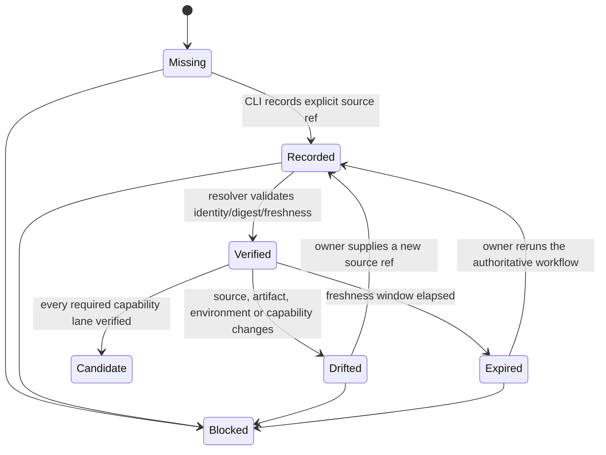
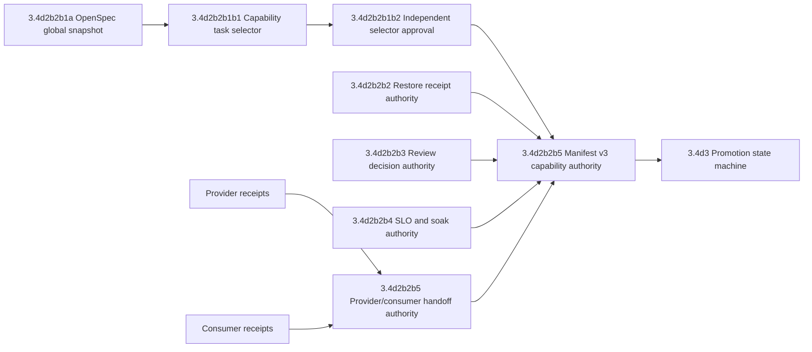

# Release Authority Source 生产交付计划

## 1. 问题与目标用户

Workbench demo 已能运行本地 Web/API、生成可复现制品、记录测试 evidence，并生成 fail-closed release manifest；但 production release owner 仍无法回答“这条结论由哪个真实系统证明、是否仍然新鲜、是否与当前 artifact/environment/capability 完全一致”。当前缺口集中在 OpenSpec task/status、restore、review、SLO/soak 和 provider/consumer handoff 五类权威来源。

目标用户是 release owner、operations、security reviewer、provider owner 与 consumer owner。首个可交付目标不是自动部署，而是让他们使用同一 CLI 得到可审计的 `candidate|blocked` 结论，并能沿 evidence ref 定位到真实 owner 和失败重检命令。

## 2. 最小可发布范围

首个 production tenant 只覆盖 Eikona first-support 主链及其所需 R0/R1/R3/R4 基础。Authority adapters 必须支持 capability-scoped 状态；未纳入首租户的 Owner 保持 `disabled|needs_contract`，不能阻塞 Eikona 首发，也不能被表述为全 Owner GA。

本计划不自动执行 production deploy、DNS、secret rotation、外部 mutation、approval 或 provider repository 写入。Release CLI 只读取显式来源、验证 digest/freshness/identity/environment/capability，并生成或校验本地 structured assets。

## 3. 权威来源矩阵

| Source | Authority owner | Workbench input | 必须绑定 | Freshness | 失败状态 |
| --- | --- | --- | --- | --- | --- |
| OpenSpec task/status | owning change | `openspec status --change <id> --json`、`openspec list --changes --sort name --json`、strict validate | change id、task counts/status、OpenSpec version、proposal/design/tasks/specs digest | 当前生成时重扫，默认24h内snapshot | `source_drift`或`delivery_blocked` |
| Restore verification | Workbench R0/R5 operations | CLI-authored restore receipt + integration evidence bundle | environment、backup manifest digest、artifact checksum、schema、RTO、run id | staging 24h、canary 7d内按策略 | `restore_unverified` |
| Review decision | security/release/architecture approvers | CLI-authored review decision | reviewer identity ref、scope、artifact/manifest digest、findings、expiry | 必须未过期且无 P0/P1 | `review_blocked` |
| SLO/soak | operations/observability | CLI-authored SLO report + evidence bundle | environment、artifact digest、window、SLI、budget、incident refs | staging 24h、canary 7d | `slo_blocked` |
| Provider Ready | provider repository owner | provider release/handoff receipt | provider identity、contract/schema/SDK digest、capability/version | 当前候选版本 | `provider_unready` |
| Consumer Done | Workbench capability owner | consumer conformance receipt | route/service/repository/transport/SDK/UI digest、provider digest | 当前候选版本 | `consumer_incomplete` |
| Integration/Rollback | joint provider+consumer test owner | component/system/e2e evidence | environment、artifact/provider/consumer digest、fault branch、rollback | staging/canary窗口内 | `integration_blocked` |

所有 source ref 必须显式传入；禁止扫描“latest”目录、按mtime猜测、只验证文件存在、解析human stdout、复用另一个environment或artifact的通过结论。

## 4. 状态与数据流



Manifest generation和validation都必须重新运行resolver。`verified`不是可手写布尔值；它是某个resolver对显式source ref、当前artifact digest和environment执行后的派生状态。

## 5. 原子交付 DAG



### 5.1 Lane A：OpenSpec status authority

- Owner：Workbench release implementer。
- 输入：显式changes root与indexed change ids；批准的OpenSpec机器输出。
- 验收：task completion、spec requirement identity、artifact digest三者独立校验；`artifact complete`不得替代task完成。
- 验证：`task release:openspec:validate ENV=integration`。

`3.4d2b2b1a`已完成`workbench.openspec_status.v1`私有snapshot、官方JSON normalization、strict validation、全artifact digest、freshness/source drift重验、sources gate和`workbench.release_manifest.v3alpha2` optional binding。无OpenSpec输入继续保持原v2/v3alpha1严格形状；有OpenSpec authority时必须使用v3alpha2，valid snapshot中的blocker会直接进入manifest并禁止candidate。

当前canonical R0-R5真实快照为：

```text
temp/release/openspec-status-20260721052500.json
```

OpenSpec版本为`1.6.0`。六个change均为`artifact_complete=true`、`strict_valid=true`，但task状态分别为R3 `6/51`、R1 `0/26`、R2 `0/33`、R0 `0/16`、R5 `10/71`、R4 `55/116`，因此generate和validate均按设计返回`openspec_delivery_blocked`。R0已从`no-tasks`迁移为16项machine checklist。这是一条直接No-Go证据，不是工具失败。对应component evidence为：

```text
temp/integration-test-runs/20260721051224-45e4436e-a552-4f95-a5e3-73ca66dc58ee/
```

`3.4d2b2b1b1`已新增`workbench.openspec_selector.v1alpha1`、`workbench.openspec_capability_status.v1alpha1`、官方`instructions apply --json`逐任务resolver、R0 16项machine task index、22-task Eikona first-support seed，以及`workbench.release_manifest.v3alpha3` capability binding。Global snapshot继续作为全平台closeout视图；capability snapshot只回答首租户candidate前置实现是否完成。详细选择、排除项、后续WP-E10→WP-G30对接波次与兼容回滚见`details/eikona-first-support-openspec-selector.md`。

当前直接capability证据为：

```text
temp/release/eikona-first-support-selector-20260721052500.json
temp/release/eikona-first-support-status-20260721052500.json
```

两者均为0600，22个task key全部可从OpenSpec `1.6.0`机器输出唯一解析，当前`0/22` ready并按设计返回`openspec_capability_blocked`。这消除了“全change未归档是否误阻塞首租户”的歧义，但不构成selector批准；`3.4d2b2b1b2`仍要求release/provider/consumer/operations/security独立签收。

### 5.2 Lane B：Restore receipt authority

- Owner：R0 backup/restore owner + R5 release owner。
- 输入：`workbench-restore-verify`生成的`workbench.restore_verification.v1` receipt和对应integration evidence run。
- Receipt最小字段：`environment`、`profile`、`format`、`schema_version`、`backup_manifest_digest`、`backup_artifact_digest`、`backup_size_bytes`、`verified_at`、`duration_ms`。
- 验收：receipt由CLI新建、0600、拒绝覆盖；resolver重验schema/digest/environment/freshness并绑定evidence bundle；production/canary不得消费local-profile receipt。
- 验证：`task db:restore:verify:release ENV=staging BACKUP_PATH=... RESTORE_RECEIPT=...`与`task release:restore:validate ENV=staging RESTORE_RECEIPT=... RESTORE_EVIDENCE_REF=evidence:integration:<run-id>`。

当前 `3.4d2b2b2a` 已完成receipt schema、私有新文件写入、evidence runner受限structured artifact收集、receipt+bundle resolver、JSON/agent projection和`workbench.release_manifest.v3alpha1` restore binding；无restore输入仍生成并读取原始v2，避免旧strict parser遭遇同版本未知字段。直接local/integration smoke证据为：

```text
temp/integration-test-runs/20260721035632-cff9ed43-2c5d-4c61-ad9f-69e1e41f1bb9/
```

该证据只能证明SQLite/integration authority链正确，不能替代managed PostgreSQL staging restore、业务行级invariant、RPO/PITR、cross-version compatibility和cleanup evidence；这些属于`3.4d2b2b2b`。

Release adapter、manifest optional binding、负向测试和AI-native输出的component证据为：

```text
temp/integration-test-runs/20260721041316-09186673-8f04-4fe1-a7d2-94b351044c8c/
```

### 5.3 Lane C：Review decision authority

- Owner：security/release/architecture approvers；Agent不得作为approver。
- 输入：CLI-authored `workbench.review_decision.v1alpha1|v1alpha2`、外部adapter签发的`workbench.review_approval.v1alpha1`和managed public-key `workbench.review_trust_bundle.v1alpha1`。
- 验收：每条finding具有severity、owner、status和evidence；P0/P1 open时blocked；decision绑定artifact/manifest digest和expiry；reviewer identity来自批准系统adapter。
- 验证：`task release:review:validate ENV=staging REVIEW_DECISION=<decision> RELEASE_MANIFEST=<v3alpha3-candidate>`。

`3.4d2b2b3a`已实现本地authority合同：`review init`只接受当前`workbench.release_manifest.v3alpha3` candidate并创建0600 pending decision；`review finding-record`和`review decide`均使用expected revision与原子替换；`review validate`重新hash manifest并校验artifact digest、environment、expiry、terminal decision与finding状态。仅`identity:`/`person:` reviewer、`security|release|architecture|operations` role和`approval:`/`ticket:` receipt ref进入结构验证；Agent/model/automation/unknown prefix、P0/P1 open、过期、未来decision time、manifest drift和unknown field均fail closed。

`3.4d2b2b3b1`进一步实现provider-neutral签名consumer：receipt使用Ed25519绑定issuer、receipt/key id、subject、role、scope、environment、manifest/artifact digest、decision、issued/expires和nonce；trust bundle只含public key、role/scope allowlist、key有效期与revocation。为防止调用者自建key+bundle自批，CLI不接受trust digest flag，只从managed deployment config `WORKBENCH_REVIEW_TRUST_BUNDLE_DIGEST`读取SHA-256锚点并要求与bundle文件一致。原`review decide`保留为诊断alpha1，但production `review validate`明确返回`review_adapter_required`；只有`review decide-from-receipt`验签成功后才升级为`workbench.review_decision.v1alpha2`。

Workbench不选择或嵌入Feishu/Gitea SDK。`3.4d2b2b3b2`由Identity/approved integration/security/release owners选择首个真实provider adapter并负责私钥、provider credential、role mapping、rotation/revocation和staging receipt。父任务在真实receipt和fault evidence出现前继续未完成。

### 5.4 Lane D：SLO/soak authority

- Owner：operations/observability。
- 输入：诊断兼容的`workbench.slo_report.v1alpha1`/`workbench.slo_policy.v1alpha1`，以及production-authoritative additive `workbench.slo_report.v1alpha2`、`workbench.slo_policy.v1alpha2`、签名`workbench.slo_observation_receipt.v1alpha1`、managed `workbench.slo_trust_bundle.v1alpha1`与`evidence:system:<run-id>`；report必须位于该run的`artifacts/slo-report.json`。
- Trust anchor：Workbench只从managed config读取`WORKBENCH_SLO_POLICY_DIGEST`和`WORKBENCH_SLO_TRUST_BUNDLE_DIGEST`，CLI参数不得覆盖；collection command与required indicator由pinned policy给出，report不能自行声明验证命令或省略不利指标。
- 多指标：policy按排序稳定ID声明API、mutation outcome、search、Pane、SSE、projection/revoke freshness、workflow queue/reconcile、backup RPO、restore RTO等required indicator；每项冻结metric kind、unit、objective、threshold、min samples，report提供同ID观测值与source/query digest。
- 连续窗口：report记录expected/observed/missing seconds、coverage basis points、segment count和max gap；禁止只用start/end声称完整、拼接失败窗口、artifact变化后继续累计或导出整段raw telemetry到evidence。
- 来源认证：observation receipt使用Ed25519绑定issuer/key、environment/capability/artifact、report/policy/source/query digest、window、issued/expires和nonce；只有managed trust中的active key可签，revoked/expired/unknown key或receipt重放均blocked。
- 验收：禁止平均值替代tail；request/error/availability使用整数basis points并相互一致；required indicator全集、window coverage、artifact/environment/capability、incident与error-budget均可重验；staging少于24h、canary/production少于7d均blocked。
- 当前本地交付：`release:slo:validate`与`workbench.release_manifest.v3alpha5`基础consumer已完成；`3.4d2b2b4a1`负责在真实adapter前升级为签名、多指标、连续窗口合同。它只证明合同与fail-closed resolver，不代表真实24h/7d窗口已经采集。
- 后续对接：observability owner提供真实query adapter、managed policy distribution、dashboard/alert/runbook和system evidence；Workbench不嵌入具体metrics/logs/traces provider SDK。
- 验证：`task release:slo:validate ENV=staging CAPABILITY=eikona-first-support ARTIFACT_DIGEST=sha256:<digest> SLO_REPORT=<system-run>/artifacts/slo-report.json SLO_POLICY=<managed-policy> SLO_EVIDENCE_REF=evidence:system:<run-id>`和`task release:canary:report ENV=canary WINDOW=7d`。

### 5.5 Lane E：Provider/consumer handoff authority

- Owner：provider owner、Workbench consumer owner和joint test owner分别独立签发。
- 输入：provider receipt、consumer receipt、integration evidence、rollback evidence。
- 验收：consumer不能代签provider；四门必须来自允许的owner role；contract/schema/SDK/capability/version digest一致；Eikona之外capability可保持disabled但不得伪装ready。
- 验证：`task release:handoff:authority:validate ENV=integration HANDOFF_REGISTRY=...`。

## 6. Manifest 演进

当前`workbench.release_manifest.v2`继续可读取和校验其已有OpenSpec requirement/evidence/artifact authority，但不能晋级production。扩展阶段采用expand-then-contract：

1. 先为restore/review/SLO/handoff authority增加独立`validate`命令和receipt schema；restore、review consumer与SLO consumer boundary已完成，review真实provider、observability真实采集与handoff authority仍待接入；
2. 当前使用`v3alpha1`承载restore authority，`v3alpha2`承载global OpenSpec authority，`v3alpha3`承载capability-scoped OpenSpec authority，`v3alpha4`承载对一个已审核alpha3 candidate的签名review attestation，unstable `v3alpha5`承载对当前review-attested alpha4的pinned、signed multi-SLI attestation；alpha4/alpha5都重新构建当前inputs并要求前一candidate完全一致，因此不存在manifest审核自身或SLO绑定自身的循环摘要；
3. review/SLO/handoff字段和selector approval冻结后再发布稳定v3，保留v2-v3alpha5 validator用于诊断和迁移；
4. 稳定v3 candidate要求首租户required capability matrix全部verified；
5. v2/alpha输入在promotion命令中明确返回`manifest_upgrade_required`；
6. rollback只恢复旧版本诊断读取，不恢复用旧版本执行promotion的能力。

## 7. Evidence 与测试要求

每条integration/component/system/e2e命令写入`temp/integration-test-runs/<run-id>/`六件套，environment必须显式。Authority adapter测试至少覆盖：

- valid、missing、malformed、unknown schema；
- wrong environment/artifact/capability/version；
- stale、future timestamp、window不足；
- file tamper、digest mismatch、symlink/root escape、oversize；
- receipt存在但evidence失败；
- evidence通过但receipt被替换；
- provider/consumer同一owner伪签；
- P0/P1 finding、budget exhausted、restore RTO超限；
- machine output parse、默认summary、agent/json/explain脱敏。

## 8. 生产晋级前置条件

Demo正式进入production候选前必须同时满足：clean完整artifact、managed Identity、Eikona first-support provider/consumer/integration/rollback、managed PostgreSQL migration与restore、24h staging soak、7d canary、P0/P1为零、approved review/decision、支持和on-call handoff。任一缺失时manifest保持blocked；不得通过手写JSON、缩短窗口、fixture、截图或人工确认绕过。

## 9. 风险与待决策

- Provider receipt的签名/身份来源需由各provider repo选择；Workbench只消费批准adapter，不保存credential。
- OpenSpec机器输出若无稳定JSON合同，先由repository-owned CLI生成版本化snapshot，禁止解析human table。
- Restore RPO/RTO策略需区分staging、canary和production；首版可冻结保守阈值，但不能省略measurement。
- Manifest v3属于稳定合同升级，必须保留v2诊断窗口、迁移命令和rollback说明。
