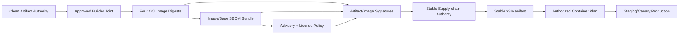

# Stable Supply-chain Authority 对接与交付计划

## 1. 目的与当前结论

本文细化 `3.4b4c-3.4b4e`，把 approved builder joint evidence 之后的四目标 image SBOM、dependency/license/advisory policy、artifact/image signature 与 stable supply-chain authority 拆成可独立交付、可复验、可撤销的 provider/consumer/joint 工作包。

当前事实：

- artifact SBOM diagnostic authority 已完成；
- artifact disclosure diagnostic authority 已完成；
- builder provenance Consumer Done 已完成，但 Provider Ready/Joint 尚未完成；
- `Dockerfile` 已冻结 `api|worker|migration|web` 四个 target 和两个 pinned base digest；
- 当前环境只有 Syft、Skopeo、ORAS；没有 container engine、Grype/Trivy、Cosign 或批准 signer；
- 因此 image digest、image/base SBOM、advisory/license pass、OCI signature 与 stable supply-chain authority都未成立，Stable v3继续 No-Go。

本文只冻结合同和执行任务，不选择未经批准的 scanner、registry 或 signer，也不把本地工具存在当 production provider authority。

## 2. Authority 链与生产边界



Stable supply-chain authority必须同时证明：

1. source→artifact→four images 是同一 candidate；
2. 四个 image 与两个 base 都以 immutable digest标识；
3. 每个 target 的 image/base SBOM 可重验且绑定OCI descriptor/layers；
4. Go、Bun/Web、OS/base dependency与license/advisory coverage完整；
5. scanner DB、policy、exception、trust均有managed digest和freshness；
6. artifact、images、SBOM、scan receipts已由批准identity签名；
7. revocation、replay、registry unavailable与rollback均fail closed；
8. Workbench stable aggregator只消费公开receipt/digest，不持有registry/scanner/signer credential。

Stable authority不能替代 repository/evidence/image-layer secret scan、independent security approval、SLO/soak、restore、deployment receipt或post-deploy verification。Security authority在 `3.4b5d` 消费已经完成的 stable supply-chain authority；`3.4b4e` 不反向依赖 `3.4b5d`。

## 3. 四目标 Image Inventory 合同

### 3.1 固定 target matrix

| Target | Runtime artifact | Base authority | Required checks |
| --- | --- | --- | --- |
| `api` | `bin/workbenchd` | `GO_RUNTIME_IMAGE` pinned digest | non-root、ports 8787/8788、ready/drain、artifact→layer绑定 |
| `worker` | `bin/workbench-worker` | `GO_RUNTIME_IMAGE` pinned digest | non-root、port 8789、claim/drain、artifact→layer绑定 |
| `migration` | `bin/workbench-migrate` | `GO_RUNTIME_IMAGE` pinned digest | non-root、one-shot exit、schema contract、artifact→layer绑定 |
| `web` | `bin/workbench-web` + `web/**` | `WEB_RUNTIME_IMAGE` pinned digest | non-root、port 4173、static tree digest、artifact→layers绑定 |

四个 target 必须来自同一 authorized container plan、artifact digest、source candidate、builder policy与joint evidence。漏任一 target、混入另一 candidate 或只检查 tag 都必须阻断。

### 3.2 Provider-owned image inventory

批准 container builder/registry adapter 必须生成版本化公开 inventory，首版合同名称建议：

```text
workbench.image_inventory.v1alpha1
```

每个 target 至少包含：

- target ID；
- image manifest/index digest；
- image config digest；
- ordered layer digests；
- immutable registry repository ref，不含 credential/query；
- base image repository与manifest digest；
- authorized container plan digest；
- artifact report/tree digest；
- builder comparison和joint evidence digest；
- Dockerfile、`.dockerignore` 与build parameters digest；
- platform/architecture；
- build invocation/receipt refs；
- created time与retention policy ref。

Inventory必须由 provider adapter/registry service生成，不得由 Agent 手写。Registry tag只能作为展示信息，不能参与authority equality或promotion。

### 3.3 Image build provenance

每个 target必须有独立 image build receipt或批准的 OCI provenance attestation，绑定 source、artifact、container plan、builder identity、base digest、build args、target和输出image digest。Provider可以使用标准 in-toto/DSSE/SLSA attestation，但 Workbench只消费批准 profile的safe projection和digest，不解析 raw CI payload。

## 4. Image/Base SBOM 合同

### 4.1 生成范围

每个 target必须生成 image SBOM；两个 distinct base digest必须分别生成 base SBOM。SBOM默认使用 CycloneDX 1.6，与artifact baseline保持格式一致，但 source identity改为OCI digest，不得保存host path、registry credential或private pull URL。

```text
api image SBOM
worker image SBOM
migration image SBOM
web image SBOM
Go runtime base SBOM
Web runtime base SBOM
```

如果三个Go target的base digest完全相同，可以复用同一base SBOM digest，但每个target authority仍必须显式引用该base SBOM，不能省略coverage。

### 4.2 Workbench image supply-chain report

Workbench release consumer后续生成：

```text
workbench.image_supply_chain_report.v1alpha1
```

报告必须绑定：

- image inventory digest；
- 四个target完整性与target→artifact mapping；
- image/base SBOM digests、format/version、component counts；
- image manifest/config/layer/base digests；
- builder joint evidence、artifact SBOM/report与container plan digest；
- package ecosystem coverage；
- missing/mismatch/private-path/unsupported-format blockers；
- 固定 `status=diagnostic|blocked` 和 `production_authorized=false`，直到 stable aggregator消费后续policy/signature receipts。

CLI flags不得用caller-provided image/base digest绕过provider inventory；所有expected digest来自inventory、managed policy或稳定上游authority。

## 5. Dependency、License 与 Advisory Policy

### 5.1 Scanner profile 决策

Dependency/security owner必须批准 scanner profile，包括：

- scanner名称与版本；
- vulnerability DB来源、digest、更新时间和最大freshness；
- 支持的OS/Go/npm/Bun package ecosystem；
- severity normalization；
- license expression parser与unknown处理；
- network/credential需求；
- exit/error/partial状态映射；
- evidence retention、redaction和failure owner。

当前环境没有Grype/Trivy，不能在本地把scanner缺失解释为pass。首个provider可以选择单一scanner，但必须覆盖所有六份SBOM；如果一个scanner不能覆盖license或某ecosystem，应增加窄adapter，而不是把缺口标为clean。

### 5.2 Managed policy

首版managed policy至少冻结：

- `critical` 与 `high` 默认阻断；
- fix available与no-fix分别记录，但不自动降低severity；
- unknown severity与unparseable advisory默认阻断；
- unknown/unlicensed/invalid SPDX expression默认阻断；
- direct/transitive、OS/language/base package全覆盖；
- scanner DB stale/unavailable、partial result、timeout默认阻断；
- accepted risk必须通过独立exception receipt，不允许CLI flag跳过；
- policy、scanner、DB、exception trust均以managed digest锚定。

### 5.3 Scan receipt

Scanner adapter必须生成公开receipt，首版合同名称建议：

```text
workbench.supply_chain_scan_receipt.v1alpha1
```

Receipt至少包含artifact/image/SBOM target digest、scanner/version、DB digest/freshness、policy digest、coverage counts、severity/license summary、exception receipt digests、status、generated/expiry times、opaque evidence ref和signature/trust refs。禁止包含package私有下载URL、registry credential、raw scanner payload或host path。

### 5.4 Exception receipt

每个license/advisory exception必须由独立approval provider生成：

```text
workbench.supply_chain_exception_receipt.v1alpha1
```

必须绑定 package identity/version/digest、advisory或license表达式、target/image/SBOM digest、reason code、risk owner、approver role、ticket/approval digest、issued/expiry、replacement/remediation deadline与signature。Free text不能扩大scope；过期、wrong target/version、unknown approver或被撤销时立即阻断。

## 6. Signature 与 Trust 合同

### 6.1 签名对象

至少签名以下对象：

1. release artifact bundle digest；
2. `api|worker|migration|web` 四个image digest；
3. image inventory；
4. artifact/image/base SBOM digests；
5. advisory/license scan receipt bundle；
6. stable supply-chain authority本身。

不能只签tag、workflow run、manifest path或summary JSON。所有签名验证必须最终绑定immutable content digest。

### 6.2 Signing profile 决策

Security/platform owner必须选择并批准：

- OCI signature/attestation format；
- key-backed或受约束keyless identity；
- issuer/key/subject/audience/repository/workflow/environment allowlist；
- registry referrer/attestation存储与retention；
- trust bundle distribution与managed digest；
- rotation、revocation、transparency/rekor要求（如适用）；
- offline/registry unavailable与emergency rollback行为。

Builder receipt v1alpha1 的 Ed25519约束不自动决定OCI签名profile。OCI signing必须单独批准，且不能因使用Cosign等工具就默认信任任意issuer/subject。

### 6.3 Verify receipt

Signature verifier必须生成safe、versioned receipt，绑定subject digest、signature/attestation digest、issuer/key/subject、trust/policy digest、verified time、freshness/revocation状态和opaque registry ref。Unknown issuer/key/subject、wrong digest、revoked/stale signature、missing referrer或registry unreadable全部fail closed。

## 7. Stable Supply-chain Authority

Workbench release CLI后续生成：

```text
workbench.stable_supply_chain_authority.v1alpha1
```

该asset必须由CLI生成和重验，不能由Agent手写或从diagnostic v1alpha1 report改字段提权。至少包含：

- environment/capability/candidate/source/artifact digest；
- approved builder Provider Ready + Joint evidence digests；
- authorized container plan和四目标image inventory digest；
- artifact/image/base SBOM bundle digests；
- dependency/license/advisory policy、DB与scan receipt digests；
- exception receipt列表与最早expiry；
- artifact/image/SBOM/scan signature verify receipt digests；
- freshness、revocation、retention与rollback refs；
- status、blockers、generated_at、expires_at。

只有全部direct evidence存在、fresh、digest一致且无阻断finding时，authority才能为 `status=verified`。它仍不等于production deployed；Stable v3 manifest、promotion、container build/smoke、deployment和SLO gates必须独立消费并签收。

## 8. 原子交付任务

### SC2-0：Image Provider Decision

- Owner：release/platform + registry + security decision owners。
- Dependencies：approved builder Joint Done、container platform decision。
- 输出：container engine/builder、registry、inventory/provenance format、SBOM tool/profile、retention与failure owner。
- 验收：四目标和两个base均可按digest pull/inspect；本地daemon ID与tag不计authority。
- 验证：provider decision receipt + registry digest pull canary。
- Failure recheck：工具安装成功、Dockerfile lint或单target build不算完成。

### SC2-1：Four-image Inventory

- Owner：approved container builder + registry implementer。
- Dependencies：SC2-0、authorized container plan。
- 输出：四个image digest、config/layers/base、provider-generated inventory与image build provenance。
- 验收：target完整、同candidate、digest-only、wrong base/target/artifact/plan全部阻断。
- 验证：provider component/system + registry inspect evidence。
- Failure recheck：mutable tag、漏migration/web、另一candidate image、手写inventory。

### SC2-2：Image/Base SBOM Bundle

- Owner：release/platform implementer。
- Dependencies：SC2-1。
- 输出：四份image SBOM、两份base SBOM与digests。
- 验收：CycloneDX 1.6、OCI digest identity、无private path/credential、每target显式base coverage。
- 验证：real registry pull/scan + schema/path/tamper negative matrix。
- Failure recheck：只扫artifact目录、只生成一个combined SBOM、tag source identity。

### SC2-3：Workbench Image Consumer

- Owner：Workbench release implementer/test owner。
- Dependencies：SC2-1/SC2-2 schema冻结。
- 输出：strict image inventory/SBOM validator和CLI-authoredimage report。
- 验收：unknown field、missing target、wrong image/base/layer/artifact/plan/SBOM、manual elevation全部阻断。
- 验证：unit/race/component evidence；真实provider输入在joint阶段验证。
- Failure recheck：caller digest覆盖、fixture计SC-G2、输出registry private ref。

### SC2-4：Image Joint Sign-off

- Owner：provider + Workbench test owners。
- Dependencies：SC2-1-SC2-3。
- 输出：真实四目标comparison/validation evidence与SC-G2 sign-off。
- 验收：provider inventory与Workbench重算完全一致，失败保留六件套。
- 验证：`task supply-chain:image:verify` integration evidence。
- Failure recheck：provider/consumer互相代签、单target fixture、只验证SBOM schema。

### SC3-0：Scanner/Policy Decision

- Owner：dependency/security decision owners。
- Dependencies：SC2-4。
- 输出：scanner/version、DB source/freshness、severity/license policy、exception provider/trust与failure owner。
- 验收：覆盖Go/Bun/Web/OS/base，scanner unavailable/stale/partial默认blocked。
- 验证：policy approval receipt + scanner DB digest/freshness canary。
- Failure recheck：本地无scanner却标Ready、只扫direct dependency。

### SC3-1：Scanner Adapter 与 Receipt

- Owner：dependency/security implementer。
- Dependencies：SC3-0。
- 输出：scan adapter、strict receipt、DB/policy/trust binding与redaction。
- 验收：timeout/error/partial/stale、wrong SBOM/target、raw payload/private path leak全部阻断。
- 验证：unit/component + seeded advisory/license negative matrix。
- Failure recheck：scanner exit 0直接当policy pass、只解析human output。

### SC3-2：Full Dependency/License Scan

- Owner：dependency/security test owner。
- Dependencies：SC3-1、SC2-4。
- 输出：artifact + six SBOM scan receipts、coverage summary。
- 验收：critical/high/unknown license为零，或每项有scope精确且未过期的exception。
- 验证：`task supply-chain:scan` integration/system evidence。
- Failure recheck：漏base/OS/transitive package、stale DB、同receipt复用于另一digest。

### SC3-3：Exception Lifecycle Drill

- Owner：independent security/release approver + dependency owner。
- Dependencies：SC3-1。
- 输出：issue/validate/expire/revoke exception receipts与remediation owner。
- 验收：wrong package/version/target、expired/revoked/unknown approver立即blocked。
- 验证：exception issue→validate→expiry/revoke replay evidence。
- Failure recheck：free-text allowlist、无expiry/owner、CLI flag skip。

### SC3-4：Policy Authority Sign-off

- Owner：dependency + security owners独立签收。
- Dependencies：SC3-2/SC3-3。
- 输出：SC-G3 evidence refs、policy/DB/scan/exception digests与最早expiry。
- 验收：所有coverage和exception可重验，scanner failure owner明确。
- 验证：policy authority validation + evidence digest check。
- Failure recheck：只看summary counts、approval替代scan。

### SC4-0：OCI Signing Decision

- Owner：security/platform + registry decision owners。
- Dependencies：SC2-4、SC3-4。
- 输出：signature/attestation profile、identity constraints、trust distribution、referrer retention、rotation/revoke/rollback owner。
- 验收：subject最终绑定immutable digest，caller不能自建trust或宽泛issuer/subject。
- 验证：decision/approval receipt + sign/verify canary。
- Failure recheck：因为Cosign存在即默认信任、只签tag。

### SC4-1：Sign Artifact/Image/SBOM/Scan Bundle

- Owner：security signer + registry owner。
- Dependencies：SC4-0。
- 输出：artifact、四images、inventory、SBOM、scan receipts签名/attestations。
- 验收：对象完整、digest精确、registry referrer可读、无credential/raw signer payload。
- 验证：provider sign/publish/lookup system evidence。
- Failure recheck：漏任一image/SBOM/scan、签summary path、local key。

### SC4-2：Signature Consumer 与 Revocation Drill

- Owner：Workbench release implementer + security/test owners。
- Dependencies：SC4-1 schema/trust冻结。
- 输出：strict verifier、verify receipts、rotation/revoke/replay/registry unavailable evidence。
- 验收：wrong issuer/key/subject/digest、revoked/stale/unsigned、missing referrer全部blocked。
- 验证：unit/race + real registry integration/system drill。
- Failure recheck：cache继续通过、warning-only、fixture计SC-G4。

### SC4-3：Stable Aggregator

- Owner：Workbench release implementer。
- Dependencies：SC2-4、SC3-4、SC4-2。
- 输出：CLI generate/validate `workbench.stable_supply_chain_authority.v1alpha1`。
- 验收：所有上游direct evidence、digest、freshness、revocation、exceptions一致；diagnostic asset或人工字段不能提权。
- 验证：positive stable fixture + tamper/missing/stale/revoked/manual elevation matrix。
- Failure recheck：扫描目录猜最新、alpha report改版本、只验证聚合counts。

### SC4-4：Stable Joint Publish 与 Rollback

- Owner：security/platform + Workbench release + stable manifest owners。
- Dependencies：SC4-3。
- 输出：真实stable authority、stable v3 consumer evidence、rollback/rebuild/resign/rescan run。
- 验收：旧artifact/image/signature被撤销后不能promotion；新candidate完整重建authority；failure evidence保留。
- 验证：`task supply-chain:verify`零退出 + stable manifest consumer + compromise/rollback system evidence。
- Failure recheck：复用旧digest/signature、删除finding代替rotation、stable manifest忽略authority expiry。

## 9. Taskfile 命令合同

后续实现至少提供：

```bash
task supply-chain:image:generate ENV=staging ...
task supply-chain:image:plan ENV=staging ...
task supply-chain:image:verify ENV=staging ...
task supply-chain:scan ENV=staging ...
task supply-chain:signature:verify ENV=staging ...
task supply-chain:authority:generate ENV=staging ...
task supply-chain:verify ENV=staging ...
```

所有生产命令必须经过 `production:guard`，machine output遵循统一AI-native CLI envelope；integration/component/system entry point写脱敏六件套。生成命令只创建CLI/service-owned结构化资产，validator必须重新读取provider inputs并重算digest，不能信任报告中自报状态。

## 10. 失败矩阵

| 场景 | 预期 |
| --- | --- |
| 任一target缺失或来自不同candidate | blocked |
| image/base使用tag而非digest | blocked |
| image config/layer/base与inventory不一致 | blocked |
| SBOM缺失、格式错误、含private path/credential | blocked |
| scanner缺失、timeout、partial、DB stale | blocked |
| critical/high或unknown license无有效exception | blocked |
| exception wrong scope、expired、revoked、unknown approver | blocked |
| unsigned或wrong issuer/key/subject/digest | blocked |
| registry referrer不可读或signature revoked/stale | blocked |
| diagnostic report被改为verified | blocked |
| 旧artifact在compromise/revoke后继续promotion | blocked并要求rebuild/resign/rescan |

## 11. Evidence 与隐私

Provider build/inspect/SBOM/scan/sign/lookup、Workbench validate/aggregate、rotation/revoke/rollback均通过各owning project evidence runner写：

```text
temp/integration-test-runs/<run-id>/
├── summary.json
├── command.txt
├── stdout.log
├── stderr.log
├── env.json
└── artifacts/
```

允许公开artifact：OCI digest inventory、SBOM、safe scan/signature receipts、policy/trust digests、stable authority和opaque refs。禁止registry credential、Authorization、private pull URL、KMS request/response、private key、raw scanner/provider payload、host/runner path、secret env、private tool arguments、raw prompts和full chain-of-thought。

## 12. 待批准决策

- 首个container engine/builder与registry profile；
- image inventory/provenance标准与provider adapter owner；
- image/base SBOM生成工具版本与OCI referrer存储；
- advisory/license scanner、DB source、freshness与severity normalization；
- license policy、exception authority与最大expiry；
- OCI signature profile、identity constraints、trust/rotation/revoke机制；
- registry retention、garbage collection与referrer recovery；
- stable authority TTL、security approval与compromise rollback owner。
