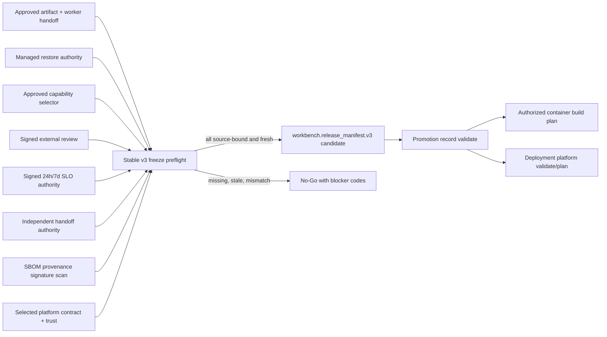

# Stable v3 Freeze Readiness Matrix

## 1. 结论

`workbench.release_manifest.v3` 当前不得冻结。现有 `v3alpha5` 已验证 restore、capability snapshot、signed review 与 signed multi-SLI SLO 的消费合同，但 production 所需的真实 authority 尚未收敛：完整 worker/approved builder、managed restore、独立 selector approval、真实 approval provider、连续 staging/canary SLO、独立 handoff、supply-chain 证明以及已批准 deployment platform contract 均未完成。

本矩阵是 stable v3 的唯一冻结前置清单。它不创建 production authority，不允许通过手工 checkbox、fixture、截图、聊天确认或本地自签数据关闭条目。

## 2. 用户与待替代状态

目标用户是 release owner、security、operations、platform owner、R4 worker owner、Identity/approved integration owner、observability owner 与 on-call。

当前状态由多个 alpha manifest、Taskfile 目标和本地测试组成，能够证明消费端实现正确，但不能证明 provider 已上线或生产条件真实存在。Stable v3 必须替代这种“实现已存在但 authority 未收敛”的模糊状态，形成一个可重验、可审计、可回滚且只接受真实来源的候选合同。

## 3. 冻结数据流

`Deployment platform validate/plan`只是只读 preflight。真实 `apply/lookup` 与 deployed truth 仍属于 `3.3b`，不得写入 stable candidate 生成流程。

## 4. Authority Readiness Matrix

| ID | Authority | Provider / Owner | Stable v3 必需绑定 | 验证入口 | 当前状态 | 当前 blocker |
| --- | --- | --- | --- | --- | --- | --- |
| SV3-A | Artifact + immutable worker | R4 worker owner、release engineer、approved builder | clean source commit/digest、完整artifact tree、worker contract/schema/step range、builder identity/provenance | `task build:reproducibility`、`task release:artifact:validate ...` | partial | source dirty、worker已bootstrap-attached但authority/role/claim未完成、无approved builder digest |
| SV3-B | Managed restore / RPO / RTO | DB/operations owner | managed PostgreSQL backup manifest、restore receipt、schema version、RPO/RTO、fresh integration evidence | `task db:restore:verify ENV=staging` | blocked | managed migration、pg_dump/pg_restore与restore receipt baseline已存在；RT-DB0/DB1任务已冻结，但provider/HA/PITR/retention/encryption、disposable managed restore、compatibility与timed DR尚未批准/执行 |
| SV3-C | Capability selector approval | release/architecture approver | selector digest、capability snapshot digest、独立approval receipt/trust、task source digest | `task release:openspec:capability:validate ...` 加 selector approval adapter | partial | capability snapshot consumer已实现，独立selector approval未上线 |
| SV3-D | External review approval | security/release/architecture + Identity/approved integration | decision/receipt/issuer/key/role/scope、reviewed manifest/artifact digest、expiry/revocation | `task release:review:validate ...` | partial | signed receipt consumer已实现，真实provider adapter与trust distribution未上线 |
| SV3-E | SLO / soak authority | observability/on-call/operations | v1alpha2 report、policy、signed observation receipt、required indicators、24h staging、7d canary、coverage/gap/query digest | `task release:slo:validate ...` | partial | consumer与负测已实现；RT-OBS0/OBS1、5.1a-d、5.3a-d和7.4a-c已冻结，但真实provider/query/paging/trust、24h baseline/final staging与连续7-day canary尚未运行 |
| SV3-F | Provider / consumer handoff | 各R0-R5 provider/consumer owner | 独立provider、consumer、joint integration、rollback owner receipt与contract/schema/SDK digest | `task release:handoff:authority:validate ENV=staging` | blocked | 当前registry可追踪但缺独立签名authority与真实owner签收 |
| SV3-G | Supply chain | release/security/dependency owner | SBOM、provenance、artifact signature、base image digest、license/advisory、secret/source/layer scan同artifact绑定 | `task supply-chain:verify`、`task security:artifact-scan` | partial | artifact SBOM、artifact disclosure与builder provenance Consumer Done已完成；Provider、SC2-SC4和SEC2-SEC4执行任务已冻结但尚未批准/执行，当前本地bare remote不适用于托管builder且无container engine/advisory/secret/OCI scanner或signer；真实Provider Ready/joint、四image/base SBOM、policy/signature、repo/history/generated/evidence/layer scan、compromise闭环与独立security approval仍未完成 |
| SV3-H | Deployment contract | root/operations/platform/security | 实际platform ID/version、adapter contract、registry、KMS signer、trust digest、staging `validate/plan` evidence、lookup/Unknown能力 | platform-owned `validate`、`plan`、`trust-export` | blocked | 只有Kubernetes+GitOps技术推荐；RT-PD0-PD4与2.0b2a-d已冻结，但实际platform/controller/owner/repository/environment inventory/sandbox/signer/lookup/rollback均未批准 |
| SV3-I | Stable schema freeze | Workbench release + architecture/security | A-H authority aggregate、canonical digest、required/optional字段、version window、alpha migration、rollback | stable schema golden + compatibility + promotion/container preflight | blocked | 依赖SV3-A至SV3-H全部完成 |

任何一项为 `partial` 或 `blocked` 时，stable v3 preflight 必须返回 No-Go。不同 authority 不得由同一个 caller 字符串代签，也不得把本地 fixture consumer test 当成 provider readiness。

## 5. Stable v3 字段冻结候选

以下字段集合只是冻结候选，不是已经发布的 schema：

- 顶层：`spec_version`、`environment`、`revision`、`artifact_digest`、`status`、`blockers`；
- 已有 authority：`artifact`、`restore`、`openspec_capability`、`review`、`slo`、`requirements`；
- 新增 required authority：`handoff_authority`、`supply_chain`、`deployment_contract`；
- `handoff_authority` 必须记录 provider/consumer/joint/rollback 独立签收摘要，不得只保留聚合计数；
- `supply_chain` 必须绑定 SBOM/provenance/signature/scan policy 与 artifact digest；
- `deployment_contract` 只绑定 platform/adapter/trust/validate-plan evidence，不记录尚未发生的 deployed 状态；
- production approval 与 deployment receipt 不属于 candidate manifest；它们在 `ProductionReady -> Deploying -> Production` 阶段由 promotion/deployment authority 消费。

Stable v3 发布后不得在同一版本增加 required 字段。新增可选信息必须通过兼容性测试；新增 required authority 必须进入下一 major 或经过明确迁移窗口。

## 6. Alpha Migration 与 Rollback

1. `v2` 至 `v3alpha5` 保留只读诊断和 source migration 输入能力，不获得 promotion/container/deployment authority。
2. Stable v3 只能由 CLI 从当前权威来源重新生成，禁止原地修改 alpha JSON 的 `spec_version`。
3. Alpha 与 stable 的 digest 不可互换；promotion record、container plan 与 deployment plan 必须重新生成。
4. Rollback 可恢复旧 validator 用于诊断读取，但不得恢复 alpha 晋级权。
5. Stable v3 已签发后若 authority 被撤销、过期或发现 digest drift，必须生成新revision或新candidate；不得编辑原manifest掩盖历史。

## 7. 并行工作包

| Work Package | Owner | Depends on | Deliverable | Exit evidence |
| --- | --- | --- | --- | --- |
| WP-SV3-A | R4 + release | R4 9.2b/10.5 | immutable worker handoff、clean approved artifact report | cross-builder digest + worker component/system evidence |
| WP-SV3-B | DB/operations | managed staging DB | backup/restore/PITR drill authority | integration evidence + restore receipt |
| WP-SV3-C | release/architecture + Identity | selector snapshot consumer | signed selector approval adapter/trust | receipt rotation/revocation matrix |
| WP-SV3-D | security/release + approved integration | review receipt consumer | real approval provider adapter | staging human approval + revoke evidence |
| WP-SV3-E | observability/on-call | managed staging/canary | 24h/7d continuous SLO authority | system evidence + signed observation receipt |
| WP-SV3-F | R0-R5 owners | canonical handoff model | independent handoff authority adapter | provider/consumer/joint/rollback receipts |
| WP-SV3-G1 | Workbench release | current artifact set | diagnostic artifact SBOM + disclosure authority | `artifact-sbom-authority-baseline.md`、`artifact-security-authority-baseline.md` + component evidence（已完成） |
| WP-SV3-G2 | R4 + release/platform/security | immutable worker + clean approved builder | `approved-builder-provenance-handoff.md` P1-P4/C1-C2/J1-J2 | cross-builder digest + signed builder receipts + comparison/rotation evidence |
| WP-SV3-G3 | release/platform/security | approved image builder + registry | image/base SBOM、advisory/license、signature authority | signed image bundle + negative matrix |
| WP-SV3-G4 | security/release | repository/evidence/image-layer scan + rotation authority | independent security approval bundle | signed scan/rotation/review evidence |
| WP-SV3-G5 | Workbench release | WP-SV3-G2/G3/G4 | stable supply-chain adapter | `task supply-chain:verify`与`task security:artifact-scan` zero exit + stable consumer evidence |
| WP-SV3-H | root/platform/security | platform approval | adapter contract、sandbox、trust distribution | validate/plan/lookup/Unknown staging evidence |
| WP-SV3-I | Workbench release | WP-SV3-A-H | stable schema、generator、validator、migration | golden/compatibility/race/system evidence |

WP-SV3-A 至 WP-SV3-H 可在写路径互不重叠时并行。WP-SV3-I 必须串行等待全部 provider authority 完成，不能让 Workbench implementer 代替外部 owner 签收。

## 8. Stable Freeze Acceptance

Stable v3 只有同时满足以下条件才可标记完成：

1. A-H 每项均有真实 provider identity、managed trust anchor、source digest、freshness 与撤销/漂移负测；
2. 同一 artifact digest 贯穿 artifact、restore、review、SLO、handoff、supply-chain 与 platform plan；
3. stable generator拒绝任意缺项、alpha base、caller自建trust、wrong environment/capability/tenant、stale/future evidence；
4. stable validator拒绝unknown fields、canonical digest mismatch、authority撤销、版本窗口外输入；
5. promotion validator只接受stable v3，alpha仍返回`manifest_upgrade_required`；
6. container plan只有stable promotion authority时才生成`build_authorized=true`；
7. platform `validate/plan`只读通过，但未收到deployment receipt前仍不得宣称Production；
8. 所有component/system/e2e入口写入`temp/integration-test-runs/<run-id>/`六件套并完成redaction。

## 9. 当前推荐顺序

当前最短关键路径是：

1. Root/operations完成SV3-H平台实际签收；
2. R4关闭SV3-A immutable worker handoff；
3. release/security实现SV3-G supply-chain authority；
4. DB、approval、observability与handoff owners并行完成SV3-B/C/D/E/F真实provider证据；
5. Workbench release owner最后执行SV3-I stable schema freeze；
6. stable v3通过后，依次解锁authoritative promotion advance、authorized container plan与deployment `validate/plan`。

在上述条件满足前，当前结论保持 **No-Go for stable v3 / No-Go for production deployment**。
