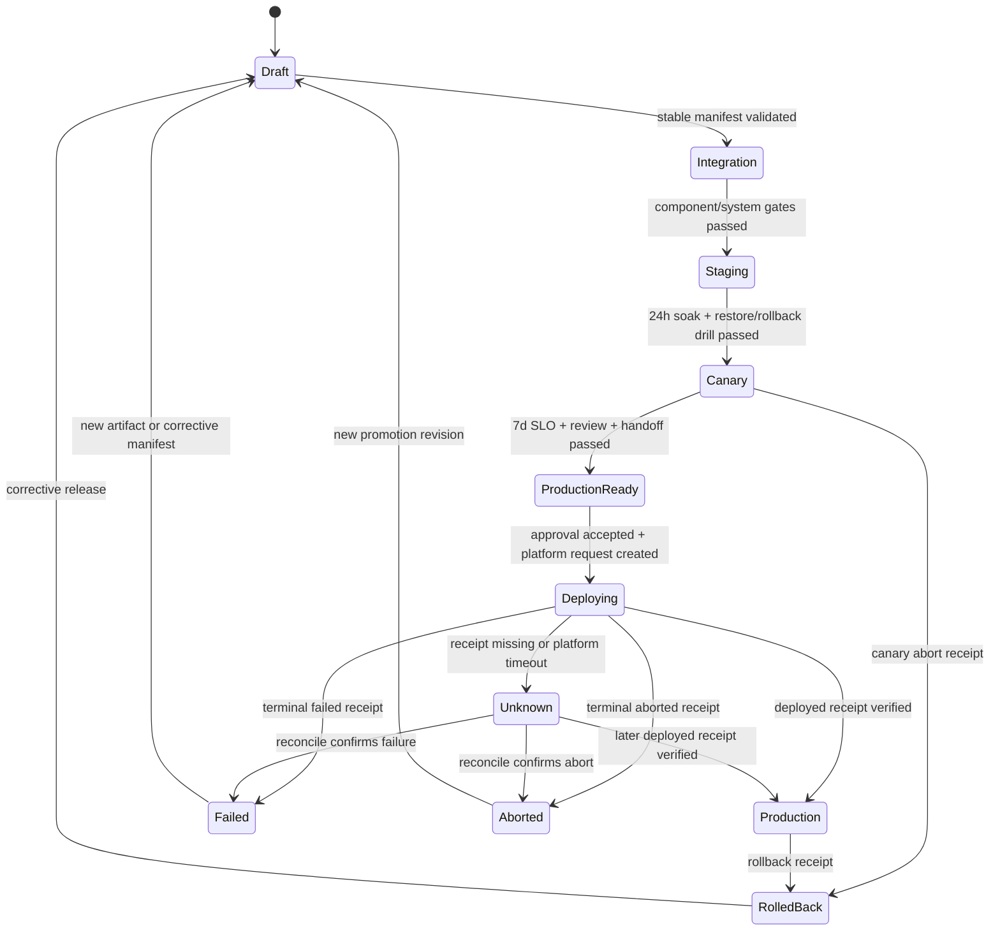

# Stable v3、Promotion 与 Deployment Receipt 对接 PRD

## 1. 问题与目标用户

Workbench 当前能够生成带 restore、OpenSpec capability、signed review 与 signed multi-SLI SLO authority 的 `workbench.release_manifest.v3alpha5`，但该版本明确没有 production promotion authority。系统仍缺三个闭环：stable v3 schema冻结、可并发安全的promotion状态机、来自批准deployment platform的真实部署receipt。

目标用户是 release owner、deployment platform owner、operations、security approver、service owner与on-call。他们需要区分“候选已满足条件”“批准执行部署”“平台正在应用”“部署完成”“状态未知”“已中止或回滚”，并保证任何CLI、Taskfile、Agent或Pod健康检查都不能自行宣称production已部署。

## 2. 最小可发布范围

首个范围只覆盖 `eikona-first-support` 和一个批准production tenant allowlist：

1. 冻结 `workbench.release_manifest.v3`；
2. 建立CLI-authored promotion record与revision CAS；
3. 支持 `Draft -> Integration -> Staging -> Canary -> ProductionReady` 的只读验证和dry-run计划；
4. `ProductionReady -> Production` 必须消费独立外部approval与deployment receipt；
5. 支持pause、abort与rollback dry-run，真实外部动作仍由deployment adapter执行；
6. 记录planned、partially_applied、deployed、failed、aborted、rolled_back与unknown状态；
7. 所有状态绑定同一environment、capability、tenant scope、artifact、stable manifest与approval digest。

首版不由Workbench直接调用Kubernetes、云厂商或CI/CD私有API；不在未选择deployment platform前实现生产写adapter；不让readiness触发部署；不把alpha manifest、命令exit 0、Pod healthy、截图或人工口头确认升级为deployed。

## 3. 责任边界

| 责任 | Owner | Authority |
| --- | --- | --- |
| Stable v3 schema与validator | Workbench release owner + architecture/security | Workbench release CLI |
| Promotion record与状态转换 | Workbench release service/CLI | CLI-authored revisioned state |
| Production approval | 独立release/security approver | signed approval receipt |
| Deployment plan与执行 | selected deployment platform owner | provider-owned adapter/API |
| Deployment truth | selected deployment platform | signed/versioned deployment receipt |
| Runtime health与post-deploy smoke | operations/service owners | read-only system evidence |
| Pause/abort/rollback决策 | release owner + on-call/approver | decision receipt + platform receipt |

Workbench只保存safe refs、digests、状态、timestamps、revision与receipt metadata；不保存deployment credential、cluster endpoint、raw platform payload、secret value或provider私有resource ID。

## 4. Stable v3 冻结条件

Stable v3 只能在以下authority全部使用真实来源后冻结：

- capability-scoped OpenSpec selector已获独立批准；
- managed PostgreSQL restore/RPO/RTO authority通过；
- signed external review provider receipt通过；
- signed multi-SLI observability authority通过真实24h staging与7d canary窗口；
- provider/consumer/joint integration/rollback handoff由独立owner签收；
- artifact set、SBOM、provenance、signature和security scan绑定同一candidate；
- deployment platform已选定，receipt合同、signing authority与staging只读`validate`/`plan` preflight已通过；真实apply/lookup集成在stable v3冻结后继续完成。

Stable schema必须明确required/optional字段、canonical ordering、digest算法、版本读取窗口、alpha迁移和rollback行为。Alpha版本只保留诊断读取；promotion validator只接受stable v3。Stable v3发布后不得在同版本静默增加required字段。

## 5. Promotion 状态机



`Unknown`是必须保留的真实状态：当请求是否被平台接受无法确认时，Workbench不得重试创建第二次部署。必须先通过idempotency key或provider operation ref执行lookup/reconcile。

`pause`停止扩大rollout但不伪造terminal状态；`abort`请求平台终止尚未完成的operation；`rollback`创建一个绑定当前deployed receipt的新operation。三者都必须保留已应用resource和真实外部副作用。

## 6. Promotion Record 合同

当前已交付 `workbench.promotion_record.v1alpha1` 诊断层：`promotion init`由CLI新建Draft record，`promotion plan`通过expected revision和exclusive local lock记录下一步计划但不改变current stage，`promotion validate`对alpha manifest返回`manifest_upgrade_required`。该层只冻结state shape、allowed transition table、CAS、输出与文件安全，不具有任何晋级或部署authority；stable v3和stage-specific evidence接入后才新增authoritative advance。

Promotion record必须由CLI创建和更新，采用revision CAS与原子写入。至少包含：

- `spec_version`、`promotion_id`、`revision`；
- environment、capability ID、tenant scope digest；
- artifact digest、stable manifest digest；
- current stage与stage status；
- approval receipt ref/digest/issuer/key/expiry；
- deployment operation ref、idempotency key digest；
- latest deployment receipt ref/digest/status/revision；
- created/updated timestamps；
- blocker codes、safe evidence refs与rollback target digest。

调用者不得直接提交`current_stage=Production`或`deployment_status=deployed`。CLI只能在重新验证manifest、approval和deployment receipt后派生状态。

每个transition必须校验expected revision、当前状态、目标状态、manifest digest与authority freshness。并发请求中只有一个CAS成功；相同idempotency key与相同target返回同一operation，不同target复用key必须拒绝。

## 7. Deployment Receipt 合同

首个稳定合同建议命名为 `workbench.deployment_receipt.v1alpha1`，在selected platform完成真实集成与兼容测试后再决定是否直接冻结为v1。Receipt至少绑定：

- spec version、issuer ref、receipt ref、platform ID与adapter version；
- operation ref、operation revision、idempotency key digest；
- environment、capability ID、tenant scope digest；
- artifact digest、stable manifest digest、approval digest；
- strategy（rolling、blue_green或批准值）、target percentage/wave；
- status：`planned|partially_applied|deployed|failed|aborted|rolled_back|unknown`；
- applied percentage、healthy/total target counts与safe runtime revision；
- requested/started/observed/completed timestamps；
- previous deployment digest、rollback target/receipt digest；
- evidence refs/digests、error code、retry/reconcile hint；
- issuer key ID、nonce、expiry与signature。

Receipt必须由deployment platform或其批准adapter签发。Workbench使用managed public trust bundle验证issuer、key、environment、capability和status权限。调用者自建trust、unsigned receipt、wrong artifact/manifest/approval、future/stale timestamps、revision regression、unknown fields或signature tamper全部blocked。

## 8. Deployment Adapter 合同

Selected platform adapter至少需要provider-neutral操作：

| Operation | Side effect | Required behavior |
| --- | --- | --- |
| `validate` | 无 | 验证平台连接、目标environment和adapter contract |
| `plan` | 无 | 返回绑定artifact/manifest/approval的canonical deployment plan digest |
| `apply` | 有 | 使用idempotency key创建或返回同一deployment operation |
| `lookup` | 无 | 查询operation并生成最新signed receipt |
| `pause` | 有 | 停止扩大rollout，保留已应用状态 |
| `abort` | 有 | 请求终止未完成operation，不伪造rollback |
| `rollback-plan` | 无 | 生成兼容性与目标digest检查结果 |
| `rollback-apply` | 有 | 创建独立rollback operation并返回receipt |

真实副作用命令必须经过root/user decision gate与外部approval。Workbench Taskfile只能做薄包装，并保留provider exit code；不得解析human stdout更新状态。

建议命令形态：

```bash
workbench-deploy-adapter plan \
  --environment production \
  --capability eikona-first-support \
  --manifest-digest sha256:<stable-v3-digest> \
  --approval-ref approval:<opaque-ref> \
  --output <private-plan-path> \
  --json
```

```bash
workbench-deploy-adapter lookup \
  --operation-ref deployment:<opaque-ref> \
  --output <evidence-run>/artifacts/deployment-receipt.json \
  --json
```

## 9. Approval、执行与真值顺序

1. Workbench生成并验证stable v3 candidate。
2. `release:decision:validate`消费独立signed approval，输出`ProductionReady`或No-Go，不执行部署。
3. Deployment adapter `plan`生成immutable plan digest；approval必须覆盖该plan或其明确target范围。
4. 经明确外部动作批准后执行`apply`，记录operation ref与idempotency digest；CLI状态进入`Deploying`。
5. `lookup`持续生成signed receipt；`partially_applied`只更新进度，不升级Production。
6. 只有`deployed` receipt通过签名、target与runtime smoke验证后，promotion才能进入Production。
7. Receipt缺失、timeout或响应丢失进入Unknown；先lookup/reconcile，禁止盲目重复apply。
8. Post-deploy仅执行只读检查；真实数据mutation需要独立批准和测试tenant allowlist。

## 10. Pause、Abort 与 Rollback

- **Pause**：用于SLO burn、监控不完整或人工观察；停止后续wave，不撤销已应用实例。
- **Abort**：用于尚未完成且平台支持终止的operation；最终状态必须来自平台receipt。
- **Rollback**：必须绑定current deployed receipt、previous compatible artifact与stable manifest；先验证DB/schema/worker/contract兼容，再执行独立operation。
- **Fix-forward**：破坏性schema或真实external mutation无法安全回滚时，状态保持真实并启动corrective candidate，不能篡改原receipt。

Active workflows回滚时先pause scheduler/claim与新dispatch，保留lease、receipt和reconcile。兼容旧/read-only版本只能观察真实状态，不得重复dispatch。

## 11. Evidence 与审计

每次dry-run、platform integration、apply、lookup、pause、abort、rollback和post-deploy都必须生成对应层级的evidence六件套。允许保存canonical plan、signed public receipt、public trust bundle、safe runtime summary与opaque provider refs；禁止保存credential、private key、cluster endpoint、raw platform payload、secret、private path或普通用户resource ID。

审计必须能回答：谁批准、批准何种target、使用哪个stable manifest和artifact、平台创建哪个operation、每次receipt如何演进、何时进入Unknown、何时reconcile、最终是否deployed/failed/aborted/rolled_back、哪个rollback target通过兼容检查。

## 12. 验收矩阵

| 场景 | 预期 |
| --- | --- |
| alpha manifest尝试promotion | `manifest_upgrade_required` |
| stable manifest缺restore/review/SLO/handoff任一authority | No-Go |
| stale/wrong-scope approval | No-Go，不调用adapter apply |
| 两个并发transition使用同一revision | 一个成功，另一个revision conflict |
| apply响应丢失 | `Unknown`，只允许lookup/reconcile |
| 相同idempotency key和相同target重试 | 返回同一operation |
| 相同key但artifact/manifest不同 | blocked |
| partially applied receipt | 保持Deploying，不标Production |
| Pod healthy但无signed deployed receipt | No-Go/Unknown |
| deployed receipt签名或digest错误 | blocked |
| rollback target schema/worker range不兼容 | rollback plan blocked |
| rollback成功receipt通过 | `RolledBack`，不删除原部署truth |
| Taskfile或Agent手写deployment success | schema/authority validation失败 |

## 13. 原子交付任务

1. Root/operations选择deployment platform、adapter owner、environment inventory source和signing authority。
2. Workbench冻结stable v3 schema/goldens、alpha迁移与promotion-only validator。
3. Workbench实现promotion record CLI、CAS、transition table、idempotency与audit tests。
4. Deployment owner实现validate/plan/apply/lookup/pause/abort/rollback adapter与signed receipt。
5. Security发布managed deployment trust bundle并完成rotation/revocation drill。
6. Staging执行plan/apply/lookup/partial/failure/unknown/abort/rollback负向集成。
7. Canary执行progressive rollout、SLO pause与rollback drill。
8. Production只在stable manifest、approval、platform receipt和post-deploy evidence全部通过后进入Production。

## 14. 待决策

- 选择Kubernetes/GitOps、云部署服务或现有CI/CD作为首个deployment authority。
- 决定adapter运行位置、network/credential boundary和签名KMS/HSM。
- 冻结tenant scope digest的来源与canonical算法。
- 冻结progressive wave模型、最小观察窗口和pause/abort支持能力。
- 冻结receipt retention、lookup SLA、Unknown reconcile周期与平台故障owner。
- 冻结production approval是否覆盖plan digest、wave范围、有效期和rollback权限。
