# Workbench Support Diagnostics 生产交接

## 1. 结论与边界

`6.3d0`已经提供可运行的safe diagnostics bundle合同；`6.3d1a`进一步提供source snapshot基线，CLI会重新读取managed config与release readiness两份JSON报告并绑定文件digest，其余五项source保持`unknown`。`6.3d2`的递归安全扫描基线已落地：bundle在strict typed decode之前先对原始字节做递归forbidden field/value扫描与嵌套深度上限（32层），任一层级命中raw endpoint、Authorization/token/cookie/secret、private path、stack、provider payload或完整argv形态即fail closed且不回显命中内容；symlink/device/空文件/超限/尾随数据/非JSON archive字节的文件矩阵与成功、失败bundle的seeded leak矩阵均有直接测试。

该基线不是生产就绪证明。它不直接读取runtime/release权威、不执行download audit或purge、不包含独立operations/security签收，也不替代browser/a11y、privacy、SLO、deployment和approver gates。所有bundle固定`production_authorized=false`。

## 2. 已实现合同

| 项目 | 当前合同 |
| --- | --- |
| Schema | `workbench.support_diagnostics_bundle.v1alpha1`、`workbench.support_diagnostics_source_snapshot.v1alpha1` |
| Binary | `workbench-diagnostics` |
| Commands | `source generate|validate`、`bundle generate|generate-from-snapshot|validate` |
| Task targets | `diagnostics:sources:generate|validate`、`diagnostics:bundle:generate-from-sources`、`diagnostics:verify`、`diagnostics:d1a:test`、`test:diagnostics-sources:component` |
| Binding | `environment`、`candidate_digest`、`source_type`、safe opaque `source_ref` |
| Limits | 1个文件、最大64KiB、TTL和max-age最长7日、0600、O_EXCL、拒绝symlink |
| Output | summary、`--json`、`--agent`、`--explain`；不输出private bundle path |
| Authority | `download_audit_required=true`、`contains_sensitive_payload=false`、`production_authorized=false` |

允许的bundle source type仅为`runtime_snapshot`、`release_preflight`、`support_request`。D1a source-bound bundle使用`source-snapshot:<sha256-hex>`绑定snapshot内容；snapshot validator每次重新读取config/release报告并比较digest。D1b0新增短寿命`workbench.runtime_readiness_report.v1alpha1`，可将database、worker、workflow三项作为direct runtime report绑定，使snapshot合同达到direct=5。D1b1a已让正式`workbench-worker`消费冻结release metadata与operation/step snapshots并调用`bootstrap.Open(...).RuntimeOption()`；但service identity、delegation与四类role engine仍保持fail-closed，Workflow API也尚未提供current definition/policy digest，所以当前仍不是managed runtime readiness。

### D1a 当前来源覆盖

| Diagnostic | 来源 | 当前状态 |
| --- | --- | --- |
| `config_invalid` | `workbench.config.validate --json` | direct CLI report，按command/status/environment/digest重验 |
| `release_not_ready` | `workbench.release.readiness --json` | direct CLI report，要求`status=success`与`facts.ready=true`一致 |
| `database_unready` | worker `/readyz`中的`database`与`database_time`组件 | D1b1a已接正式GORM/bootstrap；需disposable managed PostgreSQL evidence后才是current truth |
| `worker_unready` | `workbench.worker_readiness.v1alpha1` `/readyz` | D1b0已定义typed capture；当前claim-disabled或未bootstrap时为fail/unknown |
| `workflow_unready` | `workbench.workflow.readiness` JSON report | 六operation已聚合；缺definition/policy digest时保持unknown |
| `identity_unavailable` | Identity provider authority | `unavailable/unknown`，等待D1c |
| `owner_unavailable` | Owner provider authority | `unavailable/unknown`，等待D1c |

## 3. Safe code与救援命令

| Code | 非pass时的救援命令 |
| --- | --- |
| `config_invalid` | `task config:validate ENV=<env>` |
| `database_unready` | `task ops:doctor ENV=<env>` |
| `identity_unavailable` | `task ops:doctor ENV=<env>` |
| `owner_unavailable` | `task ops:doctor ENV=<env>` |
| `release_not_ready` | `task release:readiness ENV=<env>` |
| `worker_unready` | `task worker:production-dependencies:test ENV=<env>` |
| `workflow_unready` | `task workflow:readiness ENV=<env>` |

状态只允许`pass|warn|fail|unknown`。`warn`、`fail`和`unknown`都必须生成固定救援命令；未知code/status、重复code或空列表立即失败。

## 4. 生产数据流

```mermaid
flowchart LR
  C[Frozen Candidate] --> S[Direct Runtime/Release Sources]
  S --> G[Diagnostics Generate]
  G --> V[Recursive Security Validate]
  V --> A[Authorized Download Audit]
  A --> R[Retention/Expiry/Purge]
  V --> E[Component/System Evidence]
  R --> E
  E --> O[Operations + Security Review]
  O --> D[DI-S3 Signed Receipt]
  D --> B[Browser/A11y Support Review]
  B -->|never directly| P[Production Authorization]
```



## 5. 后续执行包

| Package | Owner | 前置 | 交付 | 验证与退出门 |
| --- | --- | --- | --- | --- |
| `D0` Contract Baseline | Workbench implementer/test owner | production task guard | schema、CLI、Taskfile、unit/component tests | `task diagnostics:test`和六件套component evidence通过；只关闭`6.3d0` |
| `D1a` Config/Release Snapshot | diagnostics implementer/test owner | D0、现有JSON contracts | 2 direct + 5 unknown source snapshot、source-bound bundle | `task test:diagnostics-sources:component`；只能关闭6.3d1a |
| `D1b0` Runtime Contract | Workbench runtime/diagnostics/workflow implementer | D1a | worker components、workflow JSON、runtime report、可选五源snapshot | contract direct=5；仅关闭D1b0，不声称managed ready |
| `D1b1a` Bootstrap Attachment | Workbench worker/bootstrap implementer | D1b0、GORM/registry baseline | release metadata、CLI snapshots、正式`bootstrap.Open`、fail-closed logs | DB/registry进入真实checker；authority/roles仍blocked |
| `D1b1b0` Authority Consumer | Workbench worker/bootstrap implementer | D1b1a、typed readiness contract | HTTPS/loopback probes、strict/freshness/revoke绑定 | consumer fault matrix通过；不计Provider Ready |
| `D1b1b1` Authority Provider | Identity/delegation provider + independent verifier | managed trust/delegation authority | real process、TLS、rotation/revoke/current receipt | timeout/revoke/mismatch不得注册worker |
| `D1b1c0` Role DAG Audit | R4/R5 plan integrator | current R4 code/tasks | 去除role-probe/scheduler循环、冻结owner/write lease | 计划无环；不计runtime ready |
| `D1b1c1-c4` Role Engines | R4 scheduler/executor/outbox/reconcile owners | D1b1b1、PostgreSQL lease/outbox、Owner receipt | fair claim、typed execute、cursor publish、unknown reconcile | 四role由真实engine/cursor观测 |
| `D1b1c5-c6` Claim and Handoff | R4/R5 operations + independent test | role engines、kill switch、candidate authority | registration/heartbeat、受控claim、restart/drain/system matrix | worker成为managed current truth |
| `CMD0` Production Target Gate | release CLI + Taskfile/docs test owners | R5 `0.4a`审计合同 | 已实现CLI-authored target registry、authority/exit/evidence分类与docs parity；component evidence已通过 | 不存在或diagnostic-only命令不能被D1-D4当作直接生产证据 |
| `D1b2` Runtime Authority | workflow/runtime + operations/test owners | D1b1、definition/policy authority | current digests、staging capture/fault matrix | staging direct=5；timeout/restart/mismatch不提权 |
| `D1c` Provider Sources | Identity/Owner provider + consumer owners | D1a、R1/R2、6.3c | signed/current Identity与Owner readiness refs | direct=7；stale/revoked/wrong scope全部失败 |
| `D1d` Frozen Aggregate | release/runtime integrator + test-engineer | D1b、D1c | complete snapshot、正式staging source-bound target | complete=true、unknown=0，但production authority仍false |
| `D2` Security Fault Matrix | security + test-engineer | D1 | 递归forbidden-field、success/failure bundle、size/file/symlink/device/archive矩阵 | 任一嵌套泄漏或超限阻断，失败保留脱敏六件套。基线已实现（见下方D2注记），关闭仍需D1完成与独立security owner验收 |
| `D3` Audit and Lifecycle | operations/support + lifecycle owner | D2、6.0a2 | download receipt、retention、expiry、hold、purge、lookup/reconcile | 无audit不得下载，过期不可读，purge留最小truth；DI-S3进入`evidence_ready` |
| `D4` Staging Signoff | independent operations/security/test owners | D3、frozen staging | staging success/failure/expiry/purge/revoke evidence、managed trust和signed receipt | `6.3d`与DI-S3 `consumer_verified`才可关闭；仍不授予production authority |

每个package都使用独立owner和直接证据。CMD0可与D1实现并行，但D4只能消费CMD0标记为`available`且绑定当前source digest的命令；D1-D3可以按写入租约串行实现；D2测试设计可在D1实现期间并行准备；D4只能消费冻结后的稳定diff和staging evidence。

D2注记（2026-08-27）：递归扫描与seeded leak矩阵基线已由`service/internal/diagnostics/security_scan.go`、LoadBundle/validateBundleShape接线、`security_scan_test.go`、CLI层与bun层seeded-leak测试实现；验证`task diagnostics:d2:security:test`与`task test:diagnostics-security:component`通过（evidence run `20260827083017-8e28446d-c360-4a10-81e6-ee67c98e8f31`，六件套、redaction 0命中）。`6.3d2` checkbox仍保持open：关闭需D1完成后的完整staging matrix与独立security owner签收。

## 6. 当前可运行命令

```bash
task diagnostics:bundle:generate \
  ENV=staging \
  CANDIDATE_DIGEST=sha256:<64-hex> \
  SOURCE_TYPE=release_preflight \
  SOURCE_REF=release:staging-candidate \
  CONFIG_STATUS=pass \
  DATABASE_STATUS=pass \
  IDENTITY_STATUS=unknown \
  OWNER_STATUS=unknown \
  RELEASE_STATUS=fail \
  WORKER_STATUS=pass \
  WORKFLOW_STATUS=unknown

task diagnostics:verify \
  ENV=staging \
  CANDIDATE_DIGEST=sha256:<64-hex>

task diagnostics:sources:generate \
  ENV=staging \
  CANDIDATE_DIGEST=sha256:<64-hex> \
  CONFIG_REPORT=temp/diagnostics/config-report.json \
  RELEASE_REPORT=temp/diagnostics/release-report.json

task diagnostics:sources:validate \
  ENV=staging \
  CANDIDATE_DIGEST=sha256:<64-hex> \
  CONFIG_REPORT=temp/diagnostics/config-report.json \
  RELEASE_REPORT=temp/diagnostics/release-report.json

task diagnostics:bundle:generate-from-sources \
  ENV=staging \
  CANDIDATE_DIGEST=sha256:<64-hex> \
  CONFIG_REPORT=temp/diagnostics/config-report.json \
  RELEASE_REPORT=temp/diagnostics/release-report.json

task workflow:readiness:report \
  ENV=staging \
  WORKFLOW_REPORT=temp/diagnostics/workflow-readiness-report.json

task diagnostics:runtime:capture \
  ENV=staging \
  WORKER_URL=http://127.0.0.1:19789 \
  WORKFLOW_REPORT=temp/diagnostics/workflow-readiness-report.json \
  RUNTIME_REPORT=temp/diagnostics/runtime-readiness-report.json

task diagnostics:runtime:validate \
  ENV=staging \
  RUNTIME_REPORT=temp/diagnostics/runtime-readiness-report.json

task diagnostics:sources:generate-runtime \
  ENV=staging \
  CANDIDATE_DIGEST=sha256:<64-hex> \
  CONFIG_REPORT=temp/diagnostics/config-report.json \
  RELEASE_REPORT=temp/diagnostics/release-report.json \
  RUNTIME_REPORT=temp/diagnostics/runtime-readiness-report.json

task diagnostics:sources:validate-runtime \
  ENV=staging \
  CANDIDATE_DIGEST=sha256:<64-hex> \
  CONFIG_REPORT=temp/diagnostics/config-report.json \
  RELEASE_REPORT=temp/diagnostics/release-report.json \
  RUNTIME_REPORT=temp/diagnostics/runtime-readiness-report.json

task test:diagnostics-sources:component
task test:diagnostics-runtime-contract:component
task diagnostics:d2:security:test
task test:diagnostics-security:component
```

`CONFIG_STATUS`等状态变量仅用于D0合同与故障测试。D1a及后续staging bundle必须由source snapshot生成。D1b0命令可以产出五项direct合同，但当前worker bootstrap与Workflow definition/policy digest仍未完成；因此不得把本地loopback fixture、合同component evidence或direct=5本身解释为staging ready。只有D1d才允许形成完整staging source snapshot。

## 7. DI-S3 对接

D0完成后，support/operations/security owner可以开始：

1. 为`support_diagnostics`生成并验证owner review request；
2. 冻结D1-D3所需direct evidence requirement和文件名；
3. 明确managed trust issuer、role、scope、expiry/revoke和升级联系人；
4. 等D3完成后生成evidence manifest；
5. 由Provider系统签发绑定request、manifest和每个direct evidence digest的receipt；
6. Workbench重验receipt并推进DI-S3到`consumer_verified`。

在D3之前，DI-S3最多到`provider_assigned`；不得签空scope，也不得把D0 component evidence当完整download audit/purge证据。

## 8. No-Go 条件

- source status由caller、fixture、human output或旧bundle提供，而非current direct source；
- diagnostics/runbook引用的target不存在、仅为diagnostic authority或与target registry digest不一致；
- bundle含raw endpoint、identity/resource/provider payload、stack、secret、token/cookie、private path或完整argv；
- 文件无上限、通过symlink/device/archive绕过、retention超过7日或expiry后仍可下载；
- 缺download audit、purge/reconcile证据或独立operations/security receipt；
- candidate/environment/source/evidence/trust任一digest漂移、过期、撤销或unknown；
- bundle、DI-S3 receipt或browser screenshot被用于替代production approval。

任一条件成立时，`6.3d`、DI-S3、WP-GOV20和最终GA均保持blocked。
