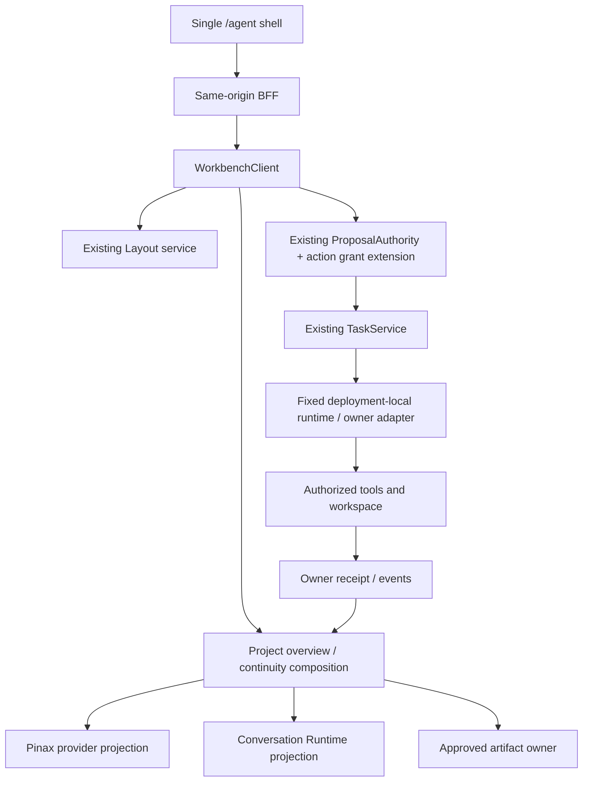
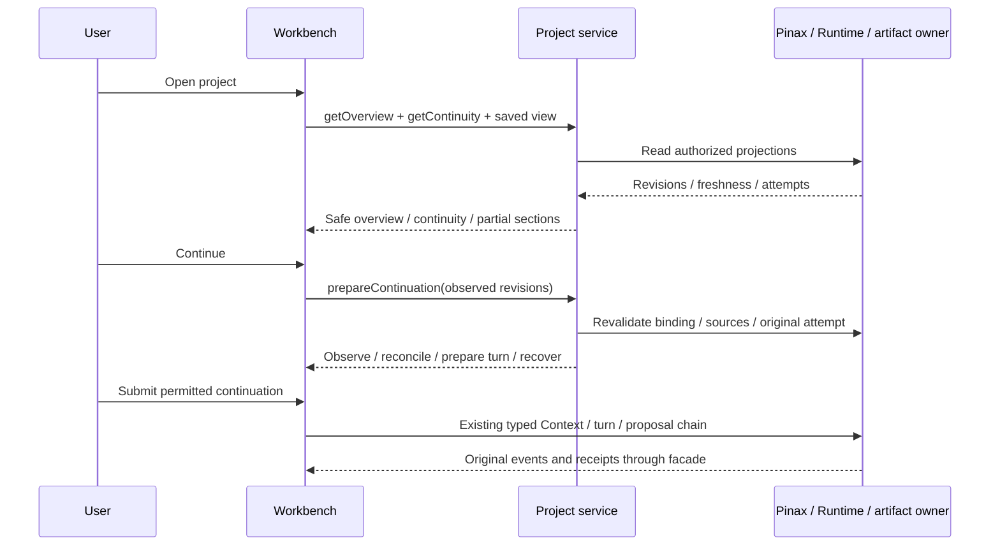

## Context

本 change 实施用户已确定的“项目与成果优先、桌面 Web、部署端工具、跨会话连续性、有界自主执行”方向。产品目标与场景见 [PRD](../../../docs/product/project-continuity-workbench.md)，控件和状态见 [UI Spec](../../../docs/ui/project-continuity-workbench.md)，接口语义见 [接口合同](../../../docs/interfaces/project-continuity-workbench.md)。

现有能力可复用：`AgentWorkbenchShellV2` 与 layout reducer、唯一 Conversation workspace、document/Pane registry、ProjectWorkspace/Dataset/View、Layout service、TaskService、ProposalAuthority、Context 与 owner adapters。2026-09-05 只读检查显示 Project UI 当前主要组织记录数据集；真实 Conversation、Pinax continuity 消费与新 action grant 没有本 change 的交付证据。

## Goals / Non-Goals

**Goals:** 打开项目找回成果、显式继续、查看准确上下文、真实执行/预览/审阅、取消/重连/重启恢复；桌面长期使用；同一版本本地和远程部署验收。

**Non-Goals:** 不替换 canonical Project、Pinax memory 或 Runtime content；不新增 scheduler、跨部署执行/同步、原生桌面或并列主壳；不删除原专业场景；本轮只完善规格文档，不实施这些功能。

## Architecture

## Decisions

### 1. 在既有单壳中提升成果优先级

中央 document dock 默认最近合法成果或项目续接 document；Chat 复用原实例，Context 按需展开。项目目录是现有 drawer 的项目化组织，不建立第二 session list owner。选择项目沿用可信 scope，旧 `/agent` 与书签仍可进入。

考虑过仅给旧 Project Table 加摘要，不能承载成果与跨会话持续工作；另起 Project/Studio 主壳会重复布局和状态。因此采用 capability-gated 的既有 shell 增量。

### 2. Project service 聚合，Pinax 提供连续性

新增 `getOverview/getContinuity/prepareContinuation`，详见接口合同；Project service 只保存必要的安全关联/准备 metadata，continuity 内容按 Pinax 版本投影。owner 缺失时独立分区 partial，项目整体失权则拒绝。所有方法使用 registry 同时投影四种调用面。

Pinax 缺 binding 时保持正常项目浏览并展示 setup；不把最近聊天或 WorkItem 状态推导为长期记忆。通用项目目录必须来自已批准的 project/workspace owner，不以本 change 新建文件管理后端。

### 3. 视图恢复与任务恢复分离

Layout service 的 `ProjectViewStateV1` 保存 principal/project 下的安全 document refs、位置和宽度；Session draft/scroll 仍按 session 隔离。Project metadata 不保存 editor body。首次/非法历史 fallback 到续接 document，不静默访问其他项目。

页面打开和 layout restore 不提交任务。prepare 只返回动作描述符，提交仍走原 Context/Agent/Proposal 链。切项目时 unsubscribe/取消在途查询，禁止迟到事件改变当前项目；UI 关闭不取消后台任务。运行重启能力由 owner 声明，unknown 原操作对账优先。

### 4. 普通自主执行有独立授权与准入

采用根 [bounded-project-autonomy](../../../../../openspec/changes/workbench-project-continuity-program-v1/specs/bounded-project-autonomy/spec.md)。旧 grant 不升级；server capability 与 provider digest 同时具备后，用户可批准有界 action grant。每次 action proposal 的效果、资源、权限、预算、幂等、版本与 writer lease 仍由原权威验证。

批授权只是记录和复用先前明确批准，不跳过 proposal/Task/owner admission。不支持 effect classification 的终端命令/MCP 操作继续单次批准；不是把所有 workspace 内命令默认为安全。撤销阻止新 admission，原 accepted run 按 owner cancel/reconcile。

### 5. 同一服务栈部署在本机或服务器

业务实现不分 local/cloud 两套。复用现有 local 与 managed BFF 的认证/存储配置：远程 HTTPS、opaque session、CSRF、Identity；本机 private session。固定 adapter 调用本部署内服务，Runtime Plane loopback 不直接暴露远程。CLI 探测失败只影响对应 capability，不回退到浏览器执行或其他机器。

### 6. 直接复用测试、组件与持久化

使用已有 Vitest + Testing Library + MSW、Playwright、Bun SDK/conformance、Go testing/httptest；不新增并行框架。新增 Go metadata 只经 GORM repository，正常构建 `CGO_ENABLED=0`；新增 layout/关联列以 additive migration 交付，业务层不写 raw SQL。prototype/fixtures 不进入真实调用或默认 capability。

## UI Contract

详细控制清单和 State Matrix 以 [UI Spec](../../../docs/ui/project-continuity-workbench.md) 为单一真源，本节固定本 change 准入：

- Surface classification：`core-shell` + `registered-pane`；已有专业内容保留 `domain-lens`。
- Primary user question：当前成果是什么，下一步如何安全继续？
- First / second / third visual priority：成果及保存状态；阻塞与继续；来源和运行详情。
- Page/Pane pattern：既有 document dock，项目目录 drawer，Chat 持续挂载，Context 按需。
- Shared primitives/composites reused：现有 primitives、CommandPalette、PaneChrome、StatusBlock、ActionRecovery、EvidenceBlock；无新 icon/font/token/modal 系统。
- Cards that earn existence：单个紧凑续接摘要；其余内容采用列表/文档。
- Primary scroll owner：document body、timeline、drawer 各一个；不叠加页面滚动。
- Domain-specific visual allowance：只复用批准 renderer 与内容排版。
- Responsive：≥1440 成果+Chat/按需 Context；1024–1439 双区+互斥 Sheet；<1024 单内容+Chat/Review；200% zoom 按 CSS viewport。
- Accessibility：键盘、IME、不抢焦点、Sheet focus/escape/return、reduced-motion；桌面互补 Pane 不 trap focus。
- Visual Exceptions：无。

| 状态 | 共享处理 |
|---|---|
| loading/empty | 局部 skeleton 或一个真实起步动作 |
| ready/running | 成果正文、owner 保存事实和简洁运行条 |
| error/offline | 就地原因、仍授权的最后确认内容、一个恢复动作 |
| partial/stale | 分区/来源标识与刷新；不伪造全局 ready |
| permission/cost | 显式范围与解锁操作，不改变浏览器 capability |
| unknown | 原操作对账，禁新提交替代 |

## Active-change 兼容与任务归属

| 已有 owner/change | 本 change 复用 | 不重复实现 / 必要 handoff |
|---|---|---|
| `workbench-agent-chat-canvas-convergence-v2` | shell、content、Context、原 attempt/stream | 原真实 Runtime/Aigora gates 仍归它；这里只消费 readiness |
| `workbench-project-data-workspaces-v1` | ProjectWorkspace、Dataset、角色与查询 | 不删除 Table/Kanban/Todo/Canvas，不重建 WorkItem |
| `workbench-text-development-studio-v1` | editor、candidate、Working Copy/Versions/Team | 写作专业内容按原 tasks 交付；这里只验证统一项目链 |
| `workbench-auctra-screenplay-room-v1`、Spatial V3 | 原 domain lens/Canvas | 不另建专业编辑器、scheduler 或相机状态 |
| R0、R1 gates、R5 | backup、managed auth、生产发布工具 | 复用现有工具；本 change 补同版本 local/remote 场景验收 |
| Pinax | canonical continuity/binding/review | provider packet 缺失时由 Pinax 新 change 交付；Workbench adapter 不能读取私有 vault |

路径分波：contracts → services/adapters → UI → scenario/integration → final gates。`tasks.md` 是本 change 唯一实施状态；lane 只标识独立性，不授权子 Agent 或重叠 writer。保留当前工作树的无关改动。

## Milestones 与证据

P0 完成合同 packets、旧行为基线、三种可丢弃原型；P1 完成一个真实项目的 Agent→工具→成果→关页→续接；P2 通过研发/调研，复用文本/多模态；P3 同版本 local/remote 和持续使用证明。

所有新增 E2E case 使用 `WB-PC-` 前缀，细分 `RESEARCH/SOFTWARE/TEXT/MEDIA/DESKTOP/RESTORE/CONTEXT/REVIEW/A11Y/GRANT/DEPLOYMENT`。scenario command 在相关测试新增后才有效，zero matched、skip、fixture pass 不得作为真实验收。

技术矩阵至少覆盖 source stale/conflict/missing、binding missing/ambiguous、project/tenant/revoke、重复提交、budget race、unknown、partial/cancel、cursor gap、重启不能恢复、capability off。在 1024/1280/1440/1920 和 zoom/IME/reduced motion 下验证。性能使用相同 runner/设备/fixture：缓存视图切换 p95 ≤200ms、输入反馈 p95 ≤100ms 为初始验收预算，owner/provider 等待单独计时；如环境导致不可测，记录诊断，不用未测数据宣称通过。

持续使用样本/计时口径见 PRD。evidence 六件套由已有 `scripts/test-evidence/run.ts` 或项目 application service 生成；新手工使用证明也必须通过 runner 记录枚举、计数与 evidence refs，不直接编写 JSON/YAML 验收记录。

## Risks / Trade-offs

- [新总览聚合放大依赖失败] → 分区 availability、并发有界读取、授权失败整体拒绝、原始 source freshness。
- [布局升级覆盖旧草稿] → safe layout refs 与 owner editor draft 分离，保存/未知状态明确；capability off 回归。
- [批授权竞态] → 原子预算与 admission fence、scope/revision 重验、owner 不支持则保持旧审批。
- [远程认证门未完成] → 本机与远程证据分别判定；未通过远程不能宣传同版首版完成。
- [没有真实用户任务] → 使用明确实验场景与计时标准，完成真实样本后决定改进重点。

## Migration Plan

新增 schema/messages/methods/capabilities；不得给旧 closed projection 填入未声明字段。UI 新姿态默认关闭，先 fixture/reference，再 provider-conformance，再真实 canary，最后两个部署形态同版验收。已有 main specs 和 archive 不因本次规格编写而标记功能已交付。

新增表/列保留 legacy 数据与读路径；重开项目从 owner ref 重新授权，不搬运原目录。回滚关闭三项新 capability、停止新 grant admission，恢复原壳；原 accepted Task 的查询/cancel/reconcile 不随 UI 关闭而消失。无表删除、无内容清空、无旧接口移除；`breaking_surfaces: []`。

## Open Questions / Implementation Gates

方向已确定；剩余为有归属的验证：Pinax packet、Conversation Runtime 真实协议、owner effect/grant conformance、三种 UI 原型结果、真实用户场景。它们有具体任务与 blocked 条件；没有证据时保持相关 gate 关闭。创建新远程 owner repo、生产部署、真实付费调用须按原具体动作授权，不是本次文档编辑自动包含的副作用。
