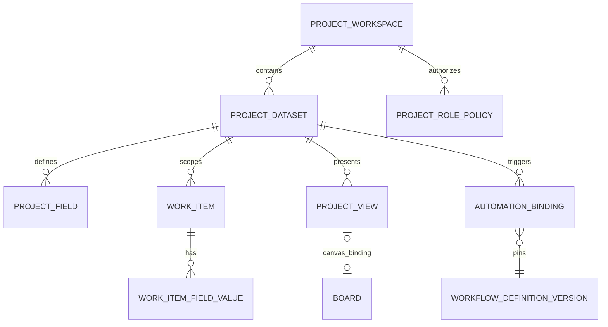

## Context

Workbench 当前已有三块可复用真源：

1. R3 `WorkItemService` 管理人的运营承诺、状态、负责人、依赖、验收、due date 与 safe links；Task 成功不自动等于 WorkItem 完成。
2. R4 `BoardService` 管理 typed node/edge、viewport、LOD、version、undo 与 safe target projection；Board relation 不修改 Owner canonical state。
3. R4 `WorkflowService` 管理不可变发布版本、run/step、lease、approval、receipt/reconcile、pause/resume/cancel 与 `unknown_accept`。

用户要的“无限画布 + workflow + Kanban + Todo 项目管理”横跨这三块能力。设计必须提供类似多维表格的“字段—记录—视图—自动化”心智模型，同时遵守 Agent-first 单壳、Server-authored truth、单一 mutation 链和 Owner remains owner。现有工作树含大量并行改动，本 change 只新增规划文档，后续实现必须按路径租约推进。

目标用户包括项目经理、团队成员、流程管理员、审批人和以 typed client 操作的 Agent。详细 PRD 见 `details/project-data-workspace-prd.md`，UI Spec 见 `details/project-data-workspace-ui-spec.md`。

## Goals / Non-Goals

**Goals:**

- 在一个 safe `projectRef` 下提供 Workbench-owned `ProjectWorkspace` 和一个或多个 `ProjectDataset`。
- 让同一批 WorkItem 记录以 Table、Kanban、Todo、Canvas 四种视图呈现，并共享 typed query、permission、version、event 与 audit 语义。
- 让企业管理员使用受控字段、视图、角色和 Automation binding 自行编排任务流，而不是修改代码或直接接触 Owner credential。
- 复用 R4 Board 与 Workflow 运行时，避免新建第三套 graph executor、scheduler 或 task state machine。
- 保持 HTTP、gRPC、JSON-RPC、TypeScript SDK parity，正常构建继续 `CGO_ENABLED=0`。
- 为 schema migration、concurrent edit、drag intent、automation trigger、permission revoke、10k Canvas 与 50k WorkItem 建立可复现证据。

**Non-Goals:**

- 不创建或重命名 Owner canonical Project；`ProjectWorkspace` 只绑定 safe `projectRef`。
- 不实现任意表格数据库、通用低代码平台、BPMN、任意 JavaScript/Python/shell、任意 HTTP/webhook 或浏览器 executor。
- 不在 v1 实现 formula、lookup、跨 dataset 双向 relation、公开 intake form、dashboard builder、评论/IM 或 template marketplace。
- 不让 Kanban 拖动、Todo 勾选或 Canvas 连线绕过 WorkItemService/WorkflowService 的版本、权限、审批、成本和 receipt gate。
- 不复制 Owner 的资产、制作、评审或交付状态机；只保存 safe refs、摘要和 receipt。
- 不引入 Rust、cgo、Tauri、Electron 或第二套 Web shell。

## Architecture

```mermaid
flowchart LR
  User[User / Agent] --> Shell[/agent single shell]
  Shell --> Pane[Project Workspace Pane]
  Pane --> BFF[Same-origin Bun BFF]
  BFF --> Client[WorkbenchClient]
  Client --> Project[ProjectWorkspaceService]
  Client --> WorkItem[WorkItemService]
  Client --> Board[BoardService]
  Client --> Automation[ProjectAutomationService]
  Automation --> Workflow[WorkflowService]
  Workflow --> Task[TaskService / Gate / Receipt]
  Task --> Owner[Approved Owner APIs]
  Project --> DB[(GORM PostgreSQL / pure-Go SQLite)]
  WorkItem --> DB
  Board --> DB
  Automation --> DB
  Workflow --> DB
  DB --> Events[Outbox / SSE / gRPC streams]
  Events --> Pane
```



## Decisions

### 1. 一个记录真源，多种视图

`WorkItemService` 继续是可变项目记录的唯一权威。Table、Kanban、Todo 和 Canvas 都读取同一 `ProjectRecordProjectionV1`，视图只保存 query/layout metadata，不保存记录副本。

- Table 单元格编辑调用 WorkItem typed mutation。
- Kanban 拖动解析为 `ProjectDragIntentV1`，服务端返回对应 `WorkItemTransition` 或 custom select field update descriptor。
- Todo 勾选先读取 server-authored allowed action；有未完成验收时不能直接显示 done。
- Canvas node 只引用 `workItemRef + sourceVersion`，位置/分组属于 Board，title/status/assignee/due 等来自 WorkItem safe projection。

**替代方案：** 每种视图拥有自己的表或 reducer。拒绝，因为会形成并行状态、跨视图漂移和难以对账的 mutation。

### 2. `ProjectWorkspace` 是组合 metadata，不是第二个 Project owner

`ProjectWorkspaceV1` 键为 `{tenantRef, workspaceRef, projectRef}`，其中 `projectRef` 必须来自批准的 Project safe projection。它保存 dataset、view、role policy、automation binding 和默认 board refs，不保存 Owner Project payload。

Project owner 删除、失权或 contract drift 时，ProjectWorkspace 保留无敏感 tombstone 与只读导出能力；不得继续执行新 mutation。

**替代方案：** Workbench 创建一套独立 Project canonical state。拒绝，因为会与 Owner 项目/制作状态冲突。

### 3. v1 采用受控字段类型，不做任意 JSON schema

字段分为不可替换的 system fields 与可配置 custom fields。

System fields：`title`、`status`、`priority`、`assignee`、`due_at`、`blockers`、`acceptance`、`dependencies`、`links`、`created_at/by`、`updated_at/by`。它们仍由现有 WorkItem domain rule 管理。

Custom field v1：

| Kind | 存储 | 关键限制 |
| --- | --- | --- |
| `text` | bounded UTF-8 | 长度、无 HTML/script |
| `number` | decimal string + scale | 固定精度与范围 |
| `single_select` | stable option ref | 选项使用 semantic token，不接收任意颜色 |
| `multi_select` | bounded option refs | 数量与总大小限制 |
| `date` | UTC instant/date mode | 显示时区由 view 配置 |
| `checkbox` | bool | 无第三态 |
| `actor_ref` | R1 opaque user/team ref | 服务端重新解析可见性 |
| `safe_ref` | allowlisted typed resource ref | 不接受 URL、path、payload |
| `work_item_relation` | WorkItem opaque refs | 首期同 tenant/workspace，cycle 只对 dependency system field生效 |

字段定义使用稳定 `fieldRef`、`kind`、`name`、`required`、`default`、`optionSet`、`visibility`、`revision`、`archivedAt`。System field 不允许改 kind/归档；custom field 删除为 archive，历史值保留。kind 改变不做原地转换，而是创建 replacement field + 显式 migration job + compare/cutover。

首期每 dataset 最多 64 个 custom fields、每 record 256 KiB safe metadata、每 select 200 个选项；最终预算由性能证据冻结。

**替代方案：** PostgreSQL JSONB/SQLite JSON 保存任意 cell map。拒绝，因为难以做跨数据库类型校验、索引、字段权限、迁移和 redaction。

### 4. 使用 typed EAV 保存 custom values

新增 `workitem_field_values`，使用 `value_kind` 和互斥的 `text_value/number_value/time_value/bool_value/ref_value` 列；multi-value 使用 ordinal 子行或独立 value item 表。GORM repository 负责 CRUD、upsert、pagination 与索引，普通业务路径不新增 raw SQL。

建议表：

```text
project_workspaces
project_datasets
project_field_definitions
project_field_options
project_views
project_view_revisions
project_role_policies
project_role_bindings
project_automation_bindings
project_trigger_cursors
workitem_field_values
project_events
project_outbox
```

所有表包含 tenant/workspace/project/dataset scope、revision、timestamps、必要 unique/index 与 soft archive。SQLite 使用现有 pure-Go driver；PostgreSQL 只在 query/claim 证据证明必要时采用集中 repository SQL exception。

**替代方案：** 每个字段新增物理列。拒绝，因为企业 schema 频繁变化会造成 migration 爆炸和 SQLite/PostgreSQL 漂移。

### 5. `ProjectQueryV1` 是所有视图共享的服务端查询合同

Query 包含 dataset/schema revision、bounded predicate AST、sort、group、field projection、page size 与 opaque cursor。Predicate 只允许 `and/or`、`eq/ne/gt/gte/lt/lte/contains/in/empty/not_empty`，字段与操作符按 kind allowlist 校验；禁止 regex、raw SQL、动态代码和客户端提供的 access predicate。

服务端先执行 R1/ProjectRolePolicy access trim，再执行 filter/sort/group。cursor 绑定 tenant/dataset/schema/query/sort/index generation digest，任何漂移返回 `resync_required` 或 `invalid_cursor`。

View metadata：

```yaml
ProjectViewV1:
  viewRef: opaque
  datasetRef: opaque
  kind: table | kanban | todo | canvas
  name: string
  query: ProjectQueryV1
  visibleFieldRefs: []
  kindConfig: closed union
  visibility: private | project
  expectedRevision: int64
```

`kindConfig` 为 closed union：Table 只含列顺序/宽度/pin/density；Kanban 只含 group field/card fields/order/WIP policy ref；Todo 只含 sections/completion action ref；Canvas 只含 boardRef/default viewport/layer filters。它不得携带 raw component props、URL 或 arbitrary JSON。

### 6. Kanban 是 typed mutation surface，不是另一个状态机

Kanban 首期允许按 `status`、`single_select` 或服务端批准的 `assignee` bucket 分组。卡片拖动流程：

1. Web 创建纯呈现 `ProjectDragIntentV1`，携带 recordRef、source/target bucket ref、source record version、view revision。
2. Project service 解析 group field、ProjectRolePolicy、WorkItem allowed transition、WIP policy 与 current version。
3. 服务返回 action descriptor；用户确认需要确认的高风险/批量动作。
4. WorkItemService 使用 expected version + idempotency 执行。
5. receipt/event 到达后卡片才进入 canonical 列；pending 可显示 ghost placeholder，但不得显示已完成。

WIP 限制由 server policy 计算。超限返回 `policy_blocked` 或 `approval_required`，浏览器不得仅凭当前可见卡片数量判断。

### 7. Todo 是个性化投影，不新建 Todo entity

Todo view 默认以当前 principal、due date、status 和 priority 派生 `Today / Upcoming / No date / Completed` sections。用户可保存项目共享 Todo view，但“我的任务”过滤条件由服务端 actor context 展开，不接受浏览器传 `userRef` 作为 authority。

Quick add 创建标准 WorkItem；complete action 仍执行 WorkItem transition matrix。若当前状态、验收或 blocker 不允许 done，UI 展示正确的 next action（例如送审、解除 blocker），而不是本地打勾。

### 8. Canvas 复用 R4 BoardService，工作流编辑与项目关系分域

`canvas` 视图绑定一个 Board ref。用户可无限 pan/zoom，但后端 viewport、LOD、page、overscan、节点/边数和 query time 均有上限，因此“无限”只描述交互空间，不代表无界加载或存储。

项目 Canvas node types 首期：`work_item`、`project`、`member`、`workflow_definition`、`workflow_run`、`safe_note`。关系沿用 R4 allowlist。对象拖动只改 Board geometry；关系连线只改 Board organization relation，或生成未发布的 workflow input binding draft。

Workflow Designer 也使用已存在的 `@xyflow/react`，但它读取 Workflow step registry，不能与 Project Canvas edge 混用。两者使用不同 pane type、node descriptor 与 command namespace。

**替代方案：** 引入 tldraw 构建自由白板。首期拒绝，因为当前任务是结构化项目/任务流，不是自由素材板；如未来需要白板，应独立 capability。

### 9. Project Automation 只绑定已发布 durable workflow

`ProjectAutomationBindingV1` 包含：

- dataset/schema revision；
- trigger：`record_created`、`record_changed`、`status_transitioned`、`manual`、`schedule`、`approved_event`；
- bounded trigger filter 与 changed field refs；
- pinned `workflowDefinitionRef/version/checksum`；
- typed input mapping，只能取允许的 record fields/safe refs/digests；
- creator/automation actor safe refs、required roles/scopes、cost/approval policy refs；
- state：`draft/enabled/paused/stale/needs_contract/disabled`；
- revision、idempotency、audit 与 trigger cursor。

WorkItem mutation 与 event/outbox 同事务提交。Project trigger worker 按 `(eventRef, bindingRef, bindingVersion)` 去重并调用 WorkflowService `StartRun`；不直接执行 step。schedule trigger 由服务端 worker 生成，浏览器时间不可作为 truth。binding 默认不回放启用前事件；历史 backfill 如需支持必须另建受控 operation。

schema/definition/policy/capability 漂移使 binding `stale` 或 `needs_contract`，停止新 run；已创建 run 按 pinned contract 收敛。Agent 可以创建 automation proposal，但 enable/publish 需 ProposalAuthority 或直接授权用户的显式确认 + 服务端重验。

### 10. R1 identity 与项目策略共同决定权限

R1 principal/tenant/membership 是身份真源。`ProjectRolePolicyV1` 仅把批准的 user/team refs 映射到项目权限，不签发身份或 token。

首期角色建议：

| Role | 权限摘要 |
| --- | --- |
| `viewer` | 读取允许记录/视图/运行摘要 |
| `contributor` | 创建记录、编辑允许字段、执行允许 transition |
| `project_manager` | 管理共享视图、batch action、WIP policy、成员分配 |
| `automation_manager` | 设计、验证、提交发布/启停 automation |
| `project_admin` | 管理 schema、角色、归档与导出 |

权限维度包括 record read/create/update/transition、field read/write/hidden、view manage/share、schema manage、automation design/publish/run/operator、role manage 与 export。记录可见性首期只支持 `all_project`、`assigned_to_actor`、`created_by_actor`、`team_membership` 等 closed predicates。

每个 query、mutation、stream、cache key 和 evidence ref 都绑定 server principal/membership version。撤权终止 stream、清除 cache、阻止新 mutation；已发送 Owner mutation继续 receipt/reconcile。

### 11. Pane 组合保持 `/agent` 单壳

新增 versioned Pane kinds：

```text
project.workspace.v1
project.schema.v1
project.automation.v1
project.automation-run.v1
```

Project Workspace Pane 内部可切换 Table/Kanban/Todo/Canvas，但这不是新的顶层 route。桌面默认 Agent 36% + Project Pane 64%，可在现有 max-4 Pane、split depth <=2 内打开 Schema/Automation/Run 辅助 Pane；Project focus mode 仍保留 Agent session breadcrumb、composer 可恢复入口和一键 restore，不创建第二壳。

平板/手机一次只显示一个 Sheet；Kanban 退化为分组列表，Canvas 以 browse/select/inspect 为主，复杂 workflow editing 在 mobile 显示 `desktop_required` 而非缩小桌面编辑器。

### 12. 所有入口统一解析 ActionDescriptor

cell editor、Kanban drag、Todo complete、Canvas context menu、Inspector、Command Palette、keyboard move mode 与 Agent proposal 都解析同一 server-authored action descriptor。每个 action 包含 permission、expected version、confirmation、cost、idempotency、receipt、disabled reason 和 recovery。

浏览器只可 optimistic 更新列宽、viewport、selection 等纯呈现状态。record/schema/view/role/automation mutation 必须等待 server observation。

### 13. 批量 mutation 返回逐项结果，不隐藏 partial

`BatchUpdateWorkItems` 使用一个 batch idempotency key 和每项 expected version。每项独立授权、校验和事务，结果为 `changed/replayed/conflict/denied/invalid`；服务返回 stable order 与 per-item event/receipt refs。首期不提供跨 50k 记录全原子事务。

批量动作超过批准规模时进入 async Workbench Task，保留 progress、partial、cancel/reconcile 语义。UI 不用单一 success toast 掩盖失败或 conflict。

### 14. 事件、审计和观察分层

Project/WorkItem/View/Role/Automation mutation 与 outbox 同事务提交。事件只包含 safe refs、revision、changed field refs、状态摘要、actor/audit/trace refs，不携带完整 description、自定义文本、Owner payload 或隐藏字段值。

SSE/gRPC/JSON-RPC/SDK 共享 source-local cursor、duplicate、retention gap、resync 和 authority revoke 语义。Automation trigger 使用 committed event source，不消费浏览器事件。

Observability 至少包含 structured JSON logs、request/trace/event/binding/run correlation、query latency、field validation errors、view cache hit、trigger lag、dedupe、workflow start failures 与 policy denial；日志不记录 cell value、prompt、token 或连接串。

### 15. Web 与服务语言保持现状

- React/TypeScript/Bun：Pane、视图交互、query cache、BFF transport。
- pure Go：Project/WorkItem/View/Automation service、repository、event worker、HTTP/SSE/gRPC/JSON-RPC。
- `@xyflow/react` 已在项目中，用于 Canvas/Workflow visual interaction。
- Editable table/virtualization 与 accessible Kanban DnD 在实现前做 dependency canary；优先 `@tanstack/react-table` + `@tanstack/react-virtual`、`@dnd-kit/core`，失败时退回 server-paginated semantic table 与菜单/键盘移动，不阻断合同实现。
- 不引入 Rust/cgo；正常 build/test/release 保持 `CGO_ENABLED=0`。

### 16. 错误与恢复词汇

新增或复用稳定错误：`schema_conflict`、`field_archived`、`field_type_mismatch`、`query_too_complex`、`invalid_cursor`、`view_conflict`、`policy_blocked`、`wip_limit_reached`、`automation_stale`、`needs_contract`、`permission_required`、`partial`、`unknown_accept`、`resync_required`。

所有错误返回 current safe revision、retryability、recovery action 和 trace ref；不得回显隐藏字段值、内部 query plan、raw SQL 或 Owner payload。

## Migration Plan

1. **Gate 0 — dependency and ownership freeze**：确认 R3 WorkItem production contract、R4 Board/Workflow runtime、Agent Pane registry 与 R1 identity 已达到可消费版本；缺失项记录 `needs_contract`，不实现 fallback。
2. **Slice A — read-only project workspace**：建立 ProjectWorkspace/Dataset/View schema、ProjectQuery、Table/Todo/Kanban read projection与 four-transport read parity。
3. **Slice B — controlled record/schema mutation**：扩展 WorkItem custom fields、expected-version、batch mutation、field migration、roles/audit；先 SQLite/组件，再 PostgreSQL。
4. **Slice C — interactive views**：Table cell editor、Kanban drag intent、Todo quick add/complete、shared Saved Views，补 keyboard/mobile/200% zoom。
5. **Slice D — Canvas binding**：Project Canvas 与 WorkItem projection reconcile、10k viewport/LOD、safe preview、node create partial recovery。
6. **Slice E — automation**：manual/record/status trigger → low-risk WorkflowDefinition；随后 approval/cost/Owner mutation canary、crash/reconcile/kill switch。
7. **Slice F — enterprise hardening**：role/field visibility、concurrent edit、migration rollback、50k/10k performance、24h soak、staging rollback drill。

Migration 坚持 expand-then-contract：先新增 project/dataset/schema/value 表和 nullable scope fields，shadow 写入并 compare，随后切换 project query/read，再开启 mutation。rollback 关闭 `PROJECT_WORKSPACE`、`PROJECT_CUSTOM_FIELDS`、`PROJECT_CANVAS`、`PROJECT_AUTOMATION` 独立 capability，保留 WorkItem/Board/Workflow 数据与只读导出，不回退浏览器 localStorage 或 fixture owner。

## Test and Evidence Plan

- Unit/property：field value/kind、schema revision、query AST complexity、view closed union、WorkItem transition、drag intent、role matrix、automation binding state。
- Repository/integration：GORM migration、typed EAV index、custom value + WorkItem event/outbox transaction、cursor generation、batch partial、SQLite/PostgreSQL parity。
- Contract：Project/Field/View/Role/Automation 与扩展 WorkItem 的 HTTP/gRPC/JSON-RPC/SDK parity。
- Concurrency：schema edit vs cell edit、Kanban double drag、Todo complete vs approval、binding disable vs trigger、duplicate event、membership revoke。
- Component/browser：Table/Kanban/Todo/Canvas switching、focus restore、keyboard move、screen reader announcements、mobile reductions、reduced motion、offline/stale/partial states。
- System/e2e：Agent proposal → project record → approval → workflow run → Task/Owner receipt → WorkItem evidence；`unknown_accept` reconcile only。
- Performance：50k active WorkItems、64 fields、20 concurrent viewers、10k Canvas nodes、viewport/LOD、200 streams、query p50/p95/allocations/EXPLAIN。
- Evidence：integration/component/system/e2e/performance 每次运行写入 `temp/integration-test-runs/<run-id>/` 的 `summary.json`、command/stdout/stderr/env/artifacts，默认脱敏且不提交。

## Risks / Trade-offs

- **[“多维表格”膨胀为通用数据库]** → v1 只允许 WorkItem record kind、9 种受控字段和 4 种视图；formula/lookup/form/dashboard 单独晋级。
- **[EAV 查询性能不足]** → 固定字段/操作符索引、server-side projection、cursor、query complexity、PostgreSQL EXPLAIN 与 50k gate；无证据不开放高基数字段聚合。
- **[Canvas 与 Workflow graph 混淆]** → 独立 pane/node registry/command namespace；Board edge 永不直接 dispatch。
- **[看板拖动产生假成功]** → action descriptor + expected version + pending placeholder + receipt/event 后确认。
- **[项目权限变成第二个身份系统]** → R1 始终是身份真源，ProjectRolePolicy 只做 scoped policy binding，每次请求重验 membership version。
- **[Automation trigger storm]** → event+binding dedupe、filter、quota、fairness、pause/kill switch、trigger lag readiness。
- **[schema 变化破坏 automation/view]** → schema revision/checksum pinning，dependent view/binding 进入 stale，显式 migration/rebind。
- **[移动端密集编辑不可用]** → mobile 以 browse/review/quick action 为主，复杂 schema/workflow editing 明确 desktop_required。

## Open Questions

- Formula/lookup 是否在 v2 自研 typed AST，还是只消费 Owner-computed projection；需要独立性能/安全设计。
- `work_item_relation` 是否扩展到跨 dataset；首期固定同 workspace，跨 dataset 需权限与级联语义评审。
- 评论、通知、IM 与表单 intake 的 canonical owner 尚未确定；在 owner-fit 判定前不加入 mutation contract。
- ProjectView 是否最终统一现有 Asset `SavedView` 为跨资源 `SavedViewV2`；首期保持独立 contract，避免破坏已归档 R3。
- Editable grid 与 DnD dependency canary 的 bundle、a11y、Dockview/React Flow coexistence 预算需在实现前冻结。

## Scope Change Log

| 决策 | 状态 | 原因 |
| --- | --- | --- |
| “无限画布”保留 | retained | 作为 Canvas view，复用 BoardService，并以 viewport/LOD 实现有界加载 |
| Workflow 保留 | retained | 复用 durable runtime，新增 project trigger/binding，不建第二 executor |
| Kanban/Todo 保留 | deliver-now | 同源 WorkItem 多视图，是本 change 的核心用户价值 |
| 多维字段/视图语法保留 | deliver-now bounded | 仅受控字段与 typed query，不做任意数据库 |
| Formula/lookup/form/dashboard | staged | 保留为 retain-next，首期安全和容量范围不足 |
| 任意 script/webhook/browser execution | rejected-now | 违反执行、安全和 owner 边界；如未来需要须新 owner/contract |

## 预切片说明（2026-08-22，由 workbench-agent-pane-direct-interfaces 提前交付；该 change 已于 2026-08-23 归档，主 spec `workbench-agent-pane-interfaces`）

- 本 change 任务 6.1 的 `project.workspace.v1` **注册**与 7.1–7.4 的 Table/Kanban/Todo **预切片**已由 `workbench-agent-pane-direct-interfaces` 在既有 `workItems` 接口上提前交付：服务端分页 Table（行选中 inspector + `updateWorkItem(fieldMask)`）、按 status 分组的 Kanban（键盘/菜单移动 = `transitionWorkItem(expectedVersion)`，无 dnd 库）、按 dueAt 分区的 Todo（blocked/open acceptance 诚实禁用完成）；三视图共享 `["workitems", ...]` query cache 与单一 `watchWorkItemEvents` 事件源（invalidate 收敛）。
- 任务 6.1–6.3、7.1–7.5 **保持未勾**：ProjectWorkspace/Dataset/View 服务端合同、ProjectQuery/view 语义、custom fields、batch mutation、WIP policy 仍由本 change 交付；落地后应以服务端视图语义**替换**预切片的客户端 status 分组/dueAt 分区（同一 pane kind、同一注册扩展，不建第二入口）。
- 预切片不持有 canonical 状态：所有记录真相仍来自 WorkItemService 投影，mutation 只走既有 typed client（内部提交 Task）。

**传输门控补充（2026-08-22，Phase 2 更新）**：workItems 的浏览器传输投影已由 `workbench-agent-pane-direct-interfaces` Phase 2 落地（该 change 已归档）（`workitemshttp` 直连 RPC + SDK 路由：list/get/update/transition），预切片 `project.workspace.v1` palette 条目已随之启用。剩余边界：`watchWorkItemEvents` 服务端事件源未实现（前端 stream hook 优雅降级，视图收敛暂靠 mutation 后 invalidate）；服务端 ProjectQuery/view 语义仍由本 change 交付后替换客户端分组。
