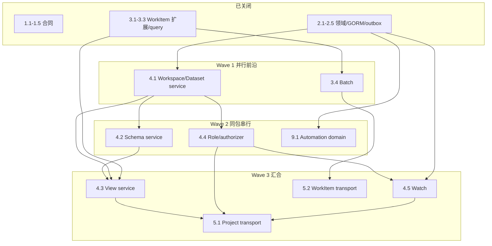

# Project Data Workspaces 执行 DAG

Change：`workbench-project-data-workspaces-v1`  
快照：2026-08-25（4.1/4.2/4.4 关闭后）  
进度：19/62（3.4 writer 进行中）。本文件只排本 change 的可并行叶子；不归档整个 change（13.3）。

## 1. 已关闭

`0.1–0.3`、`1.1–1.5`、`2.1–2.5`、`3.1–3.3`。

## 2. 当前前沿（可立即开工）

| 叶子 | Lane | 依赖 | 独占路径 | 验证 |
| --- | --- | --- | --- | --- |
| **3.4** batch mutation | B | 3.1–3.3 | `service/internal/workitems/**`；必要时 `service/internal/repository/workitem_*.go` | `CGO_ENABLED=0 go test ./service/internal/workitems/... -run 'Batch\|Idempotency\|Partial' -count=1` |
| **4.1** Workspace/Dataset service | B | 2.1–2.5 | `service/internal/projects/service/**` | `CGO_ENABLED=0 go test ./service/internal/projects/service -run 'Workspace\|Dataset\|ProjectRef' -count=1` |
| **4.2** Schema service | B | 2.1–2.4 | 与 4.1 同包，**串行于 4.1 之后** | `CGO_ENABLED=0 go test ./service/internal/projects/... -run 'Schema\|Field\|Migration' -count=1` |
| **4.4** Role policy/authorizer | B | 0.1, 2.4 | 与 4.1 同包，**串行于 4.1 之后或并入 4.1 后半** | `CGO_ENABLED=0 go test ./service/internal/projects/... -run 'Role\|Permission\|Revoke\|HiddenField' -count=1` |
| **9.1** Automation domain | A | 1.2, 2.2 | `service/internal/projectautomation/domain/**`；migration 另租 `repository` | `CGO_ENABLED=0 go test ./service/internal/projectautomation/... -run 'Binding\|Trigger\|Mapping' -count=1` |

本波最多两个 writer：

1. **3.4**（WorkItem batch）
2. **4.1**（新 `projects/service` 包）

`4.2`/`4.4` 等 4.1 落地后由同一 writer 续做。`9.1` 等本波 repository 租约释放后再开，避免与 3.4 抢 `service/internal/repository`。

## 3. 结构 DAG

## 4. 路径租约

| Writer | owned_paths | shared_read | forbidden |
| --- | --- | --- | --- |
| 3.4 | `service/internal/workitems/**`；若必须：`service/internal/repository/workitem_store.go`、`workitem_models.go`、对应 `*_test.go` | proto/schema、`projects/domain`、现有 Create/Update | `service/internal/projects/service/**`、`projectautomation/**`、web |
| 4.1 | `service/internal/projects/service/**` | `projects/domain`、`projects/events`、`repository/project_store.go` | `workitems/**`、改 `repository/*.go`、web |

共享生成物（proto/SDK/catalog）本波不改。

## 5. 后续波次（不在本波实现）

- `4.3` 等 3.3+4.1+4.2
- `5.x` 等 4.1–4.5 与 3.4
- `6.x`/`7.x` Web 等 5.3
- `8.x` Canvas 等 4.3
- `9.2+` 等 4.4+9.1
- `10–13` 质量/证据/归档

## 6. 非目标

不并行打开其他 OpenSpec change。不 `openspec archive`。不新增 MaaS/Auctra GUI。
