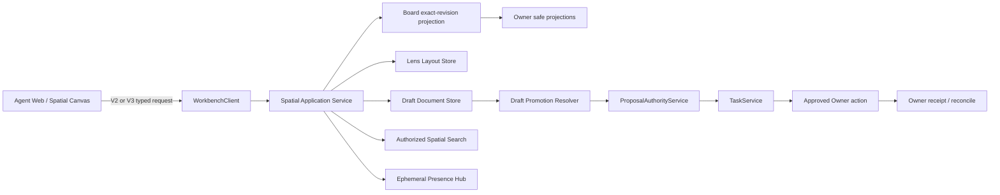

## Context

现有 Spatial Surface 已具备五个 Lens、exact board revision、viewport query、`far | medium | near` LOD、PixiJS/WebGL、worker hit-test/index、4,096 query budget、8,192 renderer cap、200 rich DOM cap、proposal-first layout 和 50k browser performance harness。当前主要缺口不是“有没有画布”，而是产品与投影层未形成成熟无限画布体验：

- far density 快路径只返回 tile density，Web renderer 只消费 nodes/relations，远景可能有数据却没有可见标记；
- 三档 LOD 把全局导航和近景富内容挤在同一层，无法表达 Atlas→Cluster→Object→Detail；
- Creative/Director 内容主要堆叠在固定 430px 内栏，和 Spatial Focus 的 conversation rail 叠加后压缩中央画布；
- 只有 pointer pan/zoom、选择和 plan layout，缺少可发现 HUD、小地图、适配选区、回中、全局搜索与跨 Lens 连续定位；
- 正式对象 layout、用户 camera preference、自由 Draft 和实时 presence 尚未分离，若直接扩展 Board 会复制 Owner state 或让高频 UI 写入污染 canonical revision；
- 当前 V2 是已被 SDK、HTTP、gRPC、JSON-RPC 与 Web 使用的稳定合同，不能通过重命名 enum 或改变同一 contract version 的 JSON shape 完成四级缩放。

本 change 必须同时服从 Agent-first 主壳、Proposal Authority、Owner remains owner、GORM persistence、三 wire transport parity、integration evidence 和增量兼容政策。

## Goals / Non-Goals

**Goals:**

- 把 Spatial Surface 完善为可信语义主画布与项目持久草稿层，而不是恢复独立 Canvas 主壳。
- 让五个 Lens 共享核心能力合同，并保留各自最适合的空间语法。
- 提供四级语义缩放、稳定导航控件、全局搜索、跨 Lens 上下文和 1024px 桌面可用布局。
- 将共享 Lens layout、用户 view preference、Draft document 和 ephemeral presence 分离持久化与版本语义。
- 让 Draft 选择集通过服务端解析和 ProposalAuthority 正式化，正式业务 mutation 继续走唯一 Task/Owner 链。
- 保持 50k addressable object 基线和现有性能门，修复 Atlas/Cluster 空白与容器尺寸漂移。
- 通过 additive V3 并行合同演进，不破坏 V2 consumers。

**Non-Goals:**

- 不把自由白板对象直接写成 Owner canonical state。
- 不实现完整 Miro/FigJam 功能集、全量自由绘图格式、演示文稿产品或任意插件对象。
- 不实现全员镜头强同步、无限 presence fan-out 或 CRDT 领域状态机。
- 不在 Workbench 复制 Scaena、Eikona、Anatomia、Auctra、Sonora、Ordo 的领域规则、执行状态或交付终态。
- 不在本 change 移除 V2、修改既有 protobuf field number、重解释 `far | medium | near`，或执行破坏性数据迁移。
- 不实现 `<1024px` 的完整无限画布编辑器；移动端继续使用只读/审查/深链路径。

## Architecture



### State ownership

| 状态 | Owner | Revision/寿命 | 是否可直接 UI 写入 |
| --- | --- | --- | --- |
| 领域对象、业务关系、状态、receipt | 对应 Owner/Task/Proposal service | Owner revision | 否，必须 proposal/action |
| Lens 共享位置、region、默认顺序 | Workbench Lens Layout service | `layoutRevision` | 是，expected revision + idempotency |
| Draft object/connector/frame | Workbench Draft service | `draftRevision` + object revision | 是，bounded patch |
| camera、active Lens、filter、rail tab、minimap 折叠 | Workbench user view preference | user/project revision | 是，debounced preference save |
| selection、hover、drag preview | Browser | 当前交互 | 是，不持久化 |
| cursor、remote selection、member heartbeat | Presence hub | TTL 15 秒 | 是，节流且不进入 audit history |

## Decisions

### 1. Spatial Canvas 是 `/agent` 内的上下文模式，不是第二主壳

普通 `/agent` ingress 默认 conversation；具有可信 project/DSH/spatial context 的 ingress 默认 Spatial Focus；用户显式选择的 mode 作为项目偏好恢复。Agent timeline/composer 始终存在，Spatial Canvas 不创建第二 composer、第二 session stream 或第二 Task control plane。

布局规则：

- `>=1440px`：中央 canvas + 右侧 context area；Timeline/Agent 与 Inspector 可并排，composer 固定在 Agent 区底部。
- `1024–1439px`：中央 canvas 保留至少 640px；右侧单一 320–384px context rail 以 Timeline/Inspector/Review/Evidence 标签切换，composer 始终可见。
- `<1024px`：不挂载完整 renderer/editor；显示可搜索的对象列表、当前选择摘要与 Owner deep link，保持 truthful desktop requirement。

Creative/Director、Workflow 或其他 Lens 不得再在 canvas 内追加固定宽度业务侧栏。专业详情统一进入 context rail 或有界 overlay。

### 2. 五个 Lens 共享能力合同，使用不同投影语法

每个 Lens 必须支持：导航、全局搜索、选择/多选、Draft、布局、proposal、运行/评审/证据入口、truthful availability、导出/深链和可访问对象列表。

视觉语法固定为：

- Creative：Project/Show→Episode/Sequence→Scene→Shot/Asset 的 Frame/Storyboard/时间顺序。
- Workflow：阶段泳道、DAG、关键路径、阻塞依赖。
- Run：状态/时间泳道、当前步骤、等待审批、失败与 reconcile。
- Review：评审队列、比较区域、决策状态、缺失证据。
- Evidence：Source→Claim→Decision/Receipt→Artifact 的 provenance 结构。

同一 Owner ref 在不同 Lens 共享 identity、freshness 和 Owner revision，但使用独立 Lens placement/region。切换 Lens 时保留 selected refs；新 Lens 有投影则平滑定位，无投影则显示 `not_projected_in_lens` 和相关对象，不伪造坐标。

### 3. V3 新增四级语义缩放，V2 保持原样

新增：

```text
SpatialSemanticLevelV1 = atlas | cluster | object | detail
SpatialViewportQueryV3
SpatialViewportResponseV3
SpatialRegionV1
```

默认客户端阈值与 5% hysteresis：

| Level | Zoom | 主要内容 |
| --- | --- | --- |
| `atlas` | `<0.30` | region 轮廓、tile density、状态热区、异常计数 |
| `cluster` | `0.30–<0.70` | cluster、region title、关键状态和样本对象 |
| `object` | `0.70–<1.30` | 轻量 object card、选中/搜索关系、布局手柄 |
| `detail` | `>=1.30` | bounded rich overlay、thumbnail、安全摘要和内联 presentation controls |

V3 query 继续包含 surface ref、expected revision、bounds、zoom bucket、cursor、filter 与 max primitives，并使用 `semanticLevel` 替代 V3 内部的旧 LOD 字段。V3 response 返回 `regions`、tiles/density、clusters、nodes/relations、provenance 和 renderer capability；不把 Owner 富 payload 塞入 viewport。

V3 service 可以复用 Board 的 `far/medium/near` 内部查询：`atlas→far density`、`cluster→far/medium cluster`、`object→medium/near primitive`、`detail→near primitive + lazy detail projection`。映射是服务内部实现，不改变 V2 wire identity。

兼容方式：新增 `QuerySpatialSurfaceV3` 和 V3 HTTP/JSON-RPC identity；旧 `QuerySpatialSurface` 只收发 V2。SDK 同时导出 V2/V3 type/client method；V2 至少保留至 V3 GA 后一个发布周期，本 change 不发 removal warning。

### 4. Region、关系和可访问列表是一级投影

`SpatialRegionV1` 只包含 safe layout metadata：`regionRef`、`kind=section|frame|lane`、`parentRegionRef`、bounds、title、status token、count 和 default collapsed state。Region 不保存 Owner 内容或业务完成状态。

关系显示策略：

- Atlas 不画 individual edges；只画 region adjacency/flow hint。
- Cluster 只画跨区关键路径和 selected/search-highlighted relation。
- Object/Detail 默认弱化关系；hover、选择、过滤或“显示此关系类型”时增强。
- relation label 和 arrow 不进入全量 DOM；只对当前 focus path 挂载 bounded overlay。

无障碍对象导航器独立于 WebGL overlay：按当前 Lens/filter 返回最多 200 个可键盘浏览的 visible/search-hit items，支持 focus、locate、inspect、multi-select 和 announce。Atlas/Cluster 的 DOM overlay 可以为 0，但对象导航器与 cluster/region accessible summary 不得为空。

### 5. 导航 HUD 与上下文工具分层

常驻 HUD 仅包含：Lens switcher、breadcrumb/status、Draft toggle、zoom in/out/percentage、fit lens、fit selection、recenter、interactive minimap、global search 和 command palette。小地图显示 region、cluster、viewport、selection 和 remote presence；默认可折叠，支持 click/drag 定位，不展示 Owner private data。

快捷键固定：`Space` 临时平移、`V/Esc` 选择、`H` hand、`+/-` zoom、`Shift+1` fit Lens、`Shift+2` fit selection、`Ctrl/Cmd+F` spatial search、`Ctrl/Cmd+K` command palette。Draft 模式通过显式按钮进入，快捷键由 command palette 显示和用户设置，不抢占文本输入。

正式对象 context toolbar 只提供 Inspect、Focus、Compare、Locate in Lens、Add reference to Draft、Plan layout、Propose change。Draft toolbar 提供 style、connect、group/frame、lock、delete、promote selection。不可用 action 保留 disabled reason。

### 6. Lens Layout 与用户 View Preference 分开

`SpatialLensLayoutV1` 由 Workbench 服务保存共享 geometry、region membership、z-order 和 default arrangement；patch 使用 `expectedLayoutRevision`、idempotency key 和 closed operations。拖动正式对象只修改 Lens placement，不改变 Board/Owner geometry 或业务关系。

camera、active Lens、filter、temporarily collapsed/hidden refs、context rail tab 和 minimap state 使用 user/project scoped `SpatialViewPreferenceV1`；500ms debounce 保存，写失败不影响 canonical projection，UI 标记 preference unsaved 并允许重试。

自动布局先返回 preview；用户接受后提交 layout patch。布局 proposal 不是 Owner mutation，不进入 TaskService；若布局建议同时修改业务依赖，则业务部分必须拆为 canonical proposal。

### 7. Draft 使用版本化 operation log，不引入领域 CRDT

Draft object kinds 固定为 `note | text | ink | connector | frame | reference`。每个 object 包含 safe draft ref、lens kind、geometry、style token、bounded text/ink payload、object revision、author safe ref 和 lifecycle `active | locked | promoted | deleted`。`reference` 只引用 authorized Owner safe ref/revision。

`PatchSpatialDraftDocument` 携带 document expected revision、idempotency key 和最多 200 个 closed operations。不同 object 可在一次 patch 原子提交；同 object 使用 expected object revision 防止覆盖。冲突时客户端 refetch，只自动重放未与远端触碰同一 object/field 的操作；其他冲突进入显式 compare，不使用静默 last-write-wins。

拖动过程只发送 presence preview，pointer-up 才提交 geometry patch。Undo 生成当前用户最后一组可逆 operation 的 inverse patch，不回滚其他用户的新操作；已 promoted object 不允许通过 undo 删除 Owner 结果。

### 8. 轻量 Presence 是可降级的临时层

presence 只包含 member safe identity、cursor world coordinate、selected draft/canonical refs、active Lens 和 heartbeat；不包含 raw text、Owner payload、private path 或 tool args。客户端 cursor 最多 10Hz，selection/viewport 最多 2Hz；heartbeat TTL 15 秒；单 surface 最多投影 32 个活跃成员，超限只显示成员数和 active Lens 分布。

presence 不进入 Draft revision、audit、backup 或 lifecycle export。stream 不可用时 Draft 仍可通过 revision/refetch 协作；UI 显示 `presence_degraded`，不能把 absence 解释为无人编辑。

### 9. Draft 提升是选择集级 canonical proposal

`PromoteSpatialDraftSelection` 只接受 surface/draft refs、expected draft/layout/board revisions、target Lens、idempotency key 和可选 closed target hints。服务端重载 Draft、Owner visibility、type registry、current revisions 和 policy，生成映射预览、影响摘要、依赖、风险、成本与目标 Owner；浏览器不能提交最终 Owner action/basis 权威。

一次提升最多 2,000 个 Draft operations，与现有 `SpatialChangeSetProposalV1` 上限一致。接受后进入 ProposalAuthority→TaskService→Owner receipt/reconcile；成功映射的 Draft 标记 `promoted` 并保存 proposal/Owner safe refs。partial/unknown 不删除 Draft，`unknown_accept` 只允许原 attempt reconcile。

### 10. 有界性能与降级预算是合同

固定 reference fixture：50,000 addressable objects、75,000 relations、1,000 regions，1440×960 Chromium。

| 层级 | 投影/渲染预算 |
| --- | --- |
| Atlas | <=512 density/region marks；0 individual edges；0 rich DOM |
| Cluster | <=1,024 clusters；<=128 labels；只绘制关键/选中关系 |
| Object | default <=4,096 primitives；renderer hard cap 8,192；关系按需 |
| Detail | <=4,096 primitives；<=200 rich DOM；详情 lazy fetch |

继续使用 server viewport/tile query、overscan、spatial index、worker hit-test/cluster、WebGL culling、batched update 和 memoized selectors。`ResizeObserver` 必须同步 renderer host 的真实 width/height；layout/rail/mode 改变后不得继续使用固定 1280×760 query bounds。

性能 gate 延续：cold first frame <=2,500ms、warm <=1,200ms、highlight <=50ms、frame P95 <=20ms、long task count <=1、JS heap <512MiB、rich DOM <=200。WebGL/worker/context loss 时切换 bounded accessible renderer/list，显示 degraded reason，并能在 context restore 后从 last canonical snapshot 重建。

## Contract Evolution Classification

| Surface | Classification | Policy |
| --- | --- | --- |
| protobuf/RPC/HTTP/JSON-RPC | additive | 新 message/field number/method/path；V2 不变 |
| TypeScript SDK public API | additive | 新 V3 exports/methods；V2 exports 不变 |
| database | additive expand-only | 新 table/index；无 rename/drop/narrow |
| config/capability | additive | 新 default-off flags；旧 key 不改义 |
| UI deep links | additive | 旧 `/agent?view=` 保留；新增参数 closed-normalize |

`breaking_surfaces: []`。若实现阶段发现必须重解释 V2、移除字段/enum/method 或让旧 client 接收新 shape，必须停止并另建带 deprecation/removal release 的 OpenSpec，不得扩大本 change。

## Risks / Trade-offs

- **[五 Lens 齐平造成范围膨胀]** → 以共享能力合同和通用 kernel 为齐平标准，专业节点/详情按 Owner contract 分阶段启用；不复制五套状态机。
- **[Draft 变成第二领域真相]** → Draft lifecycle、distinct styling、Owner reference 和 explicit promotion 强制分层；任何业务状态/依赖/终态不允许只存在 Draft。
- **[高频协作写放大]** → drag preview 走 ephemeral presence，pointer-up 才 patch；patch/object 上限、节流和 TTL 固定。
- **[V3 严格 JSON consumer 不兼容]** → 新 method/version/path 返回 V3，旧 V2 method 永远返回 V2 shape；transport parity 分别锁定。
- **[1024px 信息拥挤]** → 单一 context rail + tab、composer pinned、canvas min 640；专业固定内栏禁止。
- **[跨 Lens 定位导致迷失]** → stable selection、breadcrumb、animated locate、minimap viewport 与 `not_projected_in_lens` 明示。
- **[远景只追求性能而不可理解]** → Atlas/Cluster 非空视觉与 accessible summary 作为验收项，不再用“DOM 为零”代表正确。
- **[presence 暴露用户行为]** → safe identity、低频坐标、TTL、成员上限、无持久化；由 capability/permission 控制。

## Migration Plan

1. 先增加 V3 proto/schema/SDK method 与 contract tests，V2 继续作为默认；新增 default-off capabilities。
2. 修复 V2/V3 共用 renderer 的 density/cluster 可视化、ResizeObserver、HUD、search/minimap 与 1024px context rail；不要求启用 Draft。
3. 增加 Lens Layout/User View Preference 的 expand-only GORM tables/services；V3 canary principal 开始使用独立投影，V2 Board geometry 不迁移。
4. 增加 Draft Document、event、patch/undo 与 watch；先单用户持久化，再开启多用户 revision merge。
5. 增加 presence hub 和 selection promotion；promotion 先只生成 Review proposal，accept capability 延续既有 Proposal Authority cohort。
6. 逐 Lens 完成视觉语法与核心能力 parity，运行 1024/1440/1920、a11y、reconnect、degraded 和 50k performance evidence。
7. V3 达到 browser/contract/performance gate 后由 capability cohort 晋级；V2 继续保留至少一个发布周期。任何 V2 removal 必须另建 change。

Rollback：关闭 `spatialCanvasShellV3` 后恢复现有 mode layout；关闭 `spatialViewportV3` 后只调用 V2；关闭 Draft/Presence 后保留已有 Draft tables/records 为只读，不删除数据；已创建 proposal/Task/receipt 继续由既有 authority 完成或 reconcile。

## Open Questions

产品与合同决策已在设计访谈中冻结，不留给实现者重新选择。实现阶段仅剩外部 Owner readiness 依赖：未提供稳定 typed projection/action/receipt 的 Owner 节点必须显示 `needs_contract`，不得以 fixture 晋级为可用。
