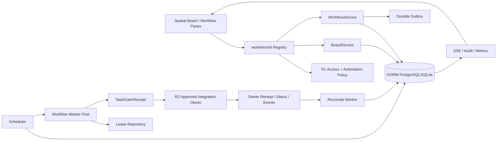
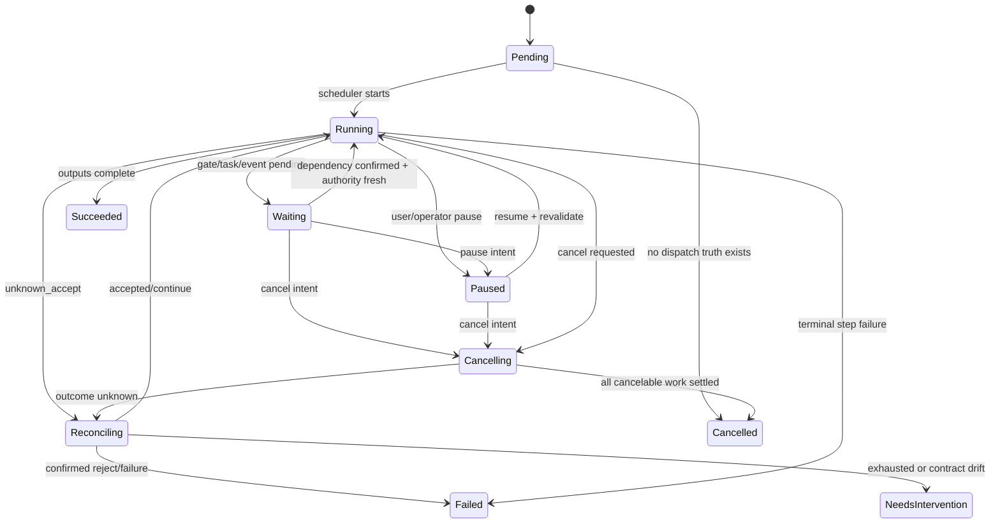

# Workbench Spatial 与 Durable Workflow R4 设计

## Context

R3 将提供 Asset、WorkItem、Task/Gate、Team、Delivery safe refs 和 Pane Desktop。Spatial Board 需要在这些对象之上提供关系化观察与组织，但不能成为 Asset/WorkItem/Owner canonical state。自动化需要跨时间等待审批、Owner 事件和人工处理，并能在 worker/进程/网络故障后继续；因此执行状态必须持久化在服务端，浏览器只设计、提交和观察 workflow。

R4 的信任边界：R1 提供 actor/tenant/membership/delegation，R2 提供 Owner operation/capability/receipt/reconcile，R3 提供 Asset/WorkItem/Task/Delivery safe refs。任何依赖未晋级时，对应 node/step 保持 `needs_contract`/`degraded`，不能靠本地脚本或 direct Owner call 绕过。

## Goals / Non-Goals

**Goals:**

- 支持 10k node 的 tenant-aware typed Spatial Board、viewport query、LOD/virtualization 和可访问交互。
- 支持版本化、可审批、可暂停/恢复/取消、可 fault-recovery 的 durable workflow definition/run/step。
- 通过 lease、outbox、idempotency、Task/receipt/reconcile 和 operator controls 防止重复或伪造 Owner mutation。
- 支持 automation actor、quota/cost/approval policy、kill switch、dead-letter、audit/SLO/runbook。

**Non-Goals:**

- 不实现任意 JS/shell/Python、用户上传代码、通用 BPMN、无限循环或动态网络请求。
- 不在浏览器执行跨 Owner saga、持有 service credential 或判断 mutation 是否成功。
- 不承诺跨数据库/Owner exactly-once；合同明确 at-least-once transport + idempotent acceptance + reconcile。
- 不自动生成通用 compensation/rollback；只有显式建模、Owner 支持且重新授权的 compensation binding/plan item 才可运行。
- 不让 Board delete/cascade 修改 canonical Asset/WorkItem/Owner object。

## Architecture



## Decisions

### 1. Board 保存图组织，不保存 canonical object

BoardNode 保存 node id/type、tenant/workspace/board、target safe ref/type/version、position/size/group、display overrides 的受控字段、style token、tombstone 与 revision。允许 node types：`asset`、`work_item`、`project`、`member`、`task`、`delivery`、`workflow_definition`、`workflow_run`、`note`（只允许 Workbench safe note summary）。

BoardEdge 保存 typed relation、source/target node、direction、label token、可选server-issued workflow binding ref与revision，不接受任意metadata map。首版关系固定为`relates_to`、`depends_on`、`blocks`、`assigned_to`、`produces`、`reviews`、`handoff_to`、`uses_asset`、`derived_from`、`feeds_input`，并按source/target matrix验证。Group membership使用`BoardNode.groupRef`，不使用`belongs_to` edge。Board relation只表达用户组织视图；除非另行调用对应领域 service，它不修改WorkItem dependency、Owner graph或Workflow执行状态。

删除 node/edge 只删除 Board projection；target object 删除/失权时 node 转 tombstone。跨 tenant ref、未知 type/relation、self-loop 或不允许组合在服务端拒绝。

### 2. Board mutation 使用 optimistic version，不先引入 CRDT

Board/Node/Edge mutation 使用 expected revision 和事务；Web 可做临时 optimistic drag，但 conflict 时回滚并提供 reload/reapply。R4 不引入 CRDT，因为当前需求是结构化 board 编辑而非离线多主文本协作；若并发冲突率/离线需求有实测证据再独立评估。

undo/redo 使用用户会话内 command history；已持久化远程 mutation 的 undo 会发送反向 typed command并重新授权/version check，不直接修改本地状态冒充成功。

### 3. Viewport query、LOD 与 virtualization 是服务合同

服务按 board revision、viewport bounds、zoom bucket、filters、node types 和 page/cursor 返回可见 node/edge cluster。LOD：

- far：cluster/count/status摘要；
- medium：node card safe summary与有限 edge；
- near：完整允许字段和 interaction handles。

查询限制 bounds、面积、node/edge数量、filter complexity、page size 和 timeout。Web 只渲染可见/overscan，使用 worker/增量 layout 处理重计算，10k node benchmark 不允许把所有 detail/subscription 常驻内存。

### 4. WorkflowDefinition 是不可变发布版本

Definition 包含 id/name/version/status、tenant/workspace、trigger、typed inputs/outputs、steps/edges、required capabilities/scopes、quota/cost policy、timeout/retry policy、approval policy、created/published audit 与 checksum。`draft` 可编辑，`published` version 不可变；修改产生新 version，运行固定引用 definition version/checksum。`deprecated` 不接受新 run，但旧 run 可按 pinned version继续或由 operator 决策。

允许 step types：

- `read_projection`：读取批准的 safe projection。
- `condition`：受限 typed expression，只访问显式 safe inputs/step outputs。
- `submit_operation`：通过 Operation registry/TaskService 调用一个 Owner/Workbench mutation。
- `wait_task`：等待 Task terminal/gate/reconcile state。
- `approval`：创建/等待 Gate，绑定 actor/membership/policy version。
- `wait_event`：等待批准 source/type/ref/version/cursor 与 deadline。
- `delay`：有上限的 durable timer。
- `emit_delivery`：请求批准的 delivery/handoff operation。

禁止 arbitrary URL、shell、script、dynamic module、unbounded loop。循环只能通过显式 bounded iteration step（如未来加入），R4 首版 DAG 无环。

### 5. WorkflowRun/Step 使用明确状态机



Step states：`pending`、`ready`、`leased`、`running`、`waiting_approval`、`waiting_owner`、`reconciling`、`paused`、`succeeded`、`failed`、`skipped`、`cancelled`。每个 transition 由 WorkflowService 验证并写 event/outbox；transport/worker/repository 不直接改状态。

### 6. Lease/claim/heartbeat 保障 crash recovery

ready step 由 scheduler 写 durable availability；worker 通过 repository 原子 claim 获得 `lease_id/owner/attempt/expires_at/fencing_token`。heartbeat 延长 lease；过期后其他 worker可 claim，但所有 state write 和 external dispatch都必须携带 fencing token/version，旧 worker 写入被拒。

数据库特定 claim（如 PostgreSQL `FOR UPDATE SKIP LOCKED`）若 GORM 无法表达，可集中在 repository queue adapter，使用参数绑定并按仓库 SQL exception policy记录理由；普通业务读写仍通过 GORM。

worker 在 dispatch前先持久化 attempt/idempotency/outbox intent，再调用 Task/Owner；进程崩溃后根据 durable intent/receipt/status reconcile，不能假设未发送。

### 7. Idempotency、retry 与 unknown_accept 语义固定

每个 `submit_operation` step 有稳定 operation idempotency key，由 run/step/definition version/input digest产生，并在 transport retry/worker reclaim 中保持不变。只有用户/策略显式创建新逻辑 attempt 才产生新的 attempt ref，但对已可能接受的 mutation仍必须先 reconcile。

自动 retry 只允许：

- dispatch 前确定未发送；
- Owner 明确返回 retryable rejection且未接受；
- bounded safe read；
- rate limit 按 `Retry-After` 且 operation contract允许。

timeout/network reset/5xx 后无法确认接受状态时进入 `unknown_accept/reconciling`。Reconcile 使用同一 idempotency/receipt/status/event，不自动重新提交。

### 8. Approval、permission 与 revoke 在执行时重新验证

Run 创建时保存 creator Principal safe refs、membership/policy version 与 requested automation actor；每个高风险 step dispatch 前重新验证当前 tenant、actor、membership、capability、cost、approval 和 definition policy。

Approval Gate 记录 scope、step/input digest、membership/policy version、expires_at 与 approver receipt。approval 后 input/definition/version/authority 任一变化使 gate stale，必须重新批准。membership/session revoke 后新 step fail-closed；已发送 mutation按 receipt reconcile。

Automation actor 与 human creator分离，使用 R1 独立 credential/delegation。workflow schedule不能扩大原 definition scopes或动态接受浏览器提供 owner URL。

### 9. Pause/resume/cancel 不伪造外部状态

pause 停止新 step claim和未发送 dispatch；已运行外部 mutation继续观察。resume 必须重新验证 definition/capability/authority/quota和stale approvals。

cancel 将 run 转 `cancelling`，取消未开始/可安全取消步骤；对 Owner 已接受的 operation 只有 capability声明支持 cancel 时才请求。Owner 未确认 cancel时保持 waiting/reconciling，不能仅因用户点击显示 `cancelled`。

### 10. Compensation 必须显式、受限、重新授权

通用 rollback无法保证。Definition 可为特定 side-effect step声明批准的 compensation binding；它不是 canonical executor step，而是独立 mutation plan item，必须固定 operation registry/schema digest，并具有单独 capability、permission、approval、idempotency、receipt与reconcile policy。原 step success不会因 compensation失败被改写；失败或authority revoke使 run 收敛为 `needs_intervention`，并保留 compensation attempt/evidence。

### 11. Durable outbox/event/audit 驱动可恢复观察

Workflow/Board state transaction 同时写 outbox event。publisher/worker使用 cursor/attempt幂等发送。SSE/API 返回 run/step/board events的source-local sequence、state version、occurred/observed time、safe refs、receipt/evidence refs；不保存 Owner raw payload或声称全局 exactly-once。

审计覆盖 definition publish/deprecate、run start/pause/resume/cancel、step claim/dispatch/retry/reconcile、approval、operator override、kill switch、quota/cost denial、Board ACL/relation mutation。

### 12. Operator controls 与 kill switch 是一等能力

Operations Pane/CLI/API 提供：worker readiness、queue/lease/outbox/dead-letter/reconcile lag、run/step safe state、pause/resume/cancel/requeue safe read、receipt lookup、evidence refs。Operator intervention必须授权、幂等、审计，并不得手工编辑 DB或伪造成功。

kill switches 至少按 workflow capability、definition、Owner operation、tenant 和全局 worker 分层。关闭只阻止新 claim/dispatch；已发送 mutation继续 reconcile。恢复前执行 compatibility/authority/queue checks。

### 13. Quota、cost 与 bounded execution

Definition/run/tenant设置 max steps、fan-out、parallelism、duration、attempts、wait time、input/output bytes、events、Owner calls和estimated cost。超限转 waiting approval/failed/paused，不能静默继续。

Scheduler按tenant公平队列和全局/Owner concurrency限制，防止单 tenant/definition耗尽 worker。Metrics labels低基数，不包含 run/tenant ids原值。

### 14. Board 与 Workflow 的集成只通过 typed refs

Board 可展示 definition/run/step node并通过 allowed command启动/暂停/观察 workflow；连接 Asset/WorkItem/Delivery node可生成 workflow draft input mapping，但发布前必须服务端验证 relation/type/scope。画布连线本身不执行 mutation。

Workflow completion可更新 WorkItem link/evidence、Inbox/Delivery projection，但不直接改 Owner canonical state或自动完成 WorkItem acceptance。

### 15. Asset 编排与 Scaena 创作交接保持合同门控

Spatial Board 的跨 Pane 拖放只传递版本化 `{assetRef, sourceVersion}`；标题、摘要、prompt、媒体 bytes、私有路径、任意 URL 和 Owner payload 都不得进入 `DataTransfer` 或 Board mutation。落点先由 Board 重新读取/授权 Asset safe projection，并以当前 Board revision、新 idempotency key 和固定安全尺寸提交既有 `CreateNode(targetType="asset")`；receipt 到达前不渲染本地 persisted asset node。

Asset 已 tombstone、permission hidden、非 current、stale、rights 未 verified、scope/version 不匹配或 capability 未就绪时，UI 必须拒绝创建并说明安全原因。没有已提升的 Asset consumer contract 时，入口保持 `needs_contract`，不得由浏览器猜测可用性或拼接请求。

Scaena 只接受 Owner 返回的 typed `OwnerDeepLinkV1` descriptor，并且必须同时存在 allowlisted host bridge 才显示“在 Scaena production 中打开”。Workbench 不构造 URL、不保存 raw prompt、不提交生成请求，也不以本地状态伪造生成或交接成功；任何 descriptor/bridge 缺失都显示 `needs_contract`。

## Persistence and Migration

建议 GORM tables：

```text
boards, board_nodes, board_edges, board_templates, board_revisions
workflow_definitions, workflow_definition_versions, workflow_steps, workflow_edges
workflow_runs, workflow_step_runs, workflow_attempts, workflow_leases
workflow_worker_instances
workflow_gates, workflow_receipts, workflow_events, workflow_outbox
workflow_dead_letters, workflow_interventions, workflow_cursors
```

所有表包含 tenant、version/timestamps、必要 unique/index；lease/queue state有 fencing token和expiry。Migration additive；backfill/definition checksum/worker compatibility不满足时 readiness false。Rollback关闭 scheduler/worker/Board mutation flags，保留数据与只读观察，不删除进行中 run；旧版本不能识别新 definition version时禁止 claim。

`DatabaseTime`为了让claim、heartbeat、expiry与reclaim只使用数据库时间，在集中GORM repository内部执行固定、无参数、无用户输入的`SELECT CURRENT_TIMESTAMP`。这是数据库函数/时间权威的最小SQL例外，不允许扩散到handler、service、worker或普通业务查询；原子claim若后续需要额外SQL例外，仍须在`4.3b`单独证明GORM无法安全表达并补PostgreSQL并发证据。

## Readiness and SLO

- API readiness：DB/migration/registry/policy/Board/Workflow schema compatible。
- Scheduler readiness：DB、clock skew、queue scan、outbox/reconcile cursor正常。
- Worker readiness：supported definition/step contract range、service identity、Owner capability snapshot、lease heartbeat正常。
- 单个 Owner offline不让整个平台not-ready，但相关 steps/capability进入 waiting/degraded。
- queue/lease/reconcile lag超过阈值、worker contract mismatch或outbox无法推进时对应 workflow capability not-ready。

目标：step scheduling p95、lease recovery、reconcile lag、workflow success/error budget、10k Board interaction；最终数值由 R5 staging/canary evidence冻结。

## Worker Production Process Decision

R4正式冻结独立 `service/cmd/workbench-worker` pure-Go binary与deployment profile，不把生产scheduler/worker隐式嵌入`workbenchd`。Worker正常build/release保持`CGO_ENABLED=0`，以PostgreSQL DB time、GORM repository、lease/fencing、durable dispatch intent、receipt/reconcile和truth-preserving drain保证恢复；单Owner故障只降对应capability。

详细启动状态机、health/readiness、角色边界、lease字段、不变量、SIGTERM/SIGKILL处理、资源预算、W0-W9最小安全切片、故障矩阵与R5制品交接见 `details/workbench-worker-production-process-contract.md`。该合同明确禁止使用stub、sleep loop、`workbenchd`副本或永久claim-disabled binary关闭R5 production artifact gate。

## Security and Data Safety

- 所有 refs tenant-bound、object-level authorized；Board cache/viewport/query按R1 context隔离。
- Definition input schema/condition expression严格类型/大小/深度/operation allowlist；禁止SSRF、arbitrary URL、script/shell。
- Worker credential来自批准secret source，不进入DB definition、event、log、trace、evidence。
- Owner payload只在connector内短暂处理并投影safe result；workflow保存digest/ref/status/receipt。
- operator接口需要强权限/re-auth/审计，默认只读；危险干预不得通过普通 UI隐藏入口。

## Migration Plan

1. 冻结 Board/Workflow contracts、state/transition/error/step types与four-transport parity。
2. 建立GORM schema/migration/outbox/lease repository及deterministic domain tests。
3. Board read/viewport canary，再开放typed mutation/template。
4. Workflow definition draft/publish与read-only run simulator（不dispatch mutation）。
5. 启用read_projection/condition/delay/wait_event低风险steps。
6. 接入Task/Gate与一个synthetic/allowlisted Owner operation，验证lease/crash/idempotency/reconcile。
7. 加入approval、automation actor、pause/resume/cancel/operator/kill switch。
8. Scaena/Auctra等真实test project canary、10k board、fault injection、soak和rollback。

## Test and Evidence Plan

- Domain/property：relation matrix、Board version/conflict、workflow DAG、state transitions、bounded expression、retry classification、fencing token。
- Repository/concurrency：claim/heartbeat/expiry/reclaim、outbox、duplicate event、transaction rollback、PostgreSQL race。
- Integration：Task/Gate/receipt、Owner timeout/unknown_accept/status reconcile、membership revoke、approval stale、service identity rotation。
- Fault injection：worker crash before/after dispatch、DB failover、clock skew、network reset、Owner 429/5xx/offline、outbox backlog、kill switch。
- Browser：10k Board LOD、keyboard/touch、workflow designer validation、run/step/operator rescue。
- Security：cross-tenant refs、SSRF/script injection、credential confusion、operator privilege、quota abuse。
- Evidence：所有 integration/system/e2e/performance/soak/drill写六件套和definition/contract/policy digest、run/receipt safe refs、redaction status。

组件交接边界、能力状态、依赖DAG、完整用户工作流、原子交付包、Pane全屏/安全预览验收与非Demo退出条件统一见 `details/workbench-production-integration-handoff-plan.md`。

R1 Identity、R2 Owner与R3 Desktop/Daily当前可消费能力、缺失合同、step/node依赖、`needs_contract`安全诊断和跨项目closeout门见 `details/r1-r3-contract-dependency-audit.md`。

Spatial Board资源字段、node type registry、relation matrix、group语义、geometry/LOD/template limits、command/query/event/error surface与`1.1a-1.1d`原子交付见 `details/board-contract-delivery-matrix.md`。

## Risks / Trade-offs

- **[Workflow engine scope膨胀]** → 首版固定typed DAG steps，不实现任意脚本/BPMN/循环；新step type需独立contract/evidence。
- **[Exactly-once幻觉]** → 明示at-least-once transport + idempotency + receipt/reconcile，所有unknown outcome可见。
- **[Lease race导致重复dispatch]** → fencing token、durable intent、stable idempotency、Owner receipt/status；无证据不自动retry。
- **[Board被误当domain graph]** → typed projection relation与domain mutation分开，delete不级联canonical object。
- **[Operator override破坏审计]** → re-auth/strong scope、typed intervention、双人approval（高风险）、不可手改DB。
- **[10k node拖垮浏览器]** → viewport query/LOD/virtualization/suspend/perf gate。

## 已冻结的后续决策门

- PostgreSQL queue claim默认使用GORM事务与CAS；只有two-worker correctness或性能证据证明GORM无法满足时，才允许在单一repository queue adapter内使用参数化数据库特定语句，并记录回滚路径。
- R4 condition不引入通用CEL或用户表达式语言；仅实现由schema验证的allowlisted typed predicate AST，限制节点数、深度、操作符、字段来源与执行预算。未来CEL需要独立dependency/security review。
- 首批canary固定为两条：本地read/approval无mutation链用于验证等待/恢复，以及具备receipt/status/reconcile合同的Eikona test-tenant mutation链。若`0.1`证明Eikona合同未达到门槛，`0.2`必须选择同等合同成熟度Owner并更新canary baseline，不得回退fixture作为真实canary。
