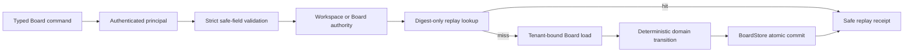

# Board Aggregate Lifecycle 实施基线

## 1. 完成范围

Fresh local aggregate evidence（2026-08-02 14:06–14:15）：`task test:board-transport-parity` 通过，证据为 `temp/integration-test-runs/20260802140612-55f27934-7d0b-4a99-afcc-550d90954163/`，`status=passed`、`duration_ms=534494`、`redaction.total_redactions=0`；该证据覆盖 owner-change、CRUD/list、viewport、event/undo、HTTP、JSON-RPC、gRPC、typed SDK、race/vet/fuzz/build 的 local/component parity，不替代真实 PostgreSQL lock/restart、managed publisher、Owner provider 或 production gate。

截至 2026-07-20，R4 `2.2b` 已完成 Board aggregate 的 create、rename 与 tombstone 生产服务层：

- `BoardService` 从认证 context 提取 principal；未认证请求在参数细节验证前 fail-closed；
- create 对 workspace 执行 authority，rename/tombstone 对 Board safe ref执行 authority，拒绝后不调用 replay/load/commit repository port；
- 提供 `IdentityAuthorizer` 对接 Identity `AllowedActions`，tenant-drift decision一律拒绝；本地单用户运行保留显式 `ScopeAuthorizer`；
- 原始 idempotency key只在服务调用栈内计算 `sha256` digest，不进入 repository command、event、receipt 或数据库；
- request digest由 operation、tenant、resource、expected revision与规范化业务字段确定性生成，不包含原始 key；
- create 在生成 Board/event/audit refs前查询 workspace-scoped replay ledger，因此 retry不创建第二个 Board；
- rename/tombstone 在加载 Board snapshot与执行 revision check前查询 resource-scoped replay ledger，因此已经提交的相同请求不会误报 stale revision；
- preflight replay只优化正常 retry；事务内 replay/conflict仍保留，用于关闭并发检查与 commit之间的竞态窗口；
- rename 使用 expected revision，tombstone为 terminal state，后续 mutation不能复活 Board；
- 每个成功 mutation提交 lifecycle event与 `board.revision_committed`，返回 contract version、committed revision、event safe ref与 replay bit；
- service不实现 transport handler、Task状态机、generic JSON patch、target payload读取或模板占位能力。

实现资产：

```text
service/internal/boards/service.go
service/internal/boards/service_test.go
service/internal/boards/domain/mutation.go
service/internal/boards/ports.go
service/internal/boards/ports_test.go
service/internal/repository/board_store.go
service/internal/repository/board_service_test.go
Taskfile.yml
```

## 2. 调用顺序与安全不变量



固定不变量：

1. 未认证或未授权请求不得调用任何 Board repository port。
2. tenant从 principal获得，不接受客户端提供或覆盖。
3. replay lookup至少由 tenant、operation、digest与 workspace/resource scope约束。
4. 相同 idempotency digest + 相同 request digest返回原 committed revision/event；不同 request digest返回 conflict。
5. replay miss仍必须在 transaction中再次检查 ledger，不能把 preflight lookup当成锁。
6. rename/tombstone只基于 active Board与 exact expected revision推进一次 revision。
7. tombstoned Board是 terminal；不存在 resurrection或隐式 hard delete。
8. Board名称、reason code、refs、event refs、audit refs与时间在 commit前验证；错误不返回原 key或 Board name。

## 3. 验证与证据

正式目标：

```bash
task board:service-lifecycle:test
task test:board-service-lifecycle:component
```

目标覆盖：

- Board/domain/repository focused tests；
- Go vet；
- 真实 GORM SQLite create/replay/conflict/rename/tombstone/terminal链路；
- 两个 service writer竞争同一 expected revision，恰好一个成功；
- race detector重复 10 次；
- winner/loser之后 mutation/revision/event/outbox count无幽灵记录；
- authentication-before-validation、authority-before-replay/load、Identity tenant drift、raw-key rejection；
- `git diff --check`。

最终 component evidence：

```text
temp/integration-test-runs/20260720214221-54eb13f1-7ee5-4665-801c-b994736cbb37/
status=passed
exit_code=0
redaction=enabled
```

## 4. 未完成边界

- `2.2b` 尚未实现 Node/Group/Edge CRUD与typed inverse；由 `2.2c` 负责。
- Template lifecycle/apply/undo仍由 `2.2d` 负责。
- 本轮没有 live PostgreSQL endpoint，不声明 PostgreSQL production evidence；最终 parity/connection/restart/secret gate属于 `2.2e`。
- Board lifecycle service 已绑定到 local runtime 的 HTTP、JSON-RPC、gRPC 与 typed SDK mutation/read path；`task test:board-lifecycle-runtime:component` 及 `temp/integration-test-runs/20260801234631-ce58c7ed-ffa8-4266-ae89-d7a0d7ee97ee/` 验证 Create→Rename→Tombstone→Read 的 revision/receipt parity，`status=passed`、`redaction.total_redactions=0`。该证据只覆盖 local/component runtime；managed service、隔离 PostgreSQL、restart/recovery、R1/R2、provider 与 production/browser gates 仍保持 open，未宣称远程 Board API production available。
- event publisher/watch、viewport query、target resolver与 Web Spatial Board仍分别属于 `2.3`、`2.4` 与 Lane C。

Fresh parallel aggregate recheck（2026-08-02 16:52–17:01）：`task test:board-transport-parity` 通过，evidence 为 `temp/integration-test-runs/20260802165206-40e446f5-ff72-4c66-9213-a5730ab95bf6/`，`status=passed`、`duration_ms=565840`、`redaction.total_redactions=0`；当前 dirty source 的 owner-change、CRUD/list、viewport、event/undo、HTTP、JSON-RPC、gRPC、typed SDK、race/vet/fuzz/build aggregate 均通过。该证据仍只证明 local/component parity，不关闭真实 PostgreSQL、managed publisher、跨进程 restart、Owner provider、R1/R2、browser 或 production gate。
