# BoardService Transaction / CRUD / Undo 交付计划

## 1. 目标与边界

本计划把原 `2.2` 拆为可独立验收的 transaction foundation、aggregate lifecycle、graph CRUD、template/undo 与并发门禁。最终目标不是内存 canvas demo，而是所有 mutation 经 authority、tenant、expected revision、idempotency、domain validation、GORM transaction、audit、event/outbox 后才返回 committed receipt。

BoardService 不复用 `core.Task` 状态机，不让 HTTP/gRPC/JSON-RPC handler 持有 feature-specific transition，也不把任意 JSON patch、raw idempotency key、Owner payload 或客户端生成 revision 写入数据库。

## 2. 调用与事务流

```mermaid
flowchart LR
  T[HTTP / gRPC / JSON-RPC / SDK] --> S[BoardService typed command]
  S --> P[Principal + Authority]
  P --> R[Target / Capability Resolver]
  R --> D[Deterministic Board Domain]
  D --> C[BoardStore Commit Command]
  C --> I[Idempotency Ledger]
  I --> X[Expected Revision CAS]
  X --> G[Typed Graph Writes]
  G --> V[Revision + Audit]
  V --> E[Events + Outbox]
  E --> O[(GORM PostgreSQL)]
  O --> Q[Committed Receipt / Typed Inverse]
```



事务顺序固定：

1. 从 context 读取认证 principal，验证 tenant/workspace/resource authority。
2. 严格验证 idempotency key，但只计算并传递 digest，原 key 不进入 repository、event、error、trace。
3. 对 create 之外的 mutation 读取 tenant-bound Board snapshot；对 node/edge/group/template 读取所需最小 typed state。
4. target/capability resolver 返回 tenant-bound safe binding；domain 计算 normalized mutation 与 typed inverse。
5. repository transaction 先查询 mutation ledger：相同 digest + request digest 返回 replay；相同 digest + 不同 request digest 返回 idempotency conflict。
6. Board row 以 `tenant_ref + board_ref + expected_revision + active state` 做 CAS；CAS 失败不得写 graph/revision/event/outbox。
7. typed graph writes、revision、audit-safe mutation ledger、event 与 outbox 在同一 transaction 提交。
8. response 只返回 safe resource、committed board revision、event ref、replay 与 typed inverse metadata；不能返回原 idempotency key。

## 3. Persistence Contract

### 3.1 Mutation ledger

`board_mutations` 使用以下稳定字段：

```text
tenant_ref, workspace_ref, operation_type, idempotency_digest
request_digest, board_ref, board_revision
resource_type, resource_ref, event_ref, actor_audit_ref, committed_at_db
```

唯一 scope 为 `tenant_ref + workspace_ref + operation_type + idempotency_digest`，因此 `board.create` retry 在调用方尚不知道 `board_ref` 时仍能找到原接受结果。原始 key、request body 与 response body不落库。

### 3.2 Event / outbox

`boards.event_sequence` 是 source-local monotonic sequence。每次 mutation 至少提交一个 resource lifecycle event和一个 `board.revision_committed` event；批量 template apply 可提交多个 safe event，但 sequence 必须连续且与 outbox 一一对应。

Event 只保存 type、board/resource safe ref、resource revision、change kind、actor audit ref、reason code与数据库时间。Outbox 只保存 event ref、board ref、sequence、status、attempt count、available/published time，不保存 event payload blob。

### 3.3 Typed graph writes

Repository command 使用 typed upsert/tombstone lists：Board、Node、Group、Edge、Template/Version/children。不存在 generic map、SQL identifier、JSON patch 或 transport DTO。Repository 只执行 service/domain 已决定的 mutation，不重新实现 relation/state machine。

## 4. 原子子任务

### 2.2a Transaction foundation

- 定义 `BoardStore` load/commit/replay port、typed commit command/result与稳定 repository errors。
- 新增 `board_mutations`、`board_events`、`board_outbox` 和 `boards.event_sequence` additive migration。
- 实现 SQLite component transaction：idempotency replay/conflict、expected revision CAS、graph/revision/event/outbox all-or-nothing。
- 配置 `WORKBENCH_TEST_POSTGRES_URL` 时执行相同 PostgreSQL contract。

### 2.2b Board aggregate lifecycle

- 实现 `CreateBoard`、`RenameBoard`、`TombstoneBoard`。
- create 使用 workspace-scoped mutation ledger；rename/tombstone 使用 board revision CAS。
- tombstoned Board terminal；任何后续 mutation fail-closed。

### 2.2c Node / Group / Edge CRUD

- 实现 11 个 graph commands及全部 typed inverse。
- node target、group membership、edge endpoint/relation matrix、style/label token与cross-tenant validation在 commit 前完成。
- delete 只 tombstone Board-owned graph row，不删除 canonical target；group non-empty、node incident edges等策略显式处理。

### 2.2d1 Mutation outcome / inverse ledger

- 使用 typed relational state保存 graph mutation的 before/after safe fields、committed receipt与inverse discriminator；不保存 generic JSON command、原 key或Owner payload。
- restart后相同请求返回稳定 committed result；inverse从持久化 typed state恢复，不能依赖进程内对象。

### 2.2d2 Template lifecycle

- 已实现 draft/publish/deprecate immutable content version、server-derived canonical checksum、registry/state CAS、typed lifecycle outcome与restart exact replay。
- `board_templates`只维护current lifecycle header；`board_template_versions`及children发布后不更新；mutation/outcome不保存raw key或template blob。

### 2.2d3 Template apply / reauthorized undo

- apply 在单事务中展开 normalized placeholder/node/group/edge，任一失败零部分写入。
- undo/redo 重新走 authority、target/capability、expected revision、idempotency；typed inverse 不是 privileged rollback。
- backend apply/application-revert/redo、跨会话history、safe descriptor、可信graph inverse executor与node/group/edge tombstone CAS restore已完成；four-transport与UI resume仍由`2.2d3e2c`交付，UI `3.2`不得绕过该读合同。

### 2.2e Concurrency / security / PostgreSQL gate

- 同 revision 多 writer 只有一个成功；loser 返回 current safe revision。
- 同 idempotency digest 相同 request replay，不同 request conflict。
- revoke、cross-tenant、tombstone、partial insert、transaction rollback、connection pool与restart replay覆盖。
- live PostgreSQL evidence 未通过前不得声明 production-ready。

当前状态：`task board:service-concurrency:test`已通过，真实PostgreSQL runner已实现为`TestPostgresBoardServiceTransactionGate`并由`task test:board-service:postgres`强制要求`WORKBENCH_TEST_POSTGRES_URL`、自动写integration evidence。本机默认socket可连接，但当前角色无`CREATEDB`，无法创建一次性数据库；未在共享`postgres`数据库运行或伪造live evidence。可由具备一次性数据库权限的环境执行：

```bash
WORKBENCH_TEST_POSTGRES_URL='postgresql:///workbench_board_test?host=/var/run/postgresql&sslmode=disable' task test:board-service:postgres
```

## 5. 验证矩阵

| 门禁 | 命令 | 证明内容 |
| --- | --- | --- |
| Port/schema | `task board:store-contract:test` | migration、ledger、CAS、event/outbox、rollback |
| Aggregate | `task board:service-lifecycle:test` | create/rename/tombstone authority与幂等 |
| Graph CRUD | `task board:service-graph:test` | node/group/edge domain + transaction |
| Template lifecycle | `task board:template-lifecycle:test` | immutable template、checksum/state CAS、exact replay |
| Template apply/undo | `task board:service-template-undo:test` | atomic apply、typed outcome、re-authorized inverse |
| Concurrency | `task board:service-concurrency:test` | race、multi-writer、replay/conflict |
| PostgreSQL | `task test:board-service:postgres` | real DB transaction/restart/index/resource evidence |

每个 component/integration 入口写入 `temp/integration-test-runs/<run-id>/` 六件套。fake store 只允许验证 service orchestration，不能作为 repository、PostgreSQL或production availability证据。
