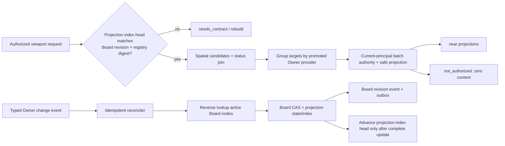

# Board Target Safe Projection 生产计划

## 1. 目标与非目标

目标是让 Board node 在不复制 Owner canonical state 的前提下，稳定提供当前actor可见的near projection、medium/far非内容摘要、status filter、target删除/tenant-wide失效/version drift恢复和安全事件。该能力必须跨重启、并发、Owner故障与PostgreSQL成立，而不是依赖fixture或浏览器缓存。

Workbench 不拥有 Owner title、正文、artifact bytes、private path、动态preview URL或授权决策。projection index只保存用于Board查询的非内容token和版本/状态证明；near title/subtitle/thumbnail safe ref必须由当前请求的批准Owner provider在当前principal下返回。



## 2. 状态边界

projection state使用稳定枚举：

- `available`：target存在、当前actor可读且source version匹配。
- `stale`：target存在但node binding version与Owner current version不同；可返回受控safe projection并明确freshness，不可伪装为current。
- `tombstoned`：Owner确认删除或tenant-wide失效；零title/subtitle/thumbnail，仅safe reason code。
- `not_authorized`：只对当前principal响应生效；零内容，不持久化到共享index，不修改Board revision，不发布tenant共享事件。
- `needs_contract`：provider未晋级、registry drift、结果缺失/重复/unsafe或index watermark不完整；不得用fixture补齐。

单target transient failure只将该target响应降为`needs_contract`或使用非内容`stale`证明；provider contract digest drift属于整组合同失败，相关provider targets全部`needs_contract`，但其他provider组继续。

## 3. Provider 合同

provider入口只接受typed request：tenant ref、principal safe identity、target type/ref/version列表、contract version与registry digest。单批最多1000 target，resolver按owner/provider分组，每provider最多一次batch调用；总并发默认4、单provider timeout默认800ms、总预算2s，均可配置但有硬上限。

每个输入target必须恰好对应一个结果。结果只允许：node ref、projection state、bounded title/subtitle、allowlisted status/freshness token、safe thumbnail ref、source version与safe tombstone reason code。禁止任意map、HTML/CSS/SVG、URL、path、credential、raw payload和Owner原始错误。duplicate/missing/unknown target或unsafe字段稳定映射为`board_invalid_contract`/`board_needs_contract`，日志只记录provider id、safe code、数量和耗时。

## 4. 0014 projection index

建议新增两张GORM模型表：

### `board_node_projection_index`

- 复合主键：`tenant_ref + board_ref + node_ref`。
- binding proof：`target_type`、`target_ref`、`target_version`、`binding_digest`。
- 非内容状态：`projection_state`、`status_token`、`freshness_token`、`source_version`、`tombstone_reason_code`。
- 审计时间：DB time `updated_at_db`。
- 禁止列：title、subtitle、thumbnail/preview URL、path、payload/json/blob、principal/role/allowed decision。

索引至少覆盖：

- `tenant_ref + board_ref + projection_state + status_token + node_ref`，用于status keyset join。
- `tenant_ref + target_type + target_ref + board_ref + node_ref`，用于Owner event反向定位。

### `board_projection_index_heads`

- 复合主键：`tenant_ref + board_ref`。
- `indexed_board_revision`、`type_registry_digest`、`provider_registry_digest`、`updated_at_db`。

status filter执行前必须验证head revision等于当前Board revision，且registry digests完全匹配。任何node mutation、rebind、delete或registry drift必须在同一Board事务中删除/失效对应index row并使head失效。批量rebuild只有全部active node结果安全写入后才能推进head；partial batch、timeout或单target未知均不得伪造complete watermark。

## 5. Status filter 与 LOD

- `far`只使用完成watermark下的allowlisted status summary，不读取per-node safe content。
- `medium`返回geometry、edge/group和非内容projection state/status/freshness token，不调用title resolver。
- `near`在status-filtered bounded candidates上执行当前principal batch provider，并返回safe content。
- keyset仍绑定canonical filter digest；index head在查询前后都必须与Board revision一致，否则丢弃partial并返回`resync_required`或`needs_contract`。
- status filter不得先全量读取Board再在内存过滤；PostgreSQL 10k gate必须保存命名索引EXPLAIN、rows、p50/p95与环境。

## 6. Owner change reconciler

reconciler只消费批准的typed Owner event，不接收raw webhook body。source event ref/digest形成幂等receipt；同一tenant/target的乱序事件按Owner monotonic version或明确版本比较拒绝旧写覆盖新状态。

处理步骤：

1. 验证provider/contract/tenant/source event与safe reason。
2. 通过target reverse index读取bounded active Board node refs。
3. 对每个Board重新读取node binding；已删除或已重绑node直接跳过。
4. 以expected Board revision执行typed projection-state mutation。
5. 在同一事务写projection row、Board revision、无payload event、outbox与source receipt。
6. CAS冲突重新读取并重算，不复用旧before-state。

tenant-wide tombstone/version drift/status change可以发布`board.target_projection_changed`与`board.revision_committed`；事件只含现有safe event字段、node ref和allowlisted change/reason code。actor-specific deny不是canonical Owner change，不进入该流程。

## 7. Readiness、观测与恢复

- provider registry/digest、projection schema与DB schema是required dependency；不匹配时相关能力`needs_contract`。
- 单provider outage只降该provider capability/target projection，不使无关Board能力全局not-ready。
- projection index head lag、reconciler backlog、provider safe code、batch size/duration、tombstone/version drift count使用低基数指标；禁止target ref、title、URL和raw error。
- worker drain停止新Owner event claim，等待inflight Board transaction，写shutdown receipt后关闭DB/provider client。
- process在Board commit后、source ack前崩溃时允许duplicate source delivery；source receipt与Board idempotency保证不重复revision。

## 8. 交付门禁

```text
2.4c1 domain/provider contract
  -> 2.4c2 0014 index + status filter
  -> 2.4c3 current-principal resolver
  -> 2.4c4 Owner event reconciler
  -> 2.4c5 PostgreSQL + real Owner promotion
  -> 2.4c production promotion
```

本地实现不得解除 `2.3e` 或 `2.4d`。只有隔离PostgreSQL、真实promoted Owner provider、managed worker restart、10k EXPLAIN/performance和脱敏证据全部通过后，root integrator才能关闭 `2.4c`。
