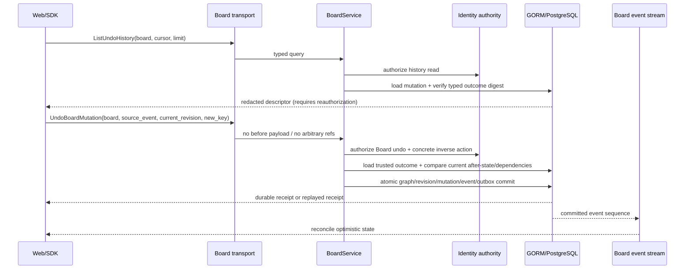

# Board 跨会话安全撤销历史基线

## 1. 目标与边界

跨会话撤销不能依赖浏览器内存中的inverse，也不能把历史记录变成权限令牌。本基线将能力拆成服务/仓储、可信执行器与传输/UI三个连续阶段：

1. `2.2d3e1`：服务与仓储提供tenant/Board绑定的event-ref lookup及有界历史页；只返回typed descriptor，不返回inverse payload。
2. `2.2d3e2a-2.2d3e2b`：添加可信create/update inverse与delete tombstone restore executor；执行时加载服务端outcome并重新授权、重新校验当前资源。
3. `2.2d3e2c`：添加Proto/SDK/four-transport safe projection与Web session resume；生产shared-service/restart/PostgreSQL promotion仍受`1.5b`与`2.2e`门控。

当前前三阶段的本地实现与component parity已通过，但尚未宣称生产远程API、跨进程restart或PostgreSQL/managed-worker promotion完成。

## 2. 查询契约

`UndoHistoryDescriptor`只包含：

- `event_ref`、`board_ref`、source Board revision；
- operation/resource type与resource ref；
- 枚举化inverse type；
- `requires_reauthorization=true`与commit time。

响应不包含idempotency key/digest、request digest、actor audit ref、expected current revision、typed command payload、before/after字段、Template values或Owner target payload。descriptor仅说明“服务端存在可识别的typed inverse”，不表示当前有权或仍可执行。

分页使用Board内已提交mutation的primary event ref作为opaque page token，按Board revision倒序，单页上限100；cursor必须同时匹配tenant与Board，不能跨Board或跨tenant复用。

## 3. 数据与完整性

查询复用`board_mutations`与既有normalized typed outcome tables，不新增raw JSON列或第二份undo ledger。每条记录加载时重新验证outcome digest；缺行、类型不匹配、未知inverse或digest篡改均返回`ErrMutationOutcomeCorrupt`并fail closed。

Board lifecycle mutation与Template application revert本身不进入可撤销列表；graph typed mutations与原始Template apply进入列表。Template apply只映射到可信`revert_template_application`类型，后续执行器仍必须调用既有application-event revert guard。

## 4. 第二阶段执行器约束

`2.2d3e2`不得接受客户端提交的before state、任意资源refs或generic JSON command。可信执行器必须：

1. 使用`board_ref + source_event_ref`加载服务端typed outcome；
2. 对当前principal重新检查Board与具体mutation action权限；
3. 使用客户端提供的新idempotency key与current expected Board revision；
4. 比较当前资源与原mutation after-state，防止覆盖后续编辑；
5. 对delete inverse执行依赖、collision与tombstone-state检查；
6. 将undo写成新的mutation/event/outbox事实，redo同样是新command；
7. Template apply继续走`RevertTemplateApplication`，禁止客户端任意批量refs。

完整运行链路：



执行器拆为三个可独立验证的生产切片：

- `2.2d3e2a`：create/update inverse executor；同resource after-state未变化才允许delete/update。
- `2.2d3e2b`：delete inverse restore；必须以tombstoned-row CAS恢复原ref，并重新验证target/group/edge dependency与registry。
- `2.2d3e2c`：已交付 additive Proto/SDK/four-transport projection与Web session resume 的本地切片；共享runtime binding、restart与PostgreSQL promotion仍由`1.5b`/`2.2e`开放。

每个成功undo都是新mutation；undo的undo形成redo历史，但服务不得把任意历史链自动折叠或覆盖。history retention、cursor expiry和归档必须服从Board event retention，不得单独删除仍被receipt引用的typed outcome。

## 5. Trusted executor service baseline

`2.2d3e2a`已实现service/repository内部可信执行入口：

- request只接受`board_ref`、`source_event_ref`、current expected Board revision和new idempotency key；
- 先检查`board.undo.execute`，再由既有typed mutation service重新检查具体node/group/edge/template action；
- source event从tenant/Board-bound normalized outcome加载，digest异常直接fail closed；
- create inverse与update inverse执行前比较current resource与原after-state，后续编辑/删除不会被覆盖；
- graph undo复用既有CAS、transaction、event/outbox与typed outcome；重试先执行authority + exact replay lookup，不依赖已被撤销的current resource；
- Template apply只路由`RevertTemplateApplication`，继续使用可信application outcome与unchanged-resource guard；
- `2.2d3e2a`交付时original delete曾明确停在restore边界；该边界已由`2.2d3e2b`的typed tombstone CAS restore替代，始终未使用INSERT或客户端payload伪实现。

验证覆盖group/node/edge create/update inverses、Template apply、restart、replay、later edit、concrete-action revoke与并发单赢家。正常实现保持pure Go和`CGO_ENABLED=0`。

Executor component evidence：

```text
temp/integration-test-runs/20260720232840-86eaa5b5-b431-41fb-a4e9-24ec35384044/
status=passed
exit_code=0
redaction=enabled
```

`2.2d3e2b`进一步完成node/group/edge original delete restore：repository不执行INSERT，而以`tenant_ref + board_ref + resource_ref + state=tombstoned + source deletion revision`执行GORM CAS，将原ref和trusted typed state恢复为active；target、group、edge endpoint与relation registry在commit前重新验证。CAS/dependency失败与并发loser均回滚Board revision、events、outbox和outcome。

Delete restore component evidence：

```text
temp/integration-test-runs/20260720234024-cf2ea5e1-120d-401b-8a3c-0206cedbcc5a/
status=passed
exit_code=0
redaction=enabled
```

## 6. 验证

```bash
task board:undo-history:test
task test:board-undo-history:component
task board:undo-executor:test
task test:board-undo-executor:component
```

当前服务层覆盖restart、cross-client、bounded cursor、cross-tenant、authority revoke、redacted projection与tamper fail-closed；本次 transport/UI slice覆盖local runtime cross-transport、safe descriptor、new idempotency key、receipt-backed refresh与UI session resume。live PostgreSQL、跨进程restart、managed-worker binding与最终production promotion仍属于`1.5b`/`2.2e`。

Component evidence：

```text
temp/integration-test-runs/20260720231435-34b0fc25-0bc5-4619-85ee-84c874e51793/
status=passed
exit_code=0
redaction=enabled
```

## 7. `2.2d3e2c` 本地传输与 UI resume 证据（2026-08-02）

本地切片新增 `GetUndoHistory`、`ListUndoHistory`、`UndoBoardMutation` 三个 additive RPC，并由同一 `BoardService` 投影到 HTTP、JSON-RPC、gRPC 与 typed SDK。wire/request/response 只暴露 safe descriptor、source event ref、current expected revision、新 idempotency key 与 receipt；不暴露 before/after、actor、inverse payload、Owner payload 或 credential。

UI 在存在 SDK safe-history 能力时以服务端最新 descriptor 作为 Undo 可用性的唯一来源；点击只发送新的幂等键，收到 receipt 后刷新 Board、viewport、history，并由 watch/invalidation 重新读取 canonical state。失败或history unavailable时不伪造成功；旧的无history client仍保留本地兼容分支以避免破坏未迁移调用方。

验证入口与证据：

```text
task test:board-undo-transport-parity
temp/integration-test-runs/20260802021938-c389a528-d71f-46db-8d5e-069d8c509d27/
status=passed
redaction=total_redactions=0

task test:resource-transport-contract:component
temp/integration-test-runs/20260802022019-f1d05a21-490e-4007-85ab-fb7320651dde/
status=passed
redaction=total_redactions=0

task studio:board-undo-resume:test
status=passed
focused=apps/web/test/spatial-board.test.tsx (12/12)
```

这组证据是本地/component gate，不替代 `1.5b` 的 shared runtime binding、真实 PostgreSQL/restart、managed worker、browser E2E 或 production/provider gate；因此 `2.2d3e2c` 的 OpenSpec checkbox 继续保持未完成，直到依赖与剩余验证闭合。

`20260720231257-97e3fd62-6fa6-4689-a906-79f681d471e1`为cursor错误映射与Template apply descriptor回归补充前的已通过记录，保留用于审计；以上较新run为最终证据。

最新本地复核（2026-08-02）：`task test:board-undo-transport-parity` 通过 HTTP、JSON-RPC、gRPC、runtime、typed SDK、race、vet 与 typecheck，脱敏证据为 `temp/integration-test-runs/20260802032838-c7f8bf58-c0cb-4754-b43d-20b935e1ac38/`，`status=passed`、`exit_code=0`、`redaction.total_redactions=0`；`task test:resource-transport-contract:component` 同步通过，证据为 `temp/integration-test-runs/20260802032838-e8597978-76ee-4e87-827a-7e41dd693603/`，`status=passed`、`exit_code=0`、`redaction.total_redactions=0`。`task studio:board-undo-resume:test` 的 `spatial-board.test.tsx` 12/12 通过并完成 Web typecheck。该复核仍只支持 local/component parity，不替代 `1.5b` shared runtime binding、真实 PostgreSQL/restart、managed worker 或 production/provider gate。

Fresh local recheck（2026-08-02）：三条入口再次通过，分别生成 `temp/integration-test-runs/20260802042457-70ea8e2c-7270-4fc0-a23f-54ff8c55829a/`（`task test:board-undo-transport-parity`，35.3s）、`temp/integration-test-runs/20260802042457-9d30798b-c415-492d-a354-ef3b02162576/`（`task test:resource-transport-contract:component`，20.4s）与 `temp/integration-test-runs/20260802042457-870754c3-bd6f-4513-960e-5a29264f217e/`（`task studio:board-undo-resume:test`，15.9s）；三者均 `status=passed`、`exit_code=0`、`redaction_result.total_redactions=0`。该复核只刷新本地 transport/UI 证据，不替代 shared runtime、真实 PostgreSQL/restart、managed worker、browser E2E 或 production gate。

Current SDK/transport recheck（2026-08-02 06:57）：在 Board graph/SDK 变更后单独重跑 `task test:board-undo-transport-parity`，证据为 `temp/integration-test-runs/20260802065728-84ba2108-956a-47d2-9271-4f3b949cc486/`，`status=passed`、`duration_ms=40062`、`redaction.total_redactions=0`。safe undo history/executor 仍保持 HTTP、JSON-RPC、gRPC、runtime 与 typed SDK 一致；该结果不替代 `1.5b` shared runtime binding、PostgreSQL/restart、managed worker 或 production/provider gate。
Fresh local parity recheck（2026-08-02 08:43）：`task test:board-undo-transport-parity` 再次通过，证据为 `temp/integration-test-runs/20260802084352-2b7686eb-56b7-45f3-8530-a9c37055cfc0/`，`status=passed`、`duration_ms=34743`、`redaction.total_redactions=0`。该结果只刷新 local/component safe undo history/executor 的 HTTP、JSON-RPC、gRPC、runtime 与 SDK parity，不替代 `1.5b` shared runtime binding、真实 PostgreSQL/restart、managed worker 或 production/provider gate。
