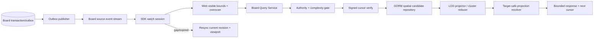

# Board Viewport / Event 正式生产交付计划

## 1. 非 Demo 目标

Viewport不是“加载全部graph后在浏览器裁剪”。正式链路必须以tenant/Board/revision绑定的服务端空间候选、LOD投影、signed cursor、target safe projection和可恢复event stream为唯一事实源。



## 2. Query invariants

- request必须绑定contract version、Board ref、non-zero Board revision、finite integer bounds、zoom bucket、LOD、filter与page size；默认200，上限1000；filter clauses上限32。
- bounds宽高、面积、overscan、candidate scan与edge expansion分别设上限；超限返回`board_limit_exceeded`，不得退化为全表scan。
- canonical排序固定为`x ASC, y ASC, node_ref ASC`；cursor保存最后sort tuple，不能使用offset分页。
- repository只返回Board-owned geometry/group/edge与safe target refs；Owner title/status/thumbnail由resolver batch投影，不能进入Board canonical rows。
- `far`只返回deterministic grid clusters和bounded sample refs；`medium`返回geometry与safe摘要；`near`返回可交互safe projection。resolver未晋级时返回`needs_contract`，不使用fixture补全。

## 3. Cursor contract

Cursor格式为`board-cursor:v1:<base64url-payload>:<hmac>`，长度不超过512 bytes。为保证最长合法`node_ref`也不突破上限，payload采用固定字段顺序的大端紧凑二进制，而不是JSON。payload包含：

```text
version, query_digest, board_revision
last_x, last_y, last_node_ref, expires_at
```

`query_digest`由contract version、tenant ref、workspace ref、Board ref、bounds、zoom bucket、LOD、canonical filter与page size确定性计算，因此payload不暴露这些scope值但仍与其逐项绑定；Board revision单独编码，以便revision drift稳定映射为`board_resync_required`，而不是泛化为cursor invalid。

HMAC-SHA256 key来自批准的runtime secret source，支持current/previous双key轮换；key、payload原文和失败cursor不得写log/evidence。签名、scope、query digest、revision或expiry任一不匹配分别返回stable cursor invalid/expired/resync，不回显内部字段。

## 4. Repository与索引

- 继续使用GORM；普通查询不得拼接SQL identifier。
- 基础候选使用`tenant_ref + board_ref + state + x + y + node_ref`稳定索引和keyset predicate；group/node type filter使用组合索引并由真实`EXPLAIN`验证。
- edge只查询本页visible node refs关联的bounded first-order edges；不得查询全Board edges再过滤。
- far cluster按zoom bucket映射固定grid cell，cluster ref由Board revision、cell和filter digest确定性派生；summary token只能来自registry/safe projection index。
- status filter与near/medium projection依赖`2.4c` normalized safe projection index；在该依赖可用前能力状态为`needs_contract`。

## 5. Event/watch invariants

- publisher只读取committed outbox；delivery至少一次，event ref去重，sequence单调且source-local。
- list/watch cursor绑定tenant、Board、last sequence、retention generation与expiry；重复event可忽略，sequence gap必须返回`board_resync_required`。
- reconnect先catch-up再进入live stream，切换点必须避免list/watch间隙；SSE、gRPC stream与SDK session共享同一source cursor语义。
- target tombstone、authority revoke、version drift只更新Board safe projection state并发event，不删除canonical Owner object，也不把Owner error/raw payload写入event。
- outbox backlog、publisher lag、cursor gap、resolver stale分别进入低基数metrics/readiness；单target失败不让整个服务not-ready。

## 6. 原子交付顺序

1. `2.3a`：query domain、complexity budget与signed cursor codec。
2. `2.3b1/2.3b2`：GORM keyset candidate/group/edge repository与additive indexes先通过local gate，再通过isolated PostgreSQL promotion。
3. `2.3c`：deterministic far cluster reducer与medium/near projection boundary。
4. `2.3d1/2.3d2`：Board query service、authority、resolver batch接口、restart/cursor先通过local component，再通过isolated PostgreSQL promotion。
5. `2.4a`：event list cursor、retention/gap规则与repository。
6. `2.4b`：outbox publisher、catch-up/live handoff、SSE/gRPC source。
7. `2.4c`：target tombstone/失权/version resolver与normalized safe projection index。
8. `2.4d`：four-transport watch parity、fault/restart/resync component gate。
9. `2.3e`：在`2.4c`后完成status filter、near/medium promotion及10k PostgreSQL benchmark。

## 7. 生产验收

- 10k node Board不得向单次请求返回超过page limit的node/detail；far LOD不返回per-node projection。
- 相同query/cursor在restart后得到稳定下一页；cursor tamper/cross-tenant/cross-Board/revision drift全部fail closed。
- 10k benchmark记录数据规模、PostgreSQL版本、query plan、p50/p95、rows scanned/returned、allocations和redaction status。
- watch覆盖duplicate、disconnect、catch-up/live边界、retention gap、publisher crash、outbox retry、target revoke与SDK resync。
- 只有`2.3e + 2.4d + 1.5b`全部有真实evidence后，Board capability才可从`needs_contract`晋级`available`。
