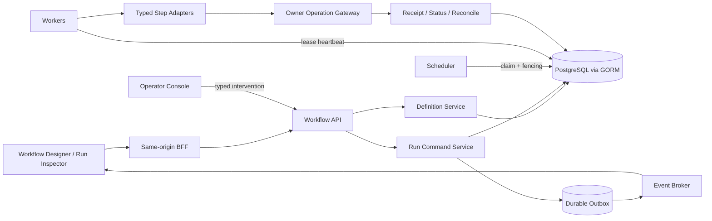

# Workbench 生产工作流机制与完整交付计划

## 1. 产品边界

Workflow 不是演示用节点连线，也不是在浏览器中执行脚本。它是以版本化定义、持久化运行、可验证 Owner receipt、人工审批和可恢复状态机为核心的生产执行控制面。

完整功能必须同时覆盖：定义、发布、启动、调度、执行、审批、暂停、恢复、取消、补偿、reconcile、operator intervention、审计、诊断、容量、灾备和回滚。任一能力只有 UI、fixture 或 happy-path 时，不得标记 `available`。

首版明确不支持任意代码、任意 URL、隐式循环、浏览器直连 Owner、无 receipt 的自动重试和数据库手工改状态。扩展 step type 必须先经过合同、安全与证据门禁。

## 2. 运行架构



`workbenchd` 负责定义、命令、查询、权限和 operator API；scheduler/worker 在开发环境可同进程 profile 启动，生产默认独立进程和独立 readiness。两者共享合同与 repository，但 worker 不绕过应用服务直接拼接 SQL 或调用浏览器上下文。

## 3. 核心实体与不变量

| 实体 | 关键字段 | 不变量 |
| --- | --- | --- |
| Definition | tenant、name、version、checksum、status、step graph | published version immutable；checksum 覆盖 canonical graph |
| Run | definition ref/version、actor、authority revision、state、budget | 只引用已发布定义；终态不可回退 |
| StepRun | step key、state、attempt、input/output refs | 输入输出只保存 typed safe refs，不保存 Owner raw payload |
| Attempt | stable idempotency key、fencing token、dispatch intent | 同一逻辑 mutation 重试保持 idempotency key |
| Lease | worker、token、expiresAt、heartbeatAt | 旧 fencing token 永远不能提交新结果 |
| Gate | required action、approvers、decision、expiresAt | 审批不等于执行权限；dispatch 前重验 authority |
| Receipt | owner、operation、receipt/status refs、outcome | `unknown_accept` 只能 status/reconcile，禁止自动重放 |
| Event | monotonic source cursor、type、safe payload、occurredAt | committed state 后写入 outbox；consumer 支持 resume/gap |
| Intervention | typed action、reason、actor、before/after refs | 不允许任意字段 patch 或手工 DB 修正 |

## 4. Definition 生命周期

```text
draft -> published -> deprecated
```

- `draft` 可编辑，但每次修改产生 expected-version CAS。
- publish command 必须先通过 DAG 无环、step registry、schema、权限需求、预算、fan-out 和依赖合同检查；validation result是命令结果和evidence，不是可持久化 Definition 状态。
- `published` 不可变；修改必须创建新 version。已有 Run 固定旧 version，不跟随浮动 latest。
- `deprecated` 禁止新 Run，已有 Run 继续按原合同执行；删除只允许 tombstone，不破坏审计引用。
- 发布必须记录 definition checksum、step registry digest、Owner contract range 和 policy digest。

## 5. Run 与 Step 状态机

Run 状态：

```text
pending -> running | cancelled
running -> waiting | paused | cancelling | reconciling | succeeded | failed | needs_intervention
waiting -> running | paused | cancelling | reconciling | failed | needs_intervention
paused -> running | cancelling
cancelling -> cancelled | reconciling | needs_intervention
reconciling -> running | succeeded | failed | cancelled | needs_intervention
```

Step 状态：

```text
pending -> ready | skipped | cancelled
ready -> leased | paused | cancelled
leased -> running | ready | cancelled
running -> waiting_approval | waiting_owner | reconciling | succeeded | failed | cancelled
waiting_approval|waiting_owner -> running | paused | reconciling | failed | cancelled
reconciling -> running | succeeded | failed | cancelled
```

状态迁移只能由 domain state machine 执行。每次迁移在同一事务中写 state/version、attempt/receipt 变化与 outbox event。非法迁移返回稳定错误，不通过“修正字段”继续运行。

## 6. Step registry

首批 production step type 与规范统一为：

1. `workbench.read_projection.v1`：读取批准的 safe projection，允许 bounded retry。
2. `workbench.condition.v1`：只读 typed expression，不可访问未声明字段。
3. `workbench.submit_operation.v1`：通过 Operation registry/TaskService 提交 mutation，必须有 idempotency、receipt、status 与 reconcile 合同。
4. `workbench.wait_task.v1`：等待 Task terminal、Gate 或 reconcile state，不通过轮询伪造完成。
5. `workbench.approval.v1`：等待指定 action/scope 的人工决策，支持超时、拒绝与 stale gate。
6. `workbench.wait_event.v1`：按 source cursor 等待 allowlisted event，具备 deadline 和 retention gap 处理。
7. `workbench.delay.v1`：使用 DB time 的 bounded durable timer，不占用执行 goroutine。
8. `workbench.emit_delivery.v1`：请求批准的 typed delivery/handoff operation，并保留 child receipt。

`transform` 不作为首版独立 step；安全字段映射由各 typed step 的显式 input mapping 合同承担。`compensation` 是 definition 中显式关联的独立 operation/workflow 机制，由补偿合同控制，不作为可绕过授权的普通 executor step。新增二者或其他 step type 必须另立 additive contract、安全评审和 evidence 门禁。

每个 registry entry 固定 input/output schema、required action、timeout、retry class、idempotency policy、cost weight、compensation capability、adapter version 和 owner contract range。

## 7. 调度、租约与幂等

- Scheduler 只把依赖满足、预算允许、authority 可重验的 Step 标记为 `ready`。
- Worker claim 使用 lease + 单调 fencing token；heartbeat 超时后可重领，但旧 worker 的完成提交必须失败。
- mutation 在网络发送前持久化 dispatch intent 与 stable idempotency key；crash 后先查 receipt/status/reconcile，再决定是否继续。
- retry 只适用于合同明确的 `retryable_rejected` 或发送前失败；指数退避含 jitter、最大次数和绝对 deadline。
- `unknown_accept`、timeout-after-send、receipt mismatch 一律进入 `reconciling`，不自动再次 mutation。
- 每 tenant、workflow、Owner、operation 均有并发、速率、成本和 fan-out 配额；超限进入 typed waiting/failed 状态而非无限排队。

## 8. 审批、权限与撤销

- Run 启动时记录 actor、tenant、delegation 和 authority revision，但不把启动时权限当永久授权。
- Approval 决策必须记录 approver、action、scope、reason、decision revision 和 policy digest。
- dispatch 前重新调用 R1 验证 actor/delegation/action/object；审批通过后若成员被撤销，step 必须失败为 `permission_revoked`。
- 高风险 operation 支持双人审批、self-approval 禁止、审批过期和 break-glass typed intervention。
- tenant switch/logout/revoke 关闭旧 authority stream 和新 dispatch；已在 Owner 执行中的 operation只允许 receipt/status/reconcile。

## 9. Pause、Cancel 与 Compensation

- Pause 停止新 claim，不中断已被 Owner 接受的真实操作；恢复时重新验证定义合同、authority、预算和 Owner readiness。
- Cancel 先写 durable intent，再停止未开始 step、撤销可取消 lease，并对 waiting receipt 执行 status/reconcile。
- 已成功 step 不自动“回滚”；只有定义显式声明 compensation 且当前 actor 具备独立权限时才执行。
- compensation 采用反向依赖顺序，每个动作有独立 authority/idempotency/cost/receipt/reconcile。部分失败或authority revoke进入 `needs_intervention` 并生成 typed operator action；不引入 `compensation_failed` 这一套平行 Run 状态。

## 10. 事件、查询与浏览器工作流

- Outbox 只在业务事务提交后发布；事件至少一次传输，客户端按 `(source, cursor, eventId)` 去重。
- SSE/gRPC/JSON-RPC stream 支持 heartbeat、resume、retention gap、backpressure、drain 和 authority lease。
- gap 不伪造连续历史，返回 typed `resync_required`，客户端重新获取 Run/Step canonical snapshot。
- Designer 提供 schema 驱动表单、DAG validation、版本 diff 和发布前检查，不提供脚本编辑器。
- Run Inspector 展示 timeline、step attempts、safe receipt refs、等待原因、预算、权限变化与可执行 rescue。
- Operator Console 只暴露 pause/resume/cancel/reconcile/retry-safe-read/approve/reject/compensate/kill-switch 等 typed command。

## 11. 生产工作流场景矩阵

| 场景 | 成熟度目标 | 关键步骤 | Owner 条件 | 晋级证据 |
| --- | --- | --- | --- | --- |
| Read + approval canary | first-support | read→condition→approval→delivery | safe read/event | auth revoke、approval expiry、resume |
| Open Design handoff | first-support | save version→generate→compare→approve→export | receipt/status/reconcile | partial child receipt、unknown_accept、retry failed child |
| Layout recovery | exploratory | detect corrupt→approval→reset preset→verify | Workbench internal | conflict、two-tab、tenant revoke |
| Scaena delivery | exploratory | validate assets→approve→dispatch→reconcile | R2 contract ready | contract mismatch、Owner offline |
| Auctra review/export | exploratory | collect draft→review gate→export→handoff | R2 contract ready | version drift、cancel、partial export |

只有真实 Owner read/event/mutation/receipt/status/reconcile 全链路通过的场景才能从 exploratory 晋级 first-support；first-support 完成 staging/canary/rollback 后才能称 mature。

## 12. 实施包与依赖 DAG

| 包 | 依赖 | 交付 | 验证入口 |
| --- | --- | --- | --- |
| WF0 Contract gate | R1/R2/R3 | canary、Owner contract、预算、kill switch | `task workflow:contract:check` |
| WF1 Domain contracts | WF0 | proto/schema/SDK、registry、state machine | `task workflow:domain:test` |
| WF2 Persistence | WF1 | GORM models、migration、CAS、outbox、lease | `task test:workflow-repository:postgres` |
| WF3 Scheduler/worker | WF2 | claim/fencing/heartbeat/retry/reconcile | `task test:workflow-worker:integration` |
| WF4 Adapters | WF0, WF3 | read/approval/Owner/event/delivery/compensation | `task test:workflow-adapters:integration` |
| WF5 API/stream/BFF | WF2, WF3 | REST/gRPC/JSON-RPC/SDK、same-origin、live events | `task test:workflow-transport:component` |
| WF6 Web surfaces | WF5, R3 desktop | Designer、Run Inspector、Operator Console | `task test:workflow-web:e2e` |
| WF7 Production gates | WF3-WF6 | fault injection、capacity、security、DR、rollback | `task test:workflow-production:system` |

WF1 与 canary adapter contract 可并行；WF2 完成前不实现 scheduler；同一 repository/domain write set 只允许一个 implementer。Web 仅在 transport/error/event 合同冻结后进入生产实现。

## 13. 完成定义

完整功能完成必须同时满足：

1. SQLite 本地与 PostgreSQL managed migration、backup/restore、CAS、lease/fencing 通过。
2. REST/gRPC/JSON-RPC/SDK 对状态、错误、cursor、idempotency 保持 conformance。
3. 至少一个低风险 canary 与一个真实 Owner mutation workflow 端到端通过。
4. crash-before-send、crash-after-send、DB failover、Owner offline/429/5xx、network reset、clock skew、outbox backlog 全部保留可恢复证据。
5. cross-tenant、revoke、approval race、credential confusion、SSRF/script injection、quota abuse 安全测试通过。
6. 生产容量预算、24h staging、7d canary、kill switch、rollback 与 operator runbook 通过。
7. 每个 integration/system/e2e/soak/drill 写入脱敏六件套；没有证据的功能仍为 `integration_ready`，不是 production `available`。
