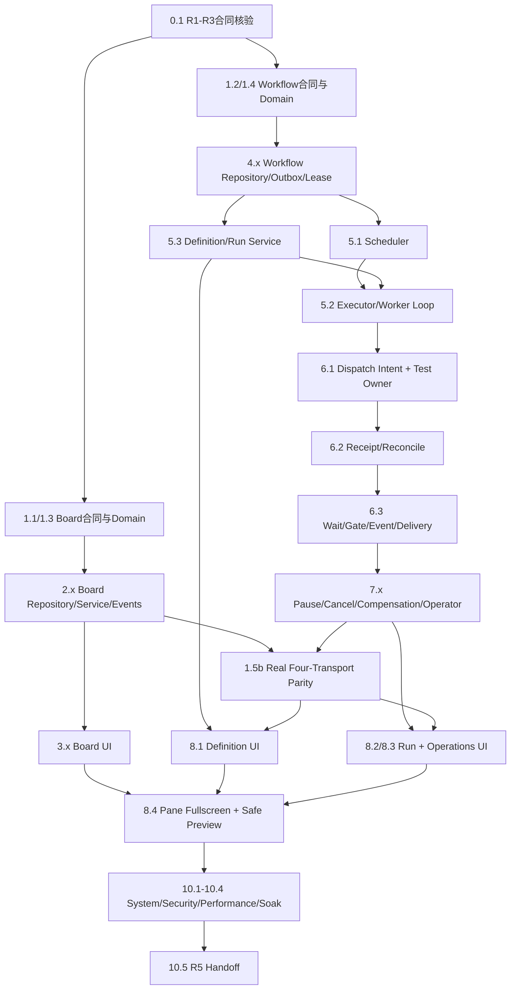

# Workbench R4 生产对接与完整功能交付图

## 1. 目的

本文件定义从当前合同/domain 基线到可晋级生产候选的完整对接顺序。它不以页面能打开、DAG能渲染或fixture happy-path作为完成；任何能力必须同时具备权威状态、持久化、真实服务绑定、故障恢复、用户救援、运维诊断和可追踪证据。

能力状态统一为：

| 状态 | 含义 | UI/API行为 |
| --- | --- | --- |
| `unavailable` | 合同或实现不存在 | 不展示可执行入口，API返回稳定unsupported |
| `needs_contract` | R1/R2/R3或registry/schema范围不满足 | 展示缺失合同与安全诊断，零dispatch |
| `degraded` | 可读或局部执行，但依赖故障/lag超限 | 禁止受影响的新mutation，继续receipt/reconcile |
| `available` | 当前环境全部必要门通过 | 才允许publish/start/dispatch对应能力 |
| `needs_intervention` | 已存在无法自动收敛的真实运行事实 | 保留事实并只开放typed operator action |

不得把“进程healthy”“路由已注册”“UI按钮存在”或“fixture通过”单独映射为`available`。

## 2. 生产依赖 DAG

## 3. 对接合同

| 边界 | 上游输出 | 下游必须验证 | 失败行为 |
| --- | --- | --- | --- |
| Web → same-origin BFF | typed command/query、expected version、idempotency metadata | session、tenant、action、CSRF、body/page限制 | 无本地terminal mutation；保留用户意图 |
| BFF/transport → shared service | normalized actor context与稳定合同 | operation registry、contract/schema range、safe errors | 四transport一致fail-closed |
| Service → repository | domain decision、expected version/fence、event/outbox intent | 同事务CAS、tenant key、checksum | rollback全部业务写，不发布幽灵事件 |
| Scheduler → lease repository | bounded candidate、DB-time claim request | dependency、quota、kill switch、worker compatibility | 不claim；相关capability degraded |
| Worker → executor | pinned definition/step snapshot、lease/fence、checkpoint | schema、timeout、role、registry digest | stale/unsupported立即停止commit与dispatch |
| Executor → Owner gateway | durable dispatch intent、stable idempotency、fresh delegation | operation permission、approval、audience、cost | send前拒绝可安全失败；send后未知必须reconcile |
| Owner → reconcile | receipt/status/event safe refs与source cursor | digest、operation、tenant、attempt、monotonic truth | 不重发mutation；等待或needs_intervention |
| Service/events → UI | canonical snapshot、source cursor、safe evidence refs | duplicate/gap/authority lease | gap触发resync，不补造历史 |

## 4. 完整用户工作流

### 4.1 Board

1. 用户创建Board并通过viewport/LOD加载可见节点。
2. 拖动、连接、group、template操作先显示optimistic preview，再提交expected-revision command。
3. 冲突时回滚持久化标记，但保留reapply intent；undo已持久化动作时发送反向typed command。
4. target失权/删除后由服务产生安全tombstone；Board不删除canonical object。
5. Board节点可打开详情、文件safe preview、Workflow definition/run；Pane支持展开和全屏，关闭后恢复原布局与焦点。

### 4.2 Workflow定义与发布

1. Designer只从canonical step snapshot构建typed DAG与input mapping。
2. Server validation返回schema/capability/cost/approval/Owner readiness结果；浏览器不复制allowlist。
3. publish固定definition checksum、step registry digest、operation registry/schema digest和policy digest。
4. published不可变；编辑创建新draft/version，diff明确影响中的运行仍固定旧版本。

### 4.3 Run执行与恢复

1. start使用稳定idempotency创建`pending` run并固定definition/version/checksum。
2. Scheduler以DB time、dependency、quota、kill switch和worker range推进ready。
3. Worker claim后所有heartbeat、intent、commit绑定fence；lease loss后旧worker零commit/dispatch。
4. read/condition/delay在无副作用executor执行；wait_task/approval/wait_event以durable cursor/gate/deadline等待。
5. mutation先写dispatch intent，再调用Owner；未知接受状态进入`reconciling`，使用同一idempotency/receipt收敛。
6. event/outbox至少一次发布；UI按cursor去重并在gap时重取canonical snapshot。

### 4.4 Pause、Cancel、Compensation与Operator

1. pause只停止新claim/未发送dispatch；resume重验合同、authority、approval、quota与readiness。
2. cancel不伪造Owner取消；已发送或可能发送的mutation保持waiting/reconciling直到真实收敛。
3. compensation仅运行显式binding的reverse-DAG plan，每项独立授权、审批、成本、idempotency、receipt与reconcile。
4. dead-letter、contract drift、authority revoke或补偿失败进入`needs_intervention`；Operator只能执行allowlisted、versioned、审计化动作，不能patch DB或force success。

## 5. 原子交付包

| 包 | 任务 | 可并行 | 退出证据 |
| --- | --- | --- | --- |
| P0 合同门 | `0.1-0.3`, `1.1-1.4f` | Board/Workflow合同可并行 | strict OpenSpec、contract/domain evidence |
| P1 存储门 | `2.1`, `4.1b-4.3c` | Board与Workflow repository可并行 | real PostgreSQL migration、CAS/claim/outbox evidence |
| P2 服务门 | `2.2-2.4`, `5.1`, `5.3` | Board service与scheduler可并行 | shared service、event、publish/start证据 |
| P3 Worker门 | `5.0b2b2b2-5.2b` | executor与release metadata受依赖串行 | startup/readiness/claim/fence/drain evidence |
| P4 Owner门 | `6.1a-6.3b` | read/wait executor与test Owner可分泳道 | no-duplicate、receipt/reconcile、revoke evidence |
| P5 控制门 | `7.1-7.3` | operator UI前必须完成 | pause/cancel/compensation/kill-switch evidence |
| P6 体验门 | `3.1-3.3`, `8.1-8.4` | Board与Workflow UI可并行 | browser/a11y/fullscreen/preview/rescue evidence |
| P7 Canary门 | `0.2`, `7.4`, `9.1-9.3` | 观测与部署先行 | real test-tenant mutation、rollback drain evidence |
| P8 晋级门 | `10.1-10.5` | 各专项审计并行，soak串行 | unit/system/security/perf/24h soak/handoff |

## 6. UI 完整功能验收

- Pane状态必须支持 docked、expanded、fullscreen、restore；浏览器刷新后只恢复允许的layout state，不恢复敏感preview数据。
- 文件/制品预览只消费R3 safe projection与授权下载/preview URL；URL必须same-origin或批准的短期投影，不接受definition提供的动态URL。
- fullscreen保持ESC退出、焦点恢复、reduced motion、screen reader标题和移动端安全区；切换过程中不中断run/event subscription。
- Definition、Run、Operations、Board任一Pane都必须显示loading/empty/degraded/needs_contract/offline/stale/permission denied/retention gap状态与rescue，不以toast代替持久状态。
- 所有mutation按钮按server capability、authority revision、resource version和idempotency状态启用；double submit、SSE重复、tab恢复不得重复命令。

## 7. 非 Demo 退出条件

以下任一存在时，R4不得标记完整或交接R5：

1. 任一canonical step只有fixture或UI，没有持久化执行/等待/恢复路径。
2. 四transport未绑定同一真实service，或浏览器存在direct Owner路径。
3. PostgreSQL claim/outbox/reconcile只在SQLite或单worker证明。
4. unknown accept、crash after intent、authority revoke、cancel、compensation failure没有真实收敛证据。
5. Board 10k、LOD、conflict rescue、keyboard/mobile/fullscreen/preview未过browser gate。
6. Operator仍需手改DB，或kill switch会丢失已发送mutation的reconcile。
7. worker artifact、contract/registry digests、runbook、rollback和24h soak evidence不完整。
