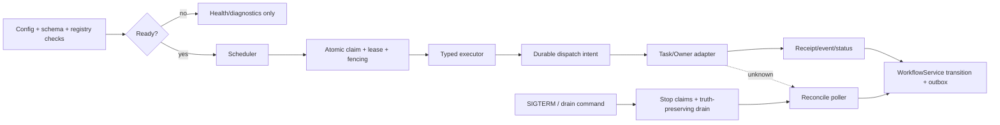
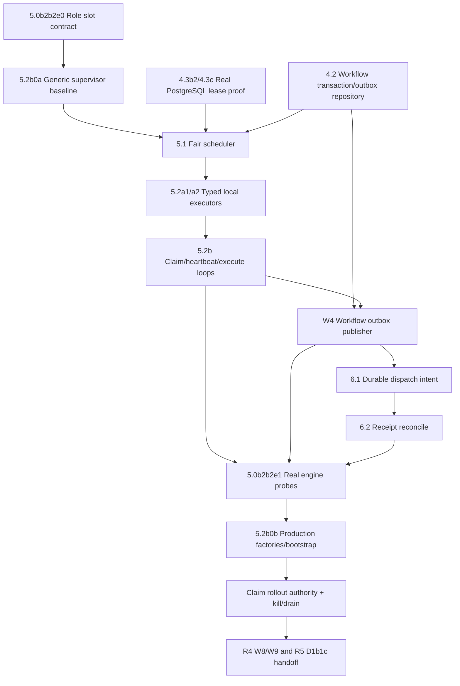

# Workbench Worker 生产进程与执行合同

## 1. 目的与非目标

本文冻结 R4 `workbench-worker` 的生产进程、健康检查、lease/fencing、dispatch/reconcile、优雅退出和 R5 制品交接合同。目标不是补一个能编译的占位 binary，而是把真实 durable workflow 执行器拆成可独立验证、可回退、不会伪造外部事实的生产切片。

首版不提供任意脚本、shell、动态 URL、任意网络访问、循环、插件热加载或用户自定义代码执行。Worker 不拥有 UI、HTTP transport 业务状态、Owner provider SDK、Identity 权威、Task 权威或数据库 migration 作者职责。

## 2. 技术与所有权决策

- Worker 使用现有 Go module，实现于 `service/cmd/workbench-worker` 与 `service/internal/workers/**`。
- 正常 build/release 路径必须 `CGO_ENABLED=0`；不得为 queue、clock、expression 或 provider connector 引入 cgo/Rust sidecar。
- Worker 是独立长运行进程和独立 deployment profile；API `workbenchd` 不隐式启动生产 scheduler/worker。
- 数据访问继续通过 GORM repository。若 Postgres 原子 claim 无法用 GORM 安全表达，只允许在 `service/internal/workflows/repository/**` 内建立参数化、集中、带设计说明和并发测试的最小 SQL 例外。
- Managed profile 只连接 PostgreSQL，启动时绝不 `AutoMigrate`；schema 不兼容时 readiness false 且不 claim。
- Worker 只通过 shared domain service、repository、R1 authority client、R2 Task/Owner adapter 写状态；executor 不直接改 terminal state。

## 3. 进程角色

一个 binary 可按配置启用以下内部角色，但每个角色必须有独立 readiness、concurrency、lag 和 kill switch：

| 角色 | 职责 | 明确禁止 |
| --- | --- | --- |
| scheduler | 计算 ready step、tenant/Owner fair queue、quota/cost、timer 到期 | 直接 dispatch Owner mutation |
| claimer | 原子 claim、建立 attempt/lease/fencing | 绕过 definition/worker compatibility |
| executor | 执行 allowlisted typed step，提交 domain command | 任意 shell/network、直接 terminal write |
| heartbeat | 使用 DB time 续租，暴露 lease loss | 在 lease loss 后继续 commit/dispatch |
| outbox publisher | 推进 workflow outbox cursor | 以 publish 失败为由重复业务 mutation |
| reconcile poller | receipt/status/event lookup，收敛 unknown outcome | 创建新 idempotency key 重发 mutation |
| drain coordinator | 停 claim、等待安全阶段、持久化 unknown/reconcile、退出 | 把 in-flight mutation伪造为 failed/cancelled |



## 4. 启动状态机

Worker 启动顺序固定为：

1. 解析 CLI/config，拒绝未知参数、空 service identity、非法 duration/concurrency/range。
2. 验证 managed profile、PostgreSQL、R1 identity/delegation、R0 operation registry 和 definition/step contract range。
3. 验证 migration version/checksum、worker registry、DB time query、queue/outbox/reconcile cursor 可读。
4. 注册 worker instance：`worker_id`、release/artifact digest、supported contract range、supported step types、started_at、draining=false。
5. 启动 admin listener、metrics 和 heartbeat；此时 process health 可为 true，但 readiness 仍为 false。
6. 所有强依赖通过后设置 readiness true，才允许 scheduler/claimer 工作。
7. 任一强依赖失效时停止新 claim；已发送 mutation 仍进入 receipt/reconcile。

启动失败必须返回非零，不输出 DSN、token、credential source value、Owner endpoint、private path 或 raw payload。诊断只返回稳定 reason code、safe version/range、component 和 evidence ref。

## 5. Health、readiness 与 degraded

Worker admin listener 默认只绑定明确配置的内部地址；生产镜像不得把诊断端口作为公开业务 API。

### 5.1 `GET /healthz`

只证明进程 event loop、signal handler 和 admin server 存活。数据库、Owner 或 queue 故障不得通过 health 假装进程崩溃，也不得因为 health true 推断 worker 可 claim。

### 5.2 `GET /readyz`

至少检查：

- PostgreSQL connect/ping 与 DB time query；
- migration version/checksum 与 runtime supported range；
- operation/step registry digest；
- worker service identity 与 delegation policy；
- worker supported definition/step contract range；
- queue scan、outbox cursor、reconcile cursor和heartbeat是否在阈值内；
- global/tenant/definition/capability kill switch；
- 当前是否 draining。

响应只能暴露 safe boolean、reason code、版本范围和低敏时间戳。单个 Owner offline 不使整个 worker not-ready；只把对应 Owner operation/capability 标记 degraded 并停止其新 dispatch，其他无关步骤继续。

### 5.3 Claim gate

`readyz=true` 不是唯一 claim 条件。每次 claim 前还必须原子验证 tenant、definition、step type、Owner operation、quota、kill switch、worker range 和 lease availability。Readiness 变化后已取得但尚未执行的 lease必须重新检查。

## 6. Lease 与 fencing 不变量

Lease 至少包含：

```text
lease_id
tenant_id
run_id
step_run_id
attempt_id
worker_id
fencing_token
lease_version
claimed_at_db
heartbeat_at_db
expires_at_db
released_at_db
release_reason
```

必须满足：

1. PostgreSQL DB time 是 claim、heartbeat、expiry 和 reclaim 的时间权威；worker wall clock只用于本地 timeout 提示。
2. Claim 同时锁定预期 `run_version`、`step_version`、worker contract range、kill switch 和 quota，并生成单调 fencing token。
3. Heartbeat 只能续租相同 `lease_id + worker_id + fencing_token + lease_version`。
4. 每个 state transition、dispatch intent、receipt attach、output commit、release 必须携带并验证 fencing token与预期 run/step version。
5. Lease 过期、被 reclaim、worker进入drain或contract不兼容后，旧 worker 的 write/dispatch必须返回稳定 stale-fence错误且无副作用。
6. Reclaim 不等于 retry。存在 durable dispatch intent、receipt ref或 unknown outcome时必须进入 reconcile，不得再次调用 Owner mutation。
7. Release 只适用于尚未产生外部副作用且已持久化安全状态的 attempt；不能通过 delete lease清除事实。

## 7. Dispatch、receipt 与失联恢复

### 7.1 Dispatch 前

- 重新验证 R1 actor/tenant/membership/delegation、R2 capability、Task/Gate、approval digest、quota/cost 和 kill switch。
- 使用 definition/run/step/operation 的稳定字段派生或查找持久化 idempotency key；进程重启、lease reclaim或attempt观察不得改变该 key。
- 在调用 Owner 前，原子写入 `dispatch_intent`、request digest、operation ref、fencing token、attempt 和 outbox event。

### 7.2 Dispatch 后

- 明确 accepted/rejected：保存 safe receipt/status/error classification，再由 WorkflowService推进状态。
- 明确未接受且合同允许 retry：只按 bounded policy重试相同逻辑 operation/idempotency，并记录决定。
- 请求已发送但响应丢失、timeout、connection reset或进程崩溃：写入或恢复 `unknown_accept/reconciling`，先按原 idempotency/receipt/status/event lookup；禁止自动 redispatch。

### 7.3 Reconcile

Reconcile poller必须有 bounded backoff、deadline、per-Owner concurrency、cursor和dead-letter策略。Owner schema/range不兼容时转 `needs_contract` 或 operator intervention，不得把 unknown伪造为 failure。Event与response竞态以 Owner contract定义的 receipt/version和本地 expected version幂等合并。

## 8. Drain 与退出

收到 `SIGTERM`、operator drain或deployment shutdown时：

1. 原子标记 worker `draining=true`，readiness false。
2. scheduler/claimer立即停止新 claim。
3. 尚未开始的无副作用 lease可安全 release；已开始步骤进入 bounded drain。
4. read/condition/delay等本地安全阶段可在 grace deadline内完成并提交。
5. dispatch intent已写或mutation可能已发送的步骤必须提交 receipt/unknown/reconcile状态，不得标记 generic failed/cancelled。
6. heartbeat持续到每个 owned lease完成安全交接或 grace deadline。
7. deadline到达后停止本地执行，让 lease过期/reclaim；旧进程之后任何 commit均由 fencing拒绝。
8. outbox cursor与worker shutdown receipt持久化后退出；无法安全持久化时非零退出并保留诊断证据。

`SIGKILL` 无法优雅处理，因此 fault test必须证明 lease expiry/reclaim和dispatch-intent恢复仍不重复 mutation。

## 9. 配置与资源预算

建议 worker 配置 surface：

```text
profile=managed
worker_id=<opaque instance id>
admin_listen=<internal address>
supported_contract_min=<version>
supported_contract_max=<version>
roles=scheduler,executor,outbox,reconcile
claim_interval=<duration>
lease_duration=<duration>
heartbeat_interval=<duration>
drain_timeout=<duration>
max_global_concurrency=<positive integer>
max_tenant_concurrency=<positive integer>
max_owner_concurrency=<positive integer>
max_reconcile_concurrency=<positive integer>
queue_scan_limit=<positive integer>
```

约束：heartbeat interval必须显著小于lease duration；所有 concurrency/scan/backoff 有硬上限；配置只引用批准的 credential source，不回显值；生产不允许自动回退 SQLite、anonymous identity、unbounded concurrency或默认开放 egress。

## 10. 最小安全实施切片

| 切片 | 交付 | 可执行范围 | Promotion 条件 |
| --- | --- | --- | --- |
| W0a | process/config合同与 validator | 不启动 claim | config负测、redaction、pure-Go build |
| W0b | 真实 binary skeleton、health/readiness、signal/drain、worker registration | readiness保持false或显式claim-disabled | startup/shutdown/unsupported range/schema ahead/behind测试 |
| W1 | GORM schema、DB-time lease、fencing repository | 只做并发claim实验，不dispatch | race + real PostgreSQL crash/reclaim/stale-write证据 |
| W2 | fair scheduler、claim loop、worker compatibility | 只claim批准的无副作用step | quota/kill switch/starvation/clock/contract mismatch测试 |
| W3 | read_projection/condition/delay/wait_event executor | 无外部mutation | restart、timeout、output schema、drain证据 |
| W4 | outbox publisher与event cursor | 不改变Owner事实 | publish outage/reorder/duplicate恢复证据 |
| W5 | Task/Gate、dispatch intent、receipt/reconcile | test Owner或synthetic mutation | crash before/after send、unknown_accept、no redispatch证据 |
| W6 | approval/revoke/pause/resume/cancel/operator | 受控test tenant | stale gate、revoke、kill/drain、operator audit证据 |
| W7 | Eikona allowlisted mutation canary | 明确test tenant/project/approval/cost | real receipt/status/reconcile、rollback drain证据 |
| W8 | security/capacity/fault/soak | staging only | P0/P1=0、SLO和24h soak达标 |
| W9 | R5 artifact handoff | 构建完整candidate | clean source、approved builder、worker metadata与evidence |

W0b 不是 release-ready worker。只有 W1-W8满足且R4 closeout通过，R5才可把 `bin/workbench-worker`计入完整production artifact set。禁止通过空 main、sleep loop、复用 `workbenchd` binary或永久claim-disabled配置关闭R5 gate。

### 10.1 W2-W5无环执行DAG

现有dependency checker中的role slot只定义fail-closed形状，不代表engine存在。Scheduler实现不得依赖“完整四role均ready”，否则会形成`role probe -> scheduler -> role probe`循环。正确顺序是先复用已完成的`5.0b2b2e0`slot合同与`5.2b0a`通用supervisor合同，再逐个实现engine，最后由`5.0b2b2e1`和`5.2b0b`把真实engine factory/probe接回production bootstrap。`5.2b0a`已经提供按selected role排序启动、失败反向rollback、drain先撤ready、反向幂等stop及runtime先Start后listen/register的基线；它不代表任何业务role已经实现或允许claim。



| Gate | 当前可证明 | 仍需直接证据 | 禁止替代 |
| --- | --- | --- | --- |
| `5.0b2b2e0` | selected role缺probe必not-ready、safe reason/version | 无 | static success、goroutine存在 |
| `5.2b0a` | engine lifecycle、ordering、rollback、safe error、runtime/bootstrap注入合同 | 四role业务factory与真实storage readiness | test-only engine、接口存在计role ready |
| W2 scheduler | bounded/fair queue与lease claim | PostgreSQL two-worker、starvation/kill/compatibility | 显式已知step调用`ClaimWorkflowLease` |
| W3 executor | typed local step与lease-loss cancellation | restart/timeout/schema/checkpoint | arbitrary script、direct terminal write |
| W4 outbox | workflow event/outbox cursor与lag | transaction/outage/reorder/duplicate recovery | Board outbox、内存channel |
| W5 reconcile | intent/receipt/status/reconcile | response loss/crash/no-redispatch | timeout重发、fixture receipt |
| `5.0b2b2e1` | 四role真实`CheckReady` | DB/Identity/registry outage recovery、shutdown leak | mock store、固定lag、静态probe |
| `5.2b0b` | production command组合根 | selected factory/start/register/drain/restart真实process证据 | runtime option存在、未被`workbench-worker`消费 |
| rollout authority | current candidate only claim | signed/current receipt、revoke/kill/drain | env boolean、Pod health、registration成功 |

每个engine必须同时拥有`Start`、`CheckReady`、`Drain/Stop`和有界并发/scan/timeout语义。`CheckReady`只能观察该进程实际启动的engine和current storage/cursor；未启动、已停止、lag超限、依赖失效或contract mismatch均返回safe failure。最终bootstrap只组合这些probe，不拥有scheduler、executor、outbox或reconcile业务逻辑。

### 10.2 写入租约与交接资产

下列切片按依赖串行；只有明确不重叠的路径可并行。任何实现者不得修改其他lane的tracked paths来伪造集成通过，跨lane接口变化先更新本change的contract/task再合并。

| Lane | Owner / write lease | 输入合同 | 必须输出 | 验证命令 | 解锁 |
| --- | --- | --- | --- | --- | --- |
| `PG` | repository + test owner；migration catalog、`service/internal/repository/workflow_*`、PostgreSQL harness | current schema `0015` parity、next `0016` ready queue projection、lease/fence domain | fresh/upgrade/readiness、queue projection/query、two-worker claim、disconnect/reclaim evidence | `task test:workflow-schema:postgres:component`；`task test:workflow-queue-projection:postgres:component`；`task test:workflow-queue:postgres:component`；后续lease fault targets | `4.1b1-4.1b5`、`5.1b1-5.1c4`、`4.3b2`、`4.3c` |
| `TX` | workflow repository/outbox owner；`service/internal/workflows/repository/**`、`service/internal/workflows/outbox/**` | GORM models、central transition command | state+event/outbox transaction、publisher cursor contract | `CGO_ENABLED=1 go test -race ./service/internal/workflows/repository ./service/internal/workflows/outbox -count=1` | `4.2`、`5.2b3` |
| `SCHED` | scheduler owner；`service/internal/scheduler/**` | ready-step query、policy/kill/compatibility snapshot、DB time | deterministic fair batch与availability projection | `CGO_ENABLED=1 go test -race ./service/internal/scheduler -count=1` | `5.1`、`5.2b1` |
| `SUP` | worker runtime owner；`service/internal/workers/engines/**`、supervisor-owned runtime/bootstrap files | selected role config、dependency checker slot | `Start/CheckReady/Drain/Stop`、safe error与lifecycle ordering合同 | `task worker:engine-supervisor:test`；`task test:worker-engine-supervisor:component` | `5.2b0a`、`5.2b1-b4` |
| `SUP-ATTACH` | 四role owners + worker bootstrap integrator；factory/runtime inputs/worker main | `SUP`合同与四类真实engine | production factory composition、真实role probes、startup/register/drain/restart矩阵 | `task test:workflow-system SCENARIO=worker-role-engine-lifecycle` | `5.2b0b`、R5 `D1b1c5/c6` |
| `CLAIM` | claimer/lease owner；`service/internal/workers/claimer/**` | fair batch、lease repository、worker compatibility | claim/heartbeat/loss cancellation/drain handoff | scheduler/claimer race + PostgreSQL lease scenarios | `5.2b1`、R5 `D1b1c1` |
| `EXEC` | executor owner；`service/internal/workers/executors/**`、expressions/timers | canonical step descriptor、fenced lease context、domain command boundary | typed local executors与bounded worker pool | `CGO_ENABLED=1 go test -race ./service/internal/workers/executors ./service/internal/workflows/expressions ./service/internal/workflows/timers -count=1` | `5.2a1/a2`、`5.2b2`、R5 `D1b1c2` |
| `PUB` | workflow outbox owner；outbox engine paths only | committed outbox rows、publisher adapter | claim/publish/ack/retry、cursor/lag readiness | outbox race + outage/reorder/duplicate component evidence | `5.2b3`、R5 `D1b1c3` |
| `DISPATCH` | Task/Owner boundary owner；dispatch-intent/app/adapter leased paths | R1 authority、R2 typed operation、fence/idempotency | durable intent、receipt/status result、unknown_accept | `task test:workflow-system SCENARIO=dispatch-reconcile OWNER=test` | `6.1a/b` |
| `RECON` | reconcile owner；`service/internal/workflows/reconcile/**` | persisted intent/receipt/idempotency、Owner lookup/status/event | bounded converge/dead-letter/cursor/lag readiness | `CGO_ENABLED=1 go test -race ./service/internal/workflows/reconcile ./service/internal/workers -count=1` | `6.2`、`5.2b4`、R5 `D1b1c4` |
| `AUTHZ` | release/operator owner；claim authority consumer、kill switch、manifest | same candidate artifact/manifest、signed rollout receipt | default-disabled candidate-bound claim与revoke/drain | claim authority + kill/revoke/restart/drain system evidence | R5 `D1b1c5` |
| `HANDOFF` | independent test + R4/R5 operations；evidence/handoff only | frozen diff/artifact/manifest及所有Provider Ready | PostgreSQL/Identity/Owner真实process矩阵和R4 W9 receipt | `task test:workflow-system`；`task test:workflow-e2e OWNER=eikona` | R5 `D1b1c6`、WP-W10/W20 |

交接资产必须至少包含worker artifact digest、manifest digest、operation/step/definition/policy digests、selected roles、claim authority receipt ref、PostgreSQL/Identity/Owner provider refs、故障点、lease/fence摘要、outbox/reconcile cursor摘要和脱敏状态。不得包含DSN、endpoint、credential、raw Owner payload、private path、完整argv或实现者自签的production approval。

## 11. 故障与负向矩阵

| 故障 | 必须结果 |
| --- | --- |
| migration未执行或schema超前 | health可用、ready=false、零claim |
| worker range不支持pinned definition | 不claim，safe mismatch reason |
| 两worker并发claim | 仅一个lease成功，其余无副作用 |
| heartbeat丢失并reclaim | 旧worker commit/dispatch被fencing拒绝 |
| dispatch后响应丢失 | unknown_accept/reconcile，零自动重发 |
| SIGTERM发生在dispatch前 | 停新claim，安全release或完成本地阶段 |
| SIGTERM发生在dispatch后 | 保存receipt或unknown/reconcile，不伪造failed/cancelled |
| SIGKILL发生在dispatch intent后 | 新worker lookup/reconcile原operation |
| 单Owner offline | 仅相关capability degraded，其他步骤继续 |
| global/tenant/operation kill switch | 停新claim/dispatch，已发送继续reconcile |
| DB time跳变或worker clock skew | 只以DB time决定lease，不产生双commit |
| queue过载 | bounded scan/backpressure/fairness，无内存或goroutine失控 |
| credential/endpoint出现在错误中 | test失败并阻断promotion |

## 12. 验证与证据

建议可运行命令按切片落地：

```bash
CGO_ENABLED=0 go test ./service/cmd/workbench-worker ./service/internal/workers/... -count=1
CGO_ENABLED=1 go test -race ./service/internal/workflows/leases ./service/internal/workflows/repository -count=1
task test:workflow-component
task test:workflow-system
task test:workflow-e2e OWNER=eikona
task release:soak ENV=staging SCENARIO=workflow
```

component/system/e2e/fault/soak必须写入 `temp/integration-test-runs/<run-id>/` 六件套，并包含 safe worker/artifact/contract/definition/policy digests、fault point、lease/fencing摘要、receipt/evidence refs、redaction结果。不得记录 raw prompt、Owner payload、token、DSN、private path或完整内部推理。

## 13. R5 制品交接合同

R4完成 W9 后向 R5 提供：

- `bin/workbench-worker` pure-Go binary；
- worker release/version、source digest、artifact digest；
- supported workflow/definition/step contract min/max；
- enabled typed step registry digest；
- migration/schema compatibility range；
- required roles与default-disabled mutation capabilities；
- health/readiness/drain smoke evidence；
- lease/fencing/crash/reconcile/fault evidence refs；
- Eikona test-tenant canary和rollback-drain evidence；
- known risks、kill switches和operator runbook refs。

R5 `3.4b2b`只有在上述交接、clean source和approved builder复现同时成立时，才允许 `production_candidate_complete=true`。R5不得在release lane补写 workflow domain、lease、executor或reconcile逻辑。
