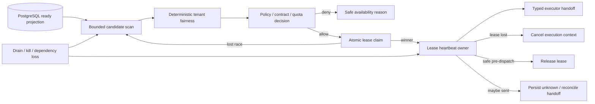

# Workflow Scheduler / Claimer 生产落地计划

## 1. 目标与当前差距

W2 的目标不是“定时找一条 `ready` step 调用现有 lease API”，而是提供一个可停止、可恢复、可公平调度、受合同和授权约束的 scheduler/claimer engine，使 `workbench-worker` 能在真实 PostgreSQL 上安全执行无副作用步骤，并为后续 typed executor、outbox、reconcile 与 R5 claim rollout 提供稳定入口。

当前已经具备：

- `workflow_runs`、`workflow_step_runs`、`workflow_attempts`、`workflow_leases` GORM models；
- `ClaimWorkflowLease`、`HeartbeatWorkflowLease`、`ReleaseWorkflowLease` 的 version/fence/DB-time transaction；
- canonical step registry、worker config、dependency checker、registration lifecycle；
- `5.2b0a` engine supervisor 与 runtime/bootstrap 注入合同。

当前仍缺少：

- 可证明来自数据库时间的 ready queue projection；
- bounded、跨 tenant 公平且不会被单一热点 tenant 填满的候选扫描；
- contract、step registry、kill switch、quota、cost、Owner capability 的统一 claim decision；
- scheduler engine、claimer loop、per-lease heartbeat/loss cancellation 与 drain handoff；
- PostgreSQL two-worker、restart、disconnect、clock skew、starvation 与 drain evidence。

## 2. MVP 与非目标

首个可上线切片只允许 claim canonical registry 中 `SideEffectClass=none` 且 executor 已注册的步骤：

- `workbench.read_projection.v1`；
- `workbench.condition.v1`；
- `workbench.delay.v1`。

`wait_task`、`approval`、`wait_event` 依赖 durable wait/gate/cursor 服务，不进入首个 claim allowlist。`submit_operation` 与 `emit_delivery` 具有外部 mutation，在 durable dispatch intent、真实 authority、receipt/reconcile 和 candidate-bound rollout authority 完成前禁止 claim。

W2 不负责：

- 直接执行步骤或写 terminal state；
- 生成 Owner request、credential、receipt 或业务 idempotency key；
- 以 scheduler 内存状态替代 durable run/step/lease truth；
- 自动提高 concurrency、跳过 quota/kill switch 或在依赖失效时继续 claim；
- 通过静态 `CheckReady=true` 或 goroutine 存在宣称 role ready。

## 3. 状态与所有权

所有 goroutine 必须由 scheduler engine 的 `Start` 创建并由 `Drain/Stop` 回收：

- 一个 scan loop；
- 不超过 `MaxGlobalConcurrency` 的 claim/execution slots；
- 每个已持有 lease 至多一个 heartbeat owner；
- 无 detached retry、timer、heartbeat 或 executor goroutine。

## 4. Additive queue projection

### 4.1 存储字段

在 `workflow_step_runs` 上通过新 migration 增量增加：

| 字段 | 类型 | 语义 |
| --- | --- | --- |
| `ready_at_db` | nullable timestamp | step 最近一次进入 `ready` 的数据库时间；非 ready 为 NULL |
| `not_before_at_db` | nullable timestamp | retry/timer/policy 指定的最早可扫描数据库时间 |
| `priority_class` | string，默认 `normal` | allowlisted `low/normal/high`，不接受任意数值抢占 |

增加以 `status, ready_at_db, tenant_ref` 为前缀的 bounded scan index。现有 `version`、`attempt_sequence`、run definition/version/checksum 与 `workflow_steps.step_type/capability_ref` 继续作为 CAS 和 compatibility source，不复制第二套 descriptor 或 operation allowlist。

### 4.2 演进策略

该变更属于 pre-1.0 alpha 数据库合同的 additive evolution：

- 新字段先 nullable/defaulted，旧 binary 可忽略；
- migration 对现有 `status=ready` 行以数据库内 `updated_at` backfill `ready_at_db`；
- 新 binary 对缺失 `ready_at_db` 的 ready 行 fail closed，不用 worker wall clock补值；
- rollback 只回退 binary 并保留新增列和索引，不执行 destructive down migration；
- 后续如需 `NOT NULL` 或删除旧读取路径，必须另建 expand-contract OpenSpec gate。

### 4.3 写入规则

只有 central workflow transition repository 可以维护 projection：

- `pending/paused -> ready`：同一 transaction 使用 DB time 写 `ready_at_db`；
- 离开 `ready`：同一 transaction 清空 `ready_at_db`；
- timer/retry：写 `not_before_at_db`，到期判断只使用 DB time；
- claim 不根据 `UpdatedAt`、进程时间或 Web optimistic state推断 ready。

## 5. Candidate 与 decision 合同

Repository 返回内部 typed `Candidate`，至少包含：

- tenant/run/step safe refs；
- run/step expected version与attempt sequence；
- definition ref/version/checksum、step registry digest与contract version；
- step type、capability ref、side-effect class、cost weight；
- `ready_at_db`、`not_before_at_db`、priority class；
- 当前 active/expired lease摘要，不返回credential、payload或完整input。

Scheduler 对每个 candidate 产生 typed `Decision`：

- `allow`：包含 attempt kind、lease duration、executor key与decision snapshot digest；
- `deny_transient`：本轮跳过，可因并发、quota、owner degradation、backpressure恢复；
- `deny_contract`：registry/definition/worker range不兼容，写 availability reason，不claim；
- `deny_policy`：global/tenant/definition/capability/Owner kill switch或未授权；
- `deny_unsupported`：executor未注册或当前阶段不允许该 side-effect class。

Decision reason 必须是稳定低基数 English code，不包含 tenant/run/step ref、DSN、endpoint、credential、payload或私有路径。

## 6. Bounded fairness

候选扫描与公平排序必须同时满足：

1. PostgreSQL 查询只读取固定 `QueueScanLimit` 窗口，并为单 tenant 设置 `PerTenantScanLimit`，避免热点 tenant 填满整个窗口。
2. Repository 可以在集中式 queue adapter 内使用参数绑定的 PostgreSQL window/`FOR UPDATE SKIP LOCKED` 例外；普通业务 service 不得写 SQL，SQLite 结果不得作为生产公平性证据。
3. Domain scheduler 使用确定性 deficit round-robin：先 priority class，再 tenant deficit，再 `ready_at_db/run_ref/step_run_ref` stable tie-break。
4. concurrency token 在 claim 前预留，claim 失败立即归还；不得先 claim 再发现本进程无容量。
5. global、tenant、Owner/capability 并发全部有硬上限；任何配置值不得超过 worker config 的 validated maximum。
6. empty queue 是 ready；持续 scan error、DB-time unavailable、cursor停滞或 backlog 超过 hard threshold 才使 scheduler role not-ready。

首版不承诺跨集群全局 weighted fairness；它承诺在共享 PostgreSQL truth、bounded candidate window和每进程 concurrency限制下，不让单 tenant 在可观察窗口内永久饿死其他 tenant。跨集群配额精确计数如需 reservation table，必须作为后续 additive schema任务单独评审。

## 7. Claimer 与 heartbeat

### 7.1 Claim loop

- scan interval 使用 validated config，jitter bounded且测试可注入；
- 每轮先检查 engine state、dependency readiness、claim authority和capacity；
- 只把 `allow` decision转为现有 `ClaimWorkflowLease` request；
- lease/attempt refs由批准的安全 ID source生成，不由candidate或用户输入拼接；
- `ErrLeaseUnavailable`/`ErrVersionConflict` 视为正常竞争失败，不重试同一 stale candidate；
- repository unavailable触发 bounded backoff并更新真实 readiness，不启动并行 retry storm。

### 7.2 Heartbeat ownership

- claim成功后创建一个 child context和一个 heartbeat owner；
- heartbeat间隔必须小于 lease duration，且保留足够 stop/drain预算；
- heartbeat使用最新 lease version，成功后原子替换内存 fence snapshot；
- stale fence、expired、not found或连续 repository failure使 lease context立即取消；
- executor只接收 lease-scoped context与current fence，不拥有heartbeat goroutine；
- lease loss后 executor result不能提交，必须由 central completion boundary再次验证fence。

### 7.3 Drain 与 Stop

- `Drain`先原子关闭新 scan/claim readiness，再等待正在进行的claim RPC结束；
- 尚未形成 dispatch intent的 lease可以用 `release_reason=drain` 安全释放；
- 已形成或可能形成外部mutation的 attempt不得release后重发，必须持久化unknown/reconcile handoff；
- `Stop`取消所有 heartbeat/execution contexts并等待 goroutine group退出；
- startup、scan、heartbeat和stop均需要显式 timeout budget；Stop失败后的重试/终态语义必须在`5.2b0b`接入前冻结。

## 8. Readiness 与 observability

Scheduler role `CheckReady`只在以下条件全部成立时返回 ready：

- engine处于running且未draining；
- 最近一次DB-time与bounded scan在freshness窗口内成功；
- step registry、worker contract、claim authority snapshot current；
- goroutine/claim/heartbeat计数不超过配置预算；
- queue hard backlog/scan latency阈值未突破。

指标和trace只记录低基数维度：role、decision reason、step type、priority class、result class。tenant/run/step/lease refs不得作为metric label；trace中仅允许redacted digest或批准的evidence ref。

## 9. 验证矩阵

| 场景 | 必须证明 |
| --- | --- |
| empty queue | role ready、零claim、无busy loop |
| two tenants + hot tenant | bounded窗口内另一tenant获得claim，无永久starvation |
| two workers same step | PostgreSQL exactly-one lease/attempt winner，loser无副作用 |
| unsupported/side-effect step | 零claim，stable reason |
| registry/contract drift | 立即停止新claim，恢复后重新全检 |
| global/tenant/Owner kill | 对应范围零新claim，其他允许范围继续 |
| quota/capacity exhausted | claim前拒绝，无超额goroutine或lease |
| heartbeat loss/DB disconnect | lease context取消，旧worker late commit被fence拒绝 |
| worker crash/reclaim | history保留，新worker fence epoch增加 |
| SIGTERM before dispatch | 停新claim并安全release |
| SIGTERM after maybe-send | 不release重发，进入unknown/reconcile |
| clock skew | claim/expiry/reclaim只由DB time决定 |
| backlog overload | bounded scan/backoff/readiness reason，无内存增长 |

Component/system evidence必须使用 disposable PostgreSQL，写入六件套并记录：candidate count、decision reason聚合、winner/loser、fence epoch、heartbeat/loss/drain摘要、redaction结果。不得记录 candidate refs列表、DSN、payload、credential、raw SQL参数或完整argv。

## 10. R5 对接与退出条件

W2 只有满足以下条件才可交给 R5 `6.3d1b1c1`：

1. `5.1a-e`、`5.2b1a-d`全部完成；
2. `4.3b2/4.3c`真实PostgreSQL claim/fencing evidence完成；
3. scheduler engine通过`5.2b0a` supervisor启动并提供真实probe；
4. 首个 no-side-effect executor 可消费 lease context，但 mutation step仍保持disabled；
5. claim authority默认关闭，只有冻结candidate/authorized canary可开启；
6. restart、drain、lease loss、contract drift、fairness、backpressure证据可由R5 manifest引用；
7. `production_authorized=false`保持不变，W2完成不构成生产发布授权。
