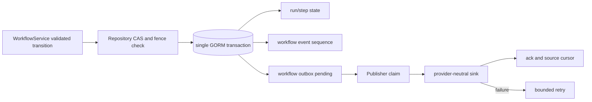

# Workflow transaction/outbox contract

## 目标

R4 `4.2` 为集中 WorkflowService 提供持久化边界：service 先完成 domain transition 验证，repository 只负责以 CAS/fence 证明提交该结果，并在同一数据库事务写入 safe event 与 outbox。Publisher 只推进已经提交的 outbox，不得重新执行业务 mutation。

## 演进面

| Surface | 分类 | 变更 | 兼容与回滚 |
| --- | --- | --- | --- |
| PostgreSQL/SQLite schema | additive | 新增 `0017_workflow_outbox_lease_foundation`；为 `workflow_outbox` 增加 nullable/defaulted lease/retry 字段和 named index | old binary 忽略新列；rollback 只回退 binary，保留列/index |
| internal Go API | additive pre-1.0 alpha | 新增 typed repository/outbox packages | 无现有外部 consumer；删除新 consumer 即可回退 |
| event payload | additive safe contract | 仅 `tenant/run/sequence/type/state/safe_ref/evidence_ref/time` | 不保存 owner payload、credential、URL、private path 或 arbitrary map |

禁止修改或复用 `0016_identity_access_metadata`。Ready queue projection 顺延为 `0018_workflow_ready_queue_projection`。

## Transaction contract

- 事务按 run row lock 串行生成 source-local sequence，禁止无锁 `max(sequence)+1`。
- run/step 使用 expected version CAS；受 lease 保护的 step 写入还必须匹配 active lease ref/fence/version。
- event ref 是 mutation idempotency key。同 ref 同 scope replay 返回原 event，不重复 state、event 或 outbox；不同内容冲突 fail closed。
- 任一 state/event/outbox write 失败必须整体 rollback。

## Outbox contract

- claim 使用数据库时间、bounded lease、worker ref 与 token digest；数据库只保存 digest。
- publish 成功后 ack 将 row 标为 published，并按 `tenant + run + kind` 连续推进 cursor。
- 非连续 ack 不得跳过缺失 sequence；重复 ack 幂等，stale token fail closed。
- sink 失败只落稳定 reason code并延后 `available_at_db`，不得保存原始 provider error。
- crash after publish before ack 允许重复投递；consumer 以 source sequence/event ref 去重，业务 mutation 不重放。
