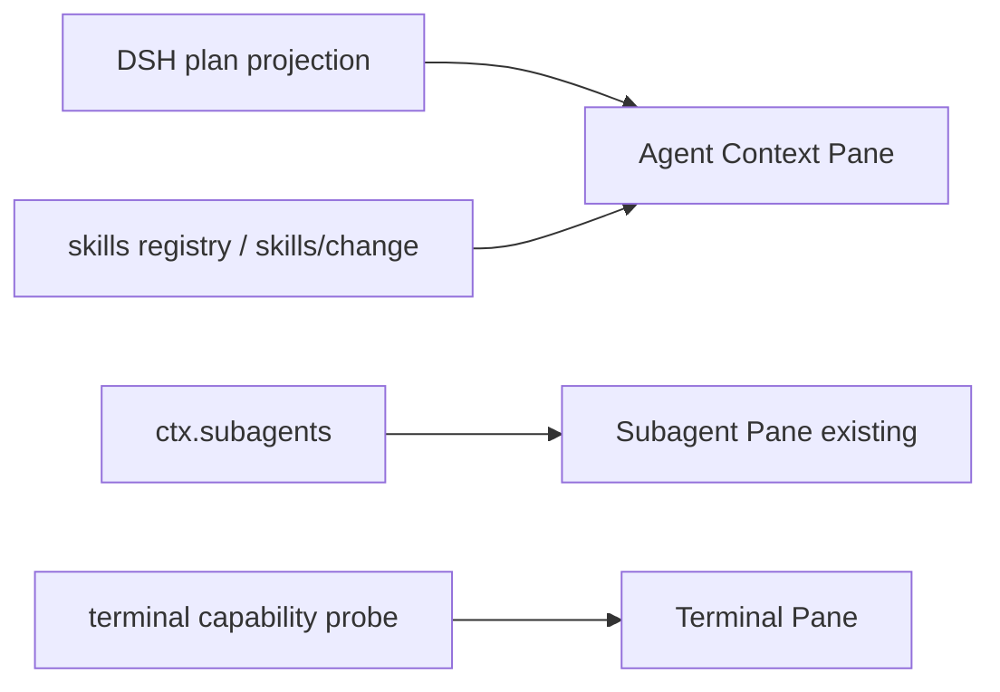

## Context

Wave 0 protocol 与 Subagent 已完成。Wave 1 证明真实 DSH owner 投影可恢复。

## Goals / Non-Goals

**Goals:**

- Agent Context 三 tab，选中 plan step 高亮 required skills。
- Invocations 时间线不含 raw prompt / private args / CoT。
- Terminal 缺 seam 时诚实失败。
- session switch 重置投影并 teardown stream。

**Non-Goals:**

- 不解封 xterm / Codicons / TerminalHostV2。
- 不实现 File watcher、Git、Browser。
- 不安装/发布 skill，除非 owner 返回 allowed action。

## Decisions

1. 单一 `workspace.agent-context` singleton view，三 tab，不是两个设置页。
2. Terminal view 独立 kind `workspace.terminal`，probe 失败不挂假 UI。
3. 复用 Pane protocol event reducer，禁止 `setInterval`。

## Risks / Trade-offs

- Overlay slot 限制：与 Wave 0 相同，不 DOM patch。
