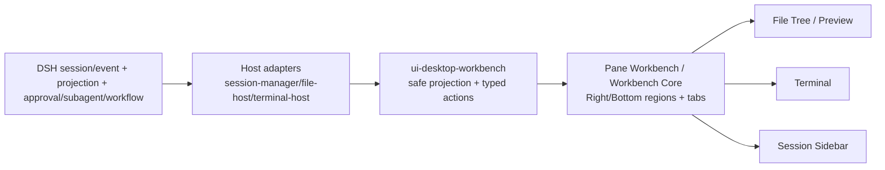
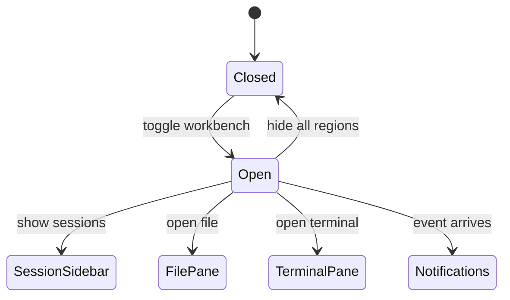

## Context

### 当前状态

`agent/harness-plugins` 已有可复用的 Workbench Core、Pane Workbench reducer、File Document、Terminal 占位、Rich Media 和 Pane Protocol。社区有 `dsh-session-manager`、`dsh-codex-ui`、`dsh-archive-manager`、`dsh-notify-center`、`dsh-task-notify` 等插件，但 star 少、维护风险高，不能作为长期运行时依赖。

本 change 把这些能力整合成自研桌面级工作台：复制/二创社区可复用逻辑，进入 `@yeisme/*` 包，自己维护。

### 产品目标

- 会话多了以后能统一管理：搜索、标签、归档、回收站、未读、继续/暂停/fork。
- 文件体验：目录树、文件预览、在 Pane 中打开。
- 终端体验：多 Tab、detach/reconnect/replay。
- 多 Pane 体验：Right/Bottom dock、拖拽分栏、键盘可达、布局恢复。
- 事件体验：turn/end、审批、后台任务、subagent 完成通知。
- 历史体验：标题/标签/消息搜索、命中深链。

## Goals / Non-Goals

**Goals:**

- 建立可安装 bundle `@yeisme/dsh-desktop-workbench`。
- 整合 Session/File/Terminal/Event/Multi-Pane 到同一个 shell。
- 复制社区代码到 `@yeisme/*` 并自维护，不 fork、不依赖原仓库。
- 只消费 DSH 官方 seam，不 DOM patch、不改 DSH core。

**Non-Goals:**

- 不实现完整 IDE/LSP/代码编辑器。
- 不做云同步、多用户、向量语义搜索（V1）。
- 不创建第二套 session/task/terminal canonical state。
- 不引入 Dockview/GoldenLayout/社区参考项目作为运行时依赖。

## Decisions

### 1. 独立包结构，不 fork 社区

```text
packages/
  host/dsh-session-manager/     # 会话管理 host
  host/dsh-file-host/           # 文件树/预览 host 骨架
  host/dsh-terminal-host/       # 终端 host 骨架
  client/ui-desktop-workbench/  # 桌面工作台 UI
  bundle/dsh-desktop-workbench/ # 可安装 bundle
```

社区代码只作为复制/参考来源，进入 `@yeisme/*` 包后由本仓库维护；保留原 LICENSE，新增 `THIRD_PARTY_NOTICES.md`。

### 2. DSH 是 canonical owner，客户端只做安全投影



所有 mutation 调用 DSH owner API；浏览器只拿 opaque ref、有界摘要、freshness 与 server-authored action。

### 3. 会话管理复用社区逻辑但重写安全边界

复制 `dsh-session-manager` 的回收站/恢复/彻底删除、统计、继续/暂停、未读、工作区分组等逻辑，改为：

- 只使用 `ctx.sessionPersistence`、`ctx.workspaceRegistry`、`ctx.storageDomain`、`ctx.agents` 等 DSH 官方服务。
- 标签使用 log-backed `session/labels` 事件与 `history.*` API。
- 删除/恢复操作全部返回 owner receipt，不本地乐观成功。

### 4. 文件/终端只接 typed seam

文件树使用 `FileEntryV1`，预览使用 `MediaRefV1`；终端使用 DSH terminal seam + xterm.js。官方 seam 缺失时记录 `contract_mismatch` 并降级，不 DOM patch。

### 5. 多 Pane 复用现有 Pane Workbench

不新建第二套 reducer；`ui-desktop-workbench` 只组合 `@yeisme/dsh-client-ui-pane-workbench` 与 `@yeisme/dsh-workbench-core`，注册 Session/File/Terminal/Media 视图。

### 6. 事件通知走 host 队列 + 可选 Webhook

监听 `turn/end`、`approval/asked`、`agent/turn-stopping`、`subagent/end`、`workflow/end`、后台 job done；通知队列在内存，UI 通过 Remote 服务拉取。不写入 raw prompt、provider payload、private tool arguments 或完整思维链。

## State and Intent Sketch



## Risks / Trade-offs

- [社区代码质量] → 复制后重写安全边界、补测试、去私有 API，source-independence scan 防止残留。
- [官方 seam 不足] → 只做最小 additive upstream patch；无法接入时降级。
- [PDF.js/Office 依赖] → 默认文件卡片 + 文本提取；PDF.js 需批准后接入。
- [浏览器 e2e 环境缺失] → M5 使用外部 DSH workspace 或安装可执行 browser runner 后闭环。
- [与现有 bundle 冲突] → 组合 registry 去重；必要时收敛旧 bundle 为内部依赖。

## Migration Plan

1. 本 change 先交付 M0 骨架与 OpenSpec。
2. M1–M3 分别交付 Session/File/Terminal 模块。
3. M4 整合多 Pane 与事件通知。
4. M5 真实 DSH profile 安装验证、Playwright、文档与发布准备。
5. rollback 为移除 `@yeisme/dsh-desktop-workbench` bundle，不迁移数据。
