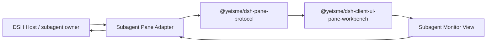

## Context

DSH Web 当前通过 `ui-subagent` header catalog 展示 subagent，`openSubagent()` 会切换当前会话，导致用户离开 orchestrator 视角。Pane Workbench 提供右侧/底部 region、Tab、拖拽、resize、preview/pin 与 `shell.overlay` 装配，是承载 Subagent Monitor 的合理容器。本 change 遵循 split-owner：DSH 拥有 subagent 生命周期与 transcript，Harness Plugins 只拥有安全投影、视图与本地 UI 状态。

### 目标

- 主会话保持 orchestrator，Subagent 树在 Pane 中显示。
- 提供 bounded `SubagentPaneProjectionV1`。
- 提供不替换主会话的 peek/follow-up/interrupt。
- 与现有 header catalog 共存，Pane 未安装时行为不回归。

### Non-Goals

- 不实现客户端 scheduler、task ledger、subagent 启动协议。
- 不复制 DSH subagent 状态机。
- 不把 subagent-origin Session 行塞回普通 sidebar。
- 不在 Pane 中渲染 raw prompt、private tool arguments、provider payload、credential、绝对路径。

## Decisions

### 1. 数据来自官方 DSH seam

只读树使用 `ctx.sessions.list.getSnapshot().subagentsByParent`、`byId`、`projectionValues.subagentTiming`、`projectionValues.tokenUsage`。详情与 mutation 使用 `ctx.connection.api.subagents.history/prompt/interrupt`。`openSubagent()` 仅用于显式打开主会话。

### 2. 安全投影先折叠

`SubagentMonitorController` 将 DSH 快照折叠为 `SubagentPaneProjectionV1`，字段受 `@yeisme/dsh-pane-protocol` safe schema 约束。View 不直接接触 Session 对象或原始 catalog。

### 3. 视图注册进 Pane Workbench

### 4. MVP 使用闭包注入 controller

`PaneLocalViewProps.projection` 目前未由 `PaneWorkbenchChrome` 传入。MVP 在 `registerView` 时用闭包注入 `SubagentMonitorController`；后续可给 Pane core 增加 `projectionFor(view)` resolver，把 host projection 正式接入。

### 5. Mutation 不乐观成功

send/interrupt 使用官方 API 返回的 accepted/rejected receipt 驱动 UI 状态；未知/partial 状态只显示 reconcile 入口，不自动 retry。

## Test Specification

| 层 | 场景 | 命令 | 证据 |
| --- | --- | --- | --- |
| unit | projection fold、tree、running/inactive、token/timing | `pnpm --filter @yeisme/dsh-client-ui-pane-subagent run test` | Vitest result |
| component | Agents 入口、树键盘、detail actions、fallback | `pnpm --filter @yeisme/dsh-client-ui-pane-subagent run test` | Vitest result |
| integration | 真实 DSH sessions/subagents API 投影 | client integration Vitest | `temp/integration-test-runs/<run-id>/` |
| build | exports/dts/tarball | package build + pack check | build output |

## Risks / Trade-offs

- [outcome 不可靠] → 首版只显示 running/inactive/ready；completed/failed/cancelled 依赖 DSH additive outcome projection。
- [overlay 不是 dock] → 先用 `shell.overlay` 右侧栏；官方 additive dock slot 就绪后只换 host adapter。
- [重复状态源] → 只消费官方 seam，禁止本地 subagent tree store。
- [mutation 权限] → 使用官方 API 自身授权；Pane 只渲染 server-authored receipt。

## Migration Plan

1. 先交付 client package 与 `subagent.monitor` view。
2. 接入 bundle/profile 与 header 入口。
3. 接入 detail peek/follow-up/interrupt。
4. 增加 Parallel steering 与 outcome projection 依赖。

Rollback：移除 bundle 后 Pane view、header action、listeners 全部 dispose，DSH 数据不变。
