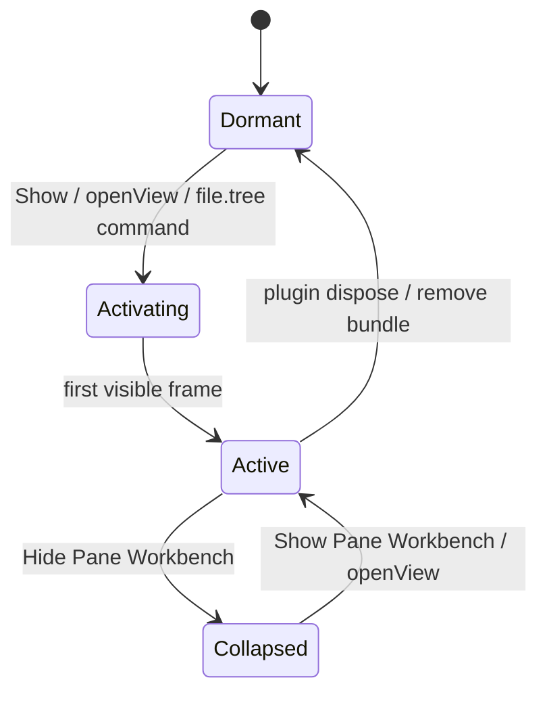

## Context

`dsh-pane-workbench-interaction-v1` 已交付 Pane reducer、chrome、lifecycle 与 `shell.overlay` adapter，但 overlay 默认展开且没有真实 view provider。`dsh-workbench-compose-v1` 已提供组合 shell，但文件树依赖 `emptyHostProjection`，所以目录树不加载。本 change 在既有 Pane engine 之上增加“按需激活”层，并把文件树接入为第一个真实按需加载的 Pane view。

## Goals / Non-Goals

**Goals:**

- Pane Workbench 默认休眠/收起，不渲染完整工作台。
- 任何 `openView` 调用都能自动唤醒 workbench 并打开目标视图。
- 文件树在 workbench 打开或用户进入 Files/Documents 时按需加载。
- 保持 source-independent、不修改 DSH core、不暴露 raw path。

**Non-Goals:**

- 不实现完整文件管理器、watcher、PDF/Office 预览。
- 不新增第二 layout reducer 或第二 domain store。
- 不引入新的 profile/bundle patch 结构。
- 不把 Host 文件系统权限或 canonical fs state 搬到浏览器。

## Decisions

### 1. 激活状态机



- `Dormant`：只保留轻量 Launcher，不挂载 `PaneWorkbenchChrome`。
- `Activating`：Launcher 首次挂载完整 chrome，并 flush pending `openView` 请求。
- `Active`：完整 chrome 可见，Right/Bottom 可交互。
- `Collapsed`：chrome 已挂载但只显示 `Show Pane Workbench`，释放 pointer events。

### 2. Controller 是可见性唯一入口

`PaneWorkbenchController` 增加：

```ts
class PaneWorkbenchController {
  private visible = false
  private listeners = new Set<() => void>()
  private pendingOpen?: PaneViewSpecV1

  show(): void
  hide(): void
  subscribe(listener: () => void): () => void
  get isVisible(): boolean
  openView(request: PaneViewSpecV1): void
}
```

- `show()` 设置 `visible=true` 并通知 Launcher。
- `openView(request)` 先 `show()`，再 dispatch；若 chrome 未挂载，先存 `pendingOpen`，挂载后 flush。
- Launcher 与 `PaneWorkbenchChrome` 都通过 controller 订阅可见性，避免两份本地 `useState` 漂移。

### 3. Launcher 懒挂载完整 chrome

`client.ts` 的 `shell.overlay` 注册改为：

```text
shell.overlay
  └─ PaneWorkbenchLauncher
       ├─ if dormant/collapsed: <button>Show Pane Workbench</button>
       └─ if active: <PaneWorkbenchChrome controller={controller} ... />
```

- Launcher 订阅 controller；首次 `show()` 时挂载 chrome，并把 `pendingOpen` 交给 chrome 的 initial dispatch。
- 隐藏时 Launcher 仍保留一个小按钮，保证用户能再次打开。
- dispose 时卸载 chrome、清理 listeners 与 pending queue。

### 4. 文件树 Host Adapter

新增 `FileTreeHostAdapter`：

```ts
interface FileTreeHostAdapter {
  listDirectory(path: string | undefined, signal?: AbortSignal): Promise<DirectoryListing>
}

function createFileTreeHostAdapter(ctx: {
  workspaces?: { listDirectory(...): Promise<DirectoryListing> }
}): FileTreeHostAdapter | undefined
```

- V1 使用 `ctx.workspaces.listDirectory`，只列出目录并映射为 `FileEntryV1`（`kind: 'directory'`）。
- `id` 使用 Host 返回的 opaque 身份或 adapter 内部维护的 `Map<id,path>`；`name` 使用 `DirectoryEntry.name`；`path` 只存在于 adapter 内部，绝不进入 `FileEntryV1`。
- 未来 DSH fs seam 提供文件/文档时，扩展 adapter 输出 `kind: 'file'|'document'` 与预览 URL resolver，不改 UI 消费方式。

### 5. `useFileTree` 按需加载

在组合工作台或 Pane file view 中新增：

```ts
function useFileTree(adapter: FileTreeHostAdapter | undefined, rootPath: string | undefined, enabled: boolean) {
  // enabled=true 时才调用 listDirectory
  // 返回 { status: 'idle'|'loading'|'ready'|'error', entries, error, retry }
}
```

- 面板打开或用户切到 Files/Documents Tab 时 `enabled=true`。
- 使用 AbortController 取消过期请求；组件卸载后不更新状态。
- 空目录显示“暂无文件条目”；错误显示可重试。

### 6. `file.tree` Pane view

- 在 `dsh-file-document` 或新 `client/ui-pane-file-tree` 中注册 Pane view：
  - `kind: 'file.tree'`
  - `role: 'navigator'`
  - `preferredRegion: 'right'`
  - `retention: 'recreate'`（关闭后释放目录状态）
- 增加 header action / command “文件树”，调用 `pane.openView({ kind: 'file.tree', ... })`，自动唤醒 workbench 并加载目录。
- 若 `ctx.paneWorkbench` 不存在，入口隐藏或禁用，不报错。

## State and Intent Sketch

```mermaid
flowchart LR
  A[Show button / openView / File Tree command] --> B[Controller.show]
  B --> C[Launcher mounts PaneWorkbenchChrome]
  C --> D[Flush pending open_view]
  D --> E[Active workbench]
  E --> F[useFileTree enabled]
  F --> G[listDirectory -> FileEntryV1[]]
  G --> H[FileDocumentPanel tree]
```

## Package and File Ownership

| Path | Ownership |
| --- | --- |
| `packages/client/ui-pane-workbench/src/controller.ts` | activation state、pending open、subscribe |
| `packages/client/ui-pane-workbench/src/chrome.ts` | `defaultVisible`、隐藏态 Show 按钮、controller 可见性订阅 |
| `packages/client/ui-pane-workbench/src/client.ts` | `PaneWorkbenchLauncher`、懒挂载 |
| `packages/bundle/dsh-file-document/` 或 `packages/client/ui-pane-file-tree/` | `FileTreeHostAdapter`、`useFileTree`、`file.tree` view |
| `packages/bundle/dsh-workbench-compose/` | `ComposedWorkbench` 接入 `useFileTree` |
| `openspec/changes/dsh-pane-workbench-auto-activation-v1/` | 本 change 设计/任务/spec |

## Verification Strategy

- Controller 单测：`openView` 自动 `show`、pending flush、hide/show 通知。
- Chrome/Launcher 组件测试：默认隐藏、Show 按钮、首次激活挂载、dispose 清理。
- Adapter 单测：`DirectoryListing -> FileEntryV1[]`、空目录、错误、raw path 不进入 entries。
- Compose/Pane 集成测试：打开面板/切 Tab 触发 `listDirectory`，展示 loading/ready/error/retry。
- OpenSpec strict validation 与 focused typecheck/test/build。

## Risks / Trade-offs

- [`host.listDirectory` 只返回目录] → V1 先交付目录树；文件/文档预览等待 DSH fs seam。
- [Launcher 增加异步挂载复杂度] → 用 controller pending queue 与 flush 保证 `openView` 不丢失。
- [可见性状态多份拷贝] → 统一由 controller 持有，Launcher/chrome 只订阅。
- [真实 browser evidence 缺失] → 本 change 不声称 Playwright 闭环；继续保留 browser gate。

## Migration Plan

1. 先合并 activation 层，保持 `PaneWorkbenchChrome` 向后兼容（`defaultVisible` 默认 false 但可传 true）。
2. 接入文件树 adapter 与 `useFileTree`，用静态/假数据先通过测试。
3. 接入真实 `ctx.workspaces.listDirectory`，验证本地 DSH profile。
4. 后续 DSH fs seam 就绪后扩展 adapter 输出文件/文档与预览 URL。

Rollback：回退 controller/launcher 改动可恢复常驻 overlay；移除 adapter 接入则文件树回到空状态。无数据迁移、无 profile breaking change。
