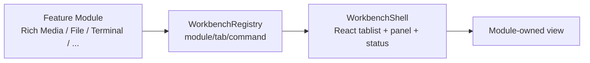

## Context

DSH-better-sidebar 的工作台交互已被社区验证：侧边 Tab 聚合文件、终端、Git、浏览器与第三方模块。我们的 Rich Media Workbench 已经实现了第一个模块雏形；继续扩展前需要把通用 shell 抽出来，否则每个模块都会重复 tablist、排序、状态栏和生命周期。

本 change 遵循“交互参考，不复制源码”的边界：Workbench Core 只采用工作台心智模型，使用 DSH 官方 slot/seam 重新实现。

## Goals / Non-Goals

**Goals:**

- 提供 headless module/tab/command 合同与 registry。
- 提供通用 React shell，供 Rich Media 及其他模块复用。
- 保持模块与 canonical state 解耦。
- 为后续 File、Terminal、Git、Browser、Jobs、Plan+Skills 提供统一扩展点。

**Non-Goals:**

- 不实现具体业务模块（媒体、文件、终端等）。
- 不复制 DSH-better-sidebar 源码、CSS、测试或构建产物。
- 不创建浏览器侧 domain store、scheduler、task ledger 或第二 Ordo。
- 不实现模块市场、签名、自动更新。

## Decisions

### 1. Workbench Core 是 headless registry + React shell

Registry 不依赖 React；Shell 只消费 registry snapshot。这样同一个 registry 可被 CLI、测试、TUI 或未来桌面端复用。

### 2. Module 合同是本地描述符，不是远程 UI 清单

`WorkbenchModuleDefinitionV1` 只包含 id/version/title/capabilities/tabs/commands。客户端视图仍由模块 bundle 本地注册，wire 数据不得携带 module URL、component name、脚本或任意 iframe。

### 3. Shell 使用标准 tablist 语义

`WorkbenchShell` 实现 role=tablist/tab/tabpanel，支持键盘、aria-selected、Delete 关闭 closable tab、状态栏 role=status。颜色不是唯一状态信号。

### 4. 先抽核心，再接官方 slot

当前 client apply 为 no-op；Rich Media Workbench 仍使用 `sidebar.footer.action`。后续确认 Workbench/Pane 官方 slot 后，Shell 可注册为正式工作台宿主，模块通过 registry 注入。

### 5. 模块按能力 fail closed

缺少 required capability、重复 module id、非法 tab/command 都拒绝注册。dispose 必须精确移除该模块及其 tabs/commands。

### 6. 官方宿主 slot 确认结果

- 当前已确认的官方入口：`sidebar.footer.action`（Rich Media Workbench 正在使用）。
- 尚未发现 DSH 官方“Workbench/Pane 宿主 slot”可作为通用工作台容器；`conversation.view` 是会话视图环，`shell.overlay` 是浮层，均不是稳定 Workbench 宿主。
- 因此 Workbench Core 的 client apply 保持 no-op；当 Pane 平台（`dsh-pane-plugin-platform-v1`）或官方 Workbench slot 落地后，Core 再注册为正式宿主。
- 结论：本轮“确认”完成，结论是暂不抢跑非官方宿主。

## Test Specification

| 层 | 场景 | 命令 | 证据 |
| --- | --- | --- | --- |
| unit | registry register/dispose/sort、重复拒绝、描述符校验 | `pnpm --filter @yeisme/dsh-workbench-core run test` | Vitest result |
| typecheck | Core 与 Shell 可编译 | `pnpm --filter @yeisme/dsh-workbench-core run typecheck` | exit 0 |
| build | node ESM 与 browser CJS 可构建 | `pnpm --filter @yeisme/dsh-workbench-core run build` | build output |

## Risks / Trade-offs

- [过早抽象] → 先以 Rich Media 为唯一 consumer，模块合同保持最小；第二个模块出现后再扩展。
- [官方 slot 未确认] → Shell 暂不注册宿主，避免非官方 UI seam。
- [与 DSH-better-sidebar 混淆] → 明确只参考交互，不引入依赖；后续 source-independence scan 纳入本包。
- [模块间耦合] → Core 不持有领域状态，模块之间只通过 typed artifact/command 交互。

## Migration Plan

1. 发布 `@yeisme/dsh-workbench-core@0.1.0-rc.1`。
2. 将 Rich Media Workbench 改为消费 Core registry/shell（additive 重构）。
3. 后续模块逐个注册进入 Core。
4. 官方 Workbench/Pane slot 就绪后，Core 作为宿主接入。

Rollback：移除 Core bundle/feature 或回滚 Rich Media 到自带 shell；无数据迁移。

## Open Questions

- Workbench Core 是否要提供模块市场/签名/自动更新？
- 官方宿主 slot 是 `sidebar.footer.action`、`shell.overlay` 还是未来 Pane slot？
- 是否需要 `dsh workbench` CLI 生成模块骨架？
