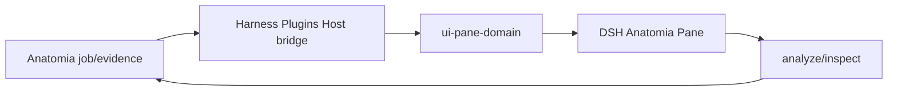

## Context

Anatomia 分析是异步 job。Harness Plugins 交付 DSH 投影、交互与生命周期；Pane 必须区分 partial 与 complete，媒体按需激活，Anatomia 不承担 DSH UI 生命周期。

## Goals / Non-Goals

**Goals:**

- 投影 source、job、timeline、shot/scene、transcript/OCR、observation/evidence。
- partial 明确标注；complete 只在 owner 声明完成时出现。
- evidence handoff 到 Ordo/Auctra/Eikona 使用 ArtifactRef。
- 通过统一 domain Pane registry、action admission 和 bundle 安装面交付 DSH 体验。

**Non-Goals:**

- 不在 Harness Plugins 实现 Anatomia job、analysis、observation、evidence 或 provider state machine。
- 不把 DSH 变成分析 owner。
- 不保存 raw prompt 或完整 CoT。

## Decisions

1. 复用 observation read projection 与 job event。
2. Frame timeline 虚拟化属于 adapter。
3. 无 stream → `offline`。
4. DSH-specific Host/Client 代码只落在 `agent/harness-plugins`；Anatomia 侧只保留 provider-neutral projection/action 合同。

## Risks / Trade-offs

- 长视频内存：inactive tab 只保留 owner ref。
- Host bridge 未挂载时保持 `offline`，不得把空 snapshot 误报为 ready。
