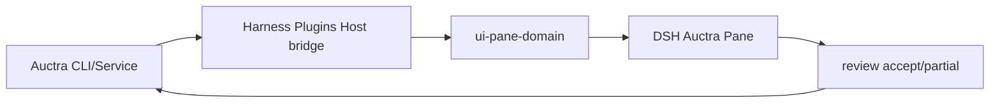

## Context

Auctra 禁止独立 GUI。DSH Pane 是由 Harness Plugins 交付的下游投影消费者，不是第二写作产品；Auctra 不承担 DSH UI 生命周期。

## Goals / Non-Goals

**Goals:**

- 投影 project、material、outline、text unit、diff、review queue。
- Candidate 与 canonical 分栏；accept 必须 owner receipt。
- Scene handoff 到 Eikona 只带 ArtifactRef。
- 通过统一 domain Pane registry、action admission 和 bundle 安装面交付 DSH 体验。

**Non-Goals:**

- 不在 Harness Plugins 实现 Auctra canonical text、candidate、review 或版本状态机。
- 不自动覆盖 canonical text。
- 不把 Workbench 做成写作 owner。

## Decisions

1. 复用既有 review gate：生成只产生 pending review item。
2. Pane 客户端只渲染 `allowed_actions`。
3. 无 stream 时 `offline`，禁止 TTL poll。
4. DSH-specific Host/Client 代码只落在 `agent/harness-plugins`；Auctra 侧只保留 provider-neutral projection/action 合同。

## Risks / Trade-offs

- Service API 若缺 event，Pane 保持 `offline` 或 `contract_mismatch`，不发明轮询。
- Host bridge 未挂载时不得把空 snapshot 误报为 ready。
