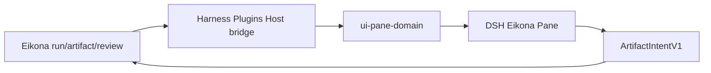

## Context

根级 Pane 生态是 `split-owner`。Eikona 已有 run/artifact evidence、review accept/reject、visual workspace projection 与 canonical model `openai/gpt-5.4-image-2`。Harness Plugins 负责把这些合同接入 DSH，但不得成为 image owner。

## Goals / Non-Goals

**Goals:**

- One read projection: gallery list, selected run, compare pair, freshness, allowed_actions.
- One gated mutation: generate preview or accept/reject with preview → approval → receipt.
- Artifact refs opaque; no path, URL, token, or raw prompt.
- Snapshot on open/context switch; push events afterwards; gap → `reconcile_required`.
- Register the view and ship it through the shared domain Pane bundle.

**Non-Goals:**

- No Eikona persistence, image generation, review state machine, or provider logic in Harness Plugins.
- No new default image model.
- No client polling fallback.
- No auto-accept of generated images.

## Decisions

1. Reuse existing Eikona CLI/API/OpenAPI as the canonical mutation path. Pane Host only forwards owner-authored actions.
2. SSE, if present, is a repairable notification. Authoritative state remains Eikona reads (`eikona-visual-workspace-projections`).
3. Default generate model is `openai/gpt-5.4-image-2`. Aliases normalize at ingress only.
4. Handoff targets (Pinax, Anatomia, Auctra) receive `ArtifactRefV1`; they do not write Eikona state.
5. DSH-specific Host/Client code lives in `agent/harness-plugins`; Eikona only exposes provider-neutral projection/action contracts.

## Risks / Trade-offs

- Stream not ready → Pane shows `offline`; do not invent timers.
- Host bridge not mounted → Pane stays `offline`; an empty snapshot is never reported as ready.
- Large galleries → virtualization belongs to the Harness adapter, not Eikona persistence.
