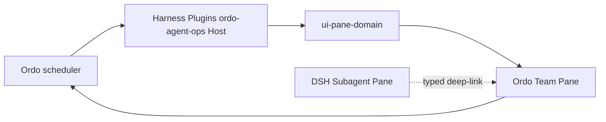

## Context

Ordo 已有 canonical scheduler contract；Harness Plugins 已有 Agent Ops Host projection 与 Workbench client。本 change 在插件仓交付 Team Pane 所需 snapshot/event、view registration、action admission 与 Subagent 边界。

## Goals / Non-Goals

**Goals:**

- 投影 DAG/task/session/attempt/runtime/lease/fence/approval/verification/evidence。
- 客户端不计算 runnable、不释放 lease、不把 timeout 当 worker stopped。
- Subagent 只含 DSH session child；Ordo 只含完整 team run。
- 通过统一 domain Pane registry 与 bundle 安装面交付 DSH Team 体验。

**Non-Goals:**

- 不创建第二 scheduler、lease ledger 或 task 状态机。
- 不把 Ordo canonical run/task/lease 状态复制进 DSH browser store。
- 不合并 Subagent 状态树。

## Decisions

1. 复用既有 Ordo snapshot/event 与 Agent Ops host。
2. 资质/composition 事实仍属 DSH/Ordo split：`agent-composition-preview-v1`。
3. 1,000 task 虚拟化属于 adapter 性能门。
4. DSH-specific Host/Client 代码只落在 `agent/harness-plugins`；Ordo 侧只保留 provider-neutral scheduler projection/action contract。

## Risks / Trade-offs

- 命名混淆：header 必须显示 owner badge `Ordo` vs `Session Subagent`。
- Snapshot 可用而 live stream 未接通时必须显示真实 freshness，不得假装 realtime。
