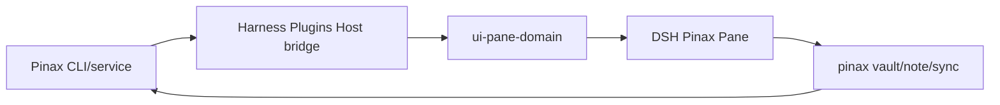

## Context

Pinax 是 local-first CLI。结构化资产必须由 CLI/service 创建。Harness Plugins 只交付 DSH 投影、交互与生命周期，不承担 vault 或索引所有权。

## Goals / Non-Goals

**Goals:**

- 投影 vault、inbox、note list、Markdown 摘要、tag/backlink、graph、history。
- capture/search/edit/link/sync 走真实 `pinax` 命令或 Local API。
- 无 stream 时诚实 `offline`。
- 通过统一 domain Pane registry、action admission 和 bundle 安装面交付 DSH 体验。

**Non-Goals:**

- 不在 Harness Plugins 实现第二 vault、索引、Git 状态机或结构化 metadata writer。
- 不手写 note metadata JSON。
- 不把 Workbench 变成知识 owner。

## Decisions

1. 复用既有 search/index/sync 投影。
2. Markdown 正文不进入 Pane persistence。
3. Graph layout 激活留给 adapter 的 measured activation。
4. DSH-specific Host/Client 代码只落在 `agent/harness-plugins`；Pinax 侧只保留 provider-neutral projection/action 合同。

## Risks / Trade-offs

- 大 vault → 分页与虚拟化在 adapter；Pinax 提供 cursor/page。
- Host bridge 未挂载时保持 `offline`，不得把空 snapshot 误报为 ready。
