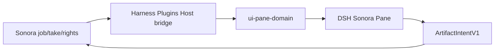

## Context

Sonora 已规定 SSE 带 cursor、不可作为权威账本，消费者必须用 snapshot 修复。DSH 插件必须遵守同一规则，并由 Harness Plugins 维护适配、注册、渲染与卸载；Sonora 不承担 DSH UI 生命周期。

## Goals / Non-Goals

**Goals:**

- 投影 script/cue、voice cast、take list、player、waveform peaks、subtitle timeline、cost/rights。
- 长音频缺 owner pre-decoded peaks 时退回 native player，不在浏览器全量 decode。
- gated render/accept 走 preview → approval → receipt。
- 通过统一 domain Pane registry、action admission 和 bundle 安装面交付 DSH 体验。

**Non-Goals:**

- 不在插件内实现 Sonora job、rights、cost、review 或持久化规则。
- 不把 SSE 当 canonical ledger。
- 不在 Pane 持久化音频字节。

## Decisions

1. 复用 `audio-workspace-projections` 与既有 HTTP/SSE。
2. waveform 只接受 owner 预计算 peaks。
3. rights/cost 缺失时 fail visible，不猜测。
4. DSH-specific Host/Client 代码只落在 `agent/harness-plugins`；Sonora 侧只保留 provider-neutral projection/action 合同。

## Risks / Trade-offs

- 无 stream → `offline`。
- Host bridge 尚未挂载正式 owner source 时只显示 `offline`，不得把空 snapshot 误报为 ready。
- 重媒体激活由 Harness adapter 做 measured activation。
